# 库存管理系统产品需求文档（PRD）

## 📋 文档信息

- **产品名称**：库存管理系统
- **版本**：v1.0
- **创建日期**：2026-02-05
- **更新日期**：2026-02-28
- **产品经理**：产品团队
- **技术方案**：详见 [库存管理系统技术方案](./技术方案.md)

**变更记录**：

| 更新日期   | 更新内容概要 |
|:-----------|:--------------|
| 2026-02-28 | 验收标准按行业标准重写：新增 9.0 编写约定（GWT、可测试性、关联关系与一致性、数量恒等式与展示准据）；4.1～4.5 各节验收标准拆分为「功能与状态」Given-When-Then 表与「关联关系与一致性/数量恒等式」必验表；第 9 节汇总增加跨模块关联一致说明。 |
| 2026-02-28 | 批次验收标准：新增 AC-4.4.10（创建批次-可选入库单须含调拨单），明确按仓库+商品获取可选入库单须使用含采购+调拨的接口，不得使用仅采购入库单分页接口。 |

---

## 1. 产品概述

### 1.1 产品定位

库存管理系统是青柠中台系统的核心业务模块，负责管理商品的入库、出库、调拨、批次管理等全生命周期库存操作，确保库存数据的准确性、可追溯性和业务操作的规范性。

### 1.2 产品目标

1. **准确性**：确保库存数据实时准确，支持并发操作
2. **可追溯性**：完整记录所有库存变动，支持审计和问题排查
3. **规范性**：统一库存变更入口，规范业务流程
4. **高效性**：支持批量操作，提高业务处理效率

### 1.3 目标用户

- **仓库管理员**：负责入库、出库、调拨操作
- **采购人员**：创建采购入库单
- **销售运营**：查看库存、创建销售出库单
- **财务人员**：查看库存流水，进行成本核算
- **系统管理员**：批次管理、库存调整

### 1.4 产品架构

库存管理系统按业务域划分为五大功能模块，统一围绕「库存」「流水」「批次」核心数据运转，下图展示产品功能架构及模块间关系。

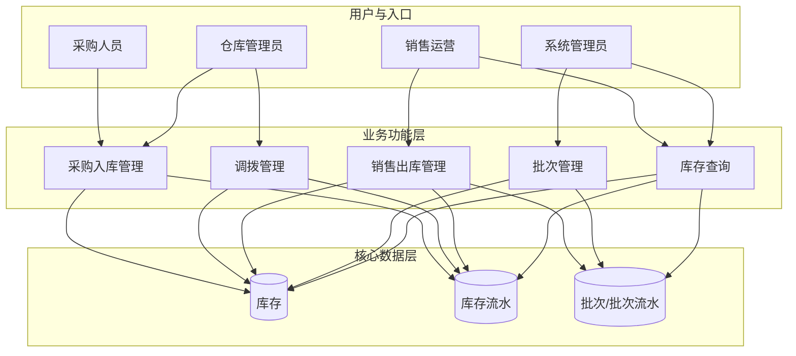

**模块说明**：

| 模块             | 职责简述                         | 主要产出/影响     |
|------------------|----------------------------------|-------------------|
| 采购入库管理     | 采购到货后录入、审核、入库       | 库存增加、入库流水 |
| 调拨管理         | 仓间调拨，审核出库 + 确认入库     | 出库/入库流水、库存一减一增 |
| 销售出库管理     | 销售发货，按 FIFO 扣减批次       | 库存与批次扣减、出库流水 |
| 批次管理         | 可售批次创建、调整、纳入、下架   | 批次数据、可分配/已分配数量 |
| 库存查询         | 库存列表、明细、流水、批次分布   | 只读展示，不变更数据 |

---

## 2. 业务流程

### 2.0 业务域与库存流转总览

下图概括各业务域对「库存」「流水」「批次」的读写关系，便于理解整体数据流后再查看各子流程（2.1～2.5）。

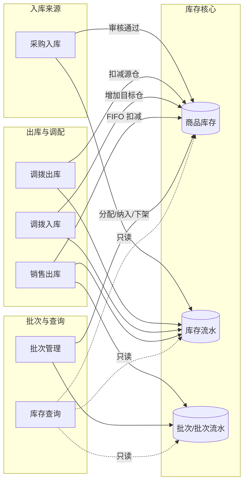

**图例**：实线箭头表示写操作（更新库存/流水/批次），虚线表示只读查询。

### 2.1 采购入库流程

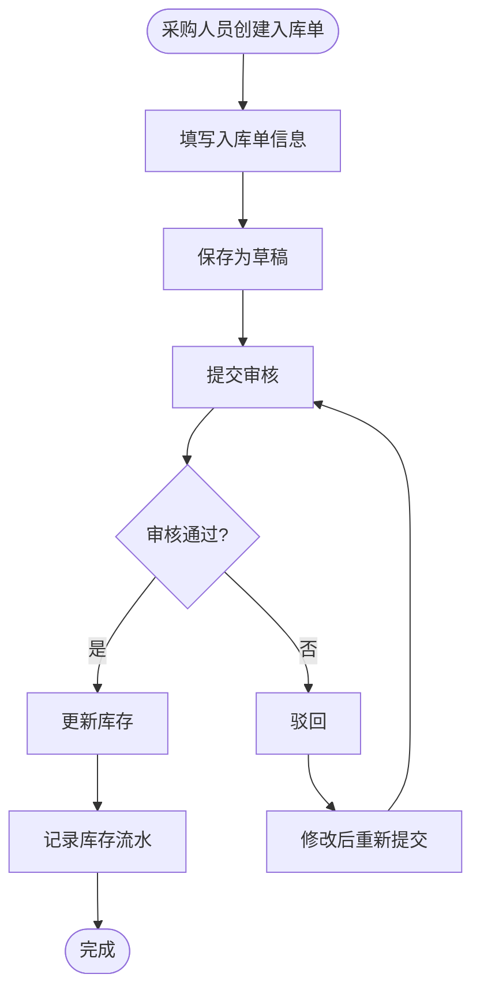

### 2.2 调拨流程

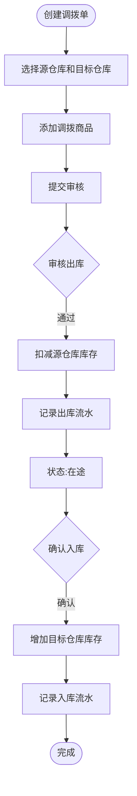

### 2.3 销售出库流程（FIFO扣减）

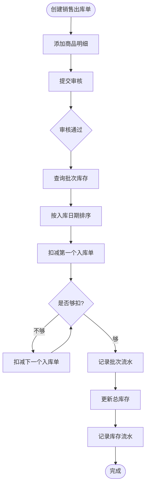

### 2.4 批次创建流程

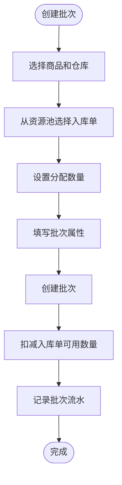

### 2.5 纳入新入库单资源流程

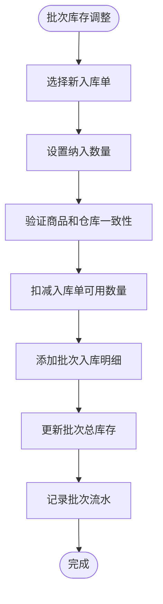

---

## 3. 单据状态与数据流转

本节对每种业务单据给出**状态流转图**与**数据流转图**，便于开发与测试对齐单据生命周期及上下游数据。

### 3.1 采购入库单

**单据状态流转**：草稿 → 待审核 → 已入库 / 已驳回；驳回后可修改再提交。

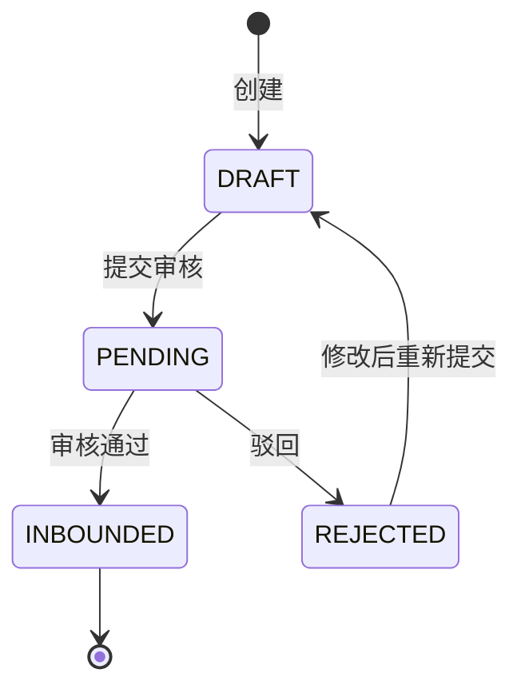

**数据流转**：审核通过后生成统一入库单、更新库存与流水。

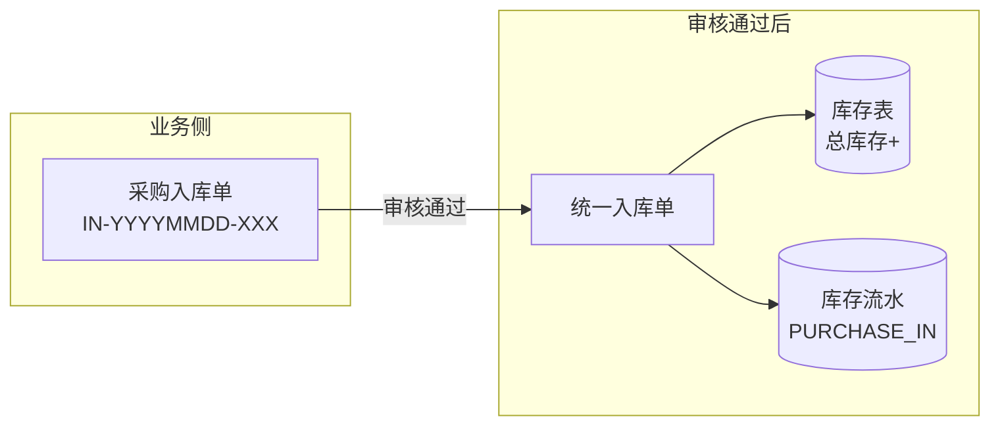

### 3.2 调拨单

**单据状态流转**：草稿（提交后仍为草稿，不更新库存）→ 审核出库通过 → 在途 → 审核入库通过 → 已完成；出库或入库环节驳回后为已驳回，可修改再提交。

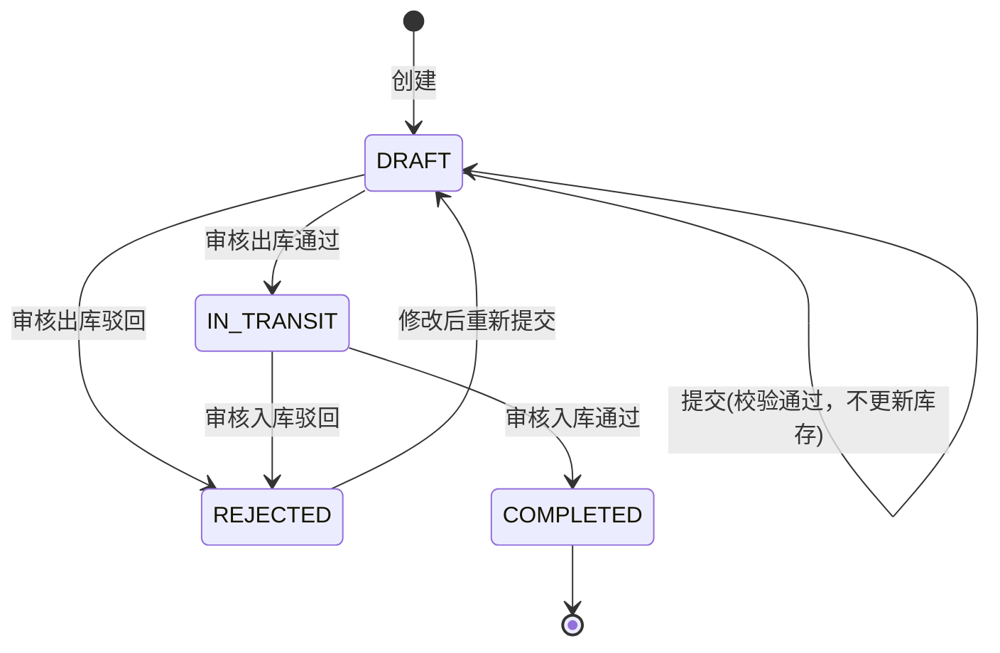

**数据流转**：审核出库扣减源仓并记出库流水；审核入库增加目标仓并记入库流水。

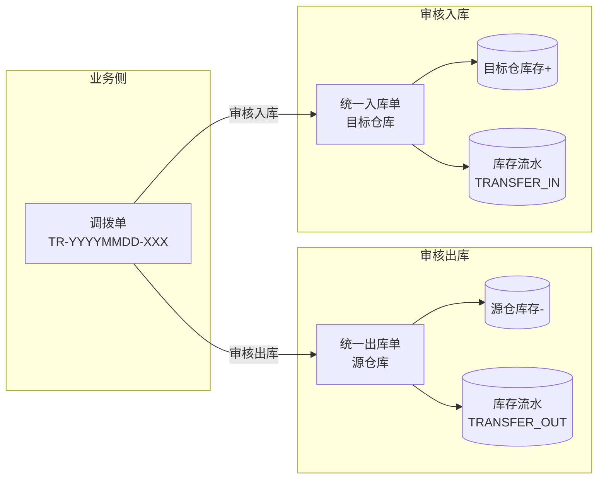

### 3.3 销售出库单

**数据流转**：审核通过后按 FIFO 扣减批次、生成统一出库单并更新库存与流水（销售出库单在 PRD 中无多状态，创建后审核即完成）。

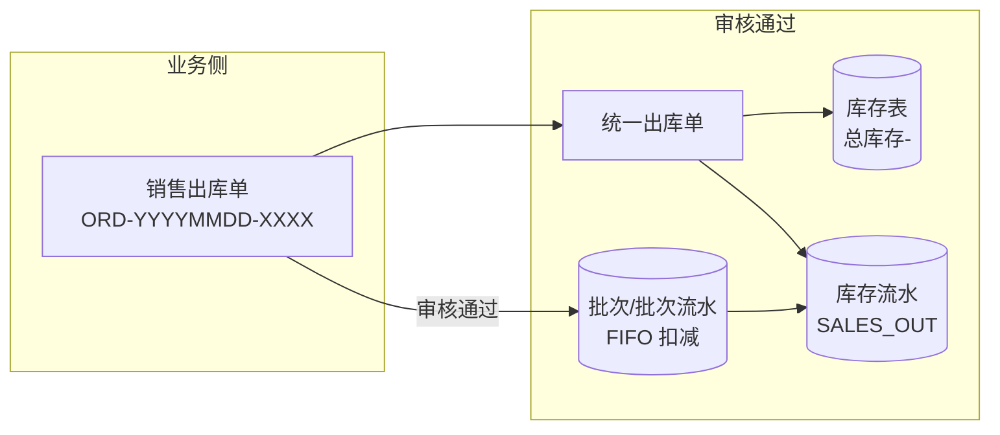

### 3.4 批次

**单据状态流转**：发布即上架，无草稿；下架后为已下架，数量返还资源池。

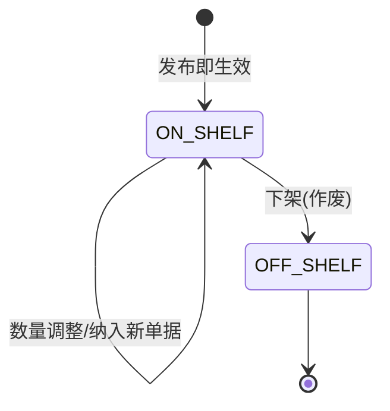

**数据流转**：创建批次从入库单资源池占用数量；调整/纳入增加批次与流水；下架返还数量至资源池。

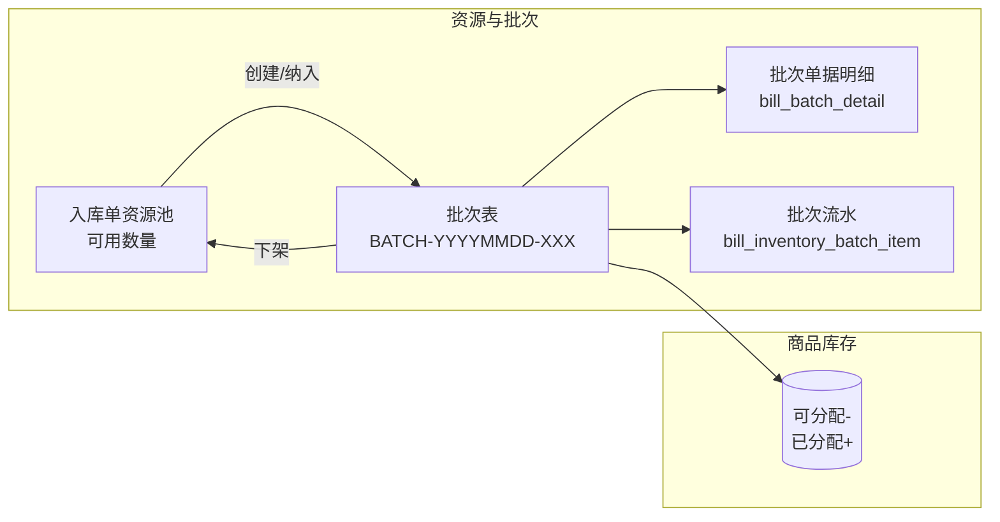

---

## 4. 功能需求

### 4.1 采购入库管理

#### 4.1.1 功能描述

支持创建、审核、查询采购入库单，审核通过后自动更新库存。

#### 4.1.2 用户故事

**作为** 采购人员  
**我希望** 创建采购入库单并审核通过  
**以便** 商品入库后库存能够自动更新

#### 4.1.3 功能点

1. **创建采购入库单**
   - 选择供应商
   - 选择目标仓库
   - 添加商品明细（商品、数量、单价、到期日期等）
   - 自动生成入库单号（格式：IN-YYYYMMDD-XXX）
   - 保存为草稿状态

**界面示意**：

- 出入库管理 - 采购入库列表（任务单号/供应商/仓库、业务日期、商品数量、处理状态、操作）


- 创建入库任务（业务日期、供应商、入库目标仓库、商品明细清单、入库数量、入库成本、商品效期、入库备注）


- 入库单详情（单号、供应商、目标仓库、业务日期、处理状态、入库商品明细、审核通过并入库）


2. **提交审核**
   - 草稿状态的入库单可以提交审核
   - 提交后状态变为"待审核"

3. **审核通过**
   - 审核通过后，自动创建统一入库单
   - **更新库存表**：按「仓库 + 商品」业务唯一键查询或创建库存行，增加对应商品在该仓库的库存数量（当前未使用 sku 维度）
   - 记录库存流水日志
   - 状态变为"已入库"

4. **查询入库单**
   - 支持按入库单号、供应商、仓库、状态等条件查询
   - 支持分页查询
   - 支持查看入库单详情（包含明细列表）

（列表与详情界面见上方截图。）

#### 4.1.4 业务规则

- 入库单号唯一
- 审核通过后不能修改
- 审核通过后自动更新库存，无需手动操作
- **库存唯一键**：库存按「仓库 id + 商品 id」为业务唯一键更新，当前未使用 sku 维度；同一仓库下同一商品对应一条库存汇总行，避免多商品串行更新
- **查库存约定**：出库、批次创建/下架、可分配扣减等涉及商品级库存变更时，均按「仓库 + 商品」查询库存（不使用 skuId）；库存不存在时错误提示使用 productId、warehouseId

#### 4.1.5 验收标准

**功能与状态**

| 编号 | 验收项 | Given（前置） | When（动作） | Then（可观测结果） |
|------|--------|---------------|--------------|--------------------|
| AC-4.1.1 | 创建采购入库单 | 用户有创建权限 | 选择供应商、目标仓库，添加商品明细（商品、数量、单价、到期日期等）并保存 | 生成单号格式 IN-YYYYMMDD-XXX 且全局唯一；单据状态为 DRAFT；明细条数与输入一致 |
| AC-4.1.2 | 提交审核 | 采购入库单状态为 DRAFT | 用户点击提交审核 | 单据状态变为 PENDING；未产生任何库存或流水变更 |
| AC-4.1.3 | 审核通过 | 采购入库单状态为 PENDING，明细含商品 A 数量 N、仓库 W | 审核人执行审核通过 | ① 生成统一入库单，与采购入库单可关联（业务单号/来源单号）② 库存表存在且仅一条 (warehouse_id=W, product_id=A)，其 total_stock 增加 N ③ 产生业务类型 PURCHASE_IN 的库存流水，条数≥1，且流水关联该采购入库单、仓库 W、商品 A，变动量合计=N，流水结余与当前库存一致 ④ 采购入库单状态变为 INBOUNDED |
| AC-4.1.4 | 审核后不可改 | 采购入库单状态为 INBOUNDED | 用户尝试编辑或删除 | 接口/前端拒绝操作，并提示已入库不可修改 |
| AC-4.1.5 | 查询 | - | 按入库单号/供应商/仓库/状态筛选、分页，或打开详情 | 列表结果与筛选条件一致；分页 total 与当前条件匹配；详情页展示完整明细列表，明细合计与列表/汇总一致 |

**关联关系与一致性（必验）**

| 编号 | 验收项 | 关联约定 | 验证方法 |
|------|--------|----------|----------|
| AC-4.1.6 | 单据→库存→流水 | 一张采购入库单审核通过后：每条明细对应「仓库+商品」唯一库存行增量；每条明细对应至少一条 PURCHASE_IN 流水；流水中的单据号、仓库、商品、数量与入库单明细可逐条对应 | 审核后查询统一入库单、库存表、库存流水，校验：入库单明细数量合计 = 各 (W,P) 库存增量合计 = 该单关联流水变动量合计 |
| AC-4.1.7 | 库存唯一键与错误提示 | 库存按 (warehouse_id, product_id) 业务唯一；库存不存在时不得静默失败 | 对不存在的 (product_id, warehouse_id) 触发库存变更时，接口返回错误且错误信息中包含 productId、warehouseId |

### 4.2 调拨管理

#### 4.2.1 功能描述

支持创建调拨单，实现仓库之间的商品调拨，包括审核出库和确认入库两个步骤。

#### 4.2.2 用户故事

**作为** 仓库管理员  
**我希望** 创建调拨单并完成调拨流程  
**以便** 在不同仓库之间调配商品库存

#### 4.2.3 功能点

1. **创建调拨单**
   - 选择源仓库和目标仓库
   - 选择商品（从源仓库的可用库存中选择，按入库单号展示）
   - **前端必须展示所选入库单的可用库存数量**
   - **前端需明确标识入库单原始类型（采购/调拨）**
   - **同一商品在一次调拨中只能选择一个入库批次**（确保成本与入库单一一对应）
   - 填写调拨数量
   - 自动生成调拨单号（格式：TR-YYYYMMDD-XXX）
   - 状态为"草稿"（DRAFT）

**界面示意**：

- 出入库管理 - 调拨管理列表（调拨单号、调出/调入仓库、商品数量、创建人/日期、状态、审核出库/详情）


- 创建调拨任务（业务日期、调出仓库、调入仓库、按入库单号选择调拨明细、调拨数量、单价成本、对应效期）


- 调拨单详情（单号、调出/调入仓库、业务日期、单据状态、调拨商品明细按入库单、审核出库/打印调拨单）


2. **提交调拨单**
   - 提交后状态保持为"草稿"（DRAFT），**不立即更新库存**
   - **后台强制校验**：可用库存 ≥ 调拨数量
   - 校验维度：单据级、批次级、仓库级
   - 禁止超量调拨，系统主动拦截

3. **审核出库**
   - 只有草稿状态的调拨单才能审核出库
   - 审核通过后，从源仓库扣减库存
   - 创建统一出库单（源仓库）
   - 记录库存流水（业务类型：调拨出库）
   - 状态变为"运输中"（IN_TRANSIT）

4. **审核入库**
   - 只有运输中状态的调拨单才能审核入库
   - 商品到达目标仓库后，审核入库
   - 创建统一入库单（目标仓库）
   - 增加目标仓库库存
   - 记录库存流水（业务类型：调拨入库）
   - 状态变为"已完成"（COMPLETED）

（列表、创建与详情界面见上方截图。）

#### 4.2.4 业务规则

- **调拨单初始为草稿状态，提交后不立即更新库存**
- **同一商品在一次调拨中只能选择一个入库批次**（确保成本与入库单一一对应）
- **前端必须展示可用库存数量**，用户依据可见数据进行调拨数量输入
- **后台强制校验**：可用库存 ≥ 调拨数量
- 必须按顺序操作：先审核出库，再审核入库
- 调拨单明细需要关联具体的入库单号
- **成本追溯**：成本源自采购入库单，随调拨过程持续传递

#### 4.2.5 验收标准

**功能与状态**

| 编号 | 验收项 | Given（前置） | When（动作） | Then（可观测结果） |
|------|--------|---------------|--------------|--------------------|
| AC-4.2.1 | 创建调拨单 | 用户有调拨权限，源仓存在可用库存 | 选择源仓、目标仓，按入库单号选商品并填调拨数量，保存 | 生成单号 TR-YYYYMMDD-XXX，状态 DRAFT；明细中每条展示所选入库单的可用库存数量及原始类型（采购/调拨）；同一商品仅出现一个入库批次（一条明细）；调拨数量≤该入库单可用数量时允许保存 |
| AC-4.2.2 | 提交调拨单 | 调拨单状态为 DRAFT | 用户提交 | 状态仍为 DRAFT；**不更新任何仓库库存**；若任一批次/仓库可用库存 &lt; 调拨数量，接口返回错误并明确提示维度（单据级/批次级/仓库级），禁止超量提交 |
| AC-4.2.3 | 审核出库 | 调拨单状态为 DRAFT，明细含源仓 W1、商品与数量 | 审核人执行审核出库通过 | ① 源仓 W1 对应 (W1, product_id) 库存扣减量 = 该单该商品调拨数量 ② 生成统一出库单（源仓 W1），与调拨单可关联 ③ 产生 TRANSFER_OUT 流水，关联该调拨单、源仓、商品，变动量=扣减量，结余与当前库存一致 ④ 调拨单状态变为 IN_TRANSIT |
| AC-4.2.4 | 审核入库 | 调拨单状态为 IN_TRANSIT，目标仓 W2、商品与数量与出库一致 | 审核人执行审核入库通过 | ① 目标仓 W2 对应 (W2, product_id) 库存增加量 = 该单该商品调拨数量 ② 生成统一入库单（目标仓 W2），与调拨单可关联 ③ 产生 TRANSFER_IN 流水，关联该调拨单、目标仓、商品，变动量=增加量 ④ 调拨单状态变为 COMPLETED |
| AC-4.2.5 | 状态与顺序 | 调拨单为 DRAFT 或 REJECTED | 用户直接请求审核入库 | 接口拒绝，提示需先审核出库；仅 IN_TRANSIT 可执行审核入库 |

**关联关系与一致性（必验）**

| 编号 | 验收项 | 关联约定 | 验证方法 |
|------|--------|----------|----------|
| AC-4.2.6 | 调拨单↔出库/入库单↔双仓库存 | 同一调拨单：审核出库扣减的源仓数量 = 审核入库增加的目标仓数量 = 调拨单明细数量合计；出库流水(TRANSFER_OUT)与入库流水(TRANSFER_IN)均关联该调拨单号，且数量与明细一致 | 完成后查库存流水：该调拨单对应 TRANSFER_OUT 变动量合计 = TRANSFER_IN 变动量合计 = 调拨单明细数量合计；源仓扣减前后差、目标仓增加前后差与上述数量一致 |
| AC-4.2.7 | 明细↔入库单号与成本 | 调拨单明细必须关联具体入库单号（可追溯至采购或调拨入库）；成本信息随该入库单传递，不在调拨单层丢失 | 详情/列表中每条明细有入库单号；从该单号可追溯到上游采购或调拨入库单 |

### 4.3 销售出库管理

#### 4.3.1 功能描述

支持创建销售出库单，按照FIFO原则从批次库存中扣减商品。

#### 4.3.2 用户故事

**作为** 销售运营  
**我希望** 创建销售出库单并审核通过  
**以便** 订单发货时能够自动扣减库存

#### 4.3.3 功能点

1. **创建销售出库单**
   - 选择仓库
   - 添加商品明细（商品、数量等）
   - 自动生成出库单号（格式：ORD-YYYYMMDD-XXXX）

2. **审核出库**
   - 审核通过后，按照FIFO原则扣减批次库存
   - 先扣最早入库的批次库存，不够再扣下一个
   - 记录每个入库单的扣减明细
   - 创建统一出库单
   - 更新总库存
   - 记录库存流水和批次流水

#### 4.3.4 业务规则

- **FIFO扣减原则**：必须按照采购入库单的先后顺序扣减
- 扣减数量不能超过可用库存
- 批次流水需要记录每个入库单的扣减明细

#### 4.3.5 扣减示例

```
批次 BATCH-001 包含：
- IN-2023102401（2023-10-24入库）：1200个，可分配800个
- IN-2023102502（2023-10-25入库）：800个，可分配600个
- IN-2023110101（2023-11-01入库）：2000个，可分配2000个

销售出库单需要扣减1000个：
1. 先扣 IN-2023102401：扣减800个（全部扣完）
2. 再扣 IN-2023102502：扣减200个（剩余400个）
3. IN-2023110101：不扣减

批次流水记录：
- 记录1：从 IN-2023102401 扣减800个，余量0
- 记录2：从 IN-2023102502 扣减200个，余量400
```

#### 4.3.6 验收标准

**功能与状态**

| 编号 | 验收项 | Given（前置） | When（动作） | Then（可观测结果） |
|------|--------|---------------|--------------|--------------------|
| AC-4.3.1 | 创建销售出库单 | 用户有出库权限 | 选择仓库，添加商品明细（商品、数量）并保存 | 生成单号格式 ORD-YYYYMMDD-XXXX；明细与输入一致，未产生库存或流水变更 |
| AC-4.3.2 | 审核出库-FIFO | 销售出库单待审核，某商品需出库数量 Q，该仓该商品下有多批次/多入库单且按入库日期有先后 | 审核通过 | 扣减顺序严格按入库日期从早到晚；先扣尽最早入库单可分配量，不足再扣下一单，直至满足 Q 或可用耗尽；若可用合计 &lt; Q，接口拒绝并提示库存不足及当前可用数 |
| AC-4.3.3 | 审核出库-数据 | 同上，审核通过且可用≥Q | 审核通过 | ① 生成统一出库单，与销售出库单可关联 ② (仓库, 商品) 总库存扣减 = Q ③ 产生 SALES_OUT 库存流水，关联该出库单，变动量合计 = Q，结余与当前库存一致 ④ 销售出库单状态变为终态（已出库） |

**关联关系与一致性（必验）**

| 编号 | 验收项 | 关联约定 | 验证方法 |
|------|--------|----------|----------|
| AC-4.3.4 | 出库单↔批次扣减↔库存流水 | 销售出库单每行商品扣减量 Q = 该商品按 FIFO 从各批次/入库单扣减量之和 = 该单关联 SALES_OUT 流水该商品变动量；批次流水中每条记录对应「从某入库单扣减」，含入库单号、扣减量、扣减后余量 | 审核后：该单关联的批次流水按入库单汇总，扣减量合计 = 出库单该商品数量；库存流水该单变动量 = 出库单总出库量；各批次可分配减少量之和 = 总库存减少量 |
| AC-4.3.5 | FIFO 可追溯 | 批次流水中扣减顺序与入库日期顺序一致；每条流水可反查到具体入库单与批次 | 对多批次场景，批次流水按时间与入库单号可还原出 FIFO 顺序，且与业务规则「先扣最早」一致 |

### 4.4 批次管理

#### 4.4.1 功能描述

支持创建可售批次，管理批次库存，支持批次调整和纳入新入库单资源。**批次发布无草稿状态，一经发布即生效并更新库存**。

#### 4.4.2 用户故事

**作为** 系统管理员  
**我希望** 创建和管理批次  
**以便** 更好地管理商品库存，支持FIFO扣减

#### 4.4.3 功能点

1. **创建可售批次（发布即生效）**
   - 选择商品和仓库（**一个批次仅包含同一商品、同一仓库下的库存**）
   - 从可用入库单资源池中选择入库单明细（**资源池须同时包含采购入库单已入库、调拨单已完成的明细**，按仓库+商品获取可选入库单时须使用含两类单据的接口，不得使用仅采购入库单分页接口，否则调拨入库后无法建批）
   - 设置分配数量
   - 填写批次扩展属性（库位、到期日期、贸易模式、申报关区等）
   - 自动生成批次号（格式：BATCH-YYYYMMDD-XXX）
   - **批次发布无草稿状态，一经发布即生效并更新库存**
   - **发布后状态直接为"已上架"（ON_SHELF）**
   - **发布时同步变更商品库存**：**当前可分配数量减少、已分配未销售数量增加**（总库存不变）；即扣减 allocatable_stock、增加 allocated_stock 及 pending_shipment_stock，与实时库存汇总看板一致

2. **查询批次列表**
   - 支持按批次号、商品、仓库、状态等条件查询
   - 显示批次总库存、已分配、可分配等信息
   - **可分配库存计算**：可分配量 = 总入库量 - 已销售 - 已分配

3. **查询批次详情**
   - 显示批次基本信息
   - 显示关联的入库单明细列表
   - 显示批次库存分布
   - 显示可分配库存：总入库量 - 已销售 - 已分配

4. **批次数量调整（纳入新入库单资源）**
   - **发布后不可修改商品与仓库信息，仅允许调整数量**
   - 从待选池中选择新的入库单
   - 设置纳入数量
   - 填写纳入原因
   - 自动更新批次总库存
   - 记录批次流水（包含入库单明细）

5. **批次作废（下架）**
   - **不设编辑功能，需变更则通过下架（作废）原有批次实现**
   - 将批次状态改为"已下架"（OFF_SHELF）
   - **作废后将该批次全部数量返还至可用库存池**
   - 下架后不能进行库存操作

6. **查询批次流水**
   - 显示批次的所有库存变动记录
   - 包含业务动作（批次创建、订单扣减、批次调整、纳入新单据、批次作废）
   - 包含入库单明细信息（如果是订单扣减）
   - 支持按入库日期排序（FIFO追溯）

**界面示意**：

- 可售批次管理 - 列表（搜索批次号或商品名称、创建新批次；批次详情、关联单据、库存状态/初始配额、物理仓库、销售状态、管理操作：调整/查看/编辑/流水）


- 批次详情（批次号与状态、下架批次/编辑批次；关联商品信息；库存溯源明细：入库单号、入库日期、初始分配量、当前可售余量；物理与贸易属性：所属仓库、存储库位、到期日期、贸易模式、申报关区）


- 库存调整与资源纳入（批次现有单据调节：关联单号、当前余量、增减量；纳入新入库单资源：池中可用、纳入本批次数量；已选定新单据；调整及纳入说明；本次总变动量、调整后批次总库存）


- 库存扣减流水日志（变动时间、业务动作、关联单据、变动量、余量、操作员；如批次创建、订单扣减等）


列表、详情、调整与纳入、扣减流水界面见上方截图。

#### 4.4.4 业务规则

- **批次发布机制**：发布即生效，不可编辑商品与仓库，仅允许调整数量，变更需作废重发
- **批次即资产，发布即锁定**：批次发布后，商品和仓库信息不可修改，确保批次的一致性和可追溯性
- 同批次仅限同一商品及同一仓库
- 批次创建后，关联的入库单明细可用数量会被扣减；同时商品级库存：**当前可分配数量减少、已分配未销售数量增加**（已分配库存合计随之增加，总库存不变），与实时库存汇总看板一致
- **可分配库存计算**：可分配量 = 总入库量 - 已销售 - 已分配，多批次独立追踪，隔离管理
- 纳入新入库单资源需要验证商品和仓库一致性
- **库存查询**：批次创建/下架、可分配↔已分配互转等均按「仓库 + 商品」查库存，库存不存在时报错信息含 productId、warehouseId

#### 4.4.5 数据表与统一入口（命名统一）

- **批次相关表名仅限以下三张**（与《库存管理系统数据库设计》一致，不得新增其他表名或实体命名）：
  - **批次表**：`bill_inventory_batch`
  - **批次单据明细表**：`bill_batch_detail`
  - **批次明细表**（批次流水）：`bill_inventory_batch_item`
- 若需求上字段不满足，仅可在上述三表中增加字段，不可另建新表或新实体。
- **批次库存数量的增加与减少**须与库存一致：**抽象、统一入口和出口**。所有批次库存变更均通过统一服务（如 BatchInventoryUnifiedService）的「增加」「扣减」入口处理；销售订单扣减批次库存时仅通过该统一出口调用，详见《库存管理系统技术方案》与《批次管理技术方案》。

#### 4.4.6 验收标准

**功能与状态**

| 编号 | 验收项 | Given（前置） | When（动作） | Then（可观测结果） |
|------|--------|---------------|--------------|--------------------|
| AC-4.4.1 | 创建可售批次 | 某仓库某商品存在可用入库单资源（采购/调拨入库单明细） | 选择同一商品、同一仓库，从资源池选入库单明细并设分配数量，填扩展属性（库位、到期日期、贸易模式、申报关区），发布 | 生成批次号 BATCH-YYYYMMDD-XXX，状态直接 ON_SHELF（无草稿）；该批次下 bill_batch_detail 与所选入库单对应，分配数量一致；所选入库单可用数量扣减相同数量；**商品库存**：(warehouse_id, product_id) 行 allocatable_stock 减少、allocated_stock（及 pending_shipment_stock）增加，total_stock 不变 |
| AC-4.4.2 | 批次列表/详情 | 存在已上架批次 | 按批次号/商品/仓库/状态查询列表或打开详情 | 列表与详情中：批次总库存、已分配、可分配满足 **可分配 = 总入库量 - 已销售 - 已分配**；关联入库单明细列表与 bill_batch_detail 一致 |
| AC-4.4.3 | 数量调整/纳入 | 批次状态 ON_SHELF，待选池有同商品同仓入库单 | 从待选池选新入库单、设纳入数量、填纳入原因并提交 | 新入库单与批次商品、仓库不一致时接口拒绝；一致时：批次总库存增加纳入数量，入库单可用数量减少纳入数量，产生批次流水（含入库单明细）；商品级可分配减、已分配增，total_stock 不变 |
| AC-4.4.4 | 批次下架 | 批次状态 ON_SHELF，当前批次总库存为 T | 执行下架（作废） | 批次状态变为 OFF_SHELF；该批次全部数量 T 返还至资源池（入库单明细可用数量增加对应量）；(warehouse_id, product_id) 行 allocatable_stock 增加、allocated_stock 减少，total_stock 不变；下架后该批次不可再参与扣减或调整 |
| AC-4.4.5 | 批次流水 | - | 查看某批次的流水 | 包含业务动作：批次创建、订单扣减、批次调整、纳入新单据、批次作废；订单扣减记录含入库单明细；支持按入库日期排序（FIFO 追溯） |
| AC-4.4.10 | 创建批次-可选入库单须含调拨单 | 某仓库存在「仅通过调拨单审核入库」到达的某商品（无该仓的采购入库单） | 创建批次时按该仓库+该商品获取可选入库单明细（资源池） | 返回的列表中**至少包含**该调拨单对应的入库明细（可分配&gt;0），可用于选作分配源；**不得**使用仅查询采购入库单的接口（如采购入库单分页）作为创建批次时的可选入库单数据源，否则会得到空列表；接口约定：按「批次所在仓库+商品」获取可选入库单须使用含**采购入库单已入库 + 调拨单已完成**的数据源（如 `POST /api/v1/basic/bill/batches/selectable-inbound-items`），详见 [调拨入库后创建批次-验证步骤](./问题/调拨入库后创建批次-验证步骤.md) |

**数量恒等式与关联关系（必验）**

| 编号 | 验收项 | 恒等式/关联约定 | 验证方法 |
|------|--------|----------------|----------|
| AC-4.4.6 | 商品库存恒等式 | 任意 (warehouse_id, product_id)：**total_stock = allocatable_stock + allocated_stock**；allocated_stock 含已售、冻结、已分配未销售（pending_shipment_stock） | 批次创建/纳入/下架前后，查询该行库存：总库存不变时，可分配与已分配变化量互为相反数；总库存变化仅由采购入库/调拨/销售出库引起 |
| AC-4.4.7 | 批次可分配公式 | 批次维度：**可分配 = 总入库量 - 已销售 - 已分配**；多批次独立追踪，互不串数 | 列表/详情/流水中展示的可分配与「总入库量 - 已销售 - 已分配」计算值一致 |
| AC-4.4.8 | 批次↔入库单明细↔库存 | 批次创建/纳入：从 bill_batch_detail 可追溯到每条占用的入库单及数量；同一入库单被批次占用的数量 ≤ 该入库单可用数量；批次占用量与 (W,P) 上 allocatable 减少、allocated 增加一致 | 创建或纳入后：bill_batch_detail 合计 = 批次总库存；各 detail 对应入库单的可用数量已扣减；商品库存行 allocatable/allocated 变化与批次变化一致 |
| AC-4.4.9 | 表与统一入口 | 仅使用 bill_inventory_batch、bill_batch_detail、bill_inventory_batch_item；批次库存增减经统一服务入口；销售扣减仅通过该统一出口 | 代码/设计评审：无其他表存储批次库存；销售出库扣减批次时仅调用约定统一出口 |

### 4.5 库存查询

#### 4.5.1 功能描述

支持查询商品库存、库存流水、批次分布等信息。

#### 4.5.2 用户故事

**作为** 销售运营  
**我希望** 查询商品库存和库存流水  
**以便** 了解商品库存情况，支持销售决策

#### 4.5.3 功能点

1. **查询库存列表**
   - **按商品维度展示**：同一商品只展示一条，数量为各仓库汇总（详见 [库存列表按商品聚合方案](./设计/库存列表按商品聚合方案.md)）
   - 支持按 productId、warehouseId 查询；二者均空时查全部
   - 显示总库存、可分配库存、已分配库存、上下架状态（status/listingStatus）
   - 支持分页查询（分页与 total 均为商品数）

2. **查询库存明细**
   - 显示实时库存汇总（入库库存合计、当前可分配、已分配库存等）
   - 显示批次分布（每个批次的库存情况）
   - 支持切换查看批次分布和库存流水

3. **查询库存流水**
   - 显示所有库存变动记录
   - 支持按业务类型、单据号、日期范围等条件筛选
   - 显示原始业务类型（采购入库、销售出库、调拨入库、调拨出库等）
   - 支持导出Excel

4. **查询批次分布**
   - 显示该商品的所有批次
   - 显示每个批次的库存情况（入库库存、已分配、可分配等）

**界面示意**：

- 库存管理中心 - 库存列表（商品预览/名称、入库库存总结余、可分配库存、已分配合计含锁定及待发、上下架、查看库存与流水）


- 库存明细管理 - 实时库存汇总看板与批次库存分布（入库库存合计、当前可分配、已分配库存拆分为已售/冻结占用/已分配未销售；在售批次号、仓库、入库库存、已分配、可分配、库位、入库成本）


- 库存明细管理 - 库存流水日志（变动时间、业务类型、关联单据号、变动仓库、变动数量、总结余、操作人；支持搜索单号/业务类型、导出流水）


列表与明细（批次分布/库存流水）界面见上方截图。

#### 4.5.4 库存数量说明

**商品库存（SKU级别）**：
- **入库库存合计（total_stock）**：商品在仓库中的物理库存总量，是所有入库操作的累计结果
- **当前可分配（allocatable_stock / 可售数量）**：当前可以用于新订单、新调拨、新批次分配的库存数量
  - 计算公式：`allocatable_stock = total_stock - allocated_stock`
- **已分配库存（allocated_stock）**：已经被分配用于特定业务的库存数量
  - 包括：已售、冻结占用、已分配未销售

**批次库存（批次级别）**：
- **批次库存合计（total_quantity）**：批次创建时从入库单明细分配的总库存数量
- **批次可分配库存（current_available_quantity）**：批次中当前可以用于销售出库的库存数量
  - 计算公式：`current_available_quantity = initial_allocated_quantity - deducted_quantity`
- **批次已分配库存**：批次中已经被销售出库的库存数量

**数量关系**：
```
入库库存合计（total_stock）= 当前可分配（allocatable_stock）+ 已分配库存（allocated_stock）

批次库存合计（total_quantity）= 批次可分配库存 + 批次已分配库存

商品库存合计 = Σ(批次库存合计)
```

详细说明请参考 [商品库存与批次库存专项说明](./技术方案.md#35-商品库存与批次库存专项说明)

#### 4.5.5 业务规则

- 库存数据实时更新
- 库存流水记录原始业务类型，而不是"统一入库"或"统一出库"
- 批次分布按批次号排序

#### 4.5.6 验收标准

**功能与查询**

| 编号 | 验收项 | Given（前置） | When（动作） | Then（可观测结果） |
|------|--------|---------------|--------------|--------------------|
| AC-4.5.1 | 库存列表 | - | 按 productId、warehouseId 筛选（可均为空查全部），分页 | 按商品维度聚合，同一商品一条，数量为各仓库汇总；展示 total_stock、allocatable_stock、allocated_stock、上下架状态；分页与 total 均为商品条数，非行数 |
| AC-4.5.2 | 库存明细 | 选定某商品（及可选仓库） | 打开库存明细页，切换「批次分布」「库存流水」 | 展示实时库存汇总（入库库存合计、当前可分配、已分配及拆分）；批次分布为每批次一行（入库库存、已分配、可分配），按批次号排序；库存流水为变动记录，可筛选 |
| AC-4.5.3 | 库存流水 | - | 按业务类型、单据号、日期范围筛选，导出 Excel | 结果与筛选一致；展示**原始业务类型**（PURCHASE_IN、SALES_OUT、TRANSFER_IN、TRANSFER_OUT 等），不出现「统一入库」「统一出库」等笼统值；导出内容与列表一致 |

**汇总与明细一致性、恒等式（必验）**

| 编号 | 验收项 | 约定与恒等式 | 验证方法 |
|------|--------|--------------|----------|
| AC-4.5.4 | 展示准据 | 当接口同时返回「汇总」与「明细列表」且来自不同表/聚合时，必须在实现中约定展示准据（见 [接口与数据展示-规避清单](../../standards/接口与数据展示-规避清单.md)）：以明细合计覆盖汇总的 allocatable/allocated，或以汇总为准并保证明细合计与之一致 | 同一商品同一仓库：明细页「汇总」的 allocatable_stock、allocated_stock 与「批次分布/明细列表」合计一致；若以明细为准，则 summary 的这两项 = SUM(明细行对应字段) |
| AC-4.5.5 | 数量恒等式 | **total_stock = allocatable_stock + allocated_stock**；allocated_stock = 已售 + 冻结 + 已分配未销售（未预留字段需在文档注明） | 列表与明细中任意一行/汇总：total、allocatable、allocated 满足上述等式；聚合 SQL 若用于汇总，SELECT 须包含恒等式全部项 |
| AC-4.5.6 | 流水与业务类型 | 流水记录关联单据号、仓库、商品、变动量、结余；业务类型与数据字典一致，可与业务动作一一对应 | 流水列表/导出中无未定义类型；按单号可反查到对应业务单；结余与当时库存一致（或接口文档明确结余口径） |
| AC-4.5.7 | 批次分布与批次数据一致 | 库存明细中的「批次分布」与批次管理模块中该商品该仓下批次的库存数据一致；批次可分配 = 总入库量 - 已销售 - 已分配 | 同一批次在「库存明细-批次分布」与「批次详情」中可分配、已分配、总库存一致 |

---

## 5. 非功能需求

### 5.1 性能需求

- 库存查询响应时间 < 500ms
- 库存更新操作响应时间 < 1s
- 支持并发操作（使用乐观锁机制）

### 5.2 可靠性需求

- 库存数据准确性：100%
- 库存流水完整性：100%
- 支持事务回滚，确保数据一致性

### 5.3 可用性需求

- 系统可用性：99.9%
- 支持7×24小时运行

### 5.4 安全性需求

- 所有操作需要权限控制
- 关键操作需要记录操作人
- 支持操作日志审计

---

## 6. 数据字典

### 6.1 状态枚举

#### 6.1.1 入库单状态
- `DRAFT`：草稿
- `PENDING`：待审核
- `INBOUNDED`：已入库
- `REJECTED`：已驳回

#### 6.1.2 调拨单状态
- `DRAFT`：草稿
- `PENDING_OUTBOUND`：待审核出库
- `IN_TRANSIT`：在途
- `COMPLETED`：已完成
- `REJECTED`：已驳回

#### 6.1.3 批次状态
- `ON_SHELF`：上架
- `OFF_SHELF`：下架

### 6.2 业务类型枚举

- `PURCHASE_IN`：采购入库
- `TRANSFER_IN`：调拨入库
- `TRANSFER_OUT`：调拨出库
- `SALES_OUT`：销售出库
- `BATCH_ADJUSTMENT`：批次调整
- `INVENTORY_ADJUSTMENT`：库存盘点

---

## 7. 界面原型说明

### 7.1 库存明细管理页面

**页面功能**：
- 显示实时库存汇总看板
- 显示批次分布表格
- 支持切换查看库存流水

**关键元素**：
- 入库库存合计
- 当前可分配
- 已分配库存（已售、冻结占用、已分配未销售）
- 批次分布表格（批次号、仓库、入库库存、已分配、可分配等）

### 7.2 创建批次页面

**页面功能**：
- 选择商品和仓库
- 关联库存分配（从入库单资源池选择）
- 填写批次扩展属性

**关键元素**：
- 商品选择下拉框
- 仓库选择下拉框
- 关联库存分配表格（入库单号、池内可用、分配数量）
- 批次扩展属性表单（批次号、库位、到期日期、贸易模式、申报关区）

### 7.3 库存调整页面

**页面功能**：
- 调整现有单据的数量
- 纳入新入库单资源

**关键元素**：
- 批次现有单据调节表格（关联单号、当前余量、增减量）
- 纳入新入库单资源区域（待选池、已选定新单据）
- 调整及纳入说明（必填）

---

## 8. 异常场景处理

### 8.1 库存不足

**场景**：销售出库时库存不足

**处理**：
- 提示"库存不足"
- 显示当前可用库存数量
- 不允许创建出库单

### 8.2 并发冲突

**场景**：多个用户同时操作同一库存

**处理**：
- 使用乐观锁机制
- 操作失败时提示"库存更新失败，请重试"
- 支持自动重试（最多3次）

### 8.3 批次状态异常

**场景**：对下架状态的批次进行操作

**处理**：
- 提示"只有上架状态的批次才能进行操作"
- 不允许执行操作

---

## 9. 验收标准

### 9.0 验收标准编写约定（行业标准）

本 PRD 验收标准遵循以下约定，以降低因表述模糊或关联关系未约定导致的缺陷：

- **Given-When-Then（GWT）**：对状态变更、跨实体生效的场景，采用「**Given** 前置条件与上下文，**When** 用户/系统执行的动作，**Then** 可观察的结果与关联数据约束」表述，便于自动化用例与手工测试对齐。
- **可测试性**：每条标准可判定通过/不通过；结果包含可观测数据（状态、数量、单号、流水条数等），避免「正确」「完整」等不可量化表述。
- **关联关系与一致性**：凡涉及多实体联动（单据↔统一出入库单↔库存行↔流水、批次↔入库单明细↔可分配/已分配），在验收中**显式约定**：主从数量一致、流水与业务单关联、跨表恒等式成立。
- **数量恒等式与展示准据**：涉及汇总与明细同屏或导出时，约定恒等式（如 total_stock = allocatable_stock + allocated_stock）及「以汇总为准」或「以明细合计覆盖汇总」的展示准据，与 [接口与数据展示-规避清单](../../standards/接口与数据展示-规避清单.md) 一致。

各功能模块的**详细验收标准**见第 4 节各小节下的「验收标准」（4.1.5、4.2.5、4.3.6、4.4.6、4.5.6），按编号 AC-4.x.x 逐条可验证。本节为全局验收汇总。

### 9.1 功能验收

- ✅ **采购入库**：AC-4.1.1～AC-4.1.7（含关联关系 AC-4.1.6、AC-4.1.7）全部通过
- ✅ **调拨管理**：AC-4.2.1～AC-4.2.7（含关联关系 AC-4.2.6、AC-4.2.7）全部通过
- ✅ **销售出库**：AC-4.3.1～AC-4.3.5（含关联关系 AC-4.3.4、AC-4.3.5）全部通过
- ✅ **批次管理**：AC-4.4.1～AC-4.4.10（含恒等式与关联 AC-4.4.6～AC-4.4.9、创建批次可选入库单含调拨 AC-4.4.10）全部通过
- ✅ **库存查询**：AC-4.5.1～AC-4.5.7（含汇总与明细一致性、恒等式 AC-4.5.4～AC-4.5.7）全部通过
- ✅ 业务流程完整、无遗漏，业务规则正确执行

### 9.2 性能验收

- ✅ 库存查询响应时间 < 500ms
- ✅ 库存更新操作响应时间 < 1s
- ✅ 支持并发操作，无数据错误（乐观锁等机制有效）

### 9.3 数据验收

- ✅ 库存数据准确（仓库+商品唯一键、**total_stock = allocatable_stock + allocated_stock** 恒等式成立）
- ✅ 库存流水完整（业务类型与数据字典一致、单据号可反查、变动量与结余可追溯）
- ✅ FIFO 扣减逻辑正确（销售出库按入库日期先后扣减，批次流水可还原顺序）
- ✅ **跨模块关联一致**：采购入库单↔统一入库单↔库存↔流水；调拨单↔出/入库单↔双仓库存↔流水；销售出库单↔批次扣减↔库存/批次流水；批次↔入库单明细↔商品可分配/已分配；库存查询汇总与明细、与批次模块数据一致（见各节「关联关系与一致性」）

---

## 10. 后续规划

### 10.1 二期功能

- 库存预警（低库存提醒）
- 库存盘点功能
- 库存成本核算
- 多仓库库存汇总

### 10.2 优化方向

- 库存查询性能优化
- 批量操作优化
- 移动端支持

---

**文档结束**
