# 库存管理系统技术方案

> 本文档详细描述了采购入库单、调拨单、库存管理系统的技术架构、数据库设计、并发处理方案和API接口设计。

## 📖 文档说明

### 版本信息
- **版本**: v1.0
- **创建日期**: 2026-02-05
- **作者**: 技术团队

### 相关文档
- [产品需求文档（PRD）](./PRD.md)
- [测试用例文档](./测试用例.md)
- [DDD聚合根设计文档](./库存管理系统DDD聚合根设计.md)
- [统一库存管理设计说明](../../technical/统一库存管理设计说明.md)
- [OpenSpec 落地方案](../../standards/OpenSpec落地方案.md)（多模块联动、技术选型等大变更时的 spec-driven 工作流）
- [接口与数据展示-规避清单](../../standards/接口与数据展示-规避清单.md)（汇总/明细一致性、恒等式、分层抽象）
- [库存分布与汇总展示问题-根因与规避标准](./问题/库存分布与汇总展示问题-根因与规避标准.md)（历史问题记录与可纳入标准的内容）

**说明**：设计模式应用内容已整合到本文档第8章"代码设计规范"中。

### 图表查看说明

本文档中的架构图使用 **Mermaid** 语法编写，在以下环境中可以正常显示图表：

- ✅ **GitHub/GitLab**：直接查看 Markdown 文件时会自动渲染图表
- ✅ **VS Code**：安装 `Markdown Preview Mermaid Support` 插件后预览
- ✅ **Typora**：直接支持 Mermaid 图表渲染
- ✅ **在线工具**：https://mermaid.live/ 可以粘贴代码查看

---

## 目录

1. [需求目的和需求列表](#1-需求目的和需求列表)
2. [技术架构](#2-技术架构)
   - [2.1 系统整体架构图](#21-系统整体架构图)
   - [2.2 分层架构（五层架构）](#22-分层架构五层架构)
3. [业务流程](#3-业务流程)
   - [3.5 商品库存与批次库存专项说明](#35-商品库存与批次库存专项说明)
4. [时序图](#4-时序图)
5. [核心逻辑实现](#5-核心逻辑实现)
   - [5.1 库存管理逻辑](#51-库存管理逻辑)
   - [5.2 统一入库单/出库单设计](#52-统一入库单出库单设计)
   - [5.3 单据编号生成](#53-单据编号生成)
6. [ER图设计](#6-er图设计)
7. [并发处理方案](#7-并发处理方案)
8. [代码设计规范](#8-代码设计规范)
   - [8.1 设计模式应用](#81-设计模式应用)
   - [8.2 Spring生命周期处理器应用](#82-spring生命周期处理器应用)
   - [8.3 DDD聚合根设计说明](#83-ddd聚合根设计说明)
   - [8.4 lime-bill-service 项目结构规范与分层约束](#84-lime-bill-service-项目结构规范与分层约束)
9. [数据库表结构](#9-数据库表结构)
10. [创建SQL](#10-创建sql)
12. [单元测试](#12-单元测试)

**说明**：
- 前端API接口文档已单独提取，详见 [前端API接口文档](./前端API接口文档.md)（同目录）
- 产品需求文档详见 [库存管理系统PRD](./PRD.md)
- 测试用例文档详见 [库存管理系统测试用例](./测试用例.md)
- DDD聚合根设计详见 [库存管理系统DDD聚合根设计](./库存管理系统DDD聚合根设计.md)
- 设计模式应用内容已整合到本文档第8章"代码设计规范"中

<div align="right">

[⬆️ 返回顶部](#库存管理系统技术方案) | [📋 查看目录](#目录)

</div>

---

## 1. 需求目的和需求列表

### 1.1 需求目的

库存管理系统是青柠中台系统的核心业务模块，负责管理商品的入库、出库、调拨、批次管理等全生命周期库存操作，确保库存数据的准确性、可追溯性和业务操作的规范性。

**核心目标**：
1. **准确性**：确保库存数据实时准确，支持并发操作
2. **可追溯性**：完整记录所有库存变动，支持审计和问题排查
3. **规范性**：统一库存变更入口，规范业务流程
4. **高效性**：支持批量操作，提高业务处理效率

### 1.2 目标用户

- **仓库管理员**：负责入库、出库、调拨操作
- **采购人员**：创建采购入库单
- **销售运营**：查看库存、创建销售出库单
- **财务人员**：查看库存流水，进行成本核算
- **系统管理员**：批次管理、库存调整

### 1.3 功能需求列表

#### 1.3.1 采购入库管理

**功能描述**：支持创建、审核、查询采购入库单，审核通过后自动更新库存。

**功能点**：
1. 创建采购入库单（选择供应商、目标仓库、添加商品明细）
2. 提交审核（草稿状态 → 待审核状态）
3. 审核通过（代码层构建统一入库上下文，更新库存并记录流水；数据库无统一单据表）
4. 查询入库单（支持多条件查询、分页查询）

**业务规则**：
- 入库单号唯一，格式：`IN-YYYYMMDD-XXX`
- 审核通过后不能修改
- 审核通过后自动更新库存，无需手动操作

#### 1.3.2 调拨管理

**功能描述**：支持创建调拨单，实现仓库之间的商品调拨，包括审核出库和确认入库两个步骤。

**功能点**：
1. 创建调拨单（选择源仓库和目标仓库，选择商品和入库批次）
2. 提交调拨单（状态保持为草稿，不立即更新库存，后台校验可用库存）
3. 审核出库（从源仓库扣减库存，状态变为"运输中"）
4. 审核入库（增加目标仓库库存，状态变为"已完成"）

**业务规则**：
- 调拨单初始为草稿状态，提交后不立即更新库存
- 同一商品在一次调拨中只能选择一个入库批次（确保成本与入库单一一对应）
- 前端必须展示可用库存数量，后台强制校验可用库存充足性
- 必须按顺序操作：先审核出库，再审核入库
- 成本追溯：成本源自采购入库单，随调拨过程持续传递

#### 1.3.3 销售出库管理

**功能描述**：支持创建销售出库单，按照FIFO原则从批次库存中扣减商品。

**功能点**：
1. 创建销售出库单（选择仓库，添加商品明细）
2. 审核出库（按照FIFO原则扣减批次库存，记录批次流水）

**业务规则**：
- FIFO扣减原则：必须按照采购入库单的先后顺序扣减
- 扣减数量不能超过可用库存
- 批次流水需要记录每个入库单的扣减明细

#### 1.3.4 批次管理

**功能描述**：支持创建可售批次，管理批次库存，支持批次调整和纳入新入库单资源。**批次发布无草稿状态，一经发布即生效并更新库存**。

**功能点**：
1. 创建可售批次（选择商品和仓库，从可用入库单资源池中选择入库单明细，发布即生效）
2. 查询批次列表（支持多条件查询，显示批次总库存、已分配、可分配等信息）
3. 查询批次详情（显示批次基本信息、关联的入库单明细列表、批次库存分布）
4. 批次数量调整（纳入新入库单资源，发布后不可修改商品与仓库信息，仅允许调整数量）
5. 批次作废（下架，作废后将该批次全部数量返还至可用库存池）
6. 查询批次流水（显示批次的所有库存变动记录）

**业务规则**：
- 批次发布机制：发布即生效，不可编辑商品与仓库，仅允许调整数量，变更需作废重发
- 批次即资产，发布即锁定：批次发布后，商品和仓库信息不可修改
- 同批次仅限同一商品及同一仓库
- 可分配库存计算：可分配量 = 总入库量 - 已销售 - 已分配
- 纳入新入库单资源需要验证商品和仓库一致性
- **新建批次**：接口不要求传 `skuId`，落库时 `sku_id` 置 0；`tradeMode`（贸易模式）、`customsZone`（申报关区）为数据字典主键（Integer），前端下拉展示名称、提交传 id

#### 1.3.5 库存查询

**功能描述**：支持查询商品库存、库存流水、批次分布等信息。

**功能点**：
1. 查询库存列表（**按商品维度展示**：同一商品只展示一条，数量为各仓库汇总；支持按 productId、warehouseId 筛选，二者均空时查全部；显示总库存、可分配库存、已分配库存、上下架状态；详见 [库存列表按商品聚合方案](./设计/库存列表按商品聚合方案.md)）
2. 查询库存明细（显示实时库存汇总、批次分布）
3. 查询库存流水（显示所有库存变动记录，支持多条件筛选）
4. 查询批次分布（显示该商品的所有批次及每个批次的库存情况）

**业务规则**：
- 库存数据实时更新
- 库存流水记录原始业务类型，而不是"统一入库"或"统一出库"
- 批次分布按批次号排序

### 1.4 非功能需求

#### 1.4.1 性能需求
- 库存查询响应时间 < 500ms
- 库存更新操作响应时间 < 1s
- 支持并发操作（使用乐观锁机制）

#### 1.4.2 可靠性需求
- 库存数据准确性：100%
- 库存流水完整性：100%
- 支持事务回滚，确保数据一致性

#### 1.4.3 可用性需求
- 系统可用性：99.9%
- 支持7×24小时运行

#### 1.4.4 安全性需求
- 所有操作需要权限控制
- 关键操作需要记录操作人
- 支持操作日志审计

#### 1.4.5 接口与数据展示（规避清单）
- 汇总与明细多数据源、数量恒等式、Biz 层抽象层次等要求见 [接口与数据展示-规避清单](../../standards/接口与数据展示-规避清单.md)；历史问题与根因见 [库存分布与汇总展示问题-根因与规避标准](./问题/库存分布与汇总展示问题-根因与规避标准.md)。

---

## 2. 技术架构

### 2.1 系统架构概述

库存管理系统采用**微服务架构**，基于 Spring Boot 3.0 + MyBatis Plus 技术栈，遵循五层架构设计模式。

### 2.2 微服务划分

```
lime-bill-service (单据服务)
├── 采购入库单模块 (PurchaseIn)
├── 调拨单模块 (Transfer Order)
├── 库存管理模块 (Inventory Management)
└── 批次管理模块 (Batch Management)
```

### 2.2.1 库存变更统一抽象层设计（代码层）

**核心设计理念**：数据库层不建统一单据表（详见 [数据库设计](./数据库设计.md)）；在**代码层**，库存的修改只能通过**统一入库逻辑**和**统一出库逻辑**处理，所有业务单据在应用层转换为**统一入库/出库上下文**（InventoryUnifiedInboundContext / InventoryUnifiedOutboundContext），再驱动库存更新与流水记录。

**业务单据到库存变更的转换**：

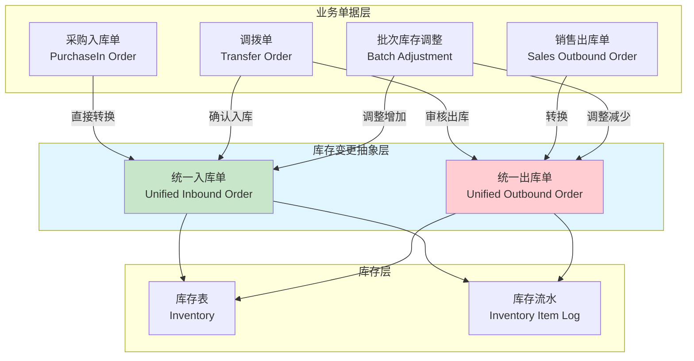
```mermaid
graph TB
    subgraph BusinessDocs["业务单据层"]
        PO["采购入库单<br/>PurchaseIn Order"]
        TO["调拨单<br/>Transfer Order"]
        SO["销售出库单<br/>Sales Outbound Order"]
        BA["批次库存调整<br/>Batch Adjustment"]
    end
    
    subgraph AbstractLayer["库存变更抽象层"]
        IO["统一入库单<br/>Unified Inbound Order"]
        OO["统一出库单<br/>Unified Outbound Order"]
    end
    
    subgraph Inventory["库存层"]
        INV["库存表<br/>Inventory"]
        IFL["库存流水<br/>Inventory Item Log"]
    end
    
    PO -->|直接转换| IO
    TO -->|审核出库| OO
    TO -->|确认入库| IO
    SO -->|转换| OO
    BA -->|调整增加| IO
    BA -->|调整减少| OO
    
    IO --> INV
    IO --> IFL
    OO --> INV
    OO --> IFL
    
    style AbstractLayer fill:#e1f5ff
    style IO fill:#c8e6c9
    style OO fill:#ffcdd2
```

**转换规则**：

业务单据到统一入库单/出库单的转换规则如下：

| 业务单据 | 操作 | 转换为 | 说明 |
|:--------|:----|:------|:------|
| **采购入库单** | ✅ 审核通过 | 📥 统一入库单 | 直接更新库存，增加总库存和可分配库存 |
| **调拨单** | ✅ 审核出库 | 📤 统一出库单 | 扣减源仓库库存，减少总库存和可分配库存 |
| **调拨单** | ✅ 审核入库 | 📥 统一入库单 | 增加目标仓库库存，增加总库存和可分配库存 |
| **销售出库单** | ✅ 审核出库 | 📤 统一出库单 | 扣减库存，减少总库存、可分配库存和已分配库存 |
| **批次库存调整** | ⬆️ 增加库存 | 📥 统一入库单 | 通过入库单增加批次库存 |
| **批次库存调整** | ⬇️ 减少库存 | 📤 统一出库单 | 通过出库单减少批次库存（按FIFO） |

**图例说明**：
- 📥 **统一入库单**：增加库存的操作
- 📤 **统一出库单**：减少库存的操作
- ✅ **操作**：业务单据的具体操作步骤
- ⬆️ **增加**：库存增加操作
- ⬇️ **减少**：库存减少操作

**优势**：
1. **统一入口**：所有库存变更都通过统一的入库单/出库单处理，逻辑集中
2. **易于扩展**：新增业务单据类型时，只需转换为入库单/出库单，无需修改库存更新逻辑
3. **审计追溯**：所有库存变更都有统一的流水记录，便于追溯
4. **并发控制**：统一的并发控制机制，保证数据一致性

### 2.3 系统整体架构图

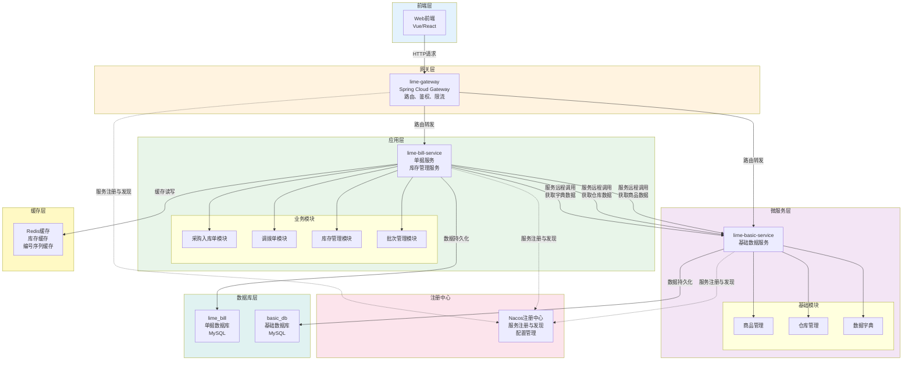
```mermaid
graph TB
    subgraph Frontend["前端层"]
        Web["Web前端<br/>Vue/React"]
    end
    
    subgraph GatewayLayer["网关层"]
        Gateway["lime-gateway<br/>Spring Cloud Gateway<br/>路由、鉴权、限流"]
    end
    
    subgraph AppLayer["应用层"]
        BillService["lime-bill-service<br/>单据服务<br/>库存管理服务"]
        subgraph BillModules["业务模块"]
            PurchaseIn["采购入库单模块"]
            TransferOrder["调拨单模块"]
            InventoryMgmt["库存管理模块"]
            BatchMgmt["批次管理模块"]
        end
    end
    
    subgraph MicroServices["微服务层"]
        BasicService["lime-basic-service<br/>基础数据服务"]
        subgraph BasicModules["基础模块"]
            Product["商品管理"]
            Warehouse["仓库管理"]
            Dictionary["数据字典"]
        end
    end
    
    subgraph Registry["注册中心"]
        Nacos["Nacos注册中心<br/>服务注册与发现<br/>配置管理"]
    end
    
    subgraph Database["数据库层"]
        BillDB["lime_bill<br/>单据数据库<br/>MySQL"]
        BasicDB["basic_db<br/>基础数据库<br/>MySQL"]
    end
    
    subgraph Cache["缓存层"]
        Redis["Redis缓存<br/>库存缓存<br/>编号序列缓存"]
    end
    
    Web -->|HTTP请求| Gateway
    Gateway -->|路由转发| BillService
    Gateway -->|路由转发| BasicService
    
    BillService -->|服务远程调用<br/>获取商品数据| BasicService
    BillService -->|服务远程调用<br/>获取仓库数据| BasicService
    BillService -->|服务远程调用<br/>获取字典数据| BasicService
    
    BillService -.->|服务注册与发现| Nacos
    BasicService -.->|服务注册与发现| Nacos
    Gateway -.->|服务注册与发现| Nacos
    
    BillService -->|数据持久化| BillDB
    BasicService -->|数据持久化| BasicDB
    
    BillService -->|缓存读写| Redis
    
    BillService --> PurchaseIn
    BillService --> TransferOrder
    BillService --> InventoryMgmt
    BillService --> BatchMgmt
    
    BasicService --> Product
    BasicService --> Warehouse
    BasicService --> Dictionary
    
    style Frontend fill:#e3f2fd
    style GatewayLayer fill:#fff3e0
    style AppLayer fill:#e8f5e9
    style MicroServices fill:#f3e5f5
    style Registry fill:#fce4ec
    style Database fill:#e0f2f1
    style Cache fill:#fff9c4
```

**架构说明**：

1. **前端层**：Web前端应用，通过HTTP协议访问网关
2. **网关层**：`lime-gateway`作为统一入口，负责路由转发、鉴权、限流等
3. **应用层**：`lime-bill-service`单据服务，包含采购入库、调拨、库存管理、批次管理等业务模块
4. **微服务层**：`lime-basic-service`基础数据服务，提供商品、仓库、数据字典等基础数据
5. **注册中心**：`Nacos`提供服务注册与发现、配置管理功能
6. **数据库层**：每个服务拥有独立的数据库（`lime_bill`、`basic_db`）
7. **缓存层**：`Redis`用于库存缓存、编号序列缓存等

**服务间调用关系**：
- `lime-bill-service`通过Feign调用`lime-basic-service`获取商品、仓库、字典等基础数据
- 所有服务都注册到`Nacos`，通过服务名进行服务发现和负载均衡
- `lime-gateway`从`Nacos`获取服务列表，进行路由转发

### 2.4 分层架构（五层架构）

```mermaid
graph TB
    subgraph Client["客户端层"]
        Web["Web前端"]
        Mobile["移动端"]
    end
    
    subgraph Gateway["API网关层"]
        SCG["Spring Cloud Gateway"]
    end
    
    subgraph Service["微服务层 - lime-bill-service"]
        subgraph Controller["Controller层"]
            PIC["PurchaseInController<br/>采购入库单控制器"]
            TOC["TransferOrderController<br/>调拨单控制器"]
            IC["InventoryController<br/>库存管理控制器"]
            BC["BatchController<br/>批次管理控制器"]
        end
        
        subgraph BizService["BizService层 - 业务编排"]
            PIB["ErpPurchaseBizService<br/>采购业务编排"]
            TOB["ErpTransferBizService<br/>调拨业务编排"]
            IB["ErpInventoryBizService<br/>库存业务编排"]
            BB["ErpBatchBizService<br/>批次业务编排"]
        end
        
        subgraph Service["Service层 - 领域服务"]
            PIS["PurchaseInService<br/>采购入库服务"]
            TOS["TransferOrderService<br/>调拨单服务"]
            IS["InventoryService<br/>库存服务<br/>统一入库/出库单处理"]
            IFS["InventoryItemService<br/>库存流水服务"]
            BS["InventoryBatchService<br/>库存批次服务"]
            BIS["BatchInventoryService<br/>批次库存服务"]
        end
        
        subgraph Repository["Repository层 - 数据访问"]
            PIR["PurchaseInRepository"]
            TOR["TransferOrderRepository"]
            IR["InventoryRepository"]
            IFR["InventoryItemRepository"]
            BR["InventoryBatchRepository"]
            BIR["BatchInboundRepository"]
        end
    end
    
    subgraph Data["数据层"]
        MySQL["MySQL数据库"]
        Redis["Redis缓存"]
    end
    
    Web --> SCG
    Mobile --> SCG
    SCG --> PIC
    SCG --> TOC
    SCG --> IC
    SCG --> BC
    
    PIC --> PIB
    TOC --> TOB
    IC --> IB
    BC --> BB
    
    PIB --> PIS
    TOB --> TOS
    TOB --> IS
    IB --> IS
    IB --> IFS
    BB --> BS
    BB --> BIS
    BIS --> IS
    
    PIS --> PIR
    TOS --> TOR
    IS --> IR
    IFS --> IFR
    BS --> BR
    BIS --> BIR
    
    PIR --> MySQL
    TOR --> MySQL
    IR --> MySQL
    IFR --> MySQL
    BR --> MySQL
    BIR --> MySQL
    IS --> Redis
```

### 2.5 技术栈

| 技术组件 | 版本/说明 |
|---------|----------|
| Spring Boot | 3.0+ |
| MyBatis Plus | 最新版本 |
| MySQL | 8.0+ |
| Redis | 7.0+ |
| Spring Cloud Gateway | 最新版本 |
| Nacos | 服务注册与配置中心 |

---

## 6. ER图设计

### 2.1 核心实体关系图

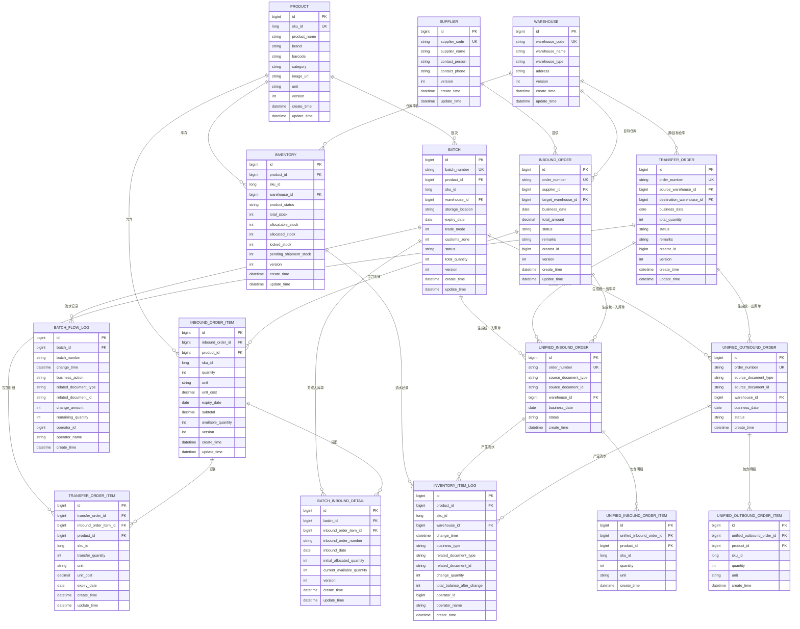
```mermaid
erDiagram
    PRODUCT ||--o{ INBOUND_ORDER_ITEM : "包含"
    SUPPLIER ||--o{ INBOUND_ORDER : "提供"
    WAREHOUSE ||--o{ INBOUND_ORDER : "目标仓库"
    WAREHOUSE ||--o{ TRANSFER_ORDER : "源/目标仓库"
    INBOUND_ORDER ||--o{ INBOUND_ORDER_ITEM : "包含明细"
    TRANSFER_ORDER ||--o{ TRANSFER_ORDER_ITEM : "包含明细"
    INBOUND_ORDER_ITEM ||--o{ TRANSFER_ORDER_ITEM : "关联"
    PRODUCT ||--o{ INVENTORY : "库存"
    WAREHOUSE ||--o{ INVENTORY : "仓库库存"
    INVENTORY ||--o{ INVENTORY_ITEM_LOG : "流水记录"
    PRODUCT ||--o{ BATCH : "批次"
    BATCH ||--o{ BATCH_INBOUND_DETAIL : "关联入库单"
    BATCH ||--o{ BATCH_FLOW_LOG : "流水记录"
    INBOUND_ORDER_ITEM ||--o{ BATCH_INBOUND_DETAIL : "分配"
    BATCH ||--o{ UNIFIED_INBOUND_ORDER : "生成统一入库单"
    BATCH ||--o{ UNIFIED_OUTBOUND_ORDER : "生成统一出库单"
    TRANSFER_ORDER ||--o{ UNIFIED_OUTBOUND_ORDER : "生成统一出库单"
    TRANSFER_ORDER ||--o{ UNIFIED_INBOUND_ORDER : "生成统一入库单"
    INBOUND_ORDER ||--o{ UNIFIED_INBOUND_ORDER : "生成统一入库单"
    UNIFIED_INBOUND_ORDER ||--o{ UNIFIED_INBOUND_ORDER_ITEM : "包含明细"
    UNIFIED_OUTBOUND_ORDER ||--o{ UNIFIED_OUTBOUND_ORDER_ITEM : "包含明细"
    UNIFIED_INBOUND_ORDER ||--o{ INVENTORY_ITEM_LOG : "产生流水"
    UNIFIED_OUTBOUND_ORDER ||--o{ INVENTORY_ITEM_LOG : "产生流水"
    
    PRODUCT {
        bigint id PK
        long sku_id UK
        string product_name
        string brand
        string barcode
        string category
        string image_url
        string unit
        int version
        datetime create_time
        datetime update_time
    }
    
    SUPPLIER {
        bigint id PK
        string supplier_code UK
        string supplier_name
        string contact_person
        string contact_phone
        int version
        datetime create_time
        datetime update_time
    }
    
    WAREHOUSE {
        bigint id PK
        string warehouse_code UK
        string warehouse_name
        string warehouse_type
        string address
        int version
        datetime create_time
        datetime update_time
    }
    
    INBOUND_ORDER {
        bigint id PK
        string order_number UK
        bigint supplier_id FK
        bigint target_warehouse_id FK
        date business_date
        decimal total_amount
        string status
        string remarks
        bigint creator_id
        int version
        datetime create_time
        datetime update_time
    }
    
    INBOUND_ORDER_ITEM {
        bigint id PK
        bigint inbound_order_id FK
        bigint product_id FK
        long sku_id
        int quantity
        string unit
        decimal unit_cost
        date expiry_date
        decimal subtotal
        int available_quantity
        int version
        datetime create_time
        datetime update_time
    }
    
    TRANSFER_ORDER {
        bigint id PK
        string order_number UK
        bigint source_warehouse_id FK
        bigint destination_warehouse_id FK
        date business_date
        int total_quantity
        string status
        string remarks
        bigint creator_id
        int version
        datetime create_time
        datetime update_time
    }
    
    TRANSFER_ORDER_ITEM {
        bigint id PK
        bigint transfer_order_id FK
        bigint inbound_order_item_id FK
        bigint product_id FK
        long sku_id
        int transfer_quantity
        string unit
        decimal unit_cost
        date expiry_date
        datetime create_time
        datetime update_time
    }
    
    INVENTORY {
        bigint id PK
        bigint product_id FK
        long sku_id
        bigint warehouse_id FK
        string product_status
        int total_stock
        int allocatable_stock
        int allocated_stock
        int locked_stock
        int pending_shipment_stock
        int version
        datetime create_time
        datetime update_time
    }
    
    INVENTORY_ITEM_LOG {
        bigint id PK
        bigint product_id FK
        long sku_id
        bigint warehouse_id FK
        datetime change_time
        string business_type
        string related_document_type
        string related_document_id
        int change_quantity
        int total_balance_after_change
        bigint operator_id
        string operator_name
        datetime create_time
    }
    
    BATCH {
        bigint id PK
        string batch_number UK
        bigint product_id FK
        long sku_id
        bigint warehouse_id FK
        string storage_location
        date expiry_date
        int trade_mode
        int customs_zone
        string status
        int total_quantity
        int version
        datetime create_time
        datetime update_time
    }
    
    BATCH_INBOUND_DETAIL {
        bigint id PK
        bigint batch_id FK
        bigint inbound_order_item_id FK
        string inbound_order_number
        date inbound_date
        int initial_allocated_quantity
        int current_available_quantity
        int version
        datetime create_time
        datetime update_time
    }
    
    BATCH_FLOW_LOG {
        bigint id PK
        bigint batch_id FK
        string batch_number
        datetime change_time
        string business_action
        string related_document_type
        string related_document_id
        int change_amount
        int remaining_quantity
        bigint operator_id
        string operator_name
        datetime create_time
    }
    
    UNIFIED_INBOUND_ORDER {
        bigint id PK
        string order_number UK
        string source_document_type
        string source_document_id
        bigint warehouse_id FK
        date business_date
        string status
        datetime create_time
    }
    
    UNIFIED_INBOUND_ORDER_ITEM {
        bigint id PK
        bigint unified_inbound_order_id FK
        bigint product_id FK
        long sku_id
        int quantity
        string unit
        datetime create_time
    }
    
    UNIFIED_OUTBOUND_ORDER {
        bigint id PK
        string order_number UK
        string source_document_type
        string source_document_id
        bigint warehouse_id FK
        date business_date
        string status
        datetime create_time
    }
    
    UNIFIED_OUTBOUND_ORDER_ITEM {
        bigint id PK
        bigint unified_outbound_order_id FK
        bigint product_id FK
        long sku_id
        int quantity
        string unit
        datetime create_time
    }
```

### 2.2 实体说明

#### 2.2.1 核心实体

1. **PRODUCT (商品)**
   - 存储商品基础信息
   - SKU编码唯一标识

2. **SUPPLIER (供应商)**
   - 存储供应商信息

3. **WAREHOUSE (仓库)**
   - 存储仓库信息

4. **INBOUND_ORDER (采购入库单)**
   - 采购入库单主表
   - 关联供应商和目标仓库

5. **INBOUND_ORDER_ITEM (采购入库单明细)**
   - 入库单商品明细
   - 记录数量、成本、效期等信息

6. **TRANSFER_ORDER (调拨单)**
   - 调拨单主表
   - 记录源仓库和目标仓库

7. **TRANSFER_ORDER_ITEM (调拨单明细)**
   - 调拨单商品明细
   - 关联源入库单明细

8. **INVENTORY (库存)**
   - 库存汇总表
   - 按SKU、仓库、产品状态维度统计

9. **INVENTORY_ITEM_LOG (库存流水)**
   - 库存变动流水记录
   - 用于追溯和审计

10. **BATCH (批次)**
    - 可售批次信息
    - 关联多个入库单明细

11. **BATCH_INBOUND_DETAIL (批次入库明细)**
    - 批次与入库单的关联关系
    - 记录分配数量和当前可售余量

12. **BATCH_FLOW_LOG (批次流水日志)**
    - 批次库存变动流水记录
    - 记录批次创建、订单扣减、批次调整等操作

13. **UNIFIED_INBOUND_ORDER (统一入库单)**
    - 库存变更的统一抽象层
    - 所有增加库存的业务单据都转换为统一入库单
    - 记录源单据类型和ID，便于追溯

14. **UNIFIED_INBOUND_ORDER_ITEM (统一入库单明细)**
    - 统一入库单的商品明细
    - 记录入库的商品和数量

15. **UNIFIED_OUTBOUND_ORDER (统一出库单)**
    - 库存变更的统一抽象层
    - 所有减少库存的业务单据都转换为统一出库单
    - 记录源单据类型和ID，便于追溯

16. **UNIFIED_OUTBOUND_ORDER_ITEM (统一出库单明细)**
    - 统一出库单的商品明细
    - 记录出库的商品和数量

---

## 3. 业务流程

### 3.1 采购入库流程

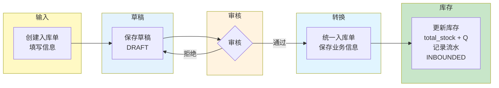
```mermaid
flowchart LR
    subgraph Input["输入"]
        A[创建入库单<br/>填写信息]
    end
    
    subgraph Draft["草稿"]
        B[保存草稿<br/>DRAFT]
    end
    
    subgraph Approval["审核"]
        C{审核}
    end
    
    subgraph Convert["转换"]
        D[统一入库单<br/>保存业务信息]
    end
    
    subgraph Inventory["库存"]
        E[更新库存<br/>total_stock + Q<br/>记录流水<br/>INBOUNDED]
    end
    
    A --> B --> C
    C -->|通过| D
    C -->|拒绝| B
    D --> E
    
    style Input fill:#fff9c4
    style Draft fill:#e3f2fd
    style Approval fill:#fff3e0
    style Convert fill:#e1f5ff
    style Inventory fill:#c8e6c9
```

**流程说明**：

采购入库流程是库存增加的核心流程，当采购的商品到达仓库并审核通过后，系统会自动增加对应仓库的库存数量。整个流程分为五个阶段：

1. **输入阶段**：用户创建采购入库单，填写供应商、目标仓库、商品明细（包括数量、成本、效期等信息）。这是库存增加的起点，所有信息必须准确无误。

2. **草稿阶段**：入库单可以保存为草稿状态，允许用户多次编辑和完善信息。草稿状态的入库单不会影响库存，只有提交审核后才会进入后续流程。

3. **审核阶段**：提交后的入库单进入待审核状态，此时不能修改。审核人员检查入库单信息的完整性和准确性，审核通过后进入转换阶段，审核拒绝则返回修改。

4. **转换阶段**：审核通过的采购入库单在代码层被转换为**统一入库上下文**（InventoryUnifiedInboundContext），作为库存系统的统一抽象。上下文中保存原始业务信息（业务类型为"采购入库"，单据号为采购入库单号），不落统一单据表，确保后续流水可追溯。

5. **库存更新阶段**：这是最关键的一步，系统会查询或创建库存记录，然后使用乐观锁机制更新库存数量，同时记录库存流水日志。更新完成后，采购入库单状态变为"已入库"。

**库存增加计算公式**：

**业务约定**：库存的业务唯一键为 **仓库 id + 商品 id**，当前**未使用 sku_id**。即：一个仓库下一个商品对应一条库存汇总行。入库时按「商品 + 仓库 + 产品状态」查询或创建库存记录，并更新该行。

对于每个入库单明细项（商品、仓库、产品状态），系统按以下步骤处理：

1. **查询或创建库存记录**：
   ```
   按 product_id、warehouse_id、product_status 查询 bill_inventory
   IF 不存在 THEN
       创建新记录：product_id、warehouse_id、product_status，total_stock=0, allocatable_stock=0, version=0
       （表唯一约束为 sku_id+warehouse_id+product_status，新建时 sku_id 以 product_id 填充以满足约束）
   END IF
   ```
   **说明**：库存按**仓库 + 商品**为业务唯一键。若该商品在该仓库该状态下尚无库存记录，系统会创建一条新记录，初始库存为 0。采购入库单明细当前不使用 sku 维度，落库时明细的 sku_id 存 0；查/建库存时使用 product_id + warehouse_id。

2. **更新库存（带乐观锁）**：
   ```sql
   UPDATE bill_inventory
   SET total_stock = total_stock + Q,           -- Q: 入库数量
       allocatable_stock = allocatable_stock + Q,
       version = version + 1,
       update_time = NOW()
   WHERE product_id = ? 
     AND warehouse_id = ? 
     AND product_status = ?
     AND version = ?                           -- 乐观锁版本号
   ```
   **说明**：使用乐观锁更新库存。按 product_id、warehouse_id、product_status 定位唯一行，将总库存和可分配库存增加 Q。若 version 不匹配则更新失败，需重新查询后重试。

3. **库存变化**：
   ```
   更新前：total_stock = T0, allocatable_stock = A0
   更新后：total_stock = T0 + Q, allocatable_stock = A0 + Q
   
   其中：
   - T0: 原总库存（该商品在该仓库该状态下的总库存数量）
   - A0: 原可分配库存（可以用于销售、调拨等的库存数量）
   - Q: 本次入库数量（Q > 0，必须为正数）
   ```
   **说明**：采购入库时，总库存和可分配库存都会增加相同的数量Q。这是因为采购入库的商品都是可用的，可以直接用于后续的销售或调拨操作。

4. **记录库存流水**：
   ```
   bill_inventory_item:
   - business_type = "PURCHASE_IN"（采购入库）
   - related_document_id = 采购入库单号（如：IN-2023102401）
   - change_quantity = Q（正数）
   - total_balance_after_change = T0 + Q
   ```
   **说明**：库存流水日志记录了每次库存变动的详细信息，包括业务类型、关联单据号、变动数量、变动后的库存余额等。这里记录的是"采购入库"而不是"统一入库"，确保用户可以追溯到原始业务单据。流水日志用于库存追溯、对账、审计等场景。

### 3.2 调拨流程

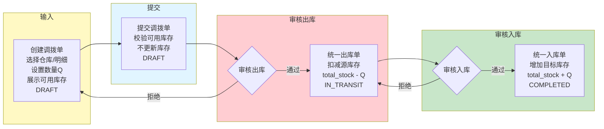
```mermaid
flowchart LR
    subgraph Input["输入"]
        A[创建调拨单<br/>选择仓库/明细<br/>设置数量Q<br/>展示可用库存<br/>DRAFT]
    end
    
    subgraph Submit["提交"]
        B[提交调拨单<br/>校验可用库存<br/>不更新库存<br/>DRAFT]
    end
    
    subgraph ApprovalOut["审核出库"]
        C{审核出库}
        D[统一出库单<br/>扣减源库存<br/>total_stock - Q<br/>IN_TRANSIT]
    end
    
    subgraph ApprovalIn["审核入库"]
        E{审核入库}
        F[统一入库单<br/>增加目标库存<br/>total_stock + Q<br/>COMPLETED]
    end
    
    A --> B --> C
    C -->|通过| D
    C -->|拒绝| A
    D --> E -->|通过| F
    E -->|拒绝| D
    
    style Input fill:#fff9c4
    style Submit fill:#e1f5ff
    style ApprovalOut fill:#ffcdd2
    style ApprovalIn fill:#c8e6c9
```

**流程说明**：

调拨流程是仓库间库存转移的核心流程，涉及两个仓库的库存变化：源仓库库存减少，目标仓库库存增加。整个流程分为五个阶段：

1. **输入阶段**：用户创建调拨单，选择源仓库（调出仓库）和目标仓库（调入仓库），从源仓库的入库单明细中选择需要调拨的商品。**关键约束**：
   - 调拨选择的商品来源于采购入库单或调拨入库单
   - 前端展示的是抽象后的入库单，但需明确标识原始为采购或调拨类型
   - **同一商品在一次调拨中只能选择一个入库批次**（确保成本与入库单一一对应）
   - **前端必须展示该单据的可用库存数量**，用户依据可见数据进行调拨数量输入
   - 调拨数量不能超过源仓库的可用库存

2. **提交阶段**：用户提交调拨单后：
   - **调拨单状态保持为"草稿"（DRAFT），不立即更新库存**
   - **后台强制校验**：所选单据的可用库存是否足够（可用库存 ≥ 调拨数量）
   - 校验维度：单据级、批次级、仓库级
   - 禁止超量调拨，系统主动拦截

3. **审核出库阶段**：审核通过后，系统执行以下操作：
   - 在代码层构建**统一出库上下文**（源仓库），调用统一库存更新服务
   - 扣减源仓库的库存（total_stock - Q, allocatable_stock - Q）
   - 写入库存流水（bill_inventory_item，业务类型：调拨出库）
   - **调拨单状态变为"运输中"（IN_TRANSIT）**，表示商品正在从源仓库运往目标仓库的路上

4. **审核入库阶段**：当商品到达目标仓库后，用户审核入库：
   - 在代码层构建**统一入库上下文**（目标仓库），调用统一库存更新服务
   - 增加目标仓库的库存（total_stock + Q, allocatable_stock + Q）
   - 写入库存流水（业务类型：调拨入库）
   - **调拨单状态变为"已完成"（COMPLETED）**，整个调拨流程结束

5. **成本追溯**：
   - 成本源自采购入库单，并随调拨过程持续传递至最终销售环节
   - 系统后台记录每笔入库对应的成本，用于订单成本核算
   - 前端不展示成本字段（仅对供应链管理人员开放，后台保留记录以供查询）
   - 支持通过调拨单号反向追溯原始采购或调拨来源

**关键点**：
- 调拨单初始为草稿状态，提交后不立即更新库存
- 调拨是分两个阶段完成的，先审核出库，再审核入库，中间有"运输中"状态
- 一次调拨行为在系统中拆分为出库和入库两个动作，共享同一调拨单号作为唯一标识
- 出库和入库都会记录独立的库存流水，便于追溯
- 总库存数量不变，只是在不同仓库间转移
- 同一商品在一次调拨中只能选择一个入库批次，确保成本与入库单一一对应
- 前端必须展示可用库存，后台强制校验库存充足性
- **调拨单分页列表接口**：返回 `statusName`（状态中文：草稿/待出库/运输中/已完成等）及 `unitId`/`unitName`（商品数量单位，用于列表展示「数量 + 单位」如「7 件」），详见《前端API接口文档》3.4 节

**库存变化计算公式**：

#### 出库阶段（源仓库库存减少）

对于每个调拨单明细项（SKU、源仓库、产品状态），系统按以下步骤处理：

1. **验证库存充足**：
   ```
   IF total_stock < Q THEN
       抛出异常：库存不足
   END IF
   ```
   **说明**：在扣减库存之前，必须先验证源仓库的库存是否充足。如果总库存小于调拨数量Q，说明库存不足，无法完成调拨，系统会抛出异常并终止操作。这个验证可以避免出现负库存的情况。

2. **扣减源仓库库存（带乐观锁）**：
   ```sql
   UPDATE bill_inventory
   SET total_stock = total_stock - Q,           -- Q: 调拨数量
       allocatable_stock = allocatable_stock - Q,
       version = version + 1,
       update_time = NOW()
   WHERE sku_id = ? 
     AND warehouse_id = 源仓库ID
     AND product_status = ?
     AND version = ?                            -- 乐观锁版本号
     AND total_stock >= Q                       -- 确保库存充足
   ```
   **说明**：使用乐观锁机制扣减源仓库库存。更新时会将总库存和可分配库存同时减少调拨数量Q。WHERE条件中同时检查version和total_stock，确保并发安全且库存充足。如果更新失败（version不匹配或库存不足），需要重新查询后重试。

3. **源仓库库存变化**：
   ```
   更新前：total_stock = T_source0, allocatable_stock = A_source0
   更新后：total_stock = T_source0 - Q, allocatable_stock = A_source0 - Q
   
   其中：
   - T_source0: 源仓库原总库存（调拨前该SKU在源仓库的总库存数量）
   - A_source0: 源仓库原可分配库存（调拨前可以用于销售、调拨等的库存数量）
   - Q: 调拨数量（Q > 0，必须为正数）
   ```
   **说明**：调拨出库时，源仓库的总库存和可分配库存都会减少相同的数量Q。这是因为调拨出去的库存不再属于源仓库，不能用于源仓库的销售或调拨操作。

4. **记录出库流水**：
   ```
   bill_inventory_item:
   - business_type = "TRANSFER_OUT"（调拨出库）
   - related_document_id = 调拨单号（如：TR-20231026001）
   - change_quantity = -Q（负数，表示减少）
   - total_balance_after_change = T_source0 - Q
   ```
   **说明**：记录源仓库的出库流水，业务类型为"调拨出库"，变动数量为负数-Q，表示库存减少。通过关联单据号可以追溯到具体的调拨单。

#### 入库阶段（目标仓库库存增加）

对于每个调拨单明细项（SKU、目标仓库、产品状态），系统按以下步骤处理：

1. **查询或创建库存记录**：
   ```
   IF 目标仓库inventory不存在 THEN
       创建新记录：total_stock=0, allocatable_stock=0, version=0
   END IF
   ```
   **说明**：如果目标仓库该SKU该状态下还没有库存记录，系统会自动创建一条新记录。这样可以确保后续更新操作能够正常执行。

2. **增加目标仓库库存（带乐观锁）**：
   ```sql
   UPDATE bill_inventory
   SET total_stock = total_stock + Q,           -- Q: 调拨数量
       allocatable_stock = allocatable_stock + Q,
       version = version + 1,
       update_time = NOW()
   WHERE sku_id = ? 
     AND warehouse_id = 目标仓库ID
     AND product_status = ?
     AND version = ?                            -- 乐观锁版本号
   ```
   **说明**：使用乐观锁机制增加目标仓库库存。更新时会将总库存和可分配库存同时增加调拨数量Q。调拨入库的商品都是可用的，可以直接用于目标仓库的销售或调拨操作。

3. **目标仓库库存变化**：
   ```
   更新前：total_stock = T_dest0, allocatable_stock = A_dest0
   更新后：total_stock = T_dest0 + Q, allocatable_stock = A_dest0 + Q
   
   其中：
   - T_dest0: 目标仓库原总库存（调拨前该SKU在目标仓库的总库存数量）
   - A_dest0: 目标仓库原可分配库存（调拨前可以用于销售、调拨等的库存数量）
   - Q: 调拨数量（Q > 0，必须为正数）
   ```
   **说明**：调拨入库时，目标仓库的总库存和可分配库存都会增加相同的数量Q。这是因为调拨进来的库存都是可用的，可以直接用于目标仓库的销售或调拨操作。

4. **记录入库流水**：
   ```
   bill_inventory_item:
   - business_type = "TRANSFER_IN"（调拨入库）
   - related_document_id = 调拨单号（如：TR-20231026001）
   - change_quantity = Q（正数，表示增加）
   - total_balance_after_change = T_dest0 + Q
   ```
   **说明**：记录目标仓库的入库流水，业务类型为"调拨入库"，变动数量为正数Q，表示库存增加。通过关联单据号可以追溯到具体的调拨单。

**操作人记录**：调拨单审核出库、审核入库成功后，会向 **单据操作日志表（bill_operation_log）** 写入操作人及单据快照，便于后期追述。详见 [单据操作日志方案](./单据操作日志方案.md)（TRANSFER_APPROVE_OUT、TRANSFER_APPROVE_IN）。

5. **更新调拨单明细的可分配数量**（可分配数量明细设计，详见 3.5.0）：
   - 将本调拨单下每条 **bill_inventory_order_item** 的 **available_quantity** 置为该行的 **quantity**
   - 使目标仓的「调拨入库单明细」进入可分配池，供新建可售批次时从「关联库存分配」中选择并分配

**总库存守恒**：
```
源仓库减少：T_source0 - Q
目标仓库增加：T_dest0 + Q
总库存不变：（T_source0 - Q）+（T_dest0 + Q）= T_source0 + T_dest0
```
**说明**：调拨操作不会改变系统的总库存数量，只是将库存从一个仓库转移到另一个仓库。源仓库减少的数量等于目标仓库增加的数量，两者之和等于调拨数量Q。这符合库存管理的物理规律：商品从一个仓库转移到另一个仓库，总数量不变。

### 3.3 库存管理流程

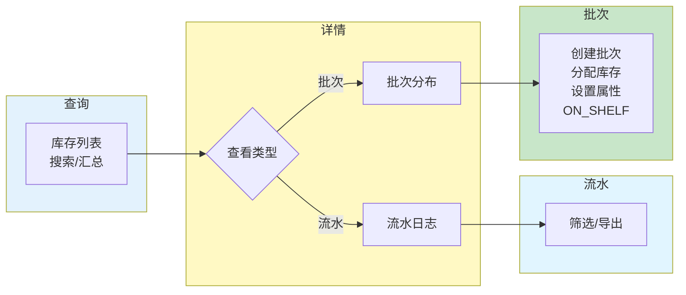
```mermaid
flowchart LR
    subgraph Query["查询"]
        A[库存列表<br/>搜索/汇总]
    end
    
    subgraph Detail["详情"]
        B{查看类型}
        C[流水日志]
        D[批次分布]
    end
    
    subgraph ItemLog["流水"]
        E[筛选/导出]
    end
    
    subgraph Batch["批次"]
        F[创建批次<br/>分配库存<br/>设置属性<br/>ON_SHELF]
    end
    
    A --> B
    B -->|流水| C --> E
    B -->|批次| D --> F
    
    style Query fill:#e3f2fd
    style Detail fill:#fff9c4
    style ItemLog fill:#e1f5ff
    style Batch fill:#c8e6c9
```

### 3.4 批次创建流程

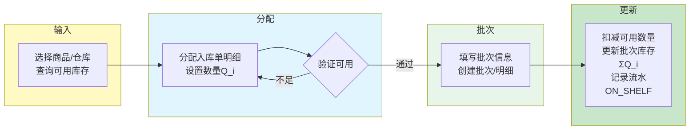
```mermaid
flowchart LR
    subgraph Input["输入"]
        A[选择商品/仓库<br/>查询可用库存]
    end
    
    subgraph Allocation["分配"]
        B[分配入库单明细<br/>设置数量Q_i]
        C{验证可用}
    end
    
    subgraph Batch["批次"]
        D[填写批次信息<br/>创建批次/明细]
    end
    
    subgraph Update["更新"]
        E[扣减可用数量<br/>更新批次库存<br/>ΣQ_i<br/>记录流水<br/>ON_SHELF]
    end
    
    A --> B --> C
    C -->|通过| D
    C -->|不足| B
    D --> E
    
    style Input fill:#fff9c4
    style Allocation fill:#e1f5ff
    style Batch fill:#e8f5e9
    style Update fill:#c8e6c9
```

**流程说明**：

批次创建流程是将采购入库单的库存资源组织成可售批次的过程。批次是库存管理的重要概念，它将来自不同入库单的库存资源整合在一起，便于统一管理和销售。整个流程分为四个阶段：

1. **输入阶段**：用户选择商品和仓库，系统查询该商品在该仓库下所有**可分配数量 > 0**的入库单明细（**bill_inventory_order_item**，含**采购入库单明细**与**调拨入库单明细**，主单 target_warehouse_id = 该仓且已入库/已完成）。可用数量即 available_quantity（池内可用），可用于创建新批次。

2. **分配阶段**：用户从查询结果中选择一个或多个入库单明细，为每个明细设置分配数量。分配数量不能超过该明细的可用数量。系统会验证所有明细的总可用数量是否满足分配需求，如果不足则提示用户重新选择。

3. **批次层**：用户填写批次的基本信息，包括批次号、库位、效期、贸易模式、申报关区等。系统创建批次主记录和批次入库明细记录。批次入库明细记录了每个入库单明细的分配情况，包括初始分配数量和当前可用数量，以及入库日期（用于后续FIFO扣减排序）。

4. **更新阶段**：系统扣减入库单明细的可用数量（表示这些库存已经被分配给批次），更新批次总库存，记录批次流水日志，最后将批次状态更新为"已上架"（ON_SHELF），表示批次可以用于销售。

**关键点**：
- 批次库存来自采购入库单明细，通过分配机制将入库单库存纳入批次
- 批次创建会扣减入库单明细的可用数量，避免重复分配
- 批次入库明细记录了入库日期，用于后续FIFO扣减排序

**批次库存计算公式**：

假设批次包含 n 个入库单明细，每个明细分配数量为 Q_i（i = 1, 2, ..., n）：

1. **扣减入库单明细可用数量（带乐观锁）**：
   ```sql
   -- 对每个入库单明细项
   UPDATE inbound_order_item
   SET available_quantity = available_quantity - Q_i,
       version = version + 1,
       update_time = NOW()
   WHERE id = 入库单明细ID
     AND version = ?
     AND available_quantity >= Q_i              -- 确保可用数量充足
   ```
   **说明**：批次创建时，需要从入库单明细中扣减可用数量，表示这些库存已经被分配给批次。使用乐观锁机制确保并发安全，同时检查可用数量是否充足。如果可用数量不足或版本号不匹配，更新会失败，需要重新查询后重试。

2. **创建批次入库明细**：
   ```
   bill_batch_detail:
   - initial_allocated_quantity = Q_i（初始分配数量，创建批次时分配的数量）
   - current_available_quantity = Q_i（当前可用数量，初始等于分配数量，后续扣减会减少）
   - inbound_date = 入库单业务日期（用于FIFO排序，最早入库的优先扣减）
   ```
   **说明**：批次入库明细记录了每个入库单明细的分配情况。初始分配数量和当前可用数量在创建时都等于分配数量Q_i。后续销售出库时，会按照入库日期（inbound_date）进行FIFO排序，优先扣减最早入库的库存。

3. **更新批次总库存（带乐观锁）**：
   ```sql
   UPDATE bill_inventory_batch
   SET total_quantity = total_quantity + ΣQ_i,  -- 批次总库存 = 所有明细分配数量之和
       version = version + 1,
       update_time = NOW()
   WHERE id = 批次ID
     AND version = ?
   ```
   **说明**：批次总库存等于所有批次入库明细的分配数量之和。创建批次时，批次总库存从0开始，加上所有明细的分配数量。使用乐观锁机制确保并发安全。

4. **批次库存计算公式**：
   ```
   批次总库存 = ΣQ_i = Q_1 + Q_2 + ... + Q_n
   
   其中：
   - Q_i: 第i个入库单明细的分配数量（分配给批次的数量）
   - n: 批次包含的入库单明细数量（批次可能包含多个入库单的库存）
   ```
   **说明**：批次总库存是所有批次入库明细分配数量的总和。例如，如果批次包含3个入库单明细，分别分配了100、200、300个，那么批次总库存就是600个。这个公式确保了批次库存的准确性。

5. **入库单明细可用数量变化**：
   ```
   更新前：available_quantity_i = A_i0
   更新后：available_quantity_i = A_i0 - Q_i
   
   约束条件：A_i0 >= Q_i（可用数量必须大于等于分配数量）
   ```
   **说明**：批次创建会扣减入库单明细的可用数量。例如，如果某个入库单明细原来有1000个可用库存，分配给批次500个后，剩余500个可用库存。这个机制确保了库存不会重复分配，避免超卖。

6. **记录批次流水**：
   ```
   bill_inventory_batch_item:
   - business_action = "批次创建"
   - change_amount = ΣQ_i（正数，表示库存增加）
   - remaining_quantity = ΣQ_i（批次创建后的总库存）
   ```
   **说明**：记录批次创建流水，变动数量为正数，表示批次库存增加。流水日志用于追溯批次库存的变化历史，便于问题排查和审计。

### 3.5 商品库存与批次库存专项说明

#### 3.5.0 可分配数量明细（入库单明细级别）

**定义**：可分配数量明细指**每条入库单明细行**当前仍可被「调拨出库」或「新建/调整批次」占用的数量，物理存储在 **`bill_inventory_order_item.available_quantity`**（池内可用）。约束：对任意明细行恒有 **0 ≤ available_quantity ≤ quantity**。

**数据来源（谁产生可分配数量）**：

| 来源 | 单据类型 | 产生时机 | 说明 |
|------|----------|----------|------|
| **采购入库单明细** | bill_type = PURCHASE_IN，已入库 | 审核入库通过后 | 将该单下每条明细的 available_quantity 置为 quantity，进入「可分配池」 |
| **调拨入库单明细** | bill_type = TRANSFER，已审核入库(COMPLETED) | 审核入库通过后 | 将该调拨单下每条明细的 available_quantity 置为 quantity，进入目标仓「可分配池」 |

**消费场景（谁扣减可分配数量）**：

| 消费场景 | 扣减对象 | 说明 |
|----------|----------|------|
| **调拨出库** | 仅源仓的采购入库单明细 | 按调拨单明细的 source_bill_item_id 扣减对应 bill_inventory_order_item.available_quantity；调入仓不变 |
| **新建可售批次 / 批次纳入新入库单** | 该仓库下 available_quantity > 0 的入库单明细 | 可选资源包括：采购入库单明细（主单已入库）+ 调拨入库单明细（主单已完成）；分配时扣减 available_quantity，并写入 bill_batch_detail.bill_item_id（指向 bill_inventory_order_item.id） |

**流程要点**：

1. **采购入库单审核入库**：更新 bill_inventory（目标仓）、写流水；**将本单所有明细的 available_quantity 设为 quantity**。
2. **调拨单审核出库**：扣减源仓 bill_inventory 及流水；扣减调拨单每条明细的 source_bill_item_id 对应行的 available_quantity；单据状态 → 运输中。
3. **调拨单审核入库**：增加目标仓 bill_inventory 及流水；**将本单（调拨单）所有明细的 available_quantity 设为 quantity**；单据状态 → 已完成。
4. **新建批次**：查询该仓库下 available_quantity > 0 的 bill_inventory_order_item（主单为已入库的采购入库单或已完成的调拨单）；用户选择明细并填写分配数量；校验后扣减 available_quantity，写入 bill_batch_detail（含 bill_item_id）。

#### 3.5.1 商品库存（按商品+仓库汇总）

**定义**：商品库存是指**某个商品**在某个仓库、某个产品状态（正品/次品）下的总体库存情况，存储在 `bill_inventory` 表中。

**业务唯一键**：**仓库 id + 商品 id**。当前**未使用 sku_id** 维度，即一个仓库下一个商品对应一条库存汇总行；查/建库存时按 product_id + warehouse_id（及 product_status）处理。

**核心字段说明**：

| 字段名 | 说明 | 计算公式 | 示例 |
|--------|------|----------|------|
| `total_stock` | **入库库存合计（总结余）** | 累计所有入库操作的总和 | 1350 罐 |
| `allocatable_stock` | **当前可分配（可售数量）** | total_stock - allocated_stock | 800 罐 |
| `allocated_stock` | **已分配库存合计** | 已售 + 冻结占用 + 已分配未销售 | 550 罐 |

**库存数量关系公式**：

```
入库库存合计（total_stock）= 当前可分配（allocatable_stock）+ 已分配库存合计（allocated_stock）

即：total_stock = allocatable_stock + allocated_stock
```

**详细说明**：

1. **入库库存合计（total_stock / 总结余）**
   - **定义**：商品在仓库中的物理库存总量，是所有入库操作的累计结果
   - **计算方式**：每次采购入库、调拨入库时累加，每次销售出库、调拨出库时扣减
   - **用途**：反映商品的真实物理库存数量
   - **示例**：SKU-IN001在"青柠菜鸟中心仓-正品"的入库库存合计为1350罐

2. **当前可分配（allocatable_stock / 可售数量）**
   - **定义**：当前可以用于新订单、新调拨、新批次分配的库存数量
   - **计算公式**：`allocatable_stock = total_stock - allocated_stock`
   - **用途**：
     - 前端展示给用户，用于创建调拨单、创建批次时的参考
     - 后台校验，确保不会超量分配
   - **示例**：SKU-IN001当前可分配800罐，表示还有800罐可以用于新的业务操作

3. **已分配库存合计（allocated_stock）**
   - **定义**：已经被分配用于特定业务的库存数量，包括：
     - **已售（sold_stock）**：已经销售并出库的库存
     - **冻结占用（locked_stock）**：被冻结或占用的库存（如质检、调拨在途等）
     - **已分配未销售（pending_shipment_stock）**：已分配给订单但尚未发货的库存
   - **计算公式**：`allocated_stock = sold_stock + locked_stock + pending_shipment_stock`
   - **示例**：已分配库存合计550罐 = 已售400罐 + 冻结占用65罐 + 已分配未销售85罐

**库存变化场景**：

不同业务操作对商品库存字段的影响如下：

| 业务操作 | 入库库存合计<br/>`total_stock` | 当前可分配<br/>`allocatable_stock` | 已分配库存<br/>`allocated_stock` | 业务说明 |
|:--------|:---------------------------:|:-------------------------------:|:-----------------------------:|:--------|
| **采购入库** | ⬆️ **+Q** | ⬆️ **+Q** | ➖ 不变 | 入库商品可直接分配，总库存和可分配库存同时增加 |
| **调拨入库** | ⬆️ **+Q** | ⬆️ **+Q** | ➖ 不变 | 调拨入库商品可直接分配，总库存和可分配库存同时增加 |
| **销售出库** | ⬇️ **-Q** | ⬇️ **-Q** | ⬇️ **-Q** | 扣减已分配的库存，三个字段同时减少 |
| **调拨出库** | ⬇️ **-Q** | ⬇️ **-Q** | ➖ 不变* | 调拨出库时，如果是从已分配中扣减，则allocated_stock也减少 |
| **批次创建** | ➖ 不变 | ⬇️ **-Q** | ⬆️ **+Q** | **当前可分配减少、已分配未销售增加**（库存从可分配转为已分配，分配给批次），总量不变 |
| **批次作废** | ➖ 不变 | ⬆️ **+Q** | ⬇️ **-Q** | 批次库存返还到可分配池，总量不变 |

**图例说明**：
- ⬆️ **+Q**：增加数量Q
- ⬇️ **-Q**：减少数量Q  
- ➖ **不变**：该字段不发生变化
- **\***：调拨出库时，如果是从已分配库存中扣减，则`allocated_stock`也会减少

**库存守恒关系**：
```
入库库存合计（total_stock）= 当前可分配（allocatable_stock）+ 已分配库存（allocated_stock）
```

**变化规律总结**：
1. **入库操作**（采购入库、调拨入库）：`total_stock`和`allocatable_stock`同时增加，`allocated_stock`不变
2. **出库操作**（销售出库、调拨出库）：`total_stock`和`allocatable_stock`同时减少，`allocated_stock`根据情况变化
3. **批次操作**（批次创建、批次作废）：`total_stock`不变，`allocatable_stock`和`allocated_stock`反向变化；**批次创建时**当前可分配（allocatable_stock）减少、已分配未销售（pending_shipment_stock）增加，与实时库存汇总看板一致

**前端展示示例**（参考界面截图）：

```
实时库存汇总看板
├── 入库库存合计：1350 罐（total_stock）
├── 当前可分配：800 罐（allocatable_stock，绿色高亮）
└── 已分配库存：550 罐（allocated_stock）
    ├── 已售：400 罐
    ├── 冻结占用：65 罐
    └── 已分配未销售：85 罐
```

#### 3.5.2 批次库存（批次级别库存）

**定义**：批次库存是指某个批次中包含的库存数量及其分配情况，存储在 **批次表（bill_inventory_batch）** 和 **批次单据明细表（bill_batch_detail）** 中。

**核心字段说明**：

| 字段名 | 所在表 | 说明 | 计算公式 | 示例 |
|:------|:------|:----|:---------|:-----|
| `total_quantity` | `bill_inventory_batch` | **📦 批次库存合计（入库库存）** | 所有批次单据明细的初始分配数量之和 | 1200 罐 |
| `current_available_quantity` | `bill_batch_detail` | **✅ 批次可分配库存** | `初始分配数量 - 已扣减数量` | 800 罐 |
| `initial_allocated_quantity` | `bill_batch_detail` | **📋 初始分配数量** | 创建批次时从入库单明细分配的数量 | 1200 罐 |

**字段说明**：
- 📦 **批次库存合计**：批次创建时从入库单明细分配的总库存数量
- ✅ **批次可分配库存**：批次中当前可以用于销售出库的库存数量
- 📋 **初始分配数量**：创建批次时从入库单明细分配的数量

**批次库存数量关系公式**：

```
批次库存合计（bill_inventory_batch.total_quantity）= Σ(bill_batch_detail.initial_allocated_quantity)

批次可分配库存（bill_batch_detail.current_available_quantity）= 
    初始分配数量（initial_allocated_quantity）- 已扣减数量（deducted_quantity）

批次已分配库存 = 批次库存合计 - 批次可分配库存
```

**详细说明**：

1. **批次库存合计（bill_inventory_batch.total_quantity / 入库库存）**
   - **定义**：批次创建时从入库单明细分配的总库存数量
   - **计算方式**：批次创建时，将所有批次入库明细的初始分配数量相加
   - **用途**：反映批次的总库存规模
   - **示例**：批次BATCH-231024-001的批次库存合计为1200罐

2. **批次可分配库存（bill_batch_detail.current_available_quantity / 可分配）**
   - **定义**：批次中当前可以用于销售出库的库存数量
   - **计算公式**：`current_available_quantity = initial_allocated_quantity - deducted_quantity`
   - **计算规则**：
     - 初始值等于初始分配数量
     - 销售出库时按FIFO原则扣减，优先扣减最早入库的明细
   - **用途**：
     - 前端展示，用于创建销售出库单时的参考
     - 后台校验，确保不会超量销售
   - **示例**：批次BATCH-231024-001的可分配库存为800罐（已销售400罐）

3. **批次已分配库存**
   - **定义**：批次中已经被销售出库的库存数量
   - **计算公式**：`批次已分配库存 = 批次库存合计 - 批次可分配库存`
   - **示例**：批次BATCH-231024-001的已分配库存 = 1200 - 800 = 400罐

**批次库存与商品库存的关系**：

```
商品库存（inventory）
├── 当前可分配（allocatable_stock）= 800 罐
│   └── 来自批次可分配库存的汇总
└── 已分配库存（allocated_stock）= 550 罐
    └── 来自批次已分配库存的汇总

批次库存（bill_inventory_batch）
├── 批次BATCH-231024-001
│   ├── 批次库存合计：1200 罐
│   ├── 批次可分配：800 罐（贡献给商品库存的"当前可分配"）
│   └── 批次已分配：400 罐（贡献给商品库存的"已分配库存"）
└── 其他批次...
```

**前端展示示例**（参考界面截图）：

```
批次库存分布
└── 批次BATCH-231024-001
    ├── 仓库：青柠菜鸟中心仓-正品
    ├── 入库库存：1200 罐（bill_inventory_batch.total_quantity）
    ├── 已分配：400 罐
    │   ├── 已售：300 罐
    │   └── 未销：50 罐
    ├── 可分配：800 罐（current_available_quantity，绿色高亮）
    ├── 库位：A-01-01
    └── 入库成本：¥45.00
```

#### 3.5.3 可售数量说明

**定义**：可售数量是指当前可以用于新订单、新调拨、新批次分配的库存数量。

**不同层级的可售数量**：

1. **商品级别可售数量（allocatable_stock）**
   - **数据来源**：`bill_inventory` 表的 `allocatable_stock` 字段
   - **计算公式**：`allocatable_stock = total_stock - allocated_stock`
   - **用途**：用于创建调拨单、创建批次时的库存校验
   - **展示位置**：库存明细管理页面的"实时库存汇总看板"

2. **批次级别可售数量（current_available_quantity）**
   - **数据来源**：`bill_batch_detail` 表的 `current_available_quantity` 字段
   - **计算公式**：`current_available_quantity = initial_allocated_quantity - deducted_quantity`
   - **用途**：用于创建销售出库单时的库存校验（按FIFO原则扣减）
   - **展示位置**：库存明细管理页面的"批次库存分布"表格

3. **入库单明细级别可售数量（available_quantity / 可分配数量明细）**
   - **数据来源**：**`bill_inventory_order_item`**（库存单据明细表）的 `available_quantity` 字段；该表同时承载采购入库单明细与调拨单明细
   - **语义**：该条单据明细当前仍可被调拨出库或新建/调整批次占用的数量；约束 0 ≤ available_quantity ≤ quantity
   - **用途**：调拨出库时扣减源仓采购入库单明细的 available_quantity；创建批次时从「采购入库单明细 + 调拨入库单明细」中选行并扣减 available_quantity
   - **展示位置**：创建批次页面的"关联库存分配"表格（池内可用）

**可售数量的校验规则**：

不同业务操作的可售数量校验规则如下：

| 业务操作 | 校验层级 | 校验字段 | 校验规则 | 说明 |
|:--------|:--------|:--------|:--------|:--------|
| **创建调拨单** | 📦 商品级别 | `inventory.allocatable_stock` | ✅ 调拨数量 ≤ 可分配库存 | 校验商品级别的可分配库存，防止超量调拨 |
| **创建批次** | 📋 入库单明细级别 | `bill_inventory_order_item.available_quantity` | ✅ 分配数量 ≤ 可用数量 | 校验入库单明细的可用数量（采购入库单+调拨入库单明细），确保不重复分配 |
| **销售出库** | 🏷️ 批次级别 | `bill_batch_detail.current_available_quantity` | ✅ 销售数量 ≤ 批次可分配库存（按FIFO） | 校验批次级别的可分配库存，按FIFO原则扣减 |

**校验说明**：
- 📦 **商品级别**：校验整个SKU在仓库中的可分配库存
- 📋 **入库单明细级别**：校验具体入库单明细的可用数量
- 🏷️ **批次级别**：校验批次中的可分配库存，支持FIFO扣减
- ✅ **校验时机**：创建/提交时进行校验，确保库存充足

#### 3.5.4 库存数量汇总示例

**场景**：SKU-IN001在"青柠菜鸟中心仓-正品"的库存情况

**商品库存汇总**（`inventory` 表）：
```
入库库存合计（total_stock）：1350 罐
├── 当前可分配（allocatable_stock）：800 罐
└── 已分配库存（allocated_stock）：550 罐
    ├── 已售：400 罐
    ├── 冻结占用：65 罐
    └── 已分配未销售：85 罐
```

**批次库存明细**（`bill_inventory_batch` 表与 `bill_batch_detail` 表）：
```
批次BATCH-231024-001
├── 批次库存合计（total_quantity）：1200 罐
├── 批次可分配（current_available_quantity）：800 罐
└── 批次已分配：400 罐
    ├── 已售：300 罐
    └── 未销：50 罐

批次BATCH-231025-002
├── 批次库存合计（total_quantity）：150 罐
├── 批次可分配（current_available_quantity）：0 罐
└── 批次已分配：150 罐
    ├── 已售：100 罐
    └── 未销：50 罐
```

**数量关系验证**：
```
商品库存合计（1350）= 批次库存合计之和（1200 + 150 = 1350）✓
商品可分配（800）= 批次可分配之和（800 + 0 = 800）✓
商品已分配（550）= 批次已分配之和（400 + 150 = 550）✓
```

### 3.6 批次库存调整流程

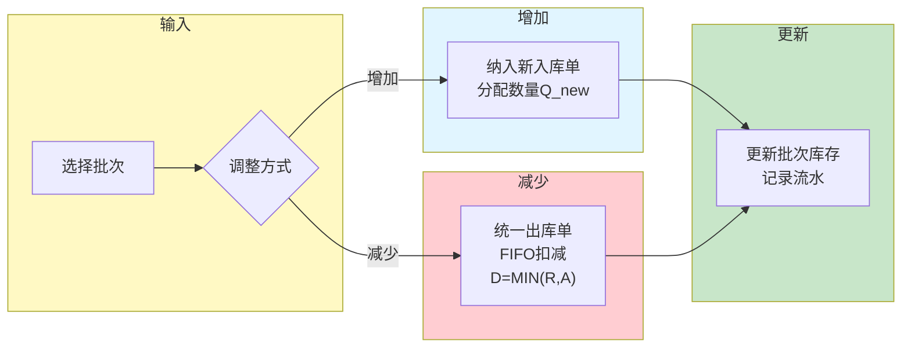
```mermaid
flowchart LR
    subgraph Input["输入"]
        A[选择批次]
        B{调整方式}
    end
    
    subgraph Increase["增加"]
        C[纳入新入库单<br/>分配数量Q_new]
    end
    
    subgraph Decrease["减少"]
        D["统一出库单<br/>FIFO扣减<br/>D=MIN(R,A)"]
    end
    
    subgraph Update["更新"]
        E[更新批次库存<br/>记录流水]
    end
    
    A --> B
    B -->|增加| C --> E
    B -->|减少| D --> E
    
    style Input fill:#fff9c4
    style Increase fill:#e1f5ff
    style Decrease fill:#ffcdd2
    style Update fill:#c8e6c9
```

**流程说明**：

批次库存调整流程用于调整已创建批次的库存数量，包括增加库存和减少库存两种情况。批次库存调整必须通过统一的入库单/出库单来处理，不能直接修改批次库存，这确保了库存变更的统一性和可追溯性。整个流程根据调整方式分为两个路径：

**增加库存路径**：当需要向批次中纳入新的入库单资源时使用。例如，批次创建时遗漏了某些入库单，或者新的采购入库单到货需要纳入现有批次。流程包括：选择新的入库单明细、设置分配数量、扣减入库单明细可用数量、创建批次入库明细、在代码层构建统一入库上下文并调用库存服务（不落统一单据表）、更新批次总库存。

**减少库存路径**：当需要从批次中扣减库存时使用。例如，销售出库、批次调整等场景。流程包括：在代码层构建统一出库上下文并调用库存服务（不落统一单据表）、查询批次入库明细并按入库日期排序（FIFO原则）、按FIFO算法计算扣减明细、更新批次入库明细、更新批次总库存。

**关键点**：
- 批次库存调整必须通过统一入库单/出库单，不能直接修改
- 减少库存时使用FIFO原则，优先扣减最早入库的库存
- 所有调整都会记录批次流水和库存流水，确保可追溯

**批次库存调整计算公式**：

#### 增加库存场景

当需要向批次中纳入新的入库单资源时：

1. **扣减入库单明细可用数量**：
   ```sql
   UPDATE inbound_order_item
   SET available_quantity = available_quantity - Q_new,
       version = version + 1
   WHERE id = 入库单明细ID
     AND version = ?
     AND available_quantity >= Q_new
   ```
   **说明**：纳入新入库单资源时，需要从入库单明细中扣减可用数量，表示这些库存已经被分配给批次。使用乐观锁机制确保并发安全，同时检查可用数量是否充足。如果可用数量不足，说明该入库单明细的库存已经被其他批次分配，无法再分配给当前批次。

2. **更新批次总库存**：
   ```
   更新前：batch.total_quantity = T_batch0
   更新后：batch.total_quantity = T_batch0 + Q_new
   
   其中：
   - T_batch0: 批次原总库存（调整前的批次总库存数量）
   - Q_new: 新增分配数量（Q_new > 0，本次纳入的新库存数量）
   ```
   **说明**：批次总库存增加新增分配数量Q_new。例如，如果批次原来有1000个库存，本次纳入200个新库存，那么批次总库存就变成1200个。这个更新使用乐观锁机制，确保并发安全。

#### 减少库存场景（FIFO扣减）

当需要从批次中扣减库存时，必须按照FIFO（First In First Out，先进先出）原则进行扣减。假设需要扣减数量为 Q_deduct，批次包含 n 个入库单明细，按入库日期排序：

1. **FIFO扣减算法**：
   ```
   剩余需扣减量 R = Q_deduct
   
   FOR i = 1 TO n DO
       IF R <= 0 THEN
           BREAK  // 已扣减完成
       END IF
       
       当前明细可用量 A_i = bill_batch_detail[i].current_available_quantity
       
       IF A_i <= 0 THEN
           CONTINUE  // 该明细已无可用库存
       END IF
       
       本次扣减量 D_i = MIN(R, A_i)  // 取剩余需扣减量和当前可用量的最小值
       
       更新明细：
       bill_batch_detail[i].current_available_quantity = A_i - D_i
       
       剩余需扣减量 R = R - D_i
   END FOR
   
   IF R > 0 THEN
       抛出异常：批次库存不足
   END IF
   ```
   **说明**：FIFO扣减算法的核心思想是优先扣减最早入库的库存。算法从第一个入库单明细开始，按入库日期顺序依次扣减。对于每个明细，计算本次扣减量D_i（取剩余需扣减量和当前可用量的最小值），然后更新该明细的可用数量，并更新剩余需扣减量。如果所有明细都扣减完了，剩余需扣减量仍然大于0，说明批次库存不足，抛出异常。

2. **FIFO扣减公式**：
   ```
   扣减明细计算：
   D_i = MIN(R_i, A_i)
   
   其中：
   - D_i: 第i个入库单明细的扣减数量（本次从该明细扣减的数量）
   - R_i: 扣减到第i个明细时的剩余需扣减量（还需要扣减的总数量）
     R_1 = Q_deduct（初始剩余需扣减量等于需要扣减的总数量）
     R_i = R_{i-1} - D_{i-1}  (i > 1)（第i个明细的剩余需扣减量等于前一个明细的剩余量减去前一个明细的扣减量）
   - A_i: 第i个入库单明细的当前可用数量（该明细还可以扣减的数量）
   - MIN(x, y): 取x和y的最小值（确保不会扣减超过可用数量）
   ```
   **说明**：FIFO扣减公式确保了扣减的准确性和合理性。对于每个入库单明细，扣减数量D_i等于剩余需扣减量R_i和当前可用数量A_i的最小值。这样可以确保：1）不会扣减超过可用数量；2）优先扣减最早入库的库存；3）如果某个明细的可用数量不足，会继续扣减下一个明细。

3. **批次总库存变化**：
   ```
   更新前：batch.total_quantity = T_batch0
   更新后：batch.total_quantity = T_batch0 - Q_deduct
   
   其中：
   - T_batch0: 批次原总库存（扣减前的批次总库存数量）
   - Q_deduct: 扣减总数量 = ΣD_i = D_1 + D_2 + ... + D_k（所有明细扣减数量的总和）
   - k: 实际参与扣减的明细数量（k <= n，可能不需要扣减所有明细）
   ```
   **说明**：批次总库存减少扣减总数量Q_deduct。扣减总数量等于所有参与扣减的明细扣减数量的总和。例如，如果需要扣减1000个，可能从第一个明细扣减800个，从第二个明细扣减200个，那么扣减总数量就是1000个，批次总库存减少1000个。

4. **批次入库明细可用数量变化**：
   ```
   对于每个参与扣减的明细i：
   更新前：current_available_quantity = A_i0
   更新后：current_available_quantity = A_i0 - D_i
   
   约束条件：A_i0 >= D_i（可用数量必须大于等于扣减数量）
   ```
   **说明**：每个参与扣减的批次入库明细，其可用数量会减少对应的扣减数量D_i。约束条件确保不会出现负库存。例如，如果某个明细原来有800个可用库存，本次扣减800个，那么剩余0个；如果原来有600个，本次扣减200个，那么剩余400个。

5. **示例计算**：
   ```
   批次 BATCH-001 包含：
   - IN-2023102401（2023-10-24入库）：current_available_quantity = 800
   - IN-2023102502（2023-10-25入库）：current_available_quantity = 600
   - IN-2023110101（2023-11-01入库）：current_available_quantity = 2000
   
   需要扣减：Q_deduct = 1000
   
   计算过程：
   i=1: D_1 = MIN(1000, 800) = 800, R_2 = 1000 - 800 = 200
   i=2: D_2 = MIN(200, 600) = 200, R_3 = 200 - 200 = 0
   i=3: R_3 = 0，不再扣减
   
   结果：
   - IN-2023102401：扣减800，剩余0
   - IN-2023102502：扣减200，剩余400
   - IN-2023110101：扣减0，剩余2000
   - 批次总库存减少：1000
   ```
   **说明**：这个示例清晰地展示了FIFO扣减的计算过程。需要扣减1000个，按照入库日期顺序，先从最早入库的IN-2023102401扣减800个（全部扣完），剩余200个需要扣减；再从IN-2023102502扣减200个（剩余400个），此时已扣减完成，不再扣减IN-2023110101。最终批次总库存减少1000个，符合预期。

**重要说明**：批次库存调整必须通过统一的入库/出库逻辑来处理，不能直接修改库存。增加库存时在代码层构建统一入库上下文并调用库存服务，减少库存时构建统一出库上下文并调用库存服务（数据库无统一单据表）。这样设计的好处是：1）所有库存变更都通过统一入口，便于管理和追溯；2）流水记录完整业务上下文，包括原始业务类型和单据号；3）统一的并发控制机制，保证数据一致性。

---

## 4. 时序图

### 4.1 采购入库时序图

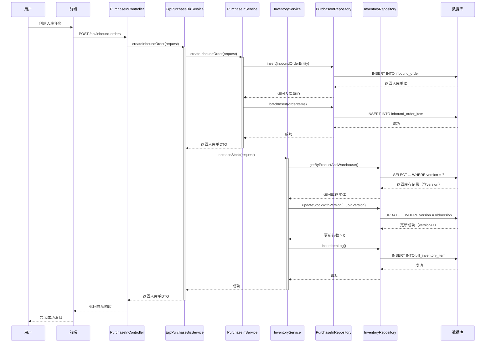
```mermaid
sequenceDiagram
    participant User as 用户
    participant Frontend as 前端
    participant Controller as PurchaseInController
    participant BizService as ErpPurchaseBizService
    participant Service as PurchaseInService
    participant InventoryService as InventoryService
    participant Repository as PurchaseInRepository
    participant InventoryRepo as InventoryRepository
    participant DB as 数据库

    User->>Frontend: 创建入库任务
    Frontend->>Controller: POST /api/inbound-orders
    Controller->>BizService: createInboundOrder(request)
    
    activate BizService
    BizService->>Service: createInboundOrder(request)
    
    activate Service
    Service->>Repository: insert(inboundOrderEntity)
    Repository->>DB: INSERT INTO inbound_order
    DB-->>Repository: 返回入库单ID
    Repository-->>Service: 返回入库单ID
    
    Service->>Repository: batchInsert(orderItems)
    Repository->>DB: INSERT INTO inbound_order_item
    DB-->>Repository: 成功
    Repository-->>Service: 成功
    
    Service-->>BizService: 返回入库单DTO
    deactivate Service
    
    BizService->>InventoryService: increaseStock(request)
    
    activate InventoryService
    InventoryService->>InventoryRepo: getByProductAndWarehouse()
    InventoryRepo->>DB: SELECT ... WHERE version = ?
    DB-->>InventoryRepo: 返回库存记录（含version）
    InventoryRepo-->>InventoryService: 返回库存实体
    
    InventoryService->>InventoryRepo: updateStockWithVersion(..., oldVersion)
    InventoryRepo->>DB: UPDATE ... WHERE version = oldVersion
    DB-->>InventoryRepo: 更新成功（version+1）
    InventoryRepo-->>InventoryService: 更新行数 > 0
    
    InventoryService->>InventoryRepo: insertItemLog()
    InventoryRepo->>DB: INSERT INTO bill_inventory_item
    DB-->>InventoryRepo: 成功
    InventoryRepo-->>InventoryService: 成功
    InventoryService-->>BizService: 成功
    deactivate InventoryService
    
    BizService-->>Controller: 返回入库单DTO
    deactivate BizService
    
    Controller-->>Frontend: 返回成功响应
    Frontend-->>User: 显示成功消息
```

### 4.2 调拨单审核出库时序图

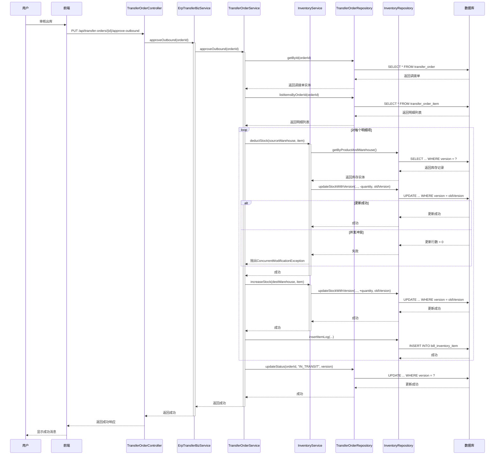
```mermaid
sequenceDiagram
    participant User as 用户
    participant Frontend as 前端
    participant Controller as TransferOrderController
    participant BizService as ErpTransferBizService
    participant Service as TransferOrderService
    participant InventoryService as InventoryService
    participant Repository as TransferOrderRepository
    participant InventoryRepo as InventoryRepository
    participant DB as 数据库

    User->>Frontend: 审核出库
    Frontend->>Controller: PUT /api/transfer-orders/{id}/approve-outbound
    
    Controller->>BizService: approveOutbound(orderId)
    
    activate BizService
    BizService->>Service: approveOutbound(orderId)
    
    activate Service
    Service->>Repository: getById(orderId)
    Repository->>DB: SELECT * FROM transfer_order
    DB-->>Repository: 返回调拨单
    Repository-->>Service: 返回调拨单实体
    
    Service->>Repository: listItemsByOrderId(orderId)
    Repository->>DB: SELECT * FROM transfer_order_item
    DB-->>Repository: 返回明细列表
    Repository-->>Service: 返回明细列表
    
    loop 对每个明细项
        Service->>InventoryService: deductStock(sourceWarehouse, item)
        
        activate InventoryService
        InventoryService->>InventoryRepo: getByProductAndWarehouse()
        InventoryRepo->>DB: SELECT ... WHERE version = ?
        DB-->>InventoryRepo: 返回库存记录
        InventoryRepo-->>InventoryService: 返回库存实体
        
        InventoryService->>InventoryRepo: updateStockWithVersion(..., -quantity, oldVersion)
        InventoryRepo->>DB: UPDATE ... WHERE version = oldVersion
        alt 更新成功
            DB-->>InventoryRepo: 更新成功
            InventoryRepo-->>InventoryService: 成功
        else 并发冲突
            DB-->>InventoryRepo: 更新行数 = 0
            InventoryRepo-->>InventoryService: 失败
            InventoryService-->>Service: 抛出ConcurrentModificationException
        end
        InventoryService-->>Service: 成功
        deactivate InventoryService
        
        Service->>InventoryService: increaseStock(destWarehouse, item)
        
        activate InventoryService
        InventoryService->>InventoryRepo: updateStockWithVersion(..., +quantity, oldVersion)
        InventoryRepo->>DB: UPDATE ... WHERE version = oldVersion
        DB-->>InventoryRepo: 更新成功
        InventoryRepo-->>InventoryService: 成功
        InventoryService-->>Service: 成功
        deactivate InventoryService
        
        Service->>InventoryRepo: insertItemLog(...)
        InventoryRepo->>DB: INSERT INTO bill_inventory_item
        DB-->>InventoryRepo: 成功
    end
    
    Service->>Repository: updateStatus(orderId, "IN_TRANSIT", version)
    Repository->>DB: UPDATE ... WHERE version = ?
    DB-->>Repository: 更新成功
    Repository-->>Service: 成功
    
    Service-->>BizService: 返回成功
    deactivate Service
    
    BizService-->>Controller: 返回成功
    deactivate BizService
    
    Controller-->>Frontend: 返回成功响应
    Frontend-->>User: 显示成功消息
```

### 4.3 批次创建时序图

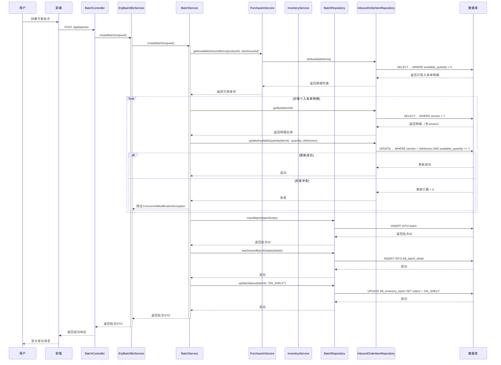
```mermaid
sequenceDiagram
    participant User as 用户
    participant Frontend as 前端
    participant Controller as BatchController
    participant BizService as ErpBatchBizService
    participant BatchService as BatchService
    participant InboundService as PurchaseInService
    participant InventoryService as InventoryService
    participant Repository as BatchRepository
    participant InboundRepo as InboundOrderItemRepository
    participant DB as 数据库

    User->>Frontend: 创建可售批次
    Frontend->>Controller: POST /api/batches
    
    Controller->>BizService: createBatch(request)
    
    activate BizService
    BizService->>BatchService: createBatch(request)
    
    activate BatchService
    BatchService->>InboundService: getAvailableInboundItems(productId, warehouseId)
    InboundService->>InboundRepo: listAvailableItems()
    InboundRepo->>DB: SELECT ... WHERE available_quantity > 0
    DB-->>InboundRepo: 返回可用入库单明细
    InboundRepo-->>InboundService: 返回明细列表
    InboundService-->>BatchService: 返回可用库存
    
    loop 对每个入库单明细
        BatchService->>InboundRepo: getById(itemId)
        InboundRepo->>DB: SELECT ... WHERE version = ?
        DB-->>InboundRepo: 返回明细（含version）
        InboundRepo-->>BatchService: 返回明细实体
        
        BatchService->>InboundRepo: updateAvailableQuantity(itemId, -quantity, oldVersion)
        InboundRepo->>DB: UPDATE ... WHERE version = oldVersion AND available_quantity >= ?
        alt 更新成功
            DB-->>InboundRepo: 更新成功
            InboundRepo-->>BatchService: 成功
        else 并发冲突
            DB-->>InboundRepo: 更新行数 = 0
            InboundRepo-->>BatchService: 失败
            BatchService-->>BizService: 抛出ConcurrentModificationException
        end
    end
    
    BatchService->>Repository: insertBatch(batchEntity)
    Repository->>DB: INSERT INTO batch
    DB-->>Repository: 返回批次ID
    Repository-->>BatchService: 返回批次ID
    
    BatchService->>Repository: batchInsertBatchDetails(details)
    Repository->>DB: INSERT INTO bill_batch_detail
    DB-->>Repository: 成功
    Repository-->>BatchService: 成功
    
    BatchService->>Repository: updateStatus(batchId, "ON_SHELF")
    Repository->>DB: UPDATE bill_inventory_batch SET status = 'ON_SHELF'
    DB-->>Repository: 成功
    Repository-->>BatchService: 成功
    
    BatchService-->>BizService: 返回批次DTO
    deactivate BatchService
    
    BizService-->>Controller: 返回批次DTO
    deactivate BizService
    
    Controller-->>Frontend: 返回成功响应
    Frontend-->>User: 显示成功消息
```

### 4.4 批次库存调整时序图（通过统一入库单/出库单）

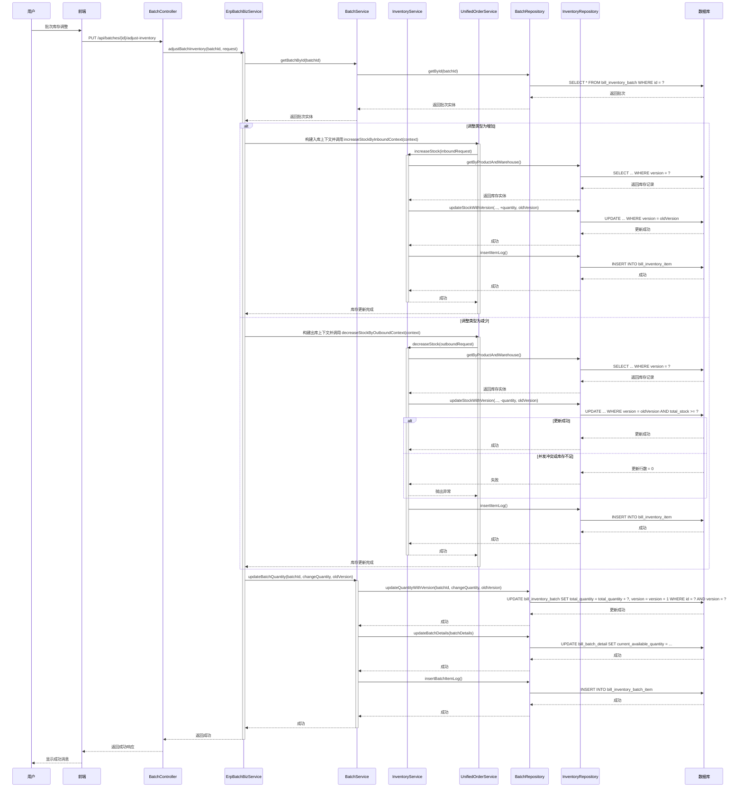
```mermaid
sequenceDiagram
    participant User as 用户
    participant Frontend as 前端
    participant Controller as BatchController
    participant BizService as ErpBatchBizService
    participant BatchService as BatchService
    participant InventoryService as InventoryService
    participant UnifiedOrderService as UnifiedOrderService
    participant Repository as BatchRepository
    participant InventoryRepo as InventoryRepository
    participant DB as 数据库

    User->>Frontend: 批次库存调整
    Frontend->>Controller: PUT /api/batches/{id}/adjust-inventory
    
    Controller->>BizService: adjustBatchInventory(batchId, request)
    
    activate BizService
    BizService->>BatchService: getBatchById(batchId)
    BatchService->>Repository: getById(batchId)
    Repository->>DB: SELECT * FROM bill_inventory_batch WHERE id = ?
    DB-->>Repository: 返回批次
    Repository-->>BatchService: 返回批次实体
    BatchService-->>BizService: 返回批次实体
    
    alt 调整类型为增加
        BizService->>UnifiedOrderService: 构建入库上下文并调用 increaseStockByInboundContext(context)
        
        activate UnifiedOrderService
        UnifiedOrderService->>InventoryService: increaseStock(inboundRequest)
        
        activate InventoryService
        InventoryService->>InventoryRepo: getByProductAndWarehouse()
        InventoryRepo->>DB: SELECT ... WHERE version = ?
        DB-->>InventoryRepo: 返回库存记录
        InventoryRepo-->>InventoryService: 返回库存实体
        
        InventoryService->>InventoryRepo: updateStockWithVersion(..., +quantity, oldVersion)
        InventoryRepo->>DB: UPDATE ... WHERE version = oldVersion
        DB-->>InventoryRepo: 更新成功
        InventoryRepo-->>InventoryService: 成功
        
        InventoryService->>InventoryRepo: insertItemLog()
        InventoryRepo->>DB: INSERT INTO bill_inventory_item
        DB-->>InventoryRepo: 成功
        InventoryRepo-->>InventoryService: 成功
        InventoryService-->>UnifiedOrderService: 成功
        deactivate InventoryService
        
        UnifiedOrderService-->>BizService: 库存更新完成
        deactivate UnifiedOrderService
        
    else 调整类型为减少
        BizService->>UnifiedOrderService: 构建出库上下文并调用 decreaseStockByOutboundContext(context)
        
        activate UnifiedOrderService
        UnifiedOrderService->>InventoryService: decreaseStock(outboundRequest)
        
        activate InventoryService
        InventoryService->>InventoryRepo: getByProductAndWarehouse()
        InventoryRepo->>DB: SELECT ... WHERE version = ?
        DB-->>InventoryRepo: 返回库存记录
        InventoryRepo-->>InventoryService: 返回库存实体
        
        InventoryService->>InventoryRepo: updateStockWithVersion(..., -quantity, oldVersion)
        InventoryRepo->>DB: UPDATE ... WHERE version = oldVersion AND total_stock >= ?
        alt 更新成功
            DB-->>InventoryRepo: 更新成功
            InventoryRepo-->>InventoryService: 成功
        else 并发冲突或库存不足
            DB-->>InventoryRepo: 更新行数 = 0
            InventoryRepo-->>InventoryService: 失败
            InventoryService-->>UnifiedOrderService: 抛出异常
        end
        
        InventoryService->>InventoryRepo: insertItemLog()
        InventoryRepo->>DB: INSERT INTO bill_inventory_item
        DB-->>InventoryRepo: 成功
        InventoryRepo-->>InventoryService: 成功
        InventoryService-->>UnifiedOrderService: 成功
        deactivate InventoryService
        
        UnifiedOrderService-->>BizService: 库存更新完成
        deactivate UnifiedOrderService
    end
    
    BizService->>BatchService: updateBatchQuantity(batchId, changeQuantity, oldVersion)
    
    activate BatchService
    BatchService->>Repository: updateQuantityWithVersion(batchId, changeQuantity, oldVersion)
    Repository->>DB: UPDATE bill_inventory_batch SET total_quantity = total_quantity + ?, version = version + 1 WHERE id = ? AND version = ?
    DB-->>Repository: 更新成功
    Repository-->>BatchService: 成功
    
    BatchService->>Repository: updateBatchDetails(batchDetails)
    Repository->>DB: UPDATE bill_batch_detail SET current_available_quantity = ...
    DB-->>Repository: 成功
    Repository-->>BatchService: 成功
    
    BatchService->>Repository: insertBatchItemLog()
    Repository->>DB: INSERT INTO bill_inventory_batch_item
    DB-->>Repository: 成功
    Repository-->>BatchService: 成功
    BatchService-->>BizService: 成功
    deactivate BatchService
    
    BizService-->>Controller: 返回成功
    deactivate BizService
    
    Controller-->>Frontend: 返回成功响应
    Frontend-->>User: 显示成功消息
```

### 4.5 库存分配时序图

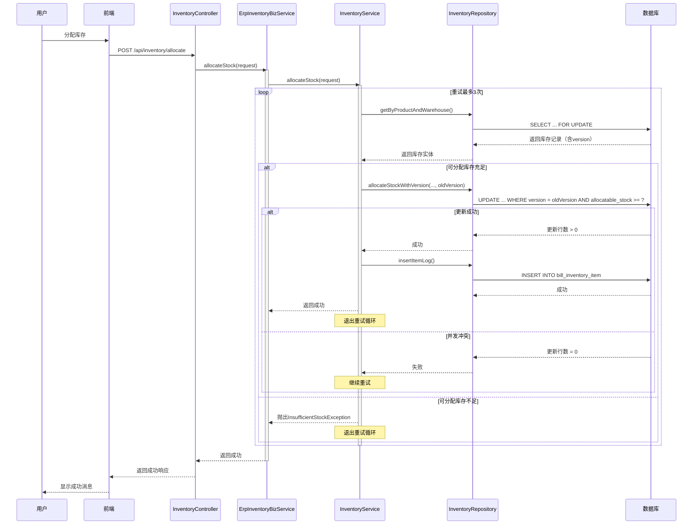
```mermaid
sequenceDiagram
    participant User as 用户
    participant Frontend as 前端
    participant Controller as InventoryController
    participant BizService as ErpInventoryBizService
    participant Service as InventoryService
    participant Repository as InventoryRepository
    participant DB as 数据库

    User->>Frontend: 分配库存
    Frontend->>Controller: POST /api/inventory/allocate
    
    Controller->>BizService: allocateStock(request)
    
    activate BizService
    BizService->>Service: allocateStock(request)
    
    activate Service
    loop 重试最多3次
        Service->>Repository: getByProductAndWarehouse()
        Repository->>DB: SELECT ... FOR UPDATE
        DB-->>Repository: 返回库存记录（含version）
        Repository-->>Service: 返回库存实体
        
        alt 可分配库存充足
            Service->>Repository: allocateStockWithVersion(..., oldVersion)
            Repository->>DB: UPDATE ... WHERE version = oldVersion AND allocatable_stock >= ?
            alt 更新成功
                DB-->>Repository: 更新行数 > 0
                Repository-->>Service: 成功
                Service->>Repository: insertItemLog()
                Repository->>DB: INSERT INTO bill_inventory_item
                DB-->>Repository: 成功
                Service-->>BizService: 返回成功
                Note over Service: 退出重试循环
            else 并发冲突
                DB-->>Repository: 更新行数 = 0
                Repository-->>Service: 失败
                Note over Service: 继续重试
            end
        else 可分配库存不足
            Service-->>BizService: 抛出InsufficientStockException
            Note over Service: 退出重试循环
        end
    end
    deactivate Service
    
    BizService-->>Controller: 返回成功
    deactivate BizService
    
    Controller-->>Frontend: 返回成功响应
    Frontend-->>User: 显示成功消息
```

---

### 5.2 统一入库/出库设计（代码层抽象，数据库无统一单据表）

#### 5.2.1 数据库与代码分层说明

**数据库层**（以 [数据库设计](./数据库设计.md) 为准）：
- **不建统一单据表、统一单据明细表**。库存变更的持久化仅使用：`bill_inventory_order`（含 `inventory_type` 区分增加/减少）、`bill_inventory`、`bill_inventory_item`（库存流水）、批次相关表等。
- 库存流水记录在 `bill_inventory_item` 中，通过 `business_type`、`bill_type`、`bill_id`、`bill_code` 等字段保留原始业务类型和单据信息，便于追溯。

**代码层**（本技术方案强调的设计）：
- **在更新库存和库存明细时，统一转化为「入库」和「出库」两类逻辑**。即：采购入库单、调拨单（出库/入库）、销售出库单等业务单据，在应用层**先转换为统一的入库上下文或出库上下文**（内存对象/DTO，不落统一单据表），再**由同一套库存更新服务**根据上下文更新 `bill_inventory` 并写入库存流水（`bill_inventory_item`）。
- 这样做的目的：**单一职责**（库存服务只认“入库/出库”）、**易扩展**（新增业务单据只需增加“业务单据 → 上下文”的转换与注册，无需改库存核心逻辑）。

**核心设计理念**：库存的修改在代码上只能通过**统一入库逻辑**和**统一出库逻辑**来处理；所有业务单据在应用层转换为**统一入库上下文（InventoryUnifiedInboundContext）**或**统一出库上下文（InventoryUnifiedOutboundContext）**，再驱动库存更新与流水记录，数据库层不依赖统一单据表。

#### 5.2.2 代码层：统一入库/出库上下文（无独立表）

上下文为内存中的 DTO，用于在业务单据与库存服务之间传递“这一笔是入库还是出库、哪个仓库、什么业务类型、哪张原始单据、哪些明细”。

**统一入库上下文（InventoryUnifiedInboundContext）** 建议字段：

| 含义 | 说明 |
|------|------|
| warehouseId | 仓库ID |
| businessType | 业务类型：PURCHASE_IN、TRANSFER_IN、BATCH_ADJUSTMENT 等 |
| billType | 关联单据类型：PURCHASE_IN、TRANSFER、BATCH 等（与数据库 bill_type 一致） |
| billId | 关联单据ID（如采购入库单ID、调拨单ID） |
| billCode | 关联单据号（原始业务单据号，写流水用） |
| billDate | 业务日期 |
| items | 明细列表：productId, skuCode, quantity, unitId, unitCost（可选）等 |

**统一出库上下文（InventoryUnifiedOutboundContext）** 建议字段：同上，业务类型为 TRANSFER_OUT、SALES_OUT、BATCH_ADJUSTMENT 等；billType/billId/billCode 对应调拨单、销售出库单等。

**与数据库的对应关系**：
- 更新目标：`bill_inventory` 表（业务唯一键为「仓库+商品」，查/更新时按 product_id、warehouse_id、product_status 定位记录，表结构仍含 sku_id 字段以兼容约束）。
- 流水记录：写入 `bill_inventory_item`（库存明细表），其中 `business_type`、`bill_type`、`bill_id`、`bill_code`、`change_quantity`、`after_quantity` 等均由上下文及当前库存计算得出，**不写入统一单据表**。

#### 5.2.3 统一入库/出库处理流程

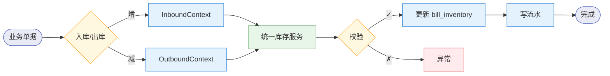
```mermaid
flowchart LR
    A([业务单据]) --> B{入库/出库}
    B -->|增| C[InboundContext]
    B -->|减| D[OutboundContext]
    C --> E[统一库存服务]
    D --> E
    E --> F{校验}
    F -->|✓| G[更新 bill_inventory]
    F -->|✗| H[异常]
    G --> I[写流水]
    I --> J([完成])

    classDef entry fill:#e8eaf6,stroke:#5c6bc0
    classDef branch fill:#fff8e1,stroke:#ffa726
    classDef process fill:#e3f2fd,stroke:#1976d2
    classDef service fill:#e8f5e9,stroke:#388e3c
    classDef err fill:#ffebee,stroke:#e53935
    class A,J entry
    class B,F branch
    class C,D,G,I process
    class E service
    class H err
```

#### 5.2.4 统一库存更新服务接口（基于上下文，无统一表）

```java
/**
 * 统一库存更新服务
 * 所有库存变更的统一入口，仅接受「入库/出库上下文」，不依赖统一单据表。
 */
public interface InventoryUnifiedService {

    /**
     * 通过统一入库上下文增加库存
     * 内部：按上下文更新 bill_inventory，并写入 bill_inventory_item 流水（business_type、bill_type、bill_id、bill_code 取自上下文）
     */
    void increaseStockByInboundContext(InventoryUnifiedInboundContext context);

    /**
     * 通过统一出库上下文减少库存
     * 内部：按上下文扣减 bill_inventory，并写入 bill_inventory_item 流水（同上）
     */
    void decreaseStockByOutboundContext(InventoryUnifiedOutboundContext context);
}
```

#### 5.2.5 扩展性设计：新增业务单据类型

后续新增业务单据（如退货入库单、报损出库单、其他出入库类型）时，**不应修改统一库存更新服务与库存流水写入逻辑**，而应通过**设计模式**做扩展：

1. **策略/处理器注册表**
   - 为每种业务单据类型定义一个**上下文构建器**（或 Handler）：负责从该业务单据构建 `InventoryUnifiedInboundContext` 或 `InventoryUnifiedOutboundContext`。
   - 在应用启动或配置中，按「业务单据类型」注册到 Map 或 Registry：`billType -> InboundContextBuilder` / `billType -> OutboundContextBuilder`。
   - 业务层：根据当前单据类型从注册表取到对应构建器，构建上下文后调用 `InventoryUnifiedService.increaseStockByInboundContext(context)` 或 `decreaseStockByOutboundContext(context)`。
   - **新增业务单据**：只需新增一个 Builder/Handler 并注册，无需改库存服务与流水逻辑。

2. **模板方法（可选）**
   - 定义「审核通过 → 校验 → 构建上下文 → 调用统一库存服务 → 更新单据状态」的模板流程；子类或不同单据服务只实现「如何构建上下文」和「如何更新单据状态」，复用同一套库存更新与流水记录。

3. **适配器**
   - 各业务单据模块通过适配器将自身领域对象转为 `InventoryUnifiedInboundContext`/`InventoryUnifiedOutboundContext`，再交给统一库存服务，保持库存层只依赖上下文 DTO，不依赖具体单据类型。

**小结**：数据库层面不建统一单据表；代码层面通过「统一入库/出库上下文 + 统一库存更新服务 + 按单据类型注册的上下文构建器」实现扩展，新增业务单据时只需新增构建器并注册，即可复用同一套库存与流水逻辑。

#### 5.2.6 统一库存更新服务实现详解

**5.2.6.1 采购入库单**

采购入库单审核通过后，只需一次入库操作：

1. **构建上下文**：从采购入库单及明细构建 `InventoryUnifiedInboundContext`
   - `warehouseId` = 目标仓库ID
   - `businessType` = PURCHASE_IN
   - `billType` = PURCHASE_IN，`billId` = 采购入库单ID，`billCode` = 采购入库单号
   - `items` = 从采购入库单明细转换（productId, skuCode, quantity, unitId, unitCost 等）

2. **调用**：`inventoryUnifiedService.increaseStockByInboundContext(context)`

3. **效果**：更新目标仓库 `bill_inventory`，写入库存流水（`bill_inventory_item`），`business_type`=PURCHASE_IN，`bill_type`=PURCHASE_IN，`bill_id`/`bill_code` 指向采购入库单。对外展示为「采购入库单增加了库存」。

**5.2.6.2 调拨单（拆分为出库+入库，对外仍体现为调拨单）**

调拨单需拆成两笔：先出库（源仓库），再入库（目标仓库），但**对外展示时仅体现为一张调拨单**。

1. **审核出库**：从源仓库扣减
   - 构建 `InventoryUnifiedOutboundContext`：`warehouseId`=源仓库ID，`businessType`=TRANSFER_OUT，`billType`=**TRANSFER**，`billId`=调拨单ID，`billCode`=调拨单号
   - 调用：`decreaseStockByOutboundContext(context)`
   - 流水记录：`business_type`=TRANSFER_OUT，`bill_type`=**TRANSFER**，`bill_id`/`bill_code`=调拨单

2. **审核入库**：向目标仓库增加
   - 构建 `InventoryUnifiedInboundContext`：`warehouseId`=目标仓库ID，`businessType`=TRANSFER_IN，`billType`=**TRANSFER**，`billId`=调拨单ID，`billCode`=调拨单号
   - 调用：`increaseStockByInboundContext(context)`
   - 流水记录：`business_type`=TRANSFER_IN，`bill_type`=**TRANSFER**，`bill_id`/`bill_code`=调拨单

3. **对外展示**：库存流水按 `bill_type`+`bill_id` 分组展示时，出库、入库两条流水均属于同一调拨单（bill_type=TRANSFER，bill_id 相同），前端可汇总为「调拨单 TR-xxx：源仓库出库、目标仓库入库」，不展示为「调拨出库单」「调拨入库单」两张独立单据。如需单条展示，可显示为「调拨单-出库」「调拨单-入库」，但单据维度仍为调拨单。

4. **实现要点**：两笔上下文中的 `billType`、`billId`、`billCode` 必须一致且指向调拨单，这样流水才能按调拨单维度追溯和展示。

**5.2.6.3 销售出库单**

与采购入库单类似，仅一次出库操作：构建 `InventoryUnifiedOutboundContext`（`businessType`=SALES_OUT，`billType`=SALES_OUT 或 ORD），调用 `decreaseStockByOutboundContext`。若涉及批次 FIFO 扣减，需在构建上下文前完成批次扣减计算，上下文中携带按 FIFO 分配好的明细。

**5.2.6.4 库存更新机制：bill_inventory 与 bill_inventory_item（库存流水）的关系**

| 表 | 职责 | 操作方式 | 说明 |
|----|------|----------|------|
| **bill_inventory**（库存表） | 存当前库存余额 | **UPDATE** | 表唯一约束为 (sku_id, warehouse_id, product_status)；**业务上按「仓库+商品」查/更新**，即查库存、出库、可分配扣减等均使用 getByProductAndWarehouse(product_id, warehouse_id)，不按 skuId。入库时 total_stock += quantity，出库时 total_stock -= quantity |
| **inventory_detail**（库存明细表/流水表） | 存每次变动记录 | **INSERT** | 每次库存变动追加一条流水，记录 change_time、business_type、bill_type、bill_id、bill_code、before_quantity、change_quantity、after_quantity 等，用于追溯和展示 |

> 说明：数据库设计中库存流水表命名为 `bill_inventory_item`（库存明细表），库存单据明细表为 `bill_inventory_order_item`，实施时需区分，如使用 `inventory_detail` 或 `inventory_item` 存流水。下文以「库存流水表」统称。

**单次库存变动的原子操作**（以某商品的入库为例，业务唯一键为仓库+商品）：

```
1. 查 bill_inventory：SELECT * FROM bill_inventory WHERE product_id=? AND warehouse_id=? AND product_status='正品'（实现为 getByProductAndWarehouse）
2. 若无则 INSERT 新记录（total_stock=0，建库存时 sku_id 以 product_id 填充）
3. UPDATE bill_inventory SET total_stock=total_stock+?, allocatable_stock=allocatable_stock+?, version=version+1
   WHERE id=? AND version=?   -- 乐观锁
4. INSERT INTO 库存流水表 (
     product_id, sku_id, warehouse_id, business_type, bill_type, bill_id, bill_code,
     before_quantity, change_quantity, after_quantity, change_time, ...
   ) VALUES (..., 更新前数量, +入库数量, 更新后数量, NOW(), ...)
```

**5.2.6.5 采购入库单与调拨单的更新流程**

**采购入库单**（一次入库操作）：

```
用户操作：审核通过采购入库单
    ↓
业务层：从采购入库单构建 InventoryUnifiedInboundContext
    - warehouseId = 目标仓库
    - businessType = PURCHASE_IN
    - billType = PURCHASE_IN, billId/billCode = 采购入库单
    - items = 采购入库单明细
    ↓
调用：inventoryUnifiedService.increaseStockByInboundContext(context)
    ↓
统一服务内部：对每个 item 执行
    - 更新 bill_inventory（目标仓库，该 SKU：total_stock += quantity）
    - INSERT 一条库存流水（business_type=PURCHASE_IN, bill_type=PURCHASE_IN, bill_id=采购入库单ID）
    ↓
业务层：更新采购入库单 status = INBOUNDED
```

**调拨单**（拆成两次操作，两次分别更新不同仓库）：

调拨单需拆为「调拨出库」和「调拨入库」两次独立更新，对应两次用户操作、两次上下文、两次调用统一服务。

| 用户操作 | 构建的上下文 | 调用 | 更新对象 | 写流水 |
|----------|--------------|------|----------|--------|
| 审核出库 | InventoryUnifiedOutboundContext（源仓库，TRANSFER_OUT） | decreaseStockByOutboundContext | bill_inventory（**源仓库**）扣减 | INSERT 流水，business_type=TRANSFER_OUT，bill_type=TRANSFER |
| 审核入库 | InventoryUnifiedInboundContext（目标仓库，TRANSFER_IN） | increaseStockByInboundContext | bill_inventory（**目标仓库**）增加 | INSERT 流水，business_type=TRANSFER_IN，bill_type=TRANSFER |

流程示意：

```
【审核出库】
用户操作：审核调拨单出库
    ↓
业务层：构建 InventoryUnifiedOutboundContext
    - warehouseId = 源仓库ID
    - businessType = TRANSFER_OUT
    - billType = TRANSFER, billId/billCode = 调拨单
    - items = 调拨单明细
    ↓
decreaseStockByOutboundContext(context)
    ↓
对每个 item：UPDATE bill_inventory（源仓库）total_stock -= quantity
           INSERT 库存流水（business_type=TRANSFER_OUT, bill_type=TRANSFER）
    ↓
业务层：更新调拨单 status = IN_TRANSIT

【审核入库】
用户操作：审核调拨单入库
    ↓
业务层：构建 InventoryUnifiedInboundContext
    - warehouseId = 目标仓库ID
    - businessType = TRANSFER_IN
    - billType = TRANSFER, billId/billCode = 调拨单（与出库相同）
    - items = 调拨单明细
    ↓
increaseStockByInboundContext(context)
    ↓
对每个 item：UPDATE bill_inventory（目标仓库）total_stock += quantity
           INSERT 库存流水（business_type=TRANSFER_IN, bill_type=TRANSFER）
    ↓
业务层：更新调拨单 status = COMPLETED
```

**关键点**：调拨出库和调拨入库是两次独立调用，分别更新源仓库、目标仓库的 `bill_inventory`，并各自写入库存流水。两笔流水的 `bill_type`、`bill_id`、`bill_code` 均指向同一调拨单，便于按调拨单维度汇总展示。

#### 5.2.7 逆向流程（作废）处理

当业务单据作废时，需通过**逆向的入库/出库逻辑**冲回已发生的库存变更，但**数据库单据状态和对外展示仍体现为原单据作废**，而非新增“冲回单”。

**5.2.7.1 采购入库单作废**

- **正向**：目标仓库入库（增加库存）。
- **逆向**：需从目标仓库出库（减少库存），相当于一次出库操作。

实现步骤：

1. **更新单据状态**：将采购入库单 `status` 置为 CANCELLED（已取消/已作废）。
2. **构建出库上下文**：
   - `warehouseId` = 原目标仓库ID
   - `businessType` = **PURCHASE_IN_VOID**（采购入库作废冲回）
   - `billType` = PURCHASE_IN，`billId` = 采购入库单ID，`billCode` = 采购入库单号
   - `items` = 原采购入库单明细（数量、SKU 等）
3. **调用**：`decreaseStockByOutboundContext(context)`
4. **流水记录**：`business_type`=PURCHASE_IN_VOID，`bill_type`=PURCHASE_IN，`bill_id`/`bill_code`=采购入库单。
5. **对外展示**：库存流水显示为「采购入库单作废（冲回）」；采购入库单主表状态为已作废，可关联到该冲回流水。

**5.2.7.2 调拨单作废**

- **正向**：先源仓库出库，再目标仓库入库。
- **逆向**：需先目标仓库出库（冲回入库），再源仓库入库（冲回出库），即两笔操作顺序与正向相反。

实现步骤：

1. **更新单据状态**：将调拨单 `status` 置为 CANCELLED。
2. **第一笔：目标仓库出库**（冲回目标仓库的入库）
   - 构建 `InventoryUnifiedOutboundContext`：`warehouseId`=目标仓库ID，`businessType`=**TRANSFER_VOID_REVERSE_OUT**
   - `billType`=TRANSFER，`billId`/`billCode`=调拨单
   - 调用：`decreaseStockByOutboundContext(context)`
3. **第二笔：源仓库入库**（冲回源仓库的出库）
   - 构建 `InventoryUnifiedInboundContext`：`warehouseId`=源仓库ID，`businessType`=**TRANSFER_VOID_REVERSE_IN**
   - `billType`=TRANSFER，`billId`/`billCode`=调拨单
   - 调用：`increaseStockByInboundContext(context)`
4. **流水记录**：两笔流水的 `bill_type`、`bill_id`、`bill_code` 均指向调拨单，`business_type` 分别为 TRANSFER_VOID_REVERSE_OUT、TRANSFER_VOID_REVERSE_IN。
5. **对外展示**：库存流水按 `bill_id` 聚合，显示为「调拨单作废（冲回）」；调拨单主表状态为已作废。

**5.2.7.3 业务类型枚举补充（逆向）**

| 业务类型码 | 说明 | 使用场景 |
|:----------|:----|:--------|
| PURCHASE_IN_VOID | 采购入库作废冲回 | 采购入库单作废时，从目标仓库出库 |
| TRANSFER_VOID_REVERSE_OUT | 调拨作废-冲回目标出库 | 调拨单作废时，目标仓库出库 |
| TRANSFER_VOID_REVERSE_IN | 调拨作废-冲回源入库 | 调拨单作废时，源仓库入库 |

**5.2.7.4 关键点**

- 逆向流程仍通过**统一入库/出库上下文 + 统一库存更新服务**完成，不新增「冲回单」表或单据类型。
- 作废时仅更新原单据 `status`，库存流水通过 `business_type` 区分正向与作废冲回。
- 对外展示时，按 `bill_type`+`bill_id` 聚合，显示为「采购入库单作废」「调拨单作废」，而非独立的
#### 5.2.8 统一库存更新服务及业务调用代码实现

**5.2.8.1 上下文 DTO 与接口定义**

```java
// 统一入库上下文
@Data
public class InventoryUnifiedInboundContext {
    private Long warehouseId;
    private String warehouseName;
    private String businessType;      // PURCHASE_IN, TRANSFER_IN, TRANSFER_VOID_REVERSE_IN 等
    private String billType;          // PURCHASE_IN, TRANSFER, BATCH 等
    private Long billId;
    private String billCode;
    private Integer billStatus;
    private LocalDate billDate;
    private List<InventoryUnifiedInboundItem> items;
}

@Data
public class InventoryUnifiedInboundItem {
    private Long productId;
    private String skuCode;
    private java.math.BigDecimal quantity;
    private Integer unitId;
    private java.math.BigDecimal unitCost;
}

// 统一出库上下文
@Data
public class InventoryUnifiedOutboundContext {
    private Long warehouseId;
    private String warehouseName;
    private String businessType;      // TRANSFER_OUT, SALES_OUT, PURCHASE_IN_VOID, TRANSFER_VOID_REVERSE_OUT 等
    private String billType;
    private Long billId;
    private String billCode;
    private Integer billStatus;
    private LocalDate billDate;
    private List<InventoryUnifiedOutboundItem> items;
}

@Data
public class InventoryUnifiedOutboundItem {
    private Long productId;
    private String skuCode;
    private java.math.BigDecimal quantity;
    private Integer unitId;
}

/**
 * 库存明细流水写入参数对象（符合 Introduce Parameter Object 原则）
 * 将多个相关参数聚合，便于扩展和维护
 */
@Data
@Builder
public class InventoryItemWriteCommand {
    private Long warehouseId;
    private String warehouseName;
    private Long productId;
    private String skuCode;
    private String businessType;
    private String billType;
    private Long billId;
    private String billCode;
    private Integer billStatus;
    private java.math.BigDecimal beforeQuantity;
    private java.math.BigDecimal changeQuantity;  // 入库为正，出库为负
    private java.math.BigDecimal afterQuantity;
}

public interface InventoryUnifiedService {
    void increaseStockByInboundContext(InventoryUnifiedInboundContext context);
    void decreaseStockByOutboundContext(InventoryUnifiedOutboundContext context);
}
```

**5.2.8.2 统一库存更新服务实现类**

```java
@Service
@RequiredArgsConstructor
@Transactional(rollbackFor = Exception.class)
public class InventoryUnifiedServiceImpl implements InventoryUnifiedService {

    private final InventoryRepository inventoryRepository;
    private final InventoryItemRepository inventoryItemRepository;  // 写 bill_inventory_item 库存明细流水

    @Override
    public void increaseStockByInboundContext(InventoryUnifiedInboundContext context) {
        if (context == null || context.getItems() == null || context.getItems().isEmpty())
            throw new BusinessException("入库上下文不能为空");
        if (context.getWarehouseId() == null) throw new BusinessException("仓库不能为空");
        for (InventoryUnifiedInboundItem item : context.getItems()) {
            increaseOneItem(context, item);
        }
    }

    @Override
    public void decreaseStockByOutboundContext(InventoryUnifiedOutboundContext context) {
        if (context == null || context.getItems() == null || context.getItems().isEmpty())
            throw new BusinessException("出库上下文不能为空");
        if (context.getWarehouseId() == null) throw new BusinessException("仓库不能为空");
        for (InventoryUnifiedOutboundItem item : context.getItems()) {
            decreaseOneItem(context, item);
        }
    }

    private void increaseOneItem(InventoryUnifiedInboundContext ctx, InventoryUnifiedInboundItem item) {
        InventoryEntity inventory = getOrCreateInventory(item.getSkuCode(), ctx.getWarehouseId());
        java.math.BigDecimal beforeQuantity = inventory.getTotalStock();
        inventoryRepository.updateStockWithVersion(inventory.getId(), item.getQuantity(), inventory.getVersion());
        InventoryEntity updatedInventory = inventoryRepository.getById(inventory.getId());

        InventoryItemWriteCommand command = InventoryItemConvert.toWriteCommand(ctx, item, beforeQuantity, updatedInventory.getTotalStock());
        writeInventoryItem(command);
    }

    private void decreaseOneItem(InventoryUnifiedOutboundContext ctx, InventoryUnifiedOutboundItem item) {
        InventoryEntity inventory = getInventory(item.getSkuCode(), ctx.getWarehouseId());
        if (inventory.getTotalStock().compareTo(item.getQuantity()) < 0) {
            throw new InsufficientStockException("库存不足: " + item.getSkuCode());
        }
        java.math.BigDecimal beforeQuantity = inventory.getTotalStock();
        java.math.BigDecimal changeQuantity = item.getQuantity().negate();
        inventoryRepository.updateStockWithVersion(inventory.getId(), changeQuantity, inventory.getVersion());
        InventoryEntity updatedInventory = inventoryRepository.getById(inventory.getId());

        InventoryItemWriteCommand command = InventoryItemConvert.toWriteCommand(ctx, item, beforeQuantity, changeQuantity, updatedInventory.getTotalStock());
        writeInventoryItem(command);
    }

    private void writeInventoryItem(InventoryItemWriteCommand command) {
        InventoryItemEntity entity = InventoryItemConvert.toEntity(command);
        inventoryItemRepository.insert(entity);
    }

    private InventoryEntity getOrCreateInventory(String skuCode, Long warehouseId) {
        InventoryEntity inventory = inventoryRepository.selectBySkuAndWarehouse(skuCode, warehouseId);
        if (inventory == null) {
            inventory = new InventoryEntity();
            inventory.setSkuCode(skuCode);
            inventory.setWarehouseId(warehouseId);
            inventory.setTotalStock(java.math.BigDecimal.ZERO);
            inventory.setAllocatableStock(java.math.BigDecimal.ZERO);
            inventory.setVersion(0);
            inventoryRepository.insert(inventory);
        }
        return inventory;
    }

    private InventoryEntity getInventory(String skuCode, Long warehouseId) {
        InventoryEntity inventory = inventoryRepository.selectBySkuAndWarehouse(skuCode, warehouseId);
        if (inventory == null) throw new BusinessException("库存不存在");
        return inventory;
    }
}
```

**5.2.8.2a 转换器与验证器（Converter / Validation）**

```java
/**
 * 库存统一上下文转换器
 * 将业务单据转换为 InventoryUnified 上下文
 */
public final class InventoryUnifiedConvert {

    /** 采购入库单 → 入库上下文（正向） */
    public static InventoryUnifiedInboundContext toInboundContext(PurchaseInboundEntity bill, List<PurchaseInboundItemEntity> items) {
        InventoryUnifiedInboundContext context = new InventoryUnifiedInboundContext();
        context.setWarehouseId(bill.getTargetWarehouseId());
        context.setWarehouseName(bill.getTargetWarehouseName());
        context.setBusinessType(BusinessTypeEnum.PURCHASE_IN.getCode());
        context.setBillType(DocumentTypeEnum.PURCHASE_IN.getCode());
        context.setBillId(bill.getId());
        context.setBillCode(bill.getBillCode());
        context.setBillStatus(bill.getStatus());
        context.setBillDate(bill.getBillDate());
        context.setItems(items.stream().map(InventoryUnifiedConvert::toInboundItem).collect(Collectors.toList()));
        return context;
    }

    /** 采购入库单 → 出库上下文（作废逆向） */
    public static InventoryUnifiedOutboundContext toOutboundContextForVoid(PurchaseInboundEntity bill, List<PurchaseInboundItemEntity> items) {
        InventoryUnifiedOutboundContext context = new InventoryUnifiedOutboundContext();
        context.setWarehouseId(bill.getTargetWarehouseId());
        context.setWarehouseName(bill.getTargetWarehouseName());
        context.setBusinessType(BusinessTypeEnum.PURCHASE_IN_VOID.getCode());
        context.setBillType(DocumentTypeEnum.PURCHASE_IN.getCode());
        context.setBillId(bill.getId());
        context.setBillCode(bill.getBillCode());
        context.setBillStatus(OrderStatusEnum.CANCELLED.getCode());
        context.setBillDate(bill.getBillDate());
        context.setItems(items.stream().map(InventoryUnifiedConvert::toOutboundItem).collect(Collectors.toList()));
        return context;
    }

    /** 调拨单 → 入库/出库上下文（按仓库与业务类型） */
    public static InventoryUnifiedInboundContext toInboundContext(TransferEntity bill, List<TransferItemEntity> items,
                                                                 Long warehouseId, String warehouseName, String businessType) {
        InventoryUnifiedInboundContext context = new InventoryUnifiedInboundContext();
        context.setWarehouseId(warehouseId);
        context.setWarehouseName(warehouseName);
        context.setBusinessType(businessType);
        context.setBillType(DocumentTypeEnum.TRANSFER.getCode());
        context.setBillId(bill.getId());
        context.setBillCode(bill.getBillCode());
        context.setBillStatus(bill.getStatus());
        context.setBillDate(bill.getBillDate());
        context.setItems(items.stream().map(InventoryUnifiedConvert::toInboundItemFromTransfer).collect(Collectors.toList()));
        return context;
    }

    public static InventoryUnifiedOutboundContext toOutboundContext(TransferEntity bill, List<TransferItemEntity> items,
                                                                   Long warehouseId, String warehouseName, String businessType) {
        InventoryUnifiedOutboundContext context = new InventoryUnifiedOutboundContext();
        context.setWarehouseId(warehouseId);
        context.setWarehouseName(warehouseName);
        context.setBusinessType(businessType);
        context.setBillType(DocumentTypeEnum.TRANSFER.getCode());
        context.setBillId(bill.getId());
        context.setBillCode(bill.getBillCode());
        context.setBillStatus(bill.getStatus());
        context.setBillDate(bill.getBillDate());
        context.setItems(items.stream().map(InventoryUnifiedConvert::toOutboundItemFromTransfer).collect(Collectors.toList()));
        return context;
    }

    private static InventoryUnifiedInboundItem toInboundItem(PurchaseInboundItemEntity item) {
        InventoryUnifiedInboundItem it = new InventoryUnifiedInboundItem();
        it.setProductId(item.getProductId());
        it.setSkuCode(item.getSkuCode());
        it.setQuantity(item.getQuantity());
        it.setUnitId(item.getUnitId());
        it.setUnitCost(item.getUnitCost());
        return it;
    }

    private static InventoryUnifiedOutboundItem toOutboundItem(PurchaseInboundItemEntity item) {
        InventoryUnifiedOutboundItem it = new InventoryUnifiedOutboundItem();
        it.setProductId(item.getProductId());
        it.setSkuCode(item.getSkuCode());
        it.setQuantity(item.getQuantity());
        it.setUnitId(item.getUnitId());
        return it;
    }

    private static InventoryUnifiedInboundItem toInboundItemFromTransfer(TransferItemEntity item) {
        InventoryUnifiedInboundItem it = new InventoryUnifiedInboundItem();
        it.setProductId(item.getProductId());
        it.setSkuCode(item.getSkuCode());
        it.setQuantity(item.getTransferQuantity());
        it.setUnitId(item.getUnitId());
        it.setUnitCost(item.getUnitCost());
        return it;
    }

    private static InventoryUnifiedOutboundItem toOutboundItemFromTransfer(TransferItemEntity item) {
        InventoryUnifiedOutboundItem it = new InventoryUnifiedOutboundItem();
        it.setProductId(item.getProductId());
        it.setSkuCode(item.getSkuCode());
        it.setQuantity(item.getTransferQuantity());
        it.setUnitId(item.getUnitId());
        return it;
    }
}

/**
 * 库存流水转换器
 * Command 构建与 Entity 转换
 */
public final class InventoryItemConvert {

    /** 入库场景：上下文 + 变更前后数量 → 流水写入 Command */
    public static InventoryItemWriteCommand toWriteCommand(InventoryUnifiedInboundContext ctx,
                                                          InventoryUnifiedInboundItem item,
                                                          java.math.BigDecimal beforeQuantity,
                                                          java.math.BigDecimal afterQuantity) {
        return InventoryItemWriteCommand.builder()
            .warehouseId(ctx.getWarehouseId())
            .warehouseName(ctx.getWarehouseName())
            .productId(item.getProductId())
            .skuCode(item.getSkuCode())
            .businessType(ctx.getBusinessType())
            .billType(ctx.getBillType())
            .billId(ctx.getBillId())
            .billCode(ctx.getBillCode())
            .billStatus(ctx.getBillStatus())
            .beforeQuantity(beforeQuantity)
            .changeQuantity(item.getQuantity())
            .afterQuantity(afterQuantity)
            .build();
    }

    /** 出库场景：上下文 + 变更前后数量（changeQuantity 已取负） → 流水写入 Command */
    public static InventoryItemWriteCommand toWriteCommand(InventoryUnifiedOutboundContext ctx,
                                                          InventoryUnifiedOutboundItem item,
                                                          java.math.BigDecimal beforeQuantity,
                                                          java.math.BigDecimal changeQuantity,
                                                          java.math.BigDecimal afterQuantity) {
        return InventoryItemWriteCommand.builder()
            .warehouseId(ctx.getWarehouseId())
            .warehouseName(ctx.getWarehouseName())
            .productId(item.getProductId())
            .skuCode(item.getSkuCode())
            .businessType(ctx.getBusinessType())
            .billType(ctx.getBillType())
            .billId(ctx.getBillId())
            .billCode(ctx.getBillCode())
            .billStatus(ctx.getBillStatus())
            .beforeQuantity(beforeQuantity)
            .changeQuantity(changeQuantity)
            .afterQuantity(afterQuantity)
            .build();
    }

    /** Command → Entity（流水落库前转换） */
    public static InventoryItemEntity toEntity(InventoryItemWriteCommand command) {
        InventoryItemEntity entity = new InventoryItemEntity();
        entity.setWarehouseId(command.getWarehouseId());
        entity.setWarehouseName(command.getWarehouseName());
        entity.setProductId(command.getProductId());
        entity.setSkuCode(command.getSkuCode());
        entity.setBusinessType(command.getBusinessType());
        entity.setBillType(command.getBillType());
        entity.setBillId(command.getBillId());
        entity.setBillCode(command.getBillCode());
        entity.setBillStatus(command.getBillStatus());
        entity.setBeforeQuantity(command.getBeforeQuantity());
        entity.setChangeQuantity(command.getChangeQuantity());
        entity.setAfterQuantity(command.getAfterQuantity());
        entity.setChangeTime(java.time.LocalDateTime.now());
        return entity;
    }
}

/**
 * 采购入库单验证器
 */
public final class PurchaseInboundValidation {

    public static void validApproveInbound(PurchaseInboundEntity bill) {
        if (bill == null) throw new BusinessException("采购入库单不存在");
        if (!bill.getStatus().equals(OrderStatusEnum.PENDING.getCode())) {
            throw new BusinessException("只有待审核状态才能审核");
        }
    }

    public static void validVoidOrder(PurchaseInboundEntity bill) {
        if (bill == null) throw new BusinessException("采购入库单不存在");
        if (bill.getStatus().equals(OrderStatusEnum.CANCELLED.getCode())) throw new BusinessException("已作废");
        if (!bill.getStatus().equals(OrderStatusEnum.INBOUNDED.getCode())) {
            throw new BusinessException("只有已入库状态才能作废");
        }
    }
}

/**
 * 调拨单验证器
 */
public final class TransferValidation {

    public static void validApproveOutbound(TransferEntity bill) {
        if (bill == null) throw new BusinessException("调拨单不存在");
        // ... 其他出库前置校验
    }

    public static void validApproveInbound(TransferEntity bill) {
        if (bill == null) throw new BusinessException("调拨单不存在");
        // ... 其他入库前置校验
    }

    public static void validVoidOrder(TransferEntity bill) {
        if (bill == null) throw new BusinessException("调拨单不存在");
        if (bill.getStatus().equals(OrderStatusEnum.CANCELLED.getCode())) throw new BusinessException("已作废");
        if (!bill.getStatus().equals(OrderStatusEnum.COMPLETED.getCode())) {
            throw new BusinessException("只有已完成的调拨单才能作废");
        }
    }
}
```

**5.2.8.3 采购入库单业务服务（正向 + 作废逆向）**

```java
@Service
@RequiredArgsConstructor
public class PurchaseInboundBizService {

    private final PurchaseInboundRepository purchaseInboundRepository;
    private final InventoryUnifiedService inventoryUnifiedService;

    @Transactional(rollbackFor = Exception.class)
    public void approveInbound(Long purchaseInboundId) {
        PurchaseInboundEntity bill = purchaseInboundRepository.getById(purchaseInboundId);
        PurchaseInboundValidation.validApproveInbound(bill);
        List<PurchaseInboundItemEntity> items = purchaseInboundRepository.listItemsByBillId(purchaseInboundId);

        InventoryUnifiedInboundContext context = InventoryUnifiedConvert.toInboundContext(bill, items);
        inventoryUnifiedService.increaseStockByInboundContext(context);

        bill.setStatus(OrderStatusEnum.INBOUNDED.getCode());
        purchaseInboundRepository.updateById(bill);
    }

    @Transactional(rollbackFor = Exception.class)
    public void voidOrder(Long purchaseInboundId) {
        PurchaseInboundEntity bill = purchaseInboundRepository.getById(purchaseInboundId);
        PurchaseInboundValidation.validVoidOrder(bill);
        List<PurchaseInboundItemEntity> items = purchaseInboundRepository.listItemsByBillId(purchaseInboundId);

        InventoryUnifiedOutboundContext context = InventoryUnifiedConvert.toOutboundContextForVoid(bill, items);
        inventoryUnifiedService.decreaseStockByOutboundContext(context);

        bill.setStatus(OrderStatusEnum.CANCELLED.getCode());
        purchaseInboundRepository.updateById(bill);
    }
}
```

**5.2.8.4 调拨单业务服务（正向 + 作废逆向）**

```java
@Service
@RequiredArgsConstructor
public class TransferBizService {

    private final TransferRepository transferRepository;
    private final InventoryUnifiedService inventoryUnifiedService;

    @Transactional(rollbackFor = Exception.class)
    public void approveOutbound(Long transferId) {
        TransferEntity bill = transferRepository.getById(transferId);
        TransferValidation.validApproveOutbound(bill);
        List<TransferItemEntity> items = transferRepository.listItemsByBillId(transferId);

        InventoryUnifiedOutboundContext context = InventoryUnifiedConvert.toOutboundContext(bill, items,
            bill.getSourceWarehouseId(), bill.getSourceWarehouseName(), BusinessTypeEnum.TRANSFER_OUT.getCode());
        inventoryUnifiedService.decreaseStockByOutboundContext(context);

        bill.setStatus(OrderStatusEnum.IN_TRANSIT.getCode());
        transferRepository.updateById(bill);
    }

    @Transactional(rollbackFor = Exception.class)
    public void approveInbound(Long transferId) {
        TransferEntity bill = transferRepository.getById(transferId);
        TransferValidation.validApproveInbound(bill);
        List<TransferItemEntity> items = transferRepository.listItemsByBillId(transferId);

        InventoryUnifiedInboundContext context = InventoryUnifiedConvert.toInboundContext(bill, items,
            bill.getTargetWarehouseId(), bill.getTargetWarehouseName(), BusinessTypeEnum.TRANSFER_IN.getCode());
        inventoryUnifiedService.increaseStockByInboundContext(context);

        bill.setStatus(OrderStatusEnum.COMPLETED.getCode());
        transferRepository.updateById(bill);
    }

    @Transactional(rollbackFor = Exception.class)
    public void voidOrder(Long transferId) {
        TransferEntity bill = transferRepository.getById(transferId);
        TransferValidation.validVoidOrder(bill);
        List<TransferItemEntity> items = transferRepository.listItemsByBillId(transferId);

        InventoryUnifiedOutboundContext outContext = InventoryUnifiedConvert.toOutboundContext(bill, items,
            bill.getTargetWarehouseId(), bill.getTargetWarehouseName(), BusinessTypeEnum.TRANSFER_VOID_REVERSE_OUT.getCode());
        inventoryUnifiedService.decreaseStockByOutboundContext(outContext);

        InventoryUnifiedInboundContext inContext = InventoryUnifiedConvert.toInboundContext(bill, items,
            bill.getSourceWarehouseId(), bill.getSourceWarehouseName(), BusinessTypeEnum.TRANSFER_VOID_REVERSE_IN.getCode());
        inventoryUnifiedService.increaseStockByInboundContext(inContext);

        bill.setStatus(OrderStatusEnum.CANCELLED.getCode());
        transferRepository.updateById(bill);
    }
}
```

**5.2.8.5 调用关系小结**

| 业务 | 正向 | 逆向（作废） |
|------|------|-------------|
| 采购入库单 | `approveInbound` → 构建 `InventoryUnifiedInboundContext`(PURCHASE_IN) → `increaseStockByInboundContext` | `voidOrder` → 构建 `InventoryUnifiedOutboundContext`(PURCHASE_IN_VOID) → `decreaseStockByOutboundContext` |
| 调拨单 | `approveOutbound` → `InventoryUnifiedOutboundContext`(TRANSFER_OUT) → `decreaseStockByOutboundContext`<br/>`approveInbound` → `InventoryUnifiedInboundContext`(TRANSFER_IN) → `increaseStockByInboundContext` | `voidOrder` → `InventoryUnifiedOutboundContext`(TRANSFER_VOID_REVERSE_OUT) → `decreaseStockByOutboundContext`<br/>→ `InventoryUnifiedInboundContext`(TRANSFER_VOID_REVERSE_IN) → `increaseStockByInboundContext` |

- `InventoryUnifiedServiceImpl` 实现 `InventoryUnifiedService` 接口，只负责按上下文更新 `inventory` 和写流水，不关心业务类型。
- 采购、调拨等业务服务负责：构建上下文 → 调用统一服务 → 更新单据状态。

**重构原则应用**：
- **Introduce Parameter Object**：`writeInventoryItem` 原 12 个参数聚合为 `InventoryItemWriteCommand`，便于扩展（新增字段只需改 DTO）、降低耦合、提升可读性
- **Single Responsibility**：`InventoryItemWriteCommand` 仅承载流水写入所需数据，职责单一
- **Open/Closed**：后续若需增加流水字段（如批次号、成本等），只需扩展 Command，无需改方法签名
- **Converter Layer**：`InventoryItemConvert` 负责 Command 构建（`toWriteCommand`）与 Command→Entity 转换（`toEntity`），Service 只调用转换与持久化，符合分层规范

---

## 5. 核心逻辑实现

### 5.1 库存管理逻辑

#### 5.1.1 核心设计理念

**关键原则**：
1. **底层统一**：所有库存更新都通过统一入库单/出库单处理
2. **展示分离**：对外展示时体现原始业务单据类型（采购入库单、销售出库单、调拨单等）
3. **追溯完整**：库存流水日志记录完整的业务上下文，包括原始业务类型和单据号
4. **设计模式解耦**：通过适配器、门面、策略等设计模式实现业务层与库存层的解耦（详见 [设计模式应用文档](./库存管理系统设计模式应用.md)）
5. **DDD聚合根设计**：通过领域驱动设计的聚合根概念，聚合库存管理和批次管理的核心业务行为（详见 [DDD聚合根设计文档](./库存管理系统DDD聚合根设计.md)）

**设计模式应用**：
- **适配器模式**：统一入库单/出库单作为适配器，将各种业务单据适配为统一的库存更新接口
- **门面模式**：`InventoryUnifiedService`作为门面，为业务层提供简化的库存操作接口
- **策略模式**：FIFO扣减策略，可扩展为LIFO、平均成本等策略
- **模板方法模式**：统一的库存更新流程模板
- **观察者模式**：库存变更事件发布，实现解耦的后续处理

**DDD聚合根设计**：
- **库存管理聚合**：`Inventory`作为聚合根，封装库存增减、分配等业务行为
- **批次管理聚合**：`Batch`作为聚合根，封装批次创建、FIFO扣减、资源纳入等业务行为
- **聚合间协作**：通过应用服务（统一入库单/出库单）协调多个聚合的操作

**核心流程**：
```
业务单据（采购入库单/销售出库单/调拨单等）
    ↓
在代码层转换为统一入库/出库上下文（InventoryUnifiedInboundContext / InventoryUnifiedOutboundContext）
   （上下文携带：业务类型、单据类型、单据号、仓库、明细等；不落统一单据表）
    ↓
调用统一库存更新服务（传入上下文），更新 inventory 表
    ↓
写入库存流水（bill_inventory_item），business_type、bill_type、bill_id、bill_code 取自上下文
    ↓
对外展示库存流水时，显示原始业务类型（采购入库、销售出库、调拨入库、调拨出库等）
```

**关键点**：
- ✅ 数据库层不建统一单据表；代码层用「上下文」驱动库存更新与流水记录
- ✅ 上下文（或等价 DTO）必须包含 `business_type`、`bill_type`、`bill_id`、`bill_code` 等追溯信息
- ✅ 记录库存流水时，从上下文中取值写入 `bill_inventory_item`，保证可追溯
- ✅ 新增业务单据时，通过「上下文构建器 + 注册表」扩展，不修改统一库存服务（详见 5.2.5）

### 5.2 业务单据到统一入库/出库上下文的转换逻辑

**实现约定（与数据库设计一致）**：数据库层**不建**统一单据表及统一单据明细表。下述“转换”产出应为**内存中的统一入库/出库上下文**（`InventoryUnifiedInboundContext` / `InventoryUnifiedOutboundContext`），业务层构建上下文后调用 `InventoryUnifiedService.increaseStockByInboundContext(context)` / `decreaseStockByOutboundContext(context)`，由统一库存服务直接更新 `inventory` 并写入 `bill_inventory_item` 流水。下文的 Convert/Entity 示例仅说明**各业务单据应组装哪些字段**（如 business_type、bill_type、bill_id、bill_code、仓库、明细），实际实现时用 Context DTO 替代 Entity，**不要**再执行 `insertUnifiedInboundOrder` / `insertUnifiedOutboundOrder` 等落库操作。

#### 5.1.2.1 枚举类定义

```java
/**
 * 单据状态枚举
 */
@Getter
@RequiredArgsConstructor
public enum OrderStatusEnum {
    
    DRAFT("DRAFT", "草稿"),
    PENDING("PENDING", "待审核"),
    APPROVED("APPROVED", "已审核"),
    INBOUNDED("INBOUNDED", "已入库"),
    PENDING_OUTBOUND("PENDING_OUTBOUND", "待出库"),
    IN_TRANSIT("IN_TRANSIT", "运输中"),
    COMPLETED("COMPLETED", "已完成"),
    SHIPPED("SHIPPED", "已发货"),
    CANCELLED("CANCELLED", "已取消");
    
    private final String code;
    private final String desc;
    
    public static OrderStatusEnum findByCodeOrThrow(String code) {
        return java.util.Arrays.stream(values())
            .filter(e -> e.getCode().equals(code))
            .findFirst()
            .orElseThrow(() -> new BusinessException("不识别的单据状态: " + code));
    }
}

/**
 * 业务类型枚举
 */
@Getter
@RequiredArgsConstructor
public enum BusinessTypeEnum {
    
    PURCHASE_IN("PURCHASE_IN", "采购入库"),
    TRANSFER_IN("TRANSFER_IN", "调拨入库"),
    TRANSFER_OUT("TRANSFER_OUT", "调拨出库"),
    SALES_OUT("SALES_OUT", "销售出库"),
    BATCH_ADJUSTMENT("BATCH_ADJUSTMENT", "批次调整"),
    INVENTORY_ADJUSTMENT("INVENTORY_ADJUSTMENT", "库存调整"),
    ALLOCATE("ALLOCATE", "分配"),
    DEALLOCATE("DEALLOCATE", "取消分配");
    
    private final String code;
    private final String desc;
    
    public static BusinessTypeEnum findByCodeOrThrow(String code) {
        return java.util.Arrays.stream(values())
            .filter(e -> e.getCode().equals(code))
            .findFirst()
            .orElseThrow(() -> new BusinessException("不识别的业务类型: " + code));
    }
}

/**
 * 单据类型枚举
 */
@Getter
@RequiredArgsConstructor
public enum DocumentTypeEnum {
    
    IN("IN", "采购入库单"),
    TR("TR", "调拨单"),
    ORD("ORD", "销售出库单"),
    BATCH("BATCH", "批次"),
    UIO("UIO", "统一入库单"),
    UOO("UOO", "统一出库单");
    
    private final String code;
    private final String desc;
    
    public static DocumentTypeEnum findByCodeOrThrow(String code) {
        return java.util.Arrays.stream(values())
            .filter(e -> e.getCode().equals(code))
            .findFirst()
            .orElseThrow(() -> new BusinessException("不识别的单据类型: " + code));
    }
}

/**
 * 产品状态枚举
 */
@Getter
@RequiredArgsConstructor
public enum ProductStatusEnum {
    
    NORMAL("正品", "正品"),
    DEFECTIVE("次品", "次品");
    
    private final String code;
    private final String desc;
    
    public static ProductStatusEnum findByCodeOrThrow(String code) {
        return java.util.Arrays.stream(values())
            .filter(e -> e.getCode().equals(code))
            .findFirst()
            .orElseThrow(() -> new BusinessException("不识别的产品状态: " + code));
    }
}
```

#### 5.1.2.2 统一单转换类（Convert）

```java
/**
 * 统一入库单转换类
 * 
 * 职责：
 * 1. 将业务单据转换为统一入库单
 * 2. 统一转换逻辑，避免重复代码
 */
public final class UnifiedInboundOrderConvert {
    
    /**
     * 从采购入库单转换为统一入库单
     */
    public static UnifiedInboundOrderEntity fromPurchaseInOrder(
            PurchaseInOrderEntity purchaseOrder,
            DocumentNumberService documentNumberService) {
        
        UnifiedInboundOrderEntity unifiedOrder = new UnifiedInboundOrderEntity();
        unifiedOrder.setOrderNumber(documentNumberService.generateUnifiedInboundOrderNumber());
        unifiedOrder.setSourceDocumentType(BusinessTypeEnum.PURCHASE_IN.getCode());
        unifiedOrder.setSourceDocumentId(purchaseOrder.getOrderNumber());
        unifiedOrder.setWarehouseId(purchaseOrder.getTargetWarehouseId());
        unifiedOrder.setBusinessDate(purchaseOrder.getBusinessDate());
        unifiedOrder.setStatus(OrderStatusEnum.COMPLETED.getCode());
        
        return unifiedOrder;
    }
    
    /**
     * 从调拨单转换为统一入库单（目标仓库）
     */
    public static UnifiedInboundOrderEntity fromTransferOrderInbound(
            TransferOrderEntity transferOrder,
            DocumentNumberService documentNumberService) {
        
        UnifiedInboundOrderEntity unifiedOrder = new UnifiedInboundOrderEntity();
        unifiedOrder.setOrderNumber(documentNumberService.generateUnifiedInboundOrderNumber());
        unifiedOrder.setSourceDocumentType(BusinessTypeEnum.TRANSFER_IN.getCode());
        unifiedOrder.setSourceDocumentId(transferOrder.getOrderNumber());
        unifiedOrder.setWarehouseId(transferOrder.getDestinationWarehouseId());
        unifiedOrder.setBusinessDate(transferOrder.getBusinessDate());
        unifiedOrder.setStatus(OrderStatusEnum.COMPLETED.getCode());
        
        return unifiedOrder;
    }
    
    /**
     * 从采购入库单明细转换为统一入库单明细
     */
    public static UnifiedInboundOrderItemEntity fromPurchaseInOrderItem(
            PurchaseInOrderItemEntity item,
            Long unifiedOrderId,
            String sourceOrderNumber) {
        
        UnifiedInboundOrderItemEntity unifiedItem = new UnifiedInboundOrderItemEntity();
        unifiedItem.setUnifiedInboundOrderId(unifiedOrderId);
        unifiedItem.setProductId(item.getProductId());
        unifiedItem.setSkuCode(item.getSkuCode());
        unifiedItem.setQuantity(item.getQuantity());
        unifiedItem.setUnit(item.getUnit());
        unifiedItem.setBusinessType(BusinessTypeEnum.PURCHASE_IN.getCode());
        unifiedItem.setRelatedDocumentType(DocumentTypeEnum.IN.getCode());
        unifiedItem.setRelatedDocumentId(sourceOrderNumber);
        
        return unifiedItem;
    }
    
    /**
     * 从调拨单明细转换为统一入库单明细（目标仓库）
     */
    public static UnifiedInboundOrderItemEntity fromTransferOrderItemInbound(
            TransferOrderItemEntity item,
            Long unifiedOrderId,
            String sourceOrderNumber) {
        
        UnifiedInboundOrderItemEntity unifiedItem = new UnifiedInboundOrderItemEntity();
        unifiedItem.setUnifiedInboundOrderId(unifiedOrderId);
        unifiedItem.setProductId(item.getProductId());
        unifiedItem.setSkuCode(item.getSkuCode());
        unifiedItem.setQuantity(item.getTransferQuantity());
        unifiedItem.setUnit(item.getUnit());
        unifiedItem.setBusinessType(BusinessTypeEnum.TRANSFER_IN.getCode());
        unifiedItem.setRelatedDocumentType(DocumentTypeEnum.TR.getCode());
        unifiedItem.setRelatedDocumentId(sourceOrderNumber);
        
        return unifiedItem;
    }
    
    /**
     * 批量转换采购入库单明细
     */
    public static List<UnifiedInboundOrderItemEntity> fromPurchaseInOrderItems(
            List<PurchaseInOrderItemEntity> items,
            Long unifiedOrderId,
            String sourceOrderNumber) {
        
        return items.stream()
            .map(item -> fromPurchaseInOrderItem(item, unifiedOrderId, sourceOrderNumber))
            .collect(java.util.stream.Collectors.toList());
    }
    
    /**
     * 批量转换调拨单明细（入库）
     */
    public static List<UnifiedInboundOrderItemEntity> fromTransferOrderItemsInbound(
            List<TransferOrderItemEntity> items,
            Long unifiedOrderId,
            String sourceOrderNumber) {
        
        return items.stream()
            .map(item -> fromTransferOrderItemInbound(item, unifiedOrderId, sourceOrderNumber))
            .collect(java.util.stream.Collectors.toList());
    }
}

/**
 * 统一出库单转换类
 */
public final class UnifiedOutboundOrderConvert {
    
    /**
     * 从调拨单转换为统一出库单（源仓库）
     */
    public static UnifiedOutboundOrderEntity fromTransferOrderOutbound(
            TransferOrderEntity transferOrder,
            DocumentNumberService documentNumberService) {
        
        UnifiedOutboundOrderEntity unifiedOrder = new UnifiedOutboundOrderEntity();
        unifiedOrder.setOrderNumber(documentNumberService.generateUnifiedOutboundOrderNumber());
        unifiedOrder.setSourceDocumentType(BusinessTypeEnum.TRANSFER_OUT.getCode());
        unifiedOrder.setSourceDocumentId(transferOrder.getOrderNumber());
        unifiedOrder.setWarehouseId(transferOrder.getSourceWarehouseId());
        unifiedOrder.setBusinessDate(transferOrder.getBusinessDate());
        unifiedOrder.setStatus(OrderStatusEnum.COMPLETED.getCode());
        
        return unifiedOrder;
    }
    
    /**
     * 从销售出库单转换为统一出库单
     */
    public static UnifiedOutboundOrderEntity fromSalesOrder(
            SalesOrderEntity salesOrder,
            DocumentNumberService documentNumberService) {
        
        UnifiedOutboundOrderEntity unifiedOrder = new UnifiedOutboundOrderEntity();
        unifiedOrder.setOrderNumber(documentNumberService.generateUnifiedOutboundOrderNumber());
        unifiedOrder.setSourceDocumentType(BusinessTypeEnum.SALES_OUT.getCode());
        unifiedOrder.setSourceDocumentId(salesOrder.getOrderNumber());
        unifiedOrder.setWarehouseId(salesOrder.getWarehouseId());
        unifiedOrder.setBusinessDate(salesOrder.getOrderDate());
        unifiedOrder.setStatus(OrderStatusEnum.COMPLETED.getCode());
        
        return unifiedOrder;
    }
    
    /**
     * 从调拨单明细转换为统一出库单明细（源仓库）
     */
    public static UnifiedOutboundOrderItemEntity fromTransferOrderItemOutbound(
            TransferOrderItemEntity item,
            Long unifiedOrderId,
            String sourceOrderNumber) {
        
        UnifiedOutboundOrderItemEntity unifiedItem = new UnifiedOutboundOrderItemEntity();
        unifiedItem.setUnifiedOutboundOrderId(unifiedOrderId);
        unifiedItem.setProductId(item.getProductId());
        unifiedItem.setSkuCode(item.getSkuCode());
        unifiedItem.setQuantity(item.getTransferQuantity());
        unifiedItem.setUnit(item.getUnit());
        unifiedItem.setBusinessType(BusinessTypeEnum.TRANSFER_OUT.getCode());
        unifiedItem.setRelatedDocumentType(DocumentTypeEnum.TR.getCode());
        unifiedItem.setRelatedDocumentId(sourceOrderNumber);
        
        return unifiedItem;
    }
    
    /**
     * 从销售订单明细转换为统一出库单明细
     */
    public static UnifiedOutboundOrderItemEntity fromSalesOrderItem(
            SalesOrderItemEntity item,
            Long unifiedOrderId,
            String sourceOrderNumber) {
        
        UnifiedOutboundOrderItemEntity unifiedItem = new UnifiedOutboundOrderItemEntity();
        unifiedItem.setUnifiedOutboundOrderId(unifiedOrderId);
        unifiedItem.setProductId(item.getProductId());
        unifiedItem.setSkuCode(item.getSkuCode());
        unifiedItem.setQuantity(item.getQuantity());
        unifiedItem.setUnit(item.getUnit());
        unifiedItem.setBusinessType(BusinessTypeEnum.SALES_OUT.getCode());
        unifiedItem.setRelatedDocumentType(DocumentTypeEnum.ORD.getCode());
        unifiedItem.setRelatedDocumentId(sourceOrderNumber);
        
        return unifiedItem;
    }
    
    /**
     * 批量转换调拨单明细（出库）
     */
    public static List<UnifiedOutboundOrderItemEntity> fromTransferOrderItemsOutbound(
            List<TransferOrderItemEntity> items,
            Long unifiedOrderId,
            String sourceOrderNumber) {
        
        return items.stream()
            .map(item -> fromTransferOrderItemOutbound(item, unifiedOrderId, sourceOrderNumber))
            .collect(java.util.stream.Collectors.toList());
    }
    
    /**
     * 批量转换销售订单明细
     */
    public static List<UnifiedOutboundOrderItemEntity> fromSalesOrderItems(
            List<SalesOrderItemEntity> items,
            Long unifiedOrderId,
            String sourceOrderNumber) {
        
        return items.stream()
            .map(item -> fromSalesOrderItem(item, unifiedOrderId, sourceOrderNumber))
            .collect(java.util.stream.Collectors.toList());
    }
}
```

#### 5.1.2.3 业务单据验证类（Validation）

```java
/**
 * 采购入库单验证类
 */
public final class PurchaseInOrderValidation {
    
    /**
     * 验证审核入库单的前置条件
     */
    public static void validApproveInboundOrder(PurchaseInOrderEntity order) {
        if (order == null) {
            throw new BusinessException("采购入库单不存在");
        }
        
        if (!OrderStatusEnum.PENDING.getCode().equals(order.getStatus())) {
            throw new BusinessException("只有待审核状态的入库单才能审核");
        }
        
        if (order.getTargetWarehouseId() == null) {
            throw new BusinessException("目标仓库不能为空");
        }
        
        if (order.getBusinessDate() == null) {
            throw new BusinessException("业务日期不能为空");
        }
    }
    
    /**
     * 验证入库单明细
     */
    public static void validOrderItems(List<PurchaseInOrderItemEntity> items) {
        if (items == null || items.isEmpty()) {
            throw new BusinessException("入库单明细不能为空");
        }
        
        for (PurchaseInOrderItemEntity item : items) {
            if (item.getQuantity() == null || item.getQuantity() <= 0) {
                throw new BusinessException("入库数量必须大于0");
            }
            
            if (StringUtils.isBlank(item.getSkuCode())) {
                throw new BusinessException("SKU编码不能为空");
            }
        }
    }
}

/**
 * 调拨单验证类
 */
public final class TransferOrderValidation {
    
    /**
     * 验证创建调拨单的前置条件
     */
    public static void validCreate(AddTransferOrderRequest request) {
        if (request == null) {
            throw new BusinessException("调拨单请求不能为空");
        }
        
        if (request.getSourceWarehouseId() == null) {
            throw new BusinessException("源仓库不能为空");
        }
        
        if (request.getDestinationWarehouseId() == null) {
            throw new BusinessException("目标仓库不能为空");
        }
        
        if (request.getSourceWarehouseId().equals(request.getDestinationWarehouseId())) {
            throw new BusinessException("源仓库和目标仓库不能相同");
        }
        
        if (request.getItems() == null || request.getItems().isEmpty()) {
            throw new BusinessException("调拨单明细不能为空");
        }
        
        // 验证同一商品只能选择一个入库批次
        Map<String, Long> skuInboundOrderMap = new HashMap<>();
        for (AddTransferOrderItemRequest item : request.getItems()) {
            String key = item.getSkuCode() + "_" + item.getInboundOrderItemId();
            if (skuInboundOrderMap.containsKey(key)) {
                throw new BusinessException("同一商品在一次调拨中只能选择一个入库批次，SKU: " + item.getSkuCode());
            }
            skuInboundOrderMap.put(key, item.getInboundOrderItemId());
        }
    }
    
    /**
     * 验证提交调拨单时的可用库存
     */
    public static void validAvailableStock(List<TransferOrderItemEntity> items, 
                                          InboundOrderItemRepository inboundOrderItemRepository) {
        for (TransferOrderItemEntity item : items) {
            InboundOrderItemEntity inboundItem = inboundOrderItemRepository.selectById(
                item.getInboundOrderItemId()
            );
            
            if (inboundItem == null) {
                throw new BusinessException("入库单明细不存在，ID: " + item.getInboundOrderItemId());
            }
            
            // 可用库存 = 入库数量 - 已分配数量
            int availableQuantity = inboundItem.getInboundQuantity() - inboundItem.getAllocatedQuantity();
            
            if (availableQuantity < item.getTransferQuantity()) {
                throw new BusinessException(
                    String.format("可用库存不足，SKU: %s, 可用库存: %d, 调拨数量: %d",
                        item.getSkuCode(), availableQuantity, item.getTransferQuantity())
                );
            }
        }
    }
    
    /**
     * 验证审核出库的前置条件
     */
    public static void validApproveOutbound(TransferOrderEntity order) {
        if (order == null) {
            throw new BusinessException("调拨单不存在");
        }
        
        // 调拨单提交后状态保持为DRAFT，审核出库时检查DRAFT状态
        if (!OrderStatusEnum.DRAFT.getCode().equals(order.getStatus())) {
            throw new BusinessException("只有草稿状态的调拨单才能审核出库");
        }
        
        if (order.getSourceWarehouseId() == null) {
            throw new BusinessException("源仓库不能为空");
        }
        
        if (order.getDestinationWarehouseId() == null) {
            throw new BusinessException("目标仓库不能为空");
        }
    }
    
    /**
     * 验证审核入库的前置条件
     */
    public static void validApproveInbound(TransferOrderEntity order) {
        if (order == null) {
            throw new BusinessException("调拨单不存在");
        }
        
        if (!OrderStatusEnum.IN_TRANSIT.getCode().equals(order.getStatus())) {
            throw new BusinessException("只有运输中状态的调拨单才能审核入库");
        }
    }
}

/**
 * 销售出库单验证类
 */
public final class SalesOrderValidation {
    
    /**
     * 验证审核出库的前置条件
     */
    public static void validApproveOutbound(SalesOrderEntity order) {
        if (order == null) {
            throw new BusinessException("销售订单不存在");
        }
        
        if (!OrderStatusEnum.PENDING.getCode().equals(order.getStatus())) {
            throw new BusinessException("只有待审核状态的订单才能审核出库");
        }
        
        if (order.getWarehouseId() == null) {
            throw new BusinessException("仓库不能为空");
        }
    }
}
```

#### 5.1.2.4 采购入库单转换逻辑

```java
@Service
@RequiredArgsConstructor
public class PurchaseInServiceImpl implements PurchaseInService {
    
    private final PurchaseInRepository purchaseInRepository;
    private final UnifiedOrderService unifiedOrderService;
    private final DocumentNumberService documentNumberService;
    
    /**
     * 审核通过采购入库单，转换为统一入库单并更新库存
     */
    @Transactional(rollbackFor = Exception.class)
    @Override
    public void approveInboundOrder(Long inboundOrderId) {
        // 1. 查询并验证采购入库单
        PurchaseInOrderEntity inboundOrder = purchaseInRepository.selectById(inboundOrderId);
        PurchaseInOrderValidation.validApproveInboundOrder(inboundOrder);
        
        // 2. 查询并验证入库单明细
        List<PurchaseInOrderItemEntity> items = purchaseInRepository.selectItemsByOrderId(inboundOrderId);
        PurchaseInOrderValidation.validOrderItems(items);
        
        // 3. 转换为统一入库单
        UnifiedInboundOrderEntity unifiedOrder = UnifiedInboundOrderConvert.fromPurchaseInOrder(
            inboundOrder, 
            documentNumberService
        );
        Long unifiedOrderId = unifiedOrderService.insertUnifiedInboundOrder(unifiedOrder);
        
        // 4. 转换为统一入库单明细
        List<UnifiedInboundOrderItemEntity> unifiedItems = UnifiedInboundOrderConvert.fromPurchaseInOrderItems(
            items,
            unifiedOrderId,
            inboundOrder.getOrderNumber()
        );
        unifiedOrderService.batchInsertUnifiedInboundOrderItems(unifiedItems);
        
        // 5. 通过统一入库单更新库存（会记录库存流水）
        unifiedOrderService.increaseStockByUnifiedInbound(unifiedOrderId);
        
        // 6. 更新采购入库单状态
        updatePurchaseInOrderStatus(inboundOrder, OrderStatusEnum.INBOUNDED);
    }
    
    /**
     * 更新采购入库单状态
     */
    private void updatePurchaseInOrderStatus(PurchaseInOrderEntity order, OrderStatusEnum status) {
        order.setStatus(status.getCode());
        purchaseInRepository.updateById(order);
    }
}
```

#### 5.1.2.5 调拨单转换逻辑

```java
@Service
@RequiredArgsConstructor
public class TransferOrderServiceImpl implements TransferOrderService {
    
    private final TransferOrderRepository transferOrderRepository;
    private final InboundOrderItemRepository inboundOrderItemRepository;
    private final UnifiedOrderService unifiedOrderService;
    private final DocumentNumberService documentNumberService;
    
    /**
     * 创建调拨单
     */
    @Transactional(rollbackFor = Exception.class)
    @Override
    public Long createTransferOrder(AddTransferOrderRequest request) {
        // 1. 验证请求参数
        TransferOrderValidation.validCreate(request);
        
        // 2. 生成调拨单号
        String orderNumber = documentNumberService.generateTransferOrderNumber();
        
        // 3. 转换为调拨单实体
        TransferOrderEntity transferOrder = TransferOrderConvert.toEntity(request);
        transferOrder.setOrderNumber(orderNumber);
        transferOrder.setStatus(OrderStatusEnum.DRAFT.getCode());
        
        // 4. 保存调拨单
        Long transferOrderId = transferOrderRepository.insert(transferOrder);
        
        // 5. 保存调拨单明细
        List<TransferOrderItemEntity> items = TransferOrderConvert.toItemEntities(
            request.getItems(), 
            transferOrderId
        );
        transferOrderRepository.batchInsertItems(items);
        
        return transferOrderId;
    }
    
    /**
     * 提交调拨单（校验可用库存，但不更新库存）
     */
    @Transactional(rollbackFor = Exception.class)
    @Override
    public void submitTransferOrder(Long transferOrderId) {
        // 1. 查询调拨单
        TransferOrderEntity transferOrder = transferOrderRepository.selectById(transferOrderId);
        if (transferOrder == null) {
            throw new BusinessException("调拨单不存在");
        }
        
        if (!OrderStatusEnum.DRAFT.getCode().equals(transferOrder.getStatus())) {
            throw new BusinessException("只有草稿状态的调拨单才能提交");
        }
        
        // 2. 查询调拨单明细
        List<TransferOrderItemEntity> items = transferOrderRepository.selectItemsByOrderId(transferOrderId);
        
        // 3. 验证可用库存（强制校验：可用库存 ≥ 调拨数量）
        TransferOrderValidation.validAvailableStock(items, inboundOrderItemRepository);
        
        // 4. 状态保持为DRAFT，不更新库存
        // 注意：提交后状态仍为DRAFT，等待审核出库时才更新库存
    }
    
    /**
     * 审核出库：转换为统一出库单
     */
    @Transactional(rollbackFor = Exception.class)
    @Override
    public void approveOutbound(Long transferOrderId) {
        // 1. 查询并验证调拨单
        TransferOrderEntity transferOrder = transferOrderRepository.selectById(transferOrderId);
        TransferOrderValidation.validApproveOutbound(transferOrder);
        
        List<TransferOrderItemEntity> items = transferOrderRepository.selectItemsByOrderId(transferOrderId);
        
        // 2. 再次验证可用库存（双重校验）
        TransferOrderValidation.validAvailableStock(items, inboundOrderItemRepository);
        
        // 3. 转换为统一出库单（源仓库）
        UnifiedOutboundOrderEntity outboundOrder = UnifiedOutboundOrderConvert.fromTransferOrderOutbound(
            transferOrder,
            documentNumberService
        );
        Long outboundOrderId = unifiedOrderService.insertUnifiedOutboundOrder(outboundOrder);
        
        // 4. 转换为统一出库单明细
        List<UnifiedOutboundOrderItemEntity> outboundItems = UnifiedOutboundOrderConvert.fromTransferOrderItemsOutbound(
            items,
            outboundOrderId,
            transferOrder.getOrderNumber()
        );
        unifiedOrderService.batchInsertUnifiedOutboundOrderItems(outboundItems);
        
        // 5. 通过统一出库单扣减源仓库库存
        unifiedOrderService.decreaseStockByUnifiedOutbound(outboundOrderId);
        
        // 6. 更新调拨单状态为"运输中"
        updateTransferOrderStatus(transferOrder, OrderStatusEnum.IN_TRANSIT);
    }
    
    /**
     * 审核入库：转换为统一入库单
     */
    @Transactional(rollbackFor = Exception.class)
    @Override
    public void approveInbound(Long transferOrderId) {
        // 1. 查询并验证调拨单
        TransferOrderEntity transferOrder = transferOrderRepository.selectById(transferOrderId);
        TransferOrderValidation.validApproveInbound(transferOrder);
        
        List<TransferOrderItemEntity> items = transferOrderRepository.selectItemsByOrderId(transferOrderId);
        
        // 2. 转换为统一入库单（目标仓库）
        UnifiedInboundOrderEntity inboundOrder = UnifiedInboundOrderConvert.fromTransferOrderInbound(
            transferOrder,
            documentNumberService
        );
        Long inboundOrderId = unifiedOrderService.insertUnifiedInboundOrder(inboundOrder);
        
        // 3. 转换为统一入库单明细
        List<UnifiedInboundOrderItemEntity> inboundItems = UnifiedInboundOrderConvert.fromTransferOrderItemsInbound(
            items,
            inboundOrderId,
            transferOrder.getOrderNumber()
        );
        unifiedOrderService.batchInsertUnifiedInboundOrderItems(inboundItems);
        
        // 4. 通过统一入库单增加目标仓库库存
        unifiedOrderService.increaseStockByUnifiedInbound(inboundOrderId);
        
        // 5. 更新调拨单状态为"已完成"
        updateTransferOrderStatus(transferOrder, OrderStatusEnum.COMPLETED);
    }
    
    /**
     * 更新调拨单状态
     */
    private void updateTransferOrderStatus(TransferOrderEntity order, OrderStatusEnum status) {
        order.setStatus(status.getCode());
        transferOrderRepository.updateById(order);
    }
}
```

#### 5.1.2.6 销售出库单转换逻辑

> **重要更新**：销售出库单的完整实现逻辑（包含FIFO批次扣减）已移至 [5.4 批次库存FIFO扣减逻辑](#54-批次库存fifo扣减逻辑) 章节，请参考该章节获取完整实现代码。

**核心要点**：
- 销售出库单需要按照FIFO原则扣减批次库存
- 扣减时需要记录每个入库单的扣减明细
- 批次流水日志需要包含入库单级别的详细信息

**简化版实现示例**（完整实现请参考5.4章节）：

```java
@Service
@RequiredArgsConstructor
public class SalesOutboundServiceImpl implements SalesOutboundService {
    
    private final SalesOutboundRepository salesOutboundRepository;
    private final BatchRepository batchRepository;
    private final UnifiedOrderService unifiedOrderService;
    
    /**
     * 审核出库：转换为统一出库单，并按照FIFO原则扣减批次库存
     * 
     * 完整实现请参考：5.4.3 FIFO扣减实现逻辑
     */
    @Transactional(rollbackFor = Exception.class)
    @Override
    public void approveOutbound(Long salesOrderId) {
        // 1. 查询并验证销售订单
        SalesOrderEntity salesOrder = salesOutboundRepository.selectById(salesOrderId);
        SalesOrderValidation.validApproveOutbound(salesOrder);
        
        List<SalesOrderItemEntity> items = salesOutboundRepository.selectItemsByOrderId(salesOrderId);
        
        // 2. 转换为统一出库单
        UnifiedOutboundOrderEntity outboundOrder = UnifiedOutboundOrderConvert.fromSalesOrder(
            salesOrder,
            documentNumberService
        );
        Long outboundOrderId = unifiedOrderService.insertUnifiedOutboundOrder(outboundOrder);
        
        // 3. 按FIFO原则扣减批次库存并转换为统一出库单明细
        List<BatchDeductionDetail> batchDeductionDetails = processSalesOrderItems(
            items,
            salesOrder,
            outboundOrderId
        );
        
        // 4. 通过统一出库单扣减总库存
        unifiedOrderService.decreaseStockByUnifiedOutbound(outboundOrderId);
        
        // 5. 记录批次扣减流水（包含入库单明细，详见5.5）
        recordBatchDeductionItemLog(salesOrder.getOrderNumber(), batchDeductionDetails);
        
        // 6. 更新销售订单状态
        updateSalesOrderStatus(salesOrder, OrderStatusEnum.SHIPPED);
    }
    
    /**
     * 处理销售订单明细（按FIFO扣减批次库存并转换为统一出库单明细）
     */
    private List<BatchDeductionDetail> processSalesOrderItems(
            List<SalesOrderItemEntity> items,
            SalesOrderEntity salesOrder,
            Long outboundOrderId) {
        
        List<BatchDeductionDetail> batchDeductionDetails = new ArrayList<>();
        List<UnifiedOutboundOrderItemEntity> outboundItems = new ArrayList<>();
        
        for (SalesOrderItemEntity item : items) {
            // 按FIFO扣减批次库存
            List<BatchDeductionDetail> deductions = deductBatchStockByFIFO(
                item.getSkuCode(),
                salesOrder.getWarehouseId(),
                item.getQuantity()
            );
            batchDeductionDetails.addAll(deductions);
            
            // 转换为统一出库单明细
            UnifiedOutboundOrderItemEntity outboundItem = UnifiedOutboundOrderConvert.fromSalesOrderItem(
                item,
                outboundOrderId,
                salesOrder.getOrderNumber()
            );
            outboundItems.add(outboundItem);
        }
        
        unifiedOrderService.batchInsertUnifiedOutboundOrderItems(outboundItems);
        
        return batchDeductionDetails;
    }
    
    /**
     * 更新销售订单状态
     */
    private void updateSalesOrderStatus(SalesOrderEntity order, OrderStatusEnum status) {
        order.setStatus(status.getCode());
        salesOutboundRepository.updateById(order);
    }
    
    // deductBatchStockByFIFO 和 recordBatchDeductionItemLog 方法
    // 的完整实现请参考 5.4.3 和 5.5 章节
}
```

#### 5.1.3 统一库存更新服务核心实现

#### 5.1.3.1 库存流水日志转换类

```java
/**
 * 库存流水日志转换类
 */
public final class InventoryItemLogConvert {
    
    /**
     * 从统一入库单明细转换为库存流水日志
     */
    public static InventoryItemEntity fromUnifiedInboundItem(
            UnifiedInboundOrderItemEntity item,
            UnifiedInboundOrderEntity order,
            InventoryEntity updatedInventory,
            Long warehouseId,
            String warehouseName,
            Long operatorId,
            String operatorName) {
        
        InventoryItemEntity itemLog = new InventoryItemEntity();
        itemLog.setProductId(item.getProductId());
        itemLog.setSkuCode(item.getSkuCode());
        itemLog.setWarehouseId(warehouseId);
        itemLog.setWarehouseName(warehouseName);
        itemLog.setProductStatus(ProductStatusEnum.NORMAL.getCode());
        itemLog.setChangeTime(LocalDateTime.now());
        itemLog.setBusinessType(item.getBusinessType());
        itemLog.setRelatedDocumentType(item.getRelatedDocumentType());
        itemLog.setRelatedDocumentId(item.getRelatedDocumentId());
        itemLog.setChangeQuantity(item.getQuantity()); // 正数
        itemLog.setTotalBalanceAfterChange(updatedInventory.getTotalStock());
        itemLog.setOperatorId(operatorId);
        itemLog.setOperatorName(operatorName);

        return itemLog;
    }
    
    /**
     * 从统一出库单明细转换为库存流水日志
     */
    public static InventoryItemEntity fromUnifiedOutboundItem(
            UnifiedOutboundOrderItemEntity item,
            UnifiedOutboundOrderEntity order,
            InventoryEntity updatedInventory,
            Long warehouseId,
            String warehouseName,
            Long operatorId,
            String operatorName) {
        
        InventoryItemEntity itemLog = new InventoryItemEntity();
        itemLog.setProductId(item.getProductId());
        itemLog.setSkuCode(item.getSkuCode());
        itemLog.setWarehouseId(warehouseId);
        itemLog.setWarehouseName(warehouseName);
        itemLog.setProductStatus(ProductStatusEnum.NORMAL.getCode());
        itemLog.setChangeTime(LocalDateTime.now());
        itemLog.setBusinessType(item.getBusinessType());
        itemLog.setRelatedDocumentType(item.getRelatedDocumentType());
        itemLog.setRelatedDocumentId(item.getRelatedDocumentId());
        itemLog.setChangeQuantity(-item.getQuantity()); // 负数表示减少
        itemLog.setTotalBalanceAfterChange(updatedInventory.getTotalStock());
        itemLog.setOperatorId(operatorId);
        itemLog.setOperatorName(operatorName);

        return itemLog;
    }
}
```

#### 5.1.3.2 库存更新辅助类

```java
/**
 * 库存更新辅助类
 * 封装库存查询、更新、流水记录等通用逻辑
 */
@Component
@RequiredArgsConstructor
public class InventoryUpdateHelper {
    
    private final InventoryRepository inventoryRepository;
    private final InventoryItemRepository inventoryItemRepository;
    
    /**
     * 增加库存并记录流水
     */
    public void increaseStockWithItemLog(
            UnifiedInboundOrderItemEntity item,
            Long warehouseId,
            String warehouseName,
            Long operatorId,
            String operatorName) {
        
        // 1. 查询或创建库存
        InventoryEntity inventory = getOrCreateInventory(item.getSkuCode(), warehouseId);
        
        // 2. 更新库存（带乐观锁）
        updateStockWithOptimisticLock(inventory, item.getQuantity());
        
        // 3. 重新查询更新后的库存
        InventoryEntity updatedInventory = getInventory(item.getSkuCode(), warehouseId);
        
        // 4. 记录库存流水
        UnifiedInboundOrderEntity dummyOrder = new UnifiedInboundOrderEntity();
        dummyOrder.setWarehouseId(warehouseId);
        InventoryItemEntity itemLog = InventoryItemLogConvert.fromUnifiedInboundItem(
            item,
            dummyOrder,
            updatedInventory,
            warehouseId,
            warehouseName,
            operatorId,
            operatorName
        );
        inventoryItemRepository.insert(itemLog);
    }
    
    /**
     * 减少库存并记录流水
     */
    public void decreaseStockWithItemLog(
            UnifiedOutboundOrderItemEntity item,
            Long warehouseId,
            String warehouseName,
            Long operatorId,
            String operatorName) {
        
        // 1. 查询库存并验证
        InventoryEntity inventory = getInventory(item.getSkuCode(), warehouseId);
        validateSufficientStock(inventory, item.getQuantity());
        
        // 2. 更新库存（带乐观锁）
        updateStockWithOptimisticLock(inventory, -item.getQuantity());
        
        // 3. 重新查询更新后的库存
        InventoryEntity updatedInventory = getInventory(item.getSkuCode(), warehouseId);
        
        // 4. 记录库存流水
        UnifiedOutboundOrderEntity dummyOrder = new UnifiedOutboundOrderEntity();
        dummyOrder.setWarehouseId(warehouseId);
        InventoryItemEntity itemLog = InventoryItemLogConvert.fromUnifiedOutboundItem(
            item,
            dummyOrder,
            updatedInventory,
            warehouseId,
            warehouseName,
            operatorId,
            operatorName
        );
        inventoryItemRepository.insert(itemLog);
    }
    
    /**
     * 获取或创建库存
     */
    private InventoryEntity getOrCreateInventory(String skuCode, Long warehouseId) {
        InventoryQueryRequest queryRequest = buildInventoryQueryRequest(skuCode, warehouseId);
        InventoryEntity inventory = inventoryRepository.selectBySkuAndWarehouse(queryRequest);
        
        if (inventory == null) {
            inventory = createNewInventory(skuCode, warehouseId);
        }
        
        return inventory;
    }
    
    /**
     * 获取库存
     */
    private InventoryEntity getInventory(String skuCode, Long warehouseId) {
        InventoryQueryRequest queryRequest = buildInventoryQueryRequest(skuCode, warehouseId);
        InventoryEntity inventory = inventoryRepository.selectBySkuAndWarehouse(queryRequest);
        
        if (inventory == null) {
            throw new BusinessException("库存记录不存在");
        }
        
        return inventory;
    }
    
    /**
     * 构建库存查询请求
     */
    private InventoryQueryRequest buildInventoryQueryRequest(String skuCode, Long warehouseId) {
        InventoryQueryRequest queryRequest = new InventoryQueryRequest();
        queryRequest.setSkuCode(skuCode);
        queryRequest.setWarehouseId(warehouseId);
        queryRequest.setProductStatus(ProductStatusEnum.NORMAL.getCode());
        return queryRequest;
    }
    
    /**
     * 创建新库存记录
     */
    private InventoryEntity createNewInventory(String skuCode, Long warehouseId) {
        InventoryEntity inventory = new InventoryEntity();
        inventory.setSkuCode(skuCode);
        inventory.setWarehouseId(warehouseId);
        inventory.setProductStatus(ProductStatusEnum.NORMAL.getCode());
        inventory.setTotalStock(0);
        inventory.setAllocatableStock(0);
        inventory.setAllocatedStock(0);
        inventory.setVersion(0);
        inventoryRepository.insert(inventory);
        return inventory;
    }
    
    /**
     * 验证库存充足
     */
    private void validateSufficientStock(InventoryEntity inventory, Integer quantity) {
        if (inventory == null || inventory.getTotalStock() < quantity) {
            throw new InsufficientStockException("库存不足");
        }
    }
    
    /**
     * 使用乐观锁更新库存
     */
    private void updateStockWithOptimisticLock(InventoryEntity inventory, Integer changeQuantity) {
        InventoryEntity updateEntity = new InventoryEntity();
        updateEntity.setSkuCode(inventory.getSkuCode());
        updateEntity.setWarehouseId(inventory.getWarehouseId());
        updateEntity.setProductStatus(inventory.getProductStatus());
        updateEntity.setVersion(inventory.getVersion());
        updateEntity.setChangeQuantity(changeQuantity);
        
        int updateCount = inventoryRepository.updateStockWithVersion(updateEntity);
        if (updateCount == 0) {
            throw new ConcurrentModificationException("库存更新失败，请重试");
        }
    }
}
```

#### 5.1.3.3 统一库存更新服务实现

```java
@Service
@RequiredArgsConstructor
public class UnifiedOrderServiceImpl implements UnifiedOrderService {
    
    private final UnifiedInboundOrderRepository unifiedInboundOrderRepository;
    private final UnifiedOutboundOrderRepository unifiedOutboundOrderRepository;
    private final InventoryUpdateHelper inventoryUpdateHelper;
    
    /**
     * 通过统一入库单增加库存
     * 核心逻辑：更新库存表 + 记录库存流水（包含原始业务类型）
     */
    @Transactional(rollbackFor = Exception.class)
    @Override
    public void increaseStockByUnifiedInbound(Long unifiedInboundOrderId) {
        // 1. 查询统一入库单
        UnifiedInboundOrderEntity unifiedOrder = unifiedInboundOrderRepository.selectById(unifiedInboundOrderId);
        UnifiedOrderValidation.validUnifiedInboundOrder(unifiedOrder);
        
        // 2. 查询统一入库单明细（包含业务类型和原始单据信息）
        List<UnifiedInboundOrderItemEntity> items = unifiedInboundOrderRepository.selectItemsByOrderId(unifiedInboundOrderId);
        
        // 3. 对每个明细项更新库存并记录流水
        String warehouseName = getWarehouseName(unifiedOrder.getWarehouseId());
        Long operatorId = getCurrentUserId();
        String operatorName = getCurrentUserName();
        
        for (UnifiedInboundOrderItemEntity item : items) {
            inventoryUpdateHelper.increaseStockWithItemLog(
                item,
                unifiedOrder.getWarehouseId(),
                warehouseName,
                operatorId,
                operatorName
            );
        }
    }
    
    /**
     * 通过统一出库单减少库存
     * 核心逻辑：更新库存表 + 记录库存流水（包含原始业务类型）
     */
    @Transactional(rollbackFor = Exception.class)
    @Override
    public void decreaseStockByUnifiedOutbound(Long unifiedOutboundOrderId) {
        // 1. 查询统一出库单
        UnifiedOutboundOrderEntity unifiedOrder = unifiedOutboundOrderRepository.selectById(unifiedOutboundOrderId);
        UnifiedOrderValidation.validUnifiedOutboundOrder(unifiedOrder);
        
        // 2. 查询统一出库单明细（包含业务类型和原始单据信息）
        List<UnifiedOutboundOrderItemEntity> items = unifiedOutboundOrderRepository.selectItemsByOrderId(unifiedOutboundOrderId);
        
        // 3. 对每个明细项更新库存并记录流水
        String warehouseName = getWarehouseName(unifiedOrder.getWarehouseId());
        Long operatorId = getCurrentUserId();
        String operatorName = getCurrentUserName();
        
        for (UnifiedOutboundOrderItemEntity item : items) {
            inventoryUpdateHelper.decreaseStockWithItemLog(
                item,
                unifiedOrder.getWarehouseId(),
                warehouseName,
                operatorId,
                operatorName
            );
        }
    }
    
    private String getWarehouseName(Long warehouseId) {
        // 实现获取仓库名称的逻辑
        return "";
    }
    
    private Long getCurrentUserId() {
        // 实现获取当前用户ID的逻辑
        return 0L;
    }
    
    private String getCurrentUserName() {
        // 实现获取当前用户名的逻辑
        return "";
    }
}

/**
 * 统一单验证类
 */
public final class UnifiedOrderValidation {
    
    public static void validUnifiedInboundOrder(UnifiedInboundOrderEntity order) {
        if (order == null) {
            throw new BusinessException("统一入库单不存在");
        }
    }
    
    public static void validUnifiedOutboundOrder(UnifiedOutboundOrderEntity order) {
        if (order == null) {
            throw new BusinessException("统一出库单不存在");
        }
    }
}
```

#### 5.1.4 批次库存FIFO扣减逻辑

#### 5.1.4.1 设计说明

**核心需求**：销售出库单扣减批次库存时，必须按照采购入库单的先后顺序（FIFO - First In First Out）进行扣减。

**业务场景**：
- 批次库存由多个采购入库单的库存组成
- 销售出库时需要按照入库时间顺序扣减
- 先扣最早入库的库存，不够再扣下一个

**示例**：
```
批次 BATCH-001 包含：
- IN-2023102401（2023-10-24入库）：1200个，当前可分配800个
- IN-2023102502（2023-10-25入库）：800个，当前可分配600个
- IN-2023110101（2023-11-01入库）：2000个，当前可分配2000个

销售出库单需要扣减1000个：
1. 先扣 IN-2023102401：扣减800个（全部扣完）
2. 再扣 IN-2023102502：扣减200个（剩余400个）
3. IN-2023110101：不扣减
```

#### 5.1.4.2 数据库设计支持

批次入库明细表 `bill_batch_detail` 已包含以下关键字段：
- `inbound_order_id`：入库单ID
- `inbound_order_number`：入库单号
- `inbound_date`：入库日期（用于排序）
- `initial_allocated_quantity`：初始分配数量
- `current_available_quantity`：当前可用数量

#### 5.1.4.3 FIFO扣减实现逻辑

```java
@Service
@RequiredArgsConstructor
public class SalesOutboundServiceImpl implements SalesOutboundService {
    
    private final SalesOutboundRepository salesOutboundRepository;
    private final BatchRepository batchRepository;
    private final UnifiedOrderService unifiedOrderService;
    
    /**
     * 审核出库：转换为统一出库单，并按照FIFO原则扣减批次库存
     */
    @Transactional(rollbackFor = Exception.class)
    @Override
    public void approveOutbound(Long salesOrderId) {
        SalesOrderEntity salesOrder = salesOutboundRepository.selectById(salesOrderId);
        List<SalesOrderItemEntity> items = salesOutboundRepository.selectItemsByOrderId(salesOrderId);
        
        // 创建统一出库单
        UnifiedOutboundOrderEntity outboundOrder = new UnifiedOutboundOrderEntity();
        outboundOrder.setOrderNumber(generateUnifiedOutboundOrderNumber());
        outboundOrder.setSourceDocumentType("SALES_OUT");
        outboundOrder.setSourceDocumentId(salesOrder.getOrderNumber());
        outboundOrder.setWarehouseId(salesOrder.getWarehouseId());
        outboundOrder.setBusinessDate(salesOrder.getOrderDate());
        outboundOrder.setStatus(OrderStatusEnum.COMPLETED.getCode());
        Long outboundOrderId = unifiedOrderService.insertUnifiedOutboundOrder(outboundOrder);
        
        // 创建统一出库单明细（按FIFO原则扣减批次库存）
        List<UnifiedOutboundOrderItemEntity> outboundItems = new ArrayList<>();
        List<BatchDeductionDetail> batchDeductionDetails = new ArrayList<>(); // 记录批次扣减明细
        
        for (SalesOrderItemEntity item : items) {
            // 按FIFO原则扣减批次库存
            List<BatchDeductionDetail> deductions = deductBatchStockByFIFO(
                item.getSkuCode(),
                salesOrder.getWarehouseId(),
                item.getQuantity()
            );
            
            // 记录批次扣减明细（用于后续记录批次流水）
            batchDeductionDetails.addAll(deductions);
            
            // 创建统一出库单明细
            UnifiedOutboundOrderItemEntity outboundItem = new UnifiedOutboundOrderItemEntity();
            outboundItem.setUnifiedOutboundOrderId(outboundOrderId);
            outboundItem.setProductId(item.getProductId());
            outboundItem.setSkuCode(item.getSkuCode());
            outboundItem.setQuantity(item.getQuantity());
            outboundItem.setUnit(item.getUnit());
            outboundItem.setBusinessType("SALES_OUT");
            outboundItem.setRelatedDocumentType("ORD");
            outboundItem.setRelatedDocumentId(salesOrder.getOrderNumber());
            outboundItems.add(outboundItem);
        }
        
        unifiedOrderService.batchInsertUnifiedOutboundOrderItems(outboundItems);
        
        // 通过统一出库单扣减库存
        unifiedOrderService.decreaseStockByUnifiedOutbound(outboundOrderId);
        
        // 记录批次扣减流水（关键：记录每个入库单的扣减明细）
        recordBatchDeductionItemLog(salesOrder.getOrderNumber(), batchDeductionDetails);
        
        // 更新销售订单状态
        salesOrder.setStatus(OrderStatusEnum.SHIPPED.getCode());
        salesOutboundRepository.updateById(salesOrder);
    }
    
    /**
     * 按FIFO原则扣减批次库存
     * @param skuCode SKU编码
     * @param warehouseId 仓库ID
     * @param quantity 需要扣减的数量
     * @return 批次扣减明细列表
     */
    private List<BatchDeductionDetail> deductBatchStockByFIFO(
            String skuCode, Long warehouseId, Integer quantity) {
        
        // 1. 查询该SKU在该仓库的所有批次及其入库明细（按入库日期排序）
        List<BatchInboundDetailEntity> inboundDetails = batchRepository
            .selectAvailableInboundDetailsBySkuAndWarehouse(skuCode, warehouseId);
        
        // 按入库日期排序（FIFO：最早入库的在前）
        inboundDetails.sort(Comparator.comparing(BatchInboundDetailEntity::getInboundDate));
        
        List<BatchDeductionDetail> deductionDetails = new ArrayList<>();
        int remainingQuantity = quantity;
        
        // 2. 按顺序扣减每个入库单的库存
        for (BatchInboundDetailEntity detail : inboundDetails) {
            if (remainingQuantity <= 0) {
                break; // 已扣减完成
            }
            
            int availableQuantity = detail.getCurrentAvailableQuantity();
            if (availableQuantity <= 0) {
                continue; // 该入库单已无可用库存
            }
            
            // 计算本次扣减数量
            int deductQuantity = Math.min(remainingQuantity, availableQuantity);
            
            // 3. 更新批次入库明细的可用数量（带乐观锁）
            BatchInboundDetailEntity updateEntity = new BatchInboundDetailEntity();
            updateEntity.setId(detail.getId());
            updateEntity.setVersion(detail.getVersion());
            updateEntity.setChangeQuantity(-deductQuantity); // 负数表示减少
            
            int updateCount = batchRepository.updateInboundDetailQuantityWithVersion(updateEntity);
            if (updateCount == 0) {
                throw new ConcurrentModificationException("批次库存扣减失败，请重试");
            }
            
            // 4. 更新批次总库存
            BatchEntity batch = batchRepository.selectById(detail.getBatchId());
            BatchEntity batchUpdate = new BatchEntity();
            batchUpdate.setId(batch.getId());
            batchUpdate.setVersion(batch.getVersion());
            batchUpdate.setChangeQuantity(-deductQuantity);
            batchRepository.updateBatchQuantityWithVersion(batchUpdate);
            
            // 5. 记录扣减明细
            BatchDeductionDetail deductionDetail = new BatchDeductionDetail();
            deductionDetail.setBatchId(detail.getBatchId());
            deductionDetail.setBatchNumber(batch.getBatchNumber());
            deductionDetail.setInboundOrderId(detail.getInboundOrderId());
            deductionDetail.setInboundOrderNumber(detail.getInboundOrderNumber());
            deductionDetail.setInboundDate(detail.getInboundDate());
            deductionDetail.setDeductQuantity(deductQuantity);
            deductionDetail.setRemainingQuantity(availableQuantity - deductQuantity);
            deductionDetails.add(deductionDetail);
            
            remainingQuantity -= deductQuantity;
        }
        
        // 6. 检查是否扣减完成
        if (remainingQuantity > 0) {
            throw new InsufficientStockException(
                String.format("批次库存不足，还需要 %d 个", remainingQuantity)
            );
        }
        
        return deductionDetails;
    }
    
    /**
     * 记录批次扣减流水（记录每个入库单的扣减明细）
     */
    private void recordBatchDeductionItemLog(
            String salesOrderNumber, List<BatchDeductionDetail> deductionDetails) {
        
        for (BatchDeductionDetail detail : deductionDetails) {
            BatchItemLogEntity itemLog = new BatchItemLogEntity();
            itemLog.setBatchId(detail.getBatchId());
            itemLog.setBatchNumber(detail.getBatchNumber());
            itemLog.setChangeTime(LocalDateTime.now());
            itemLog.setBusinessAction("订单扣减"); // 业务动作：订单扣减
            itemLog.setRelatedDocumentType("ORD"); // 关联单据类型：订单
            itemLog.setRelatedDocumentId(salesOrderNumber); // 关联单据号：销售订单号
            itemLog.setChangeAmount(-detail.getDeductQuantity()); // 负数表示减少
            itemLog.setRemainingQuantity(detail.getRemainingQuantity()); // 扣减后的余量
            itemLog.setOperatorId(getCurrentUserId());
            itemLog.setOperatorName(getCurrentUserName());
            
            // 关键：记录入库单级别的明细信息（用于追溯）
            itemLog.setInboundOrderId(detail.getInboundOrderId());
            itemLog.setInboundOrderNumber(detail.getInboundOrderNumber());
            itemLog.setInboundDate(detail.getInboundDate());
            
            batchRepository.insertBatchItemLog(itemLog);
        }
    }
}

/**
 * 批次扣减明细（用于记录FIFO扣减的详细信息）
 */
@Data
class BatchDeductionDetail {
    private Long batchId;
    private String batchNumber;
    private Long inboundOrderId;
    private String inboundOrderNumber;
    private LocalDate inboundDate;
    private Integer deductQuantity;
    private Integer remainingQuantity;
}
```

#### 5.1.4.4 Repository层查询方法

```java
public interface BatchRepository {
    
    /**
     * 查询指定SKU和仓库的可用入库明细（按入库日期排序，用于FIFO扣减）
     */
    List<BatchInboundDetailEntity> selectAvailableInboundDetailsBySkuAndWarehouse(
        String skuCode, Long warehouseId
    );
    
    /**
     * 更新批次入库明细的可用数量（带乐观锁）
     */
    int updateInboundDetailQuantityWithVersion(BatchInboundDetailEntity entity);
    
    /**
     * 更新批次总库存（带乐观锁）
     */
    int updateBatchQuantityWithVersion(BatchEntity entity);
    
    /**
     * 插入批次流水日志
     */
    void insertBatchItemLog(BatchItemLogEntity itemLog);
}
```

#### 5.1.4.5 Mapper XML实现

```xml
<!-- 查询可用入库明细（按入库日期排序） -->
<select id="selectAvailableInboundDetailsBySkuAndWarehouse" resultType="BatchInboundDetailEntity">
    SELECT 
        bid.id,
        bid.batch_id,
        bid.inbound_order_id,
        bid.inbound_order_number,
        bid.inbound_date,
        bid.current_available_quantity,
        bid.version
    FROM bill_batch_detail bid
    INNER JOIN batch b ON bid.batch_id = b.id
    WHERE b.sku_id = #{skuId}
      AND b.warehouse_id = #{warehouseId}
      AND b.status = 'ON_SHELF'
      AND bid.current_available_quantity > 0
    ORDER BY bid.inbound_date ASC, bid.inbound_order_number ASC
</select>

<!-- 更新批次入库明细可用数量（带乐观锁） -->
<update id="updateInboundDetailQuantityWithVersion">
    UPDATE bill_batch_detail
    SET current_available_quantity = current_available_quantity + #{changeQuantity},
        version = version + 1
    WHERE id = #{id}
      AND version = #{version}
      AND current_available_quantity + #{changeQuantity} >= 0
</update>

<!-- 更新批次总库存（带乐观锁） -->
<update id="updateBatchQuantityWithVersion">
    UPDATE bill_inventory_batch
    SET total_quantity = total_quantity + #{changeQuantity},
        version = version + 1
    WHERE id = #{id}
      AND version = #{version}
</update>
```

### 5.5 批次流水明细说明

#### 5.1.5.1 批次流水明细的重要性

批次流水日志不仅记录批次级别的库存变动，还需要记录**入库单级别的明细信息**，以便：
1. **完整追溯**：可以追溯到具体是哪个采购入库单的库存被扣减
2. **FIFO验证**：可以验证是否按照入库顺序进行扣减
3. **问题排查**：当出现库存问题时，可以精确定位到具体的入库单

#### 5.1.5.2 批次明细表（流水）字段说明

`bill_inventory_batch_item` 表（与《数据库设计》2.2.7 一致）已包含用于 FIFO 追溯的字段：`bill_type`、`bill_id`、`bill_code`、`bill_item_id`、`bill_date`，无需再增加其他关联单据字段。建表语句以数据库设计文档 3.7 为准。

#### 5.1.5.3 批次流水明细展示

```java
@Service
@RequiredArgsConstructor
public class BatchItemServiceImpl implements BatchItemService {
    
    private final BatchItemRepository batchItemRepository;
    
    /**
     * 查询批次流水日志（包含入库单明细信息）
     */
    @Override
    public IPage<BatchItemLogDTO> queryBatchItemLog(BatchItemLogQueryRequest request) {
        Page<BatchItemLogEntity> page = new Page<>(request.getPageIndex(), request.getPageSize());
        IPage<BatchItemLogEntity> entityPage = batchItemRepository.selectPage(page, request);
        
        // 转换为DTO，包含入库单明细信息
        IPage<BatchItemLogDTO> dtoPage = entityPage.convert(entity -> {
            BatchItemLogDTO dto = new BatchItemLogDTO();
            dto.setId(entity.getId());
            dto.setChangeTime(entity.getChangeTime());
            dto.setBusinessAction(getBusinessActionDisplayName(entity.getBusinessAction()));
            dto.setRelatedDocumentType(entity.getRelatedDocumentType());
            dto.setRelatedDocumentId(entity.getRelatedDocumentId());
            dto.setChangeAmount(entity.getChangeAmount());
            dto.setRemainingQuantity(entity.getRemainingQuantity());
            dto.setOperatorName(entity.getOperatorName());
            
            // 关键：展示入库单明细信息（如果是订单扣减）
            if ("订单扣减".equals(entity.getBusinessAction()) && entity.getInboundOrderNumber() != null) {
                dto.setInboundOrderNumber(entity.getInboundOrderNumber());
                dto.setInboundDate(entity.getInboundDate());
                dto.setDetailDescription(String.format(
                    "从入库单 %s（%s入库）扣减 %d 个，余量 %d 个",
                    entity.getInboundOrderNumber(),
                    entity.getInboundDate(),
                    Math.abs(entity.getChangeAmount()),
                    entity.getRemainingQuantity()
                ));
            }
            
            return dto;
        });
        
        return dtoPage;
    }
}
```

#### 5.1.5.4 批次流水明细展示示例

**前端展示格式**：

| 变动时间 | 业务动作 | 关联单据 | 入库单明细 | 变动量 | 余量 | 操作人 |
|---------|---------|---------|-----------|--------|------|--------|
| 2026-02-05 10:00:00 | 订单扣减 | ORD-20260205-001 | IN-2023102401（2023-10-24入库） | -800 | 0 | 系统 |
| 2026-02-05 10:00:00 | 订单扣减 | ORD-20260205-001 | IN-2023102502（2023-10-25入库） | -200 | 400 | 系统 |

**说明**：
- 一次销售出库可能产生多条批次流水记录（对应多个入库单）
- 每条记录都明确标注了是从哪个入库单扣减的
- 可以验证是否按照入库日期顺序进行扣减

#### 5.1.6 纳入新入库单资源功能

#### 5.1.6.1 功能说明

**业务需求**：在批次库存调整时，可以将新的采购入库单资源纳入到现有批次中。

**使用场景**：
1. 批次创建时遗漏了某些入库单
2. 新的采购入库单到货，需要纳入现有批次
3. 批次库存调整时，需要补充新的入库资源

#### 5.6.2 功能实现

```java
@Service
@RequiredArgsConstructor
public class BatchServiceImpl implements BatchService {
    
    private final BatchRepository batchRepository;
    private final PurchaseInRepository purchaseInRepository;
    private final UnifiedOrderService unifiedOrderService;
    
    /**
     * 纳入新入库单资源到批次
     * @param batchId 批次ID
     * @param request 纳入请求（包含入库单明细ID和分配数量）
     */
    @Transactional(rollbackFor = Exception.class)
    @Override
    public void includeNewInboundResources(Long batchId, IncludeInboundResourceRequest request) {
        // 1. 查询批次信息
        BatchEntity batch = batchRepository.selectById(batchId);
        if (batch == null) {
            throw new BusinessException("批次不存在");
        }
        if (!"ON_SHELF".equals(batch.getStatus())) {
            throw new BusinessException("只有上架状态的批次才能纳入新资源");
        }
        
        // 2. 验证商品和仓库一致性
        for (IncludeInboundResourceItem item : request.getItems()) {
            PurchaseInOrderItemEntity inboundItem = purchaseInRepository.selectItemById(item.getInboundOrderItemId());
            if (inboundItem == null) {
                throw new BusinessException("入库单明细不存在");
            }
            
            // 验证商品一致
            if (!batch.getProductId().equals(inboundItem.getProductId())) {
                throw new BusinessException("商品不一致，无法纳入");
            }
            
            // 验证仓库一致
            PurchaseInOrderEntity inboundOrder = purchaseInRepository.selectById(inboundItem.getInboundOrderId());
            if (!batch.getWarehouseId().equals(inboundOrder.getTargetWarehouseId())) {
                throw new BusinessException("仓库不一致，无法纳入");
            }
            
            // 验证可用数量
            if (inboundItem.getAvailableQuantity() < item.getAllocatedQuantity()) {
                throw new BusinessException(
                    String.format("入库单 %s 可用数量不足", inboundOrder.getOrderNumber())
                );
            }
        }
        
        // 3. 扣减入库单明细的可用数量（带乐观锁）
        int totalIncludedQuantity = 0;
        List<BatchInboundDetailEntity> newDetails = new ArrayList<>();
        
        for (IncludeInboundResourceItem item : request.getItems()) {
            PurchaseInOrderItemEntity inboundItem = purchaseInRepository.selectItemById(item.getInboundOrderItemId());
            PurchaseInOrderEntity inboundOrder = purchaseInRepository.selectById(inboundItem.getInboundOrderId());
            
            // 扣减入库单明细的可用数量
            PurchaseInOrderItemEntity updateEntity = new PurchaseInOrderItemEntity();
            updateEntity.setId(inboundItem.getId());
            updateEntity.setVersion(inboundItem.getVersion());
            updateEntity.setChangeAvailableQuantity(-item.getAllocatedQuantity());
            
            int updateCount = purchaseInRepository.updateAvailableQuantityWithVersion(updateEntity);
            if (updateCount == 0) {
                throw new ConcurrentModificationException("入库单资源扣减失败，请重试");
            }
            
            // 创建批次入库明细记录
            BatchInboundDetailEntity detail = new BatchInboundDetailEntity();
            detail.setBatchId(batchId);
            detail.setInboundOrderId(inboundOrder.getId());
            detail.setInboundOrderNumber(inboundOrder.getOrderNumber());
            detail.setInboundDate(inboundOrder.getBusinessDate());
            detail.setInitialAllocatedQuantity(item.getAllocatedQuantity());
            detail.setCurrentAvailableQuantity(item.getAllocatedQuantity());
            detail.setVersion(0);
            newDetails.add(detail);
            
            totalIncludedQuantity += item.getAllocatedQuantity();
        }
        
        // 4. 批量插入批次入库明细
        batchRepository.batchInsertInboundDetails(newDetails);
        
        // 5. 更新批次总库存（带乐观锁）
        BatchEntity batchUpdate = new BatchEntity();
        batchUpdate.setId(batchId);
        batchUpdate.setVersion(batch.getVersion());
        batchUpdate.setChangeQuantity(totalIncludedQuantity);
        
        int updateCount = batchRepository.updateBatchQuantityWithVersion(batchUpdate);
        if (updateCount == 0) {
            throw new ConcurrentModificationException("批次库存更新失败，请重试");
        }
        
        // 6. 记录批次流水日志
        BatchItemLogEntity itemLog = new BatchItemLogEntity();
        itemLog.setBatchId(batchId);
        itemLog.setBatchNumber(batch.getBatchNumber());
        itemLog.setChangeTime(LocalDateTime.now());
        itemLog.setBusinessAction("纳入新单据"); // 业务动作：纳入新单据
        itemLog.setRelatedDocumentType("BATCH_ADJUSTMENT"); // 关联单据类型：批次调整
        itemLog.setRelatedDocumentId(batch.getBatchNumber());
        itemLog.setChangeAmount(totalIncludedQuantity); // 正数表示增加
        itemLog.setRemainingQuantity(batch.getTotalQuantity() + totalIncludedQuantity);
        itemLog.setOperatorId(getCurrentUserId());
        itemLog.setOperatorName(getCurrentUserName());
        itemLog.setRemark(request.getReason()); // 纳入原因
        
        batchRepository.insertBatchItemLog(itemLog);
        
        // 7. 记录详细的入库单明细（可选：如果需要更详细的追溯）
        for (IncludeInboundResourceItem item : request.getItems()) {
            PurchaseInOrderItemEntity inboundItem = purchaseInRepository.selectItemById(item.getInboundOrderItemId());
            PurchaseInOrderEntity inboundOrder = purchaseInRepository.selectById(inboundItem.getInboundOrderId());
            
            // 可以记录更详细的流水，包含具体入库单信息
            BatchItemLogEntity detailItemLog = new BatchItemLogEntity();
            detailItemLog.setBatchId(batchId);
            detailItemLog.setBatchNumber(batch.getBatchNumber());
            detailItemLog.setChangeTime(LocalDateTime.now());
            detailItemLog.setBusinessAction("纳入新单据");
            detailItemLog.setRelatedDocumentType("IN");
            detailItemLog.setRelatedDocumentId(inboundOrder.getOrderNumber());
            detailItemLog.setInboundOrderId(inboundOrder.getId());
            detailItemLog.setInboundOrderNumber(inboundOrder.getOrderNumber());
            detailItemLog.setInboundDate(inboundOrder.getBusinessDate());
            detailItemLog.setChangeAmount(item.getAllocatedQuantity());
            detailItemLog.setRemainingQuantity(batch.getTotalQuantity() + totalIncludedQuantity);
            detailItemLog.setOperatorId(getCurrentUserId());
            detailItemLog.setOperatorName(getCurrentUserName());
            detailItemLog.setRemark(String.format("纳入入库单 %s，数量 %d", 
                inboundOrder.getOrderNumber(), item.getAllocatedQuantity()));
            
            batchRepository.insertBatchItemLog(detailItemLog);
        }
    }
}

/**
 * 纳入入库单资源请求
 */
@Data
class IncludeInboundResourceRequest {
    /**
     * 纳入的入库单明细列表
     */
    private List<IncludeInboundResourceItem> items;
    
    /**
     * 纳入原因
     */
    private String reason;
}

@Data
class IncludeInboundResourceItem {
    /**
     * 入库单明细ID
     */
    private Long inboundOrderItemId;
    
    /**
     * 分配数量
     */
    private Integer allocatedQuantity;
}
```

#### 5.6.3 查询可用入库单资源池

```java
/**
 * 查询批次可用的入库单资源池（用于纳入新资源）
 */
@Override
public IPage<AvailableInboundResourceDTO> queryAvailableInboundResources(
        AvailableInboundResourceQueryRequest request) {
    
    // 查询指定商品和仓库的可用入库单明细
    Page<PurchaseInOrderItemEntity> page = new Page<>(
        request.getPageIndex(), request.getPageSize()
    );
    
    IPage<PurchaseInOrderItemEntity> itemPage = purchaseInRepository
        .selectAvailableItemsByProductAndWarehouse(page, request);
    
    // 转换为DTO
    return itemPage.convert(item -> {
        PurchaseInOrderEntity order = purchaseInRepository.selectById(item.getInboundOrderId());
        
        AvailableInboundResourceDTO dto = new AvailableInboundResourceDTO();
        dto.setInboundOrderItemId(item.getId());
        dto.setInboundOrderId(order.getId());
        dto.setInboundOrderNumber(order.getOrderNumber());
        dto.setInboundDate(order.getBusinessDate());
        dto.setAvailableQuantity(item.getAvailableQuantity());
        dto.setUnit(item.getUnit());
        dto.setUnitCost(item.getUnitCost());
        dto.setExpiryDate(item.getExpiryDate());
        
        return dto;
    });
}
```

#### 5.1.7 库存流水查询和展示逻辑

```java
@Service
@RequiredArgsConstructor
public class InventoryItemServiceImpl implements InventoryItemService {
    
    private final InventoryItemRepository inventoryItemRepository;
    
    /**
     * 查询库存流水日志
     * 对外展示时，显示原始业务类型（采购入库、销售出库、调拨入库、调拨出库等）
     */
    @Override
    public IPage<InventoryItemDTO> queryItemLog(InventoryItemQueryRequest request) {
        // 1. 构建查询条件
        InventoryItemQueryRequest queryRequest = new InventoryItemQueryRequest();
        queryRequest.setSkuCode(request.getSkuCode());
        queryRequest.setWarehouseId(request.getWarehouseId());
        queryRequest.setBusinessType(request.getBusinessType()); // 可以按业务类型筛选
        queryRequest.setRelatedDocumentId(request.getRelatedDocumentId()); // 可以按单据号搜索
        queryRequest.setStartDate(request.getStartDate());
        queryRequest.setEndDate(request.getEndDate());
        
        // 2. 分页查询
        Page<InventoryItemEntity> page = new Page<>(request.getPageIndex(), request.getPageSize());
        IPage<InventoryItemEntity> entityPage = inventoryItemRepository.selectPage(page, queryRequest);
        
        // 3. 转换为DTO（业务类型转换为中文显示）
        IPage<InventoryItemDTO> dtoPage = entityPage.convert(entity -> {
            InventoryItemDTO dto = new InventoryItemDTO();
            dto.setId(entity.getId());
            dto.setChangeTime(entity.getChangeTime());
            // 关键：使用原始业务类型，转换为中文显示
            dto.setBusinessType(getBusinessTypeDisplayName(entity.getBusinessType()));
            dto.setRelatedDocumentType(entity.getRelatedDocumentType());
            dto.setRelatedDocumentId(entity.getRelatedDocumentId()); // 显示原始单据号
            dto.setWarehouseName(entity.getWarehouseName());
            dto.setChangeQuantity(entity.getChangeQuantity());
            dto.setTotalBalanceAfterChange(entity.getTotalBalanceAfterChange());
            dto.setOperatorName(entity.getOperatorName());
            return dto;
        });
        
        return dtoPage;
    }
    
    /**
     * 业务类型转换为中文显示名称
     */
    private String getBusinessTypeDisplayName(String businessType) {
        switch (businessType) {
            case "PURCHASE_IN":
                return "采购入库";
            case "TRANSFER_IN":
                return "调拨入库";
            case "TRANSFER_OUT":
                return "调拨出库";
            case "SALES_OUT":
                return "销售出库";
            case "BATCH_ADJUSTMENT":
                return "批次调整";
            case "INVENTORY_ADJUSTMENT":
                return "库存盘点";
            default:
                return businessType;
        }
    }
}
```

#### 5.1.8 核心流程总结

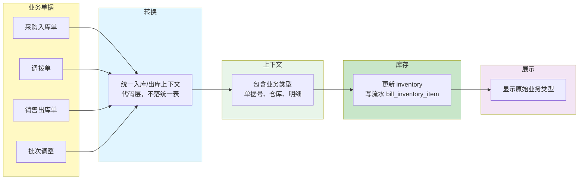
```mermaid
flowchart LR
    subgraph Business["业务单据"]
        A[采购入库单]
        B[调拨单]
        C[销售出库单]
        D[批次调整]
    end
    
    subgraph Convert["转换"]
        E[统一入库/出库上下文<br/>代码层，不落统一表]
    end
    
    subgraph Context["上下文"]
        F[包含业务类型<br/>单据号、仓库、明细]
    end
    
    subgraph Inventory["库存"]
        G[更新 inventory<br/>写流水 bill_inventory_item]
    end
    
    subgraph Display["展示"]
        H[显示原始业务类型]
    end
    
    A & B & C & D --> E --> F --> G --> H
    
    style Business fill:#fff9c4
    style Convert fill:#e1f5ff
    style Context fill:#e8f5e9
    style Inventory fill:#c8e6c9
    style Display fill:#f3e5f5
```

#### 5.1.9 关键设计要点

1. **统一入库/出库上下文（代码层）必须包含业务追溯字段**
   - `business_type`: 记录原始业务类型（PURCHASE_IN, SALES_OUT 等）
   - `bill_type` / `bill_id` / `bill_code`: 记录单据类型与原始单据号，写流水时写入 `bill_inventory_item`

2. **库存流水写入 bill_inventory_item，从上下文中取业务信息**
   - 不记录"统一入库"或"统一出库"，而是记录原始业务类型（采购入库、销售出库、调拨入库、调拨出库等）
   - 数据库层无统一单据表，流水表即承载追溯信息

3. **对外展示时使用库存流水中的业务类型**
   - 前端查询库存流水时，显示原始业务类型
   - 用户看到的是"采购入库单增加了库存"，而不是"统一入库单增加了库存"

4. **追溯完整**
   - 通过 `bill_code`、`bill_id` 可追溯到原始业务单据
   - 通过 `business_type` 可区分不同业务场景

5. **扩展性**
   - 新增业务单据类型时，通过「上下文构建器 + 注册表」扩展，不修改统一库存服务（详见 5.2.5）

---

## 9. 数据库表结构

### 9.1 表结构设计原则

1. **统一字段规范**
   - 所有表包含：`id`(主键)、`create_time`、`update_time`
   - 需要并发控制的表包含：`version`(乐观锁版本号)
   - 软删除字段：`is_deleted`(0-未删除，1-已删除)

2. **索引设计**
   - 主键索引：`PRIMARY KEY (id)`
   - 唯一索引：业务唯一字段（如订单号、SKU编码）
   - 普通索引：外键字段、查询频繁字段

3. **字段类型规范**
   - 金额：`DECIMAL(18,2)`
   - 数量：`INT` 或 `BIGINT`
   - 日期：`DATE`
   - 时间：`DATETIME`
   - 版本号：`INT DEFAULT 0`

### 9.2 核心表结构

#### 4.2.1 商品表 (product)

| 字段名 | 类型 | 说明 | 约束 |
|--------|------|------|------|
| id | BIGINT | 主键ID | PK, AUTO_INCREMENT |
| sku_id | BIGINT | SKU ID | UK, NOT NULL |
| product_name | VARCHAR(255) | 商品名称 | NOT NULL |
| brand | VARCHAR(100) | 品牌 | |
| barcode | VARCHAR(100) | 条码 | |
| category | VARCHAR(100) | 分类 | |
| image_url | VARCHAR(500) | 商品图片URL | |
| unit | VARCHAR(20) | 单位 | |
| version | INT | 乐观锁版本号 | DEFAULT 0 |
| create_time | DATETIME | 创建时间 | DEFAULT CURRENT_TIMESTAMP |
| update_time | DATETIME | 更新时间 | DEFAULT CURRENT_TIMESTAMP ON UPDATE |

#### 4.2.2 供应商表 (supplier)

| 字段名 | 类型 | 说明 | 约束 |
|--------|------|------|------|
| id | BIGINT | 主键ID | PK, AUTO_INCREMENT |
| supplier_code | VARCHAR(50) | 供应商编码 | UK, NOT NULL |
| supplier_name | VARCHAR(255) | 供应商名称 | NOT NULL |
| contact_person | VARCHAR(100) | 联系人 | |
| contact_phone | VARCHAR(50) | 联系电话 | |
| version | INT | 乐观锁版本号 | DEFAULT 0 |
| create_time | DATETIME | 创建时间 | DEFAULT CURRENT_TIMESTAMP |
| update_time | DATETIME | 更新时间 | DEFAULT CURRENT_TIMESTAMP ON UPDATE |

#### 4.2.3 仓库表 (warehouse)

| 字段名 | 类型 | 说明 | 约束 |
|--------|------|------|------|
| id | BIGINT | 主键ID | PK, AUTO_INCREMENT |
| warehouse_code | VARCHAR(50) | 仓库编码 | UK, NOT NULL |
| warehouse_name | VARCHAR(255) | 仓库名称 | NOT NULL |
| warehouse_type | VARCHAR(50) | 仓库类型 | |
| address | VARCHAR(500) | 地址 | |
| version | INT | 乐观锁版本号 | DEFAULT 0 |
| create_time | DATETIME | 创建时间 | DEFAULT CURRENT_TIMESTAMP |
| update_time | DATETIME | 更新时间 | DEFAULT CURRENT_TIMESTAMP ON UPDATE |

#### 4.2.4 采购入库单表 (inbound_order)

| 字段名 | 类型 | 说明 | 约束 |
|--------|------|------|------|
| id | BIGINT | 主键ID | PK, AUTO_INCREMENT |
| order_number | VARCHAR(50) | 入库单号 | UK, NOT NULL |
| supplier_id | BIGINT | 供应商ID | FK, NOT NULL |
| target_warehouse_id | BIGINT | 目标仓库ID | FK, NOT NULL |
| business_date | DATE | 业务日期 | NOT NULL |
| total_amount | DECIMAL(18,2) | 总金额 | DEFAULT 0 |
| status | VARCHAR(20) | 状态 | NOT NULL |
| remarks | VARCHAR(500) | 备注 | |
| creator_id | BIGINT | 创建人ID | |
| version | INT | 乐观锁版本号 | DEFAULT 0 |
| create_time | DATETIME | 创建时间 | DEFAULT CURRENT_TIMESTAMP |
| update_time | DATETIME | 更新时间 | DEFAULT CURRENT_TIMESTAMP ON UPDATE |

**状态枚举值**：

| 状态码 | 状态名称 | 说明 |
|:------|:--------|:----|
| `DRAFT` | 📝 草稿 | 单据创建后的初始状态 |
| `PENDING` | ⏳ 待审核 | 单据已提交，等待审核 |
| `APPROVED` | ✅ 已审核 | 单据审核通过 |
| `INBOUNDED` | 📥 已入库 | 入库操作完成，库存已更新 |
| `CANCELLED` | ❌ 已取消 | 单据已取消 |

#### 4.2.5 采购入库单明细表 (inbound_order_item)

| 字段名 | 类型 | 说明 | 约束 |
|--------|------|------|------|
| id | BIGINT | 主键ID | PK, AUTO_INCREMENT |
| inbound_order_id | BIGINT | 入库单ID | FK, NOT NULL |
| product_id | BIGINT | 商品ID | FK, NOT NULL |
| sku_id | BIGINT | SKU ID | NOT NULL |
| quantity | INT | 入库数量 | NOT NULL |
| unit | VARCHAR(20) | 单位 | |
| unit_cost | DECIMAL(18,2) | 入库成本单价 | NOT NULL |
| expiry_date | DATE | 商品效期 | |
| subtotal | DECIMAL(18,2) | 小计 | NOT NULL |
| available_quantity | INT | 可用数量（池内可用） | DEFAULT 0 |
| version | INT | 乐观锁版本号 | DEFAULT 0 |
| create_time | DATETIME | 创建时间 | DEFAULT CURRENT_TIMESTAMP |
| update_time | DATETIME | 更新时间 | DEFAULT CURRENT_TIMESTAMP ON UPDATE |

#### 4.2.6 调拨单表 (transfer_order)

| 字段名 | 类型 | 说明 | 约束 |
|--------|------|------|------|
| id | BIGINT | 主键ID | PK, AUTO_INCREMENT |
| order_number | VARCHAR(50) | 调拨单号 | UK, NOT NULL |
| source_warehouse_id | BIGINT | 调出仓库ID | FK, NOT NULL |
| destination_warehouse_id | BIGINT | 调入仓库ID | FK, NOT NULL |
| business_date | DATE | 业务日期 | NOT NULL |
| total_quantity | INT | 商品总数量 | DEFAULT 0 |
| status | VARCHAR(20) | 状态 | NOT NULL |
| remarks | VARCHAR(500) | 备注 | |
| creator_id | BIGINT | 创建人ID | |
| version | INT | 乐观锁版本号 | DEFAULT 0 |
| create_time | DATETIME | 创建时间 | DEFAULT CURRENT_TIMESTAMP |
| update_time | DATETIME | 更新时间 | DEFAULT CURRENT_TIMESTAMP ON UPDATE |

**状态枚举值**：

| 状态码 | 状态名称 | 说明 |
|:------|:--------|:----|
| `DRAFT` | 📝 草稿 | 创建和提交后均为草稿状态，不更新库存 |
| `IN_TRANSIT` | 🚚 运输中 | 审核出库后，源仓库库存已扣减 |
| `COMPLETED` | ✅ 已完成 | 审核入库后，目标仓库库存已增加 |
| `CANCELLED` | ❌ 已取消 | 调拨单已取消 |

#### 4.2.7 调拨单明细表 (transfer_order_item)

| 字段名 | 类型 | 说明 | 约束 |
|--------|------|------|------|
| id | BIGINT | 主键ID | PK, AUTO_INCREMENT |
| transfer_order_id | BIGINT | 调拨单ID | FK, NOT NULL |
| inbound_order_item_id | BIGINT | 源入库单明细ID | FK, NOT NULL |
| product_id | BIGINT | 商品ID | FK, NOT NULL |
| sku_id | BIGINT | SKU ID | NOT NULL |
| transfer_quantity | INT | 调拨数量 | NOT NULL |
| unit | VARCHAR(20) | 单位 | |
| unit_cost | DECIMAL(18,2) | 单价成本（只读） | |
| expiry_date | DATE | 对应效期（只读） | |
| create_time | DATETIME | 创建时间 | DEFAULT CURRENT_TIMESTAMP |
| update_time | DATETIME | 更新时间 | DEFAULT CURRENT_TIMESTAMP ON UPDATE |

#### 4.2.8 库存表 (inventory)

| 字段名 | 类型 | 说明 | 约束 |
|--------|------|------|------|
| id | BIGINT | 主键ID | PK, AUTO_INCREMENT |
| product_id | BIGINT | 商品ID | FK, NOT NULL |
| sku_id | BIGINT | SKU ID | NOT NULL |
| warehouse_id | BIGINT | 仓库ID | FK, NOT NULL |
| product_status | VARCHAR(50) | 产品状态（正品/次品） | NOT NULL, DEFAULT '正品' |
| total_stock | INT | 入库库存（总结余） | DEFAULT 0 |
| allocatable_stock | INT | 可分配库存 | DEFAULT 0 |
| allocated_stock | INT | 已分配合计 | DEFAULT 0 |
| locked_stock | INT | 锁定库存 | DEFAULT 0 |
| pending_shipment_stock | INT | 待发库存 | DEFAULT 0 |
| version | INT | 乐观锁版本号 | DEFAULT 0 |
| create_time | DATETIME | 创建时间 | DEFAULT CURRENT_TIMESTAMP |
| update_time | DATETIME | 更新时间 | DEFAULT CURRENT_TIMESTAMP ON UPDATE |

**唯一约束**：`UNIQUE KEY uk_sku_warehouse_status (sku_id, warehouse_id, product_status)`

#### 4.2.9 库存流水表 (bill_inventory_item)

| 字段名 | 类型 | 说明 | 约束 |
|--------|------|------|------|
| id | BIGINT | 主键ID | PK, AUTO_INCREMENT |
| product_id | BIGINT | 商品ID | FK, NOT NULL |
| sku_id | BIGINT | SKU ID | NOT NULL |
| warehouse_id | BIGINT | 仓库ID | FK, NOT NULL |
| warehouse_name | VARCHAR(255) | 仓库名称（冗余） | |
| product_status | VARCHAR(50) | 产品状态 | NOT NULL |
| change_time | DATETIME | 变动时间 | NOT NULL |
| business_type | VARCHAR(50) | 业务类型 | NOT NULL |
| related_document_type | VARCHAR(50) | 关联单据类型 | NOT NULL |
| related_document_id | VARCHAR(100) | 关联单据号 | NOT NULL |
| change_quantity | INT | 变动数量 | NOT NULL |
| total_balance_after_change | INT | 变动后总结余 | NOT NULL |
| operator_id | BIGINT | 操作人ID | |
| operator_name | VARCHAR(100) | 操作人名称 | |
| create_time | DATETIME | 创建时间 | DEFAULT CURRENT_TIMESTAMP |

**业务类型枚举值**：

| 业务类型码 | 业务类型名称 | 说明 |
|:----------|:-----------|:----|
| `PURCHASE_IN` | 📥 采购入库 | 采购商品入库操作 |
| `TRANSFER_IN` | 📥 调拨入库 | 调拨商品入库操作 |
| `TRANSFER_OUT` | 📤 调拨出库 | 调拨商品出库操作 |
| `SALES_OUT` | 📤 销售出库 | 销售商品出库操作 |
| `INVENTORY_ADJUSTMENT` | 🔧 库存盘点 | 库存盘点调整操作 |
| `ALLOCATE` | 🔒 分配 | 库存分配操作 |
| `DEALLOCATE` | 🔓 取消分配 | 取消库存分配操作 |

#### 4.2.10 批次表 (batch)

| 字段名 | 类型 | 说明 | 约束 |
|--------|------|------|------|
| id | BIGINT | 主键ID | PK, AUTO_INCREMENT |
| batch_number | VARCHAR(50) | 销售批次号 | UK, NOT NULL |
| product_id | BIGINT | 商品ID | FK, NOT NULL |
| sku_id | BIGINT | SKU ID | NOT NULL |
| warehouse_id | BIGINT | 仓库ID | FK, NOT NULL |
| storage_location | VARCHAR(50) | 库位 | |
| expiry_date | DATE | 到期日期 | |
| trade_mode | INT | 贸易模式（数据字典ID） | |
| customs_zone | INT | 申报关区（数据字典ID） | |
| status | INT | 状态（1-已上架，2-已下架） | NOT NULL |
| total_quantity | INT | 批次库存合计 | DEFAULT 0 |
| version | INT | 乐观锁版本号 | DEFAULT 0 |
| create_time | DATETIME | 创建时间 | DEFAULT CURRENT_TIMESTAMP |
| update_time | DATETIME | 更新时间 | DEFAULT CURRENT_TIMESTAMP ON UPDATE |

**状态枚举值**：

| 状态码 | 状态名称 | 说明 |
|:------|:--------|:----|
| `ON_SHELF` | ✅ 已上架 | 批次发布即生效，无草稿状态 |
| `OFF_SHELF` | ❌ 已下架 | 批次作废，库存已返还到可用库存池 |

#### 4.2.11 批次单据明细表 (bill_batch_detail)

| 字段名 | 类型 | 说明 | 约束 |
|--------|------|------|------|
| id | BIGINT | 主键ID | PK, AUTO_INCREMENT |
| batch_id | INT | 批次ID | FK, NOT NULL |
| bill_item_id | INT | 单据明细ID（对应 bill_inventory_order_item.id） | FK, NOT NULL |
| bill_code | VARCHAR(50) | 单据号 | NOT NULL |
| bill_date | DATE | 单据日期 | |
| bill_status | INT | 单据状态 | NOT NULL |
| initial_allocated_quantity | DECIMAL(18,2) | 初始分配量 | NOT NULL |
| current_available_quantity | DECIMAL(18,2) | 当前可售余量 | NOT NULL |
| status | INT | 状态 | NOT NULL |
| version | INT | 乐观锁版本号 | DEFAULT 0 |
| create_time | DATETIME | 创建时间 | DEFAULT CURRENT_TIMESTAMP |
| update_time | DATETIME | 更新时间 | DEFAULT CURRENT_TIMESTAMP ON UPDATE |

---

## 10. 创建SQL

### 9.1 商品表

```sql
CREATE TABLE `product` (
    `id` BIGINT(20) NOT NULL AUTO_INCREMENT COMMENT '主键ID',
    `sku_id` BIGINT NOT NULL COMMENT 'SKU ID',
    `product_name` VARCHAR(255) NOT NULL COMMENT '商品名称',
    `brand` VARCHAR(100) DEFAULT NULL COMMENT '品牌',
    `barcode` VARCHAR(100) DEFAULT NULL COMMENT '条码',
    `category` VARCHAR(100) DEFAULT NULL COMMENT '分类',
    `image_url` VARCHAR(500) DEFAULT NULL COMMENT '商品图片URL',
    `unit` VARCHAR(20) DEFAULT NULL COMMENT '单位',
    `version` INT(11) NOT NULL DEFAULT '0' COMMENT '乐观锁版本号',
    `create_time` DATETIME NOT NULL DEFAULT CURRENT_TIMESTAMP COMMENT '创建时间',
    `update_time` DATETIME NOT NULL DEFAULT CURRENT_TIMESTAMP ON UPDATE CURRENT_TIMESTAMP COMMENT '更新时间',
    PRIMARY KEY (`id`),
    UNIQUE KEY `uk_sku_id` (`sku_id`),
    KEY `idx_product_name` (`product_name`),
    KEY `idx_barcode` (`barcode`)
) ENGINE=InnoDB DEFAULT CHARSET=utf8mb4 COMMENT='商品表';
```

### 9.2 供应商表

```sql
CREATE TABLE `supplier` (
    `id` BIGINT(20) NOT NULL AUTO_INCREMENT COMMENT '主键ID',
    `supplier_code` VARCHAR(50) NOT NULL COMMENT '供应商编码',
    `supplier_name` VARCHAR(255) NOT NULL COMMENT '供应商名称',
    `contact_person` VARCHAR(100) DEFAULT NULL COMMENT '联系人',
    `contact_phone` VARCHAR(50) DEFAULT NULL COMMENT '联系电话',
    `version` INT(11) NOT NULL DEFAULT '0' COMMENT '乐观锁版本号',
    `create_time` DATETIME NOT NULL DEFAULT CURRENT_TIMESTAMP COMMENT '创建时间',
    `update_time` DATETIME NOT NULL DEFAULT CURRENT_TIMESTAMP ON UPDATE CURRENT_TIMESTAMP COMMENT '更新时间',
    PRIMARY KEY (`id`),
    UNIQUE KEY `uk_supplier_code` (`supplier_code`),
    KEY `idx_supplier_name` (`supplier_name`)
) ENGINE=InnoDB DEFAULT CHARSET=utf8mb4 COMMENT='供应商表';
```

### 9.3 仓库表

```sql
CREATE TABLE `warehouse` (
    `id` BIGINT(20) NOT NULL AUTO_INCREMENT COMMENT '主键ID',
    `warehouse_code` VARCHAR(50) NOT NULL COMMENT '仓库编码',
    `warehouse_name` VARCHAR(255) NOT NULL COMMENT '仓库名称',
    `warehouse_type` VARCHAR(50) DEFAULT NULL COMMENT '仓库类型',
    `address` VARCHAR(500) DEFAULT NULL COMMENT '地址',
    `version` INT(11) NOT NULL DEFAULT '0' COMMENT '乐观锁版本号',
    `create_time` DATETIME NOT NULL DEFAULT CURRENT_TIMESTAMP COMMENT '创建时间',
    `update_time` DATETIME NOT NULL DEFAULT CURRENT_TIMESTAMP ON UPDATE CURRENT_TIMESTAMP COMMENT '更新时间',
    PRIMARY KEY (`id`),
    UNIQUE KEY `uk_warehouse_code` (`warehouse_code`),
    KEY `idx_warehouse_name` (`warehouse_name`)
) ENGINE=InnoDB DEFAULT CHARSET=utf8mb4 COMMENT='仓库表';
```

### 9.4 采购入库单表

```sql
CREATE TABLE `inbound_order` (
    `id` BIGINT(20) NOT NULL AUTO_INCREMENT COMMENT '主键ID',
    `order_number` VARCHAR(50) NOT NULL COMMENT '入库单号',
    `supplier_id` BIGINT(20) NOT NULL COMMENT '供应商ID',
    `target_warehouse_id` BIGINT(20) NOT NULL COMMENT '目标仓库ID',
    `business_date` DATE NOT NULL COMMENT '业务日期',
    `total_amount` DECIMAL(18,2) NOT NULL DEFAULT '0.00' COMMENT '总金额',
    `status` VARCHAR(20) NOT NULL COMMENT '状态：DRAFT-草稿，PENDING-待审核，APPROVED-已审核，INBOUNDED-已入库，CANCELLED-已取消',
    `remarks` VARCHAR(500) DEFAULT NULL COMMENT '备注',
    `creator_id` BIGINT(20) DEFAULT NULL COMMENT '创建人ID',
    `version` INT(11) NOT NULL DEFAULT '0' COMMENT '乐观锁版本号',
    `create_time` DATETIME NOT NULL DEFAULT CURRENT_TIMESTAMP COMMENT '创建时间',
    `update_time` DATETIME NOT NULL DEFAULT CURRENT_TIMESTAMP ON UPDATE CURRENT_TIMESTAMP COMMENT '更新时间',
    PRIMARY KEY (`id`),
    UNIQUE KEY `uk_order_number` (`order_number`),
    KEY `idx_supplier_id` (`supplier_id`),
    KEY `idx_target_warehouse_id` (`target_warehouse_id`),
    KEY `idx_business_date` (`business_date`),
    KEY `idx_status` (`status`)
) ENGINE=InnoDB DEFAULT CHARSET=utf8mb4 COMMENT='采购入库单表';
```

### 9.5 采购入库单明细表

```sql
CREATE TABLE `inbound_order_item` (
    `id` BIGINT(20) NOT NULL AUTO_INCREMENT COMMENT '主键ID',
    `inbound_order_id` BIGINT(20) NOT NULL COMMENT '入库单ID',
    `product_id` BIGINT(20) NOT NULL COMMENT '商品ID',
    `sku_id` BIGINT NOT NULL COMMENT 'SKU ID',
    `quantity` INT(11) NOT NULL COMMENT '入库数量',
    `unit` VARCHAR(20) DEFAULT NULL COMMENT '单位',
    `unit_cost` DECIMAL(18,2) NOT NULL COMMENT '入库成本单价',
    `expiry_date` DATE DEFAULT NULL COMMENT '商品效期',
    `subtotal` DECIMAL(18,2) NOT NULL COMMENT '小计',
    `available_quantity` INT(11) NOT NULL DEFAULT '0' COMMENT '可用数量（池内可用）',
    `version` INT(11) NOT NULL DEFAULT '0' COMMENT '乐观锁版本号',
    `create_time` DATETIME NOT NULL DEFAULT CURRENT_TIMESTAMP COMMENT '创建时间',
    `update_time` DATETIME NOT NULL DEFAULT CURRENT_TIMESTAMP ON UPDATE CURRENT_TIMESTAMP COMMENT '更新时间',
    PRIMARY KEY (`id`),
    KEY `idx_inbound_order_id` (`inbound_order_id`),
    KEY `idx_product_id` (`product_id`),
    KEY `idx_sku_id` (`sku_id`)
) ENGINE=InnoDB DEFAULT CHARSET=utf8mb4 COMMENT='采购入库单明细表';
```

### 9.6 调拨单表

```sql
CREATE TABLE `transfer_order` (
    `id` BIGINT(20) NOT NULL AUTO_INCREMENT COMMENT '主键ID',
    `order_number` VARCHAR(50) NOT NULL COMMENT '调拨单号',
    `source_warehouse_id` BIGINT(20) NOT NULL COMMENT '调出仓库ID',
    `destination_warehouse_id` BIGINT(20) NOT NULL COMMENT '调入仓库ID',
    `business_date` DATE NOT NULL COMMENT '业务日期',
    `total_quantity` INT(11) NOT NULL DEFAULT '0' COMMENT '商品总数量',
    `status` VARCHAR(20) NOT NULL COMMENT '状态：DRAFT-草稿，PENDING_OUTBOUND-待出库，IN_TRANSIT-运输中，COMPLETED-已完成，CANCELLED-已取消',
    `remarks` VARCHAR(500) DEFAULT NULL COMMENT '备注',
    `creator_id` BIGINT(20) DEFAULT NULL COMMENT '创建人ID',
    `version` INT(11) NOT NULL DEFAULT '0' COMMENT '乐观锁版本号',
    `create_time` DATETIME NOT NULL DEFAULT CURRENT_TIMESTAMP COMMENT '创建时间',
    `update_time` DATETIME NOT NULL DEFAULT CURRENT_TIMESTAMP ON UPDATE CURRENT_TIMESTAMP COMMENT '更新时间',
    PRIMARY KEY (`id`),
    UNIQUE KEY `uk_order_number` (`order_number`),
    KEY `idx_source_warehouse_id` (`source_warehouse_id`),
    KEY `idx_destination_warehouse_id` (`destination_warehouse_id`),
    KEY `idx_business_date` (`business_date`),
    KEY `idx_status` (`status`)
) ENGINE=InnoDB DEFAULT CHARSET=utf8mb4 COMMENT='调拨单表';
```

### 9.7 调拨单明细表

```sql
CREATE TABLE `transfer_order_item` (
    `id` BIGINT(20) NOT NULL AUTO_INCREMENT COMMENT '主键ID',
    `transfer_order_id` BIGINT(20) NOT NULL COMMENT '调拨单ID',
    `inbound_order_item_id` BIGINT(20) NOT NULL COMMENT '源入库单明细ID',
    `product_id` BIGINT(20) NOT NULL COMMENT '商品ID',
    `sku_id` BIGINT NOT NULL COMMENT 'SKU ID',
    `transfer_quantity` INT(11) NOT NULL COMMENT '调拨数量',
    `unit` VARCHAR(20) DEFAULT NULL COMMENT '单位',
    `unit_cost` DECIMAL(18,2) DEFAULT NULL COMMENT '单价成本（只读）',
    `expiry_date` DATE DEFAULT NULL COMMENT '对应效期（只读）',
    `create_time` DATETIME NOT NULL DEFAULT CURRENT_TIMESTAMP COMMENT '创建时间',
    `update_time` DATETIME NOT NULL DEFAULT CURRENT_TIMESTAMP ON UPDATE CURRENT_TIMESTAMP COMMENT '更新时间',
    PRIMARY KEY (`id`),
    KEY `idx_transfer_order_id` (`transfer_order_id`),
    KEY `idx_inbound_order_item_id` (`inbound_order_item_id`),
    KEY `idx_product_id` (`product_id`),
    KEY `idx_sku_id` (`sku_id`)
) ENGINE=InnoDB DEFAULT CHARSET=utf8mb4 COMMENT='调拨单明细表';
```

### 9.8 库存表

```sql
CREATE TABLE `bill_inventory` (
    `id` BIGINT(20) NOT NULL AUTO_INCREMENT COMMENT '主键ID',
    `product_id` BIGINT(20) NOT NULL COMMENT '商品ID',
    `sku_id` BIGINT NOT NULL COMMENT 'SKU ID',
    `warehouse_id` BIGINT(20) NOT NULL COMMENT '仓库ID',
    `product_status` VARCHAR(50) NOT NULL DEFAULT '正品' COMMENT '产品状态（正品/次品）',
    `total_stock` INT(11) NOT NULL DEFAULT '0' COMMENT '入库库存（总结余）',
    `allocatable_stock` INT(11) NOT NULL DEFAULT '0' COMMENT '可分配库存',
    `allocated_stock` INT(11) NOT NULL DEFAULT '0' COMMENT '已分配合计（含锁定及待发）',
    `locked_stock` INT(11) NOT NULL DEFAULT '0' COMMENT '锁定库存',
    `pending_shipment_stock` INT(11) NOT NULL DEFAULT '0' COMMENT '待发库存',
    `version` INT(11) NOT NULL DEFAULT '0' COMMENT '乐观锁版本号',
    `create_time` DATETIME NOT NULL DEFAULT CURRENT_TIMESTAMP COMMENT '创建时间',
    `update_time` DATETIME NOT NULL DEFAULT CURRENT_TIMESTAMP ON UPDATE CURRENT_TIMESTAMP COMMENT '更新时间',
    PRIMARY KEY (`id`),
    UNIQUE KEY `uk_sku_warehouse_status` (`sku_id`, `warehouse_id`, `product_status`),
    KEY `idx_product_id` (`product_id`),
    KEY `idx_sku_id` (`sku_id`),
    KEY `idx_warehouse_id` (`warehouse_id`)
) ENGINE=InnoDB DEFAULT CHARSET=utf8mb4 COMMENT='库存表';
```

### 9.9 库存流水表

```sql
CREATE TABLE `bill_inventory_item` (
    `id` BIGINT(20) NOT NULL AUTO_INCREMENT COMMENT '主键ID',
    `product_id` BIGINT(20) NOT NULL COMMENT '商品ID',
    `sku_id` BIGINT NOT NULL COMMENT 'SKU ID',
    `warehouse_id` BIGINT(20) NOT NULL COMMENT '仓库ID',
    `warehouse_name` VARCHAR(255) DEFAULT NULL COMMENT '仓库名称（冗余）',
    `product_status` VARCHAR(50) NOT NULL COMMENT '产品状态',
    `change_time` DATETIME NOT NULL COMMENT '变动时间',
    `business_type` VARCHAR(50) NOT NULL COMMENT '业务类型：PURCHASE_IN-采购入库，TRANSFER_IN-调拨入库，TRANSFER_OUT-调拨出库，SALES_OUT-销售出库，INVENTORY_ADJUSTMENT-库存盘点，BATCH_ADJUSTMENT-批次调整，ALLOCATE-分配，DEALLOCATE-取消分配。注意：此字段记录的是原始业务类型，用于对外展示，而不是"统一入库"或"统一出库"',
    `related_document_type` VARCHAR(50) NOT NULL COMMENT '关联单据类型：IN-入库单，TR-调拨单，ORD-订单，ADJ-调整单，BATCH-批次。用于标识原始业务单据的类型',
    `related_document_id` VARCHAR(100) NOT NULL COMMENT '关联单据号（原始业务单据号）：如IN-2023102401、TR-20231026001、ORD-20231026-8891等。用于追溯原始业务单据',
    `change_quantity` INT(11) NOT NULL COMMENT '变动数量（正数表示增加，负数表示减少）',
    `total_balance_after_change` INT(11) NOT NULL COMMENT '变动后总结余',
    `operator_id` BIGINT(20) DEFAULT NULL COMMENT '操作人ID',
    `operator_name` VARCHAR(100) DEFAULT NULL COMMENT '操作人名称',
    `create_time` DATETIME NOT NULL DEFAULT CURRENT_TIMESTAMP COMMENT '创建时间',
    PRIMARY KEY (`id`),
    KEY `idx_product_id` (`product_id`),
    KEY `idx_sku_id` (`sku_id`),
    KEY `idx_warehouse_id` (`warehouse_id`),
    KEY `idx_change_time` (`change_time`),
    KEY `idx_related_doc` (`related_document_type`, `related_document_id`),
    KEY `idx_business_type` (`business_type`)
) ENGINE=InnoDB DEFAULT CHARSET=utf8mb4 COMMENT='库存流水表';
```

### 9.10 批次表

**批次相关表名统一**（仅限以下三张，以《数据库设计》为准）：
- **批次表**：`bill_inventory_batch`（建表见数据库设计 3.5）
- **批次单据明细表**：`bill_batch_detail`（建表见数据库设计 3.6）
- **批次明细表（流水）**：`bill_inventory_batch_item`（建表见数据库设计 3.7）

完整建表 SQL 见 [数据库设计 - 3.5～3.7](./数据库设计.md)，项目 DDL 见 `lime-bill-service/sql/batch_ddl.sql`。字段说明：批次表使用 **batch_code**、**status**（INT）、**allocatable_quantity** 等；批次单据明细表使用 **bill_item_id**、**bill_code**、**bill_date**；批次明细表使用 **bill_type**、**bill_id**、**bill_code**、**bill_item_id**、**bill_date** 用于 FIFO 追溯。

### 9.13 统一单据表说明（数据库层不建，代码层用上下文）

**约定**：数据库层面**不建**统一入库单表、统一出库单表及其明细表，表结构以 [数据库设计](./数据库设计.md) 为准。  
代码层面在更新库存和库存明细时，将采购入库单、调拨单、销售出库单等**统一转化为入库/出库逻辑**：先构建**统一入库上下文**（InventoryUnifiedInboundContext）或**统一出库上下文**（InventoryUnifiedOutboundContext），再调用统一库存更新服务；流水写入 `bill_inventory_item`，业务类型与单据号从上下文中取值。详见本文档 5.2 节及扩展性设计 5.2.5、8.1.8。

### 9.14 单据编号序列表

```sql
CREATE TABLE `document_number_sequence` (
    `id` BIGINT(20) NOT NULL AUTO_INCREMENT COMMENT '主键ID',
    `document_type` VARCHAR(50) NOT NULL COMMENT '单据类型：PURCHASE_IN-采购入库单，TRANSFER-调拨单，SALES_OUT-销售出库单，BATCH-批次，UNIFIED_INBOUND-统一入库单，UNIFIED_OUTBOUND-统一出库单',
    `date_str` VARCHAR(8) NOT NULL COMMENT '日期字符串：YYYYMMDD',
    `current_sequence` INT(11) NOT NULL DEFAULT 0 COMMENT '当前序号',
    `max_sequence` INT(11) NOT NULL COMMENT '最大序号（3位=999，4位=9999）',
    `version` INT(11) NOT NULL DEFAULT 0 COMMENT '版本号（乐观锁）',
    `create_time` DATETIME NOT NULL DEFAULT CURRENT_TIMESTAMP COMMENT '创建时间',
    `update_time` DATETIME NOT NULL DEFAULT CURRENT_TIMESTAMP ON UPDATE CURRENT_TIMESTAMP COMMENT '更新时间',
    PRIMARY KEY (`id`),
    UNIQUE KEY `uk_type_date` (`document_type`, `date_str`),
    KEY `idx_date` (`date_str`)
) ENGINE=InnoDB DEFAULT CHARSET=utf8mb4 COMMENT='单据编号序列表';
```

**关键字段说明**：
- `document_type`: 单据类型，用于区分不同的业务单据
- `date_str`: 日期字符串（YYYYMMDD），每日重置序号
- `current_sequence`: 当前序号，每次生成编号时递增
- `max_sequence`: 最大序号，防止超出编号范围
- `version`: 乐观锁版本号，用于并发控制

---

### 5.3 单据编号生成

#### 5.3.1 设计目的

**核心需求**：
- 所有业务单据编号必须自动生成，统一管理
- 确保编号唯一性
- 支持并发场景下的编号生成
- 编号格式规范，包含业务类型和日期信息

**需要生成编号的单据类型**：
- 采购入库单：`IN-YYYYMMDD-XXX`
- 调拨单：`TR-YYYYMMDD-XXX`
- 销售出库单：`ORD-YYYYMMDD-XXXX`
- 批次号：`BATCH-YYYYMMDD-XXX`
- 统一入库单：`UIO-YYYYMMDD-XXX`
- 统一出库单：`UOO-YYYYMMDD-XXX`

#### 5.3.2 编号格式规范

| 单据类型 | 编号格式 | 示例 | 说明 |
|---------|---------|------|------|
| 采购入库单 | `IN-YYYYMMDD-XXX` | IN-20231024-001 | 前缀+日期+3位序号 |
| 调拨单 | `TR-YYYYMMDD-XXX` | TR-20231026-001 | 前缀+日期+3位序号 |
| 销售出库单 | `ORD-YYYYMMDD-XXXX` | ORD-20231026-0001 | 前缀+日期+4位序号 |
| 批次号 | `BATCH-YYYYMMDD-XXX` | BATCH-20260205-001 | 前缀+日期+3位序号 |
| 统一入库单 | `UIO-YYYYMMDD-XXX` | UIO-20231024-001 | 前缀+日期+3位序号 |
| 统一出库单 | `UOO-YYYYMMDD-XXX` | UOO-20231026-001 | 前缀+日期+3位序号 |

**格式说明**：
- `YYYYMMDD`：8位日期，如20231024
- `XXX`：3位序号，从001开始，每日重置
- `XXXX`：4位序号，从0001开始，每日重置

#### 5.3.3 数据库设计

#### 8.3.1 编号序列表 (document_number_sequence)

```sql
CREATE TABLE `document_number_sequence` (
    `id` BIGINT(20) NOT NULL AUTO_INCREMENT COMMENT '主键ID',
    `document_type` VARCHAR(50) NOT NULL COMMENT '单据类型：PURCHASE_IN-采购入库单，TRANSFER-调拨单，SALES_OUT-销售出库单，BATCH-批次，UNIFIED_INBOUND-统一入库单，UNIFIED_OUTBOUND-统一出库单',
    `date_str` VARCHAR(8) NOT NULL COMMENT '日期字符串：YYYYMMDD',
    `current_sequence` INT(11) NOT NULL DEFAULT 0 COMMENT '当前序号',
    `max_sequence` INT(11) NOT NULL COMMENT '最大序号（3位=999，4位=9999）',
    `version` INT(11) NOT NULL DEFAULT 0 COMMENT '版本号（乐观锁）',
    `create_time` DATETIME NOT NULL DEFAULT CURRENT_TIMESTAMP COMMENT '创建时间',
    `update_time` DATETIME NOT NULL DEFAULT CURRENT_TIMESTAMP ON UPDATE CURRENT_TIMESTAMP COMMENT '更新时间',
    PRIMARY KEY (`id`),
    UNIQUE KEY `uk_type_date` (`document_type`, `date_str`),
    KEY `idx_date` (`date_str`)
) ENGINE=InnoDB DEFAULT CHARSET=utf8mb4 COMMENT='单据编号序列表';
```

**设计说明**：
- 使用 `document_type` + `date_str` 作为唯一索引，确保同一天同一类型单据的唯一性
- 使用 `version` 字段实现乐观锁，保证并发安全
- 每日自动创建新的序列记录，序号从1开始

### 8.4 编号生成服务实现

#### 8.4.1 服务接口

```java
/**
 * 单据编号生成服务
 */
public interface DocumentNumberService {
    
    /**
     * 生成采购入库单号
     * @return 入库单号，格式：IN-YYYYMMDD-XXX
     */
    String generatePurchaseInOrderNumber();
    
    /**
     * 生成调拨单号
     * @return 调拨单号，格式：TR-YYYYMMDD-XXX
     */
    String generateTransferOrderNumber();
    
    /**
     * 生成销售出库单号
     * @return 出库单号，格式：ORD-YYYYMMDD-XXXX
     */
    String generateSalesOrderNumber();
    
    /**
     * 生成批次号
     * @return 批次号，格式：BATCH-YYYYMMDD-XXX
     */
    String generateBatchNumber();
    
    /**
     * 生成统一入库单号
     * @return 统一入库单号，格式：UIO-YYYYMMDD-XXX
     */
    String generateUnifiedInboundOrderNumber();
    
    /**
     * 生成统一出库单号
     * @return 统一出库单号，格式：UOO-YYYYMMDD-XXX
     */
    String generateUnifiedOutboundOrderNumber();
}
```

#### 8.4.2 服务实现

```java
@Service
@RequiredArgsConstructor
public class DocumentNumberServiceImpl implements DocumentNumberService {
    
    private final DocumentNumberSequenceRepository sequenceRepository;
    
    /**
     * 生成采购入库单号
     */
    @Override
    public String generatePurchaseInOrderNumber() {
        return generateDocumentNumber("PURCHASE_IN", "IN", 3);
    }
    
    /**
     * 生成调拨单号
     */
    @Override
    public String generateTransferOrderNumber() {
        return generateDocumentNumber("TRANSFER", "TR", 3);
    }
    
    /**
     * 生成销售出库单号
     */
    @Override
    public String generateSalesOrderNumber() {
        return generateDocumentNumber("SALES_OUT", "ORD", 4);
    }
    
    /**
     * 生成批次号
     */
    @Override
    public String generateBatchNumber() {
        return generateDocumentNumber("BATCH", "BATCH", 3);
    }
    
    /**
     * 生成统一入库单号
     */
    @Override
    public String generateUnifiedInboundOrderNumber() {
        return generateDocumentNumber("UNIFIED_INBOUND", "UIO", 3);
    }
    
    /**
     * 生成统一出库单号
     */
    @Override
    public String generateUnifiedOutboundOrderNumber() {
        return generateDocumentNumber("UNIFIED_OUTBOUND", "UOO", 3);
    }
    
    /**
     * 通用编号生成方法
     * 
     * @param documentType 单据类型（数据库存储类型）
     * @param prefix 编号前缀（如IN、TR、ORD等）
     * @param sequenceLength 序号长度（3或4）
     * @return 生成的单据编号
     */
    @Transactional(rollbackFor = Exception.class)
    public String generateDocumentNumber(String documentType, String prefix, int sequenceLength) {
        // 1. 获取当前日期字符串
        String dateStr = LocalDate.now().format(DateTimeFormatter.ofPattern("yyyyMMdd"));
        
        // 2. 查询或创建序列记录（带重试机制）
        int maxRetries = 3;
        for (int i = 0; i < maxRetries; i++) {
            try {
                DocumentNumberSequenceEntity sequence = getOrCreateSequence(documentType, dateStr, sequenceLength);
                
                // 3. 递增序号（带乐观锁）
                int nextSequence = sequence.getCurrentSequence() + 1;
                
                // 检查序号是否超过最大值
                if (nextSequence > sequence.getMaxSequence()) {
                    throw new BusinessException(
                        String.format("今日%s单据编号已达到最大值%d", documentType, sequence.getMaxSequence())
                    );
                }
                
                // 4. 更新序号（带乐观锁）
                DocumentNumberSequenceEntity updateEntity = new DocumentNumberSequenceEntity();
                updateEntity.setId(sequence.getId());
                updateEntity.setVersion(sequence.getVersion());
                updateEntity.setCurrentSequence(nextSequence);
                
                int updateCount = sequenceRepository.updateSequenceWithVersion(updateEntity);
                if (updateCount > 0) {
                    // 5. 生成编号
                    String sequenceStr = String.format("%0" + sequenceLength + "d", nextSequence);
                    return String.format("%s-%s-%s", prefix, dateStr, sequenceStr);
                } else {
                    // 乐观锁冲突，重试
                    if (i == maxRetries - 1) {
                        throw new ConcurrentModificationException("编号生成失败，请重试");
                    }
                    Thread.sleep(10); // 短暂等待后重试
                }
            } catch (InterruptedException e) {
                Thread.currentThread().interrupt();
                throw new BusinessException("编号生成被中断");
            }
        }
        
        throw new BusinessException("编号生成失败");
    }
    
    /**
     * 获取或创建序列记录
     */
    private DocumentNumberSequenceEntity getOrCreateSequence(
            String documentType, String dateStr, int sequenceLength) {
        
        // 1. 查询是否存在
        DocumentNumberSequenceQueryRequest queryRequest = new DocumentNumberSequenceQueryRequest();
        queryRequest.setDocumentType(documentType);
        queryRequest.setDateStr(dateStr);
        DocumentNumberSequenceEntity sequence = sequenceRepository.selectByTypeAndDate(queryRequest);
        
        if (sequence != null) {
            return sequence;
        }
        
        // 2. 不存在则创建（需要考虑并发创建的情况）
        try {
            DocumentNumberSequenceEntity newSequence = new DocumentNumberSequenceEntity();
            newSequence.setDocumentType(documentType);
            newSequence.setDateStr(dateStr);
            newSequence.setCurrentSequence(0);
            newSequence.setMaxSequence(sequenceLength == 3 ? 999 : 9999);
            newSequence.setVersion(0);
            
            sequenceRepository.insert(newSequence);
            return newSequence;
        } catch (DuplicateKeyException e) {
            // 并发创建冲突，重新查询
            return sequenceRepository.selectByTypeAndDate(queryRequest);
        }
    }
}
```

#### 8.4.3 Repository层实现

```java
public interface DocumentNumberSequenceRepository {
    
    /**
     * 根据单据类型和日期查询序列
     */
    DocumentNumberSequenceEntity selectByTypeAndDate(DocumentNumberSequenceQueryRequest request);
    
    /**
     * 插入序列记录
     */
    void insert(DocumentNumberSequenceEntity entity);
    
    /**
     * 更新序号（带乐观锁）
     */
    int updateSequenceWithVersion(DocumentNumberSequenceEntity entity);
}

@Repository
@RequiredArgsConstructor
public class DocumentNumberSequenceRepositoryImpl implements DocumentNumberSequenceRepository {
    
    private final DocumentNumberSequenceMapper mapper;
    
    @Override
    public DocumentNumberSequenceEntity selectByTypeAndDate(DocumentNumberSequenceQueryRequest request) {
        return mapper.selectByTypeAndDate(request.getDocumentType(), request.getDateStr());
    }
    
    @Override
    public void insert(DocumentNumberSequenceEntity entity) {
        mapper.insert(entity);
    }
    
    @Override
    public int updateSequenceWithVersion(DocumentNumberSequenceEntity entity) {
        return mapper.updateSequenceWithVersion(
            entity.getId(),
            entity.getVersion(),
            entity.getCurrentSequence()
        );
    }
}
```

#### 8.4.4 Mapper XML实现

```xml
<!-- 根据单据类型和日期查询序列 -->
<select id="selectByTypeAndDate" resultType="DocumentNumberSequenceEntity">
    SELECT 
        id,
        document_type,
        date_str,
        current_sequence,
        max_sequence,
        version
    FROM document_number_sequence
    WHERE document_type = #{documentType}
      AND date_str = #{dateStr}
    FOR UPDATE
</select>

<!-- 插入序列记录 -->
<insert id="insert" useGeneratedKeys="true" keyProperty="id">
    INSERT INTO document_number_sequence (
        document_type,
        date_str,
        current_sequence,
        max_sequence,
        version
    ) VALUES (
        #{documentType},
        #{dateStr},
        #{currentSequence},
        #{maxSequence},
        #{version}
    )
</insert>

<!-- 更新序号（带乐观锁） -->
<update id="updateSequenceWithVersion">
    UPDATE document_number_sequence
    SET current_sequence = #{currentSequence},
        version = version + 1,
        update_time = NOW()
    WHERE id = #{id}
      AND version = #{version}
</update>
```

### 8.5 并发安全设计

#### 8.5.1 并发场景分析

**场景1：同一时刻多个请求生成同一类型的编号**
- **问题**：可能生成重复编号
- **解决方案**：使用乐观锁 + 重试机制

**场景2：跨日期时创建新序列记录**
- **问题**：多个请求同时创建同一天的序列记录
- **解决方案**：使用唯一索引 + 捕获DuplicateKeyException后重新查询

#### 8.5.2 并发控制流程

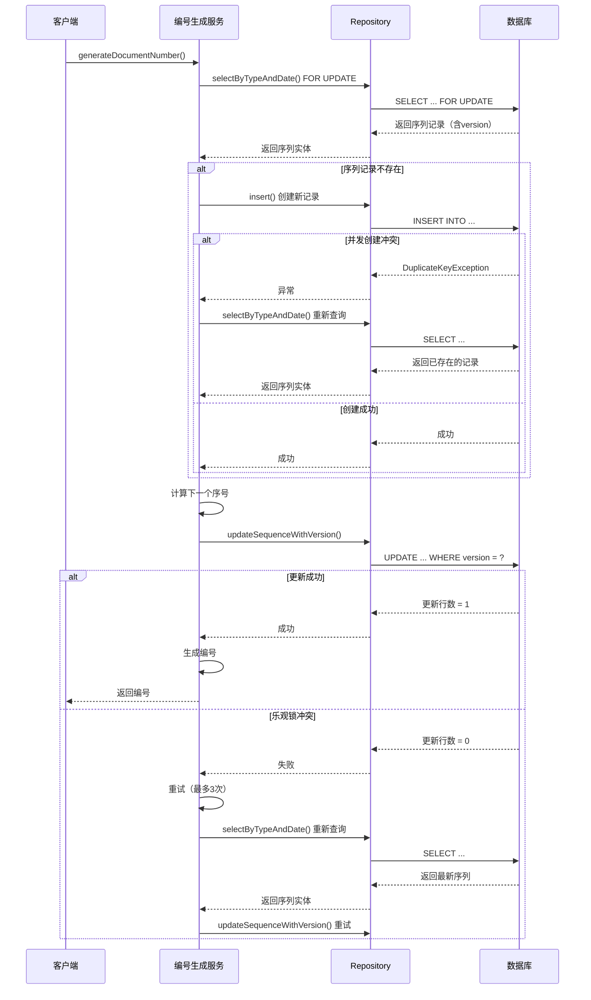
```mermaid
sequenceDiagram
    participant Client as 客户端
    participant Service as 编号生成服务
    participant Repo as Repository
    participant DB as 数据库

    Client->>Service: generateDocumentNumber()
    Service->>Repo: selectByTypeAndDate() FOR UPDATE
    Repo->>DB: SELECT ... FOR UPDATE
    DB-->>Repo: 返回序列记录（含version）
    Repo-->>Service: 返回序列实体
    
    alt 序列记录不存在
        Service->>Repo: insert() 创建新记录
        Repo->>DB: INSERT INTO ...
        alt 并发创建冲突
            DB-->>Repo: DuplicateKeyException
            Repo-->>Service: 异常
            Service->>Repo: selectByTypeAndDate() 重新查询
            Repo->>DB: SELECT ...
            DB-->>Repo: 返回已存在的记录
            Repo-->>Service: 返回序列实体
        else 创建成功
            DB-->>Repo: 成功
            Repo-->>Service: 成功
        end
    end
    
    Service->>Service: 计算下一个序号
    Service->>Repo: updateSequenceWithVersion()
    Repo->>DB: UPDATE ... WHERE version = ?
    alt 更新成功
        DB-->>Repo: 更新行数 = 1
        Repo-->>Service: 成功
        Service->>Service: 生成编号
        Service-->>Client: 返回编号
    else 乐观锁冲突
        DB-->>Repo: 更新行数 = 0
        Repo-->>Service: 失败
        Service->>Service: 重试（最多3次）
        Service->>Repo: selectByTypeAndDate() 重新查询
        Repo->>DB: SELECT ...
        DB-->>Repo: 返回最新序列
        Repo-->>Service: 返回序列实体
        Service->>Repo: updateSequenceWithVersion() 重试
    end
```

#### 8.5.3 使用SELECT FOR UPDATE的考虑

**方案1：使用SELECT FOR UPDATE（悲观锁）**
- 优点：简单直接，避免并发冲突
- 缺点：性能较差，可能造成锁等待

**方案2：使用乐观锁 + 重试（推荐）**
- 优点：性能好，并发度高
- 缺点：需要重试机制

**最终方案**：使用乐观锁 + 重试机制，在查询时使用 `SELECT FOR UPDATE` 确保读取最新数据，更新时使用乐观锁。

### 8.6 编号唯一性保证

#### 8.6.1 数据库层面

1. **唯一索引**：在业务单据表的 `order_number` 字段上建立唯一索引
2. **序列表唯一索引**：`document_number_sequence` 表的 `(document_type, date_str)` 唯一索引

#### 8.6.2 应用层面

1. **事务保护**：编号生成在事务中完成
2. **乐观锁**：使用version字段防止并发冲突
3. **重试机制**：乐观锁冲突时自动重试（最多3次）

#### 8.6.3 异常处理

```java
/**
 * 生成编号时的异常处理
 */
@Transactional(rollbackFor = Exception.class)
public String generateDocumentNumber(String documentType, String prefix, int sequenceLength) {
    try {
        // ... 生成逻辑
        return number;
    } catch (DuplicateKeyException e) {
        // 数据库唯一索引冲突（理论上不应该发生，因为使用了序列表）
        // 记录日志并抛出业务异常
        log.error("单据编号重复：{}", number, e);
        throw new BusinessException("单据编号生成失败，请稍后重试");
    } catch (ConcurrentModificationException e) {
        // 乐观锁冲突，已重试3次仍失败
        log.error("编号生成并发冲突：documentType={}", documentType, e);
        throw new BusinessException("编号生成失败，请稍后重试");
    }
}
```

### 8.7 编号生成服务使用示例

#### 8.7.1 采购入库单使用

```java
@Service
@RequiredArgsConstructor
public class PurchaseInServiceImpl implements PurchaseInService {
    
    private final DocumentNumberService documentNumberService;
    private final PurchaseInRepository purchaseInRepository;
    
    /**
     * 创建采购入库单
     */
    @Transactional(rollbackFor = Exception.class)
    @Override
    public Long createInboundOrder(AddPurchaseInRequest request) {
        // 1. 生成入库单号
        String orderNumber = documentNumberService.generatePurchaseInOrderNumber();
        
        // 2. 创建入库单实体
        PurchaseInOrderEntity entity = PurchaseInConvert.toEntity(request);
        entity.setOrderNumber(orderNumber);
        entity.setStatus(OrderStatusEnum.DRAFT.getCode());
        
        // 3. 保存入库单
        purchaseInRepository.insert(entity);
        
        return entity.getId();
    }
}
```

#### 8.7.2 调拨单使用

```java
@Service
@RequiredArgsConstructor
public class TransferOrderServiceImpl implements TransferOrderService {
    
    private final DocumentNumberService documentNumberService;
    
    @Transactional(rollbackFor = Exception.class)
    @Override
    public Long createTransferOrder(AddTransferOrderRequest request) {
        // 生成调拨单号
        String orderNumber = documentNumberService.generateTransferOrderNumber();
        
        // ... 其他逻辑
    }
}
```

### 8.8 性能优化

#### 8.8.1 缓存优化（可选）

对于高并发场景，可以使用Redis缓存当天的序列值：

```java
@Service
@RequiredArgsConstructor
public class DocumentNumberServiceImpl implements DocumentNumberService {
    
    private final DocumentNumberSequenceRepository sequenceRepository;
    private final RedisTemplate<String, String> redisTemplate;
    
    /**
     * 使用Redis缓存的编号生成（可选优化）
     */
    public String generateDocumentNumberWithCache(String documentType, String prefix, int sequenceLength) {
        String dateStr = LocalDate.now().format(DateTimeFormatter.ofPattern("yyyyMMdd"));
        String cacheKey = String.format("doc:seq:%s:%s", documentType, dateStr);
        
        // 1. 尝试从Redis获取序号
        Long sequence = redisTemplate.opsForValue().increment(cacheKey);
        
        // 2. 如果是第一次（sequence == 1），需要初始化数据库记录
        if (sequence == 1) {
            // 设置过期时间（当天23:59:59）
            LocalDateTime endOfDay = LocalDate.now().atTime(23, 59, 59);
            long expireSeconds = ChronoUnit.SECONDS.between(LocalDateTime.now(), endOfDay);
            redisTemplate.expire(cacheKey, expireSeconds, TimeUnit.SECONDS);
            
            // 初始化数据库记录
            initSequenceInDatabase(documentType, dateStr, sequenceLength);
        }
        
        // 3. 检查是否超过最大值
        int maxSequence = sequenceLength == 3 ? 999 : 9999;
        if (sequence > maxSequence) {
            throw new BusinessException("今日单据编号已达到最大值");
        }
        
        // 4. 生成编号
        String sequenceStr = String.format("%0" + sequenceLength + "d", sequence);
        return String.format("%s-%s-%s", prefix, dateStr, sequenceStr);
    }
    
    /**
     * 初始化数据库记录（幂等操作）
     */
    private void initSequenceInDatabase(String documentType, String dateStr, int sequenceLength) {
        try {
            DocumentNumberSequenceEntity entity = new DocumentNumberSequenceEntity();
            entity.setDocumentType(documentType);
            entity.setDateStr(dateStr);
            entity.setCurrentSequence(0);
            entity.setMaxSequence(sequenceLength == 3 ? 999 : 9999);
            sequenceRepository.insert(entity);
        } catch (DuplicateKeyException e) {
            // 并发初始化冲突，忽略（其他线程已初始化）
        }
    }
}
```

**注意**：Redis方案需要保证Redis的高可用性，否则可能丢失序号。建议使用数据库方案作为主要方案，Redis作为性能优化选项。

### 8.9 编号生成规则配置

#### 8.9.1 配置表设计（可选）

如果需要支持灵活的编号规则配置，可以设计配置表：

```sql
CREATE TABLE `document_number_rule` (
    `id` BIGINT(20) NOT NULL AUTO_INCREMENT COMMENT '主键ID',
    `document_type` VARCHAR(50) NOT NULL COMMENT '单据类型',
    `prefix` VARCHAR(20) NOT NULL COMMENT '编号前缀',
    `date_format` VARCHAR(20) NOT NULL DEFAULT 'yyyyMMdd' COMMENT '日期格式',
    `sequence_length` INT(11) NOT NULL DEFAULT 3 COMMENT '序号长度',
    `reset_type` VARCHAR(20) NOT NULL DEFAULT 'DAILY' COMMENT '重置类型：DAILY-每日重置，MONTHLY-每月重置，NEVER-不重置',
    `is_enabled` TINYINT(1) NOT NULL DEFAULT 1 COMMENT '是否启用',
    `create_time` DATETIME NOT NULL DEFAULT CURRENT_TIMESTAMP,
    `update_time` DATETIME NOT NULL DEFAULT CURRENT_TIMESTAMP ON UPDATE CURRENT_TIMESTAMP,
    PRIMARY KEY (`id`),
    UNIQUE KEY `uk_document_type` (`document_type`)
) ENGINE=InnoDB DEFAULT CHARSET=utf8mb4 COMMENT='单据编号规则配置表';
```

#### 8.9.2 初始化配置数据

```sql
INSERT INTO `document_number_rule` (`document_type`, `prefix`, `sequence_length`, `reset_type`) VALUES
('PURCHASE_IN', 'IN', 3, 'DAILY'),
('TRANSFER', 'TR', 3, 'DAILY'),
('SALES_OUT', 'ORD', 4, 'DAILY'),
('BATCH', 'BATCH', 3, 'DAILY'),
('UNIFIED_INBOUND', 'UIO', 3, 'DAILY'),
('UNIFIED_OUTBOUND', 'UOO', 3, 'DAILY');
```

### 8.10 编号生成服务测试

#### 8.10.1 单元测试

```java
@SpringBootTest
@Transactional
class DocumentNumberServiceTest {
    
    @Autowired
    private DocumentNumberService documentNumberService;
    
    /**
     * 测试：生成采购入库单号
     */
    @Test
    void testGeneratePurchaseInOrderNumber() {
        String number1 = documentNumberService.generatePurchaseInOrderNumber();
        String number2 = documentNumberService.generatePurchaseInOrderNumber();
        
        // 验证格式
        assertTrue(number1.matches("^IN-\\d{8}-\\d{3}$"));
        assertTrue(number2.matches("^IN-\\d{8}-\\d{3}$"));
        
        // 验证唯一性
        assertNotEquals(number1, number2);
        
        // 验证序号递增
        String seq1 = number1.substring(number1.lastIndexOf("-") + 1);
        String seq2 = number2.substring(number2.lastIndexOf("-") + 1);
        assertEquals(Integer.parseInt(seq2), Integer.parseInt(seq1) + 1);
    }
    
    /**
     * 测试：并发生成编号
     */
    @Test
    void testConcurrentGenerate() throws InterruptedException {
        int threadCount = 10;
        int generateCount = 100;
        Set<String> numbers = Collections.synchronizedSet(new HashSet<>());
        CountDownLatch latch = new CountDownLatch(threadCount);
        
        ExecutorService executor = Executors.newFixedThreadPool(threadCount);
        for (int i = 0; i < threadCount; i++) {
            executor.submit(() -> {
                try {
                    for (int j = 0; j < generateCount; j++) {
                        String number = documentNumberService.generatePurchaseInOrderNumber();
                        numbers.add(number);
                    }
                } finally {
                    latch.countDown();
                }
            });
        }
        
        latch.await(30, TimeUnit.SECONDS);
        executor.shutdown();
        
        // 验证所有编号都唯一
        assertEquals(threadCount * generateCount, numbers.size());
    }
}
```

### 8.11 关键设计要点

1. **唯一性保证**
   - 数据库唯一索引：业务单据表的 `order_number` 唯一索引
   - 序列表唯一索引：`(document_type, date_str)` 唯一索引
   - 乐观锁：防止并发冲突

2. **并发安全**
   - 使用乐观锁 + 重试机制
   - 查询时使用 `SELECT FOR UPDATE` 确保读取最新数据
   - 更新时使用 `version` 字段进行乐观锁控制

3. **可扩展性**
   - 支持新增单据类型（只需添加配置）
   - 支持不同的编号格式（通过配置表）

4. **可追溯性**
   - 序列表记录所有编号生成历史
   - 可以查询某一天生成了多少个编号

---

## 7. 并发处理方案

### 7.1 乐观锁机制

系统采用 **MySQL 乐观锁**机制，通过 `version` 字段实现并发控制，避免数据更新冲突。

### 7.2 核心原则

1. **版本号字段**：所有需要并发控制的表都包含 `version INT DEFAULT 0` 字段
2. **读取时获取版本**：更新前先读取当前记录的 `version` 值
3. **更新时校验版本**：更新时在 WHERE 条件中包含 `version = 旧版本号`
4. **更新后递增版本**：更新成功后 `version = version + 1`
5. **失败重试机制**：如果更新失败（影响行数为0），说明发生并发冲突，需要重试或抛出异常

### 7.3 并发场景分析

#### 7.3.1 采购入库并发场景

**场景**：多个用户同时提交采购入库单，更新同一商品的库存

**处理流程**：
```sql
-- 1. 读取当前库存和版本号
SELECT total_stock, allocatable_stock, version 
FROM inventory 
WHERE sku_id = ? AND warehouse_id = ? AND product_status = ?;

-- 2. 计算新库存值
new_total_stock = old_total_stock + inbound_quantity;
new_allocatable_stock = old_allocatable_stock + inbound_quantity;

-- 3. 更新库存（带版本校验）
UPDATE bill_inventory 
SET total_stock = ?,
    allocatable_stock = ?,
    version = version + 1
WHERE sku_id = ? 
  AND warehouse_id = ? 
  AND product_status = ?
  AND version = ?;  -- 关键：版本号校验

-- 4. 检查更新结果
IF ROW_COUNT() == 0 THEN
    -- 并发冲突，需要重试或抛出异常
    THROW ConcurrentModificationException
END IF
```

#### 7.3.2 调拨单并发场景

**场景**：调拨单审核出库时，同时扣减源仓库库存和增加目标仓库库存

**处理流程**：
```sql
BEGIN TRANSACTION;

-- 1. 扣减源仓库库存（带版本校验）
UPDATE bill_inventory 
SET total_stock = total_stock - ?,
    allocatable_stock = allocatable_stock - ?,
    version = version + 1
WHERE sku_id = ? 
  AND warehouse_id = ?  -- 源仓库
  AND product_status = ?
  AND version = ?
  AND allocatable_stock >= ?;  -- 库存充足性检查

IF ROW_COUNT() == 0 THEN
    ROLLBACK;
    THROW InsufficientStockException OR ConcurrentModificationException
END IF

-- 2. 增加目标仓库库存（带版本校验）
UPDATE bill_inventory 
SET total_stock = total_stock + ?,
    allocatable_stock = allocatable_stock + ?,
    version = version + 1
WHERE sku_id = ? 
  AND warehouse_id = ?  -- 目标仓库
  AND product_status = ?
  AND version = ?;

IF ROW_COUNT() == 0 THEN
    ROLLBACK;
    THROW ConcurrentModificationException
END IF

COMMIT;
```

#### 6.3.3 库存分配并发场景

**场景**：多个订单同时分配同一商品的库存

**处理流程**：
```sql
BEGIN TRANSACTION;

-- 1. 读取当前可分配库存和版本号
SELECT allocatable_stock, allocated_stock, version 
FROM inventory 
WHERE sku_id = ? AND warehouse_id = ? AND product_status = ?
FOR UPDATE;  -- 行锁，防止其他事务读取

-- 2. 检查可分配库存是否充足
IF allocatable_stock < allocate_quantity THEN
    ROLLBACK;
    THROW InsufficientStockException
END IF

-- 3. 更新库存（扣减可分配，增加已分配）
UPDATE bill_inventory 
SET allocatable_stock = allocatable_stock - ?,
    allocated_stock = allocated_stock + ?,
    version = version + 1
WHERE sku_id = ? 
  AND warehouse_id = ?
  AND product_status = ?
  AND version = ?
  AND allocatable_stock >= ?;  -- 双重检查

IF ROW_COUNT() == 0 THEN
    ROLLBACK;
    THROW ConcurrentModificationException OR InsufficientStockException
END IF

COMMIT;
```

#### 6.3.4 批次创建并发场景

**场景**：创建批次时，从多个入库单明细分配库存

**处理流程**：
```sql
BEGIN TRANSACTION;

-- 对每个入库单明细进行分配
FOR EACH inbound_order_item IN batch_items:
    -- 1. 读取入库单明细的可用数量和版本号
    SELECT available_quantity, version 
    FROM inbound_order_item 
    WHERE id = ?;
    
    -- 2. 检查可用数量是否充足
    IF available_quantity < allocate_quantity THEN
        ROLLBACK;
        THROW InsufficientStockException
    END IF
    
    -- 3. 扣减入库单明细的可用数量（带版本校验）
    UPDATE inbound_order_item 
    SET available_quantity = available_quantity - ?,
        version = version + 1
    WHERE id = ?
      AND version = ?
      AND available_quantity >= ?;
    
    IF ROW_COUNT() == 0 THEN
        ROLLBACK;
        THROW ConcurrentModificationException
    END IF
    
    -- 4. 创建批次入库明细记录
    INSERT INTO bill_batch_detail (...);
END FOR

-- 5. 创建批次主记录
INSERT INTO batch (...);

COMMIT;
```

#### 6.3.5 批次库存调整并发场景

**场景**：批次库存调整时，通过统一入库单/出库单更新库存

**处理流程**：
```sql
BEGIN TRANSACTION;

-- 1. 读取批次信息和版本号
SELECT total_quantity, version 
FROM bill_inventory_batch 
WHERE id = ?;

-- 2. 根据调整类型创建统一入库单或出库单
IF adjustment_type == 'INCREASE' THEN
    -- 创建统一入库单
    INSERT INTO unified_inbound_order (...);
    
    -- 更新批次库存（带版本校验）
    UPDATE bill_inventory_batch 
    SET total_quantity = total_quantity + ?,
        version = version + 1
    WHERE id = ?
      AND version = ?;
ELSE
    -- 创建统一出库单
    INSERT INTO unified_outbound_order (...);
    
    -- 更新批次库存（带版本校验）
    UPDATE bill_inventory_batch 
    SET total_quantity = total_quantity - ?,
        version = version + 1
    WHERE id = ?
      AND version = ?
      AND total_quantity >= ?;  -- 库存充足性检查
END IF

IF ROW_COUNT() == 0 THEN
    ROLLBACK;
    THROW ConcurrentModificationException OR InsufficientStockException
END IF

-- 3. 更新批次入库明细的当前可售余量
FOR EACH bill_batch_detail IN affected_details:
    UPDATE bill_batch_detail 
    SET current_available_quantity = current_available_quantity + ?,
        version = version + 1
    WHERE id = ?
      AND version = ?;
END FOR

-- 4. 通过统一入库单/出库单更新库存表
-- （调用统一的库存更新服务，带版本校验）

-- 5. 创建批次流水记录
INSERT INTO bill_inventory_batch_item (...);

COMMIT;
```

**关键点**：
1. 批次库存调整必须通过统一入库单/出库单处理，不能直接修改库存
2. 批次表和批次明细表都需要版本号控制
3. 库存更新通过统一的库存服务处理，保证一致性

### 6.4 代码实现示例

#### 6.4.1 Repository层实现

**Repository接口定义**：

```java
public interface InventoryRepository {
    
    /**
     * 根据ID查询库存
     */
    InventoryEntity selectById(Long id);
    
    /**
     * 根据SKU、仓库、产品状态查询库存
     */
    InventoryEntity selectBySkuAndWarehouse(InventoryQueryRequest request);
    
    /**
     * 查询库存列表
     */
    List<InventoryEntity> selectList(InventoryQueryRequest request);
    
    /**
     * 分页查询库存列表
     */
    IPage<InventoryEntity> selectPage(Page<InventoryEntity> page, InventoryQueryRequest request);
    
    /**
     * 插入库存
     */
    int insert(InventoryEntity entity);
    
    /**
     * 更新库存（带乐观锁）
     */
    int updateStockWithVersion(InventoryEntity entity);
    
    /**
     * 分配库存（带乐观锁）
     */
    int allocateStockWithVersion(InventoryEntity entity);
    
    /**
     * 检查库存是否存在
     */
    boolean existsBySkuAndWarehouse(InventoryQueryRequest request);
}
```

**Repository实现**：

```java
@Component
public class InventoryRepositoryImpl implements InventoryRepository {
    
    @Autowired
    private InventoryMapper mapper;
    
    @Override
    public InventoryEntity selectById(Long id) {
        return mapper.selectById(id);
    }
    
    @Override
    public InventoryEntity selectBySkuAndWarehouse(InventoryQueryRequest request) {
        LambdaQueryWrapper<InventoryEntity> wrapper = new LambdaQueryWrapper<>();
        wrapper.eq(InventoryEntity::getSkuCode, request.getSkuCode())
               .eq(InventoryEntity::getWarehouseId, request.getWarehouseId())
               .eq(InventoryEntity::getProductStatus, request.getProductStatus());
        return mapper.selectOne(wrapper);
    }
    
    @Override
    public List<InventoryEntity> selectList(InventoryQueryRequest request) {
        LambdaQueryWrapper<InventoryEntity> wrapper = buildQueryWrapper(request);
        return mapper.selectList(wrapper);
    }
    
    @Override
    public IPage<InventoryEntity> selectPage(Page<InventoryEntity> page, InventoryQueryRequest request) {
        LambdaQueryWrapper<InventoryEntity> wrapper = buildQueryWrapper(request);
        return mapper.selectPage(page, wrapper);
    }
    
    @Override
    public int insert(InventoryEntity entity) {
        return mapper.insert(entity);
    }
    
    /**
     * 更新库存（带乐观锁）
     * 通过Entity对象传递参数，包含version字段用于乐观锁控制
     */
    @Override
    public int updateStockWithVersion(InventoryEntity entity) {
        return mapper.updateStockWithVersion(entity);
    }
    
    /**
     * 分配库存（带乐观锁）
     * 通过Entity对象传递参数，包含version字段用于乐观锁控制
     */
    @Override
    public int allocateStockWithVersion(InventoryEntity entity) {
        return mapper.allocateStockWithVersion(entity);
    }
    
    @Override
    public boolean existsBySkuAndWarehouse(InventoryQueryRequest request) {
        LambdaQueryWrapper<InventoryEntity> wrapper = new LambdaQueryWrapper<>();
        wrapper.eq(InventoryEntity::getSkuCode, request.getSkuCode())
               .eq(InventoryEntity::getWarehouseId, request.getWarehouseId())
               .eq(InventoryEntity::getProductStatus, request.getProductStatus());
        if (request.getExcludeId() != null) {
            wrapper.ne(InventoryEntity::getId, request.getExcludeId());
        }
        return mapper.selectCount(wrapper) > 0;
    }
    
    /**
     * 构建查询条件
     */
    private LambdaQueryWrapper<InventoryEntity> buildQueryWrapper(InventoryQueryRequest request) {
        LambdaQueryWrapper<InventoryEntity> wrapper = new LambdaQueryWrapper<>();
        
        if (request == null) {
            wrapper.orderByDesc(InventoryEntity::getCreateTime);
            return wrapper;
        }
        
        // SKU编码查询
        if (StringUtils.hasText(request.getSkuCode())) {
            wrapper.eq(InventoryEntity::getSkuCode, request.getSkuCode());
        }
        
        // 仓库ID查询
        if (request.getWarehouseId() != null) {
            wrapper.eq(InventoryEntity::getWarehouseId, request.getWarehouseId());
        }
        
        // 产品状态查询
        if (StringUtils.hasText(request.getProductStatus())) {
            wrapper.eq(InventoryEntity::getProductStatus, request.getProductStatus());
        }
        
        // 商品ID查询
        if (request.getProductId() != null) {
            wrapper.eq(InventoryEntity::getProductId, request.getProductId());
        }
        
        // 可分配库存范围查询
        if (request.getMinAllocatableStock() != null) {
            wrapper.ge(InventoryEntity::getAllocatableStock, request.getMinAllocatableStock());
        }
        
        // 排序
        if (StringUtils.hasText(request.getOrderBy())) {
            if ("ASC".equalsIgnoreCase(request.getOrderType())) {
                wrapper.orderByAsc(getOrderByField(request.getOrderBy()));
            } else {
                wrapper.orderByDesc(getOrderByField(request.getOrderBy()));
            }
        } else {
            wrapper.orderByDesc(InventoryEntity::getCreateTime);
        }
        
        return wrapper;
    }
    
    /**
     * 获取排序字段
     */
    private SFunction<InventoryEntity, ?> getOrderByField(String orderBy) {
        switch (orderBy) {
            case "totalStock":
                return InventoryEntity::getTotalStock;
            case "allocatableStock":
                return InventoryEntity::getAllocatableStock;
            case "skuCode":
                return InventoryEntity::getSkuCode;
            case "createTime":
            default:
                return InventoryEntity::getCreateTime;
        }
    }
}
```

**InventoryQueryRequest 对象定义**：

```java
@Data
public class InventoryQueryRequest {
    /**
     * SKU编码
     */
    private String skuCode;
    
    /**
     * 仓库ID
     */
    private Long warehouseId;
    
    /**
     * 产品状态
     */
    private String productStatus;
    
    /**
     * 商品ID
     */
    private Long productId;
    
    /**
     * 最小可分配库存
     */
    private Integer minAllocatableStock;
    
    /**
     * 排除的ID（用于存在性检查）
     */
    private Long excludeId;
    
    /**
     * 排序字段
     */
    private String orderBy;
    
    /**
     * 排序类型：ASC/DESC
     */
    private String orderType;
}
```

#### 6.4.2 Mapper XML实现

```xml
<!-- 更新库存（带乐观锁） -->
<!-- 使用Entity对象传递参数，通过changeQuantity字段传递变动数量 -->
<update id="updateStockWithVersion">
    UPDATE bill_inventory
    SET total_stock = total_stock + #{changeQuantity},
        allocatable_stock = allocatable_stock + #{changeQuantity},
        version = version + 1,
        update_time = NOW()
    WHERE sku_id = #{skuId}
      AND warehouse_id = #{warehouseId}
      AND product_status = #{productStatus}
      AND version = #{version}
</update>

<!-- 分配库存（带乐观锁） -->
<!-- 使用Entity对象传递参数，通过allocateQuantity字段传递分配数量 -->
<update id="allocateStockWithVersion">
    UPDATE bill_inventory
    SET allocatable_stock = allocatable_stock - #{allocateQuantity},
        allocated_stock = allocated_stock + #{allocateQuantity},
        version = version + 1,
        update_time = NOW()
    WHERE sku_id = #{skuId}
      AND warehouse_id = #{warehouseId}
      AND product_status = #{productStatus}
      AND version = #{version}
      AND allocatable_stock >= #{allocateQuantity}
</update>
```

**注意**：Entity对象需要包含以下字段用于更新操作：
- `skuCode`: SKU编码
- `warehouseId`: 仓库ID
- `productStatus`: 产品状态
- `version`: 旧版本号（用于乐观锁）
- `changeQuantity`: 变动数量（更新库存时使用）
- `allocateQuantity`: 分配数量（分配库存时使用）

#### 6.4.3 Service层实现

```java
@Service
@RequiredArgsConstructor
public class InventoryServiceImpl implements InventoryService {
    
    private final InventoryRepository inventoryRepository;
    private final InventoryItemRepository inventoryItemRepository;
    
    /**
     * 增加库存（采购入库）
     */
    @Override
    public void increaseStock(IncreaseStockRequest request) {
        // 1. 构建查询请求对象
        InventoryQueryRequest queryRequest = new InventoryQueryRequest();
        queryRequest.setSkuCode(request.getSkuCode());
        queryRequest.setWarehouseId(request.getWarehouseId());
        queryRequest.setProductStatus(request.getProductStatus());
        
        // 2. 读取当前库存
        InventoryEntity inventory = inventoryRepository.selectBySkuAndWarehouse(queryRequest);
        
        if (inventory == null) {
            // 创建新库存记录
            inventory = createNewInventory(request);
        }
        
        int oldVersion = inventory.getVersion();
        int newTotalStock = inventory.getTotalStock() + request.getQuantity();
        int newAllocatableStock = inventory.getAllocatableStock() + request.getQuantity();
        
        // 3. 构建更新实体对象（传对象而非多个参数）
        InventoryEntity updateEntity = new InventoryEntity();
        updateEntity.setSkuCode(request.getSkuCode());
        updateEntity.setWarehouseId(request.getWarehouseId());
        updateEntity.setProductStatus(request.getProductStatus());
        updateEntity.setVersion(oldVersion); // 旧版本号，用于乐观锁
        updateEntity.setChangeQuantity(request.getQuantity()); // 变动数量
        
        // 4. 更新库存（带版本校验）
        int updateCount = inventoryRepository.updateStockWithVersion(updateEntity);
        
        if (updateCount == 0) {
            // 并发冲突，抛出异常或重试
            throw new ConcurrentModificationException("库存更新失败，请重试");
        }
        
        // 5. 创建流水记录
        createItemLog(request, newTotalStock, "PURCHASE_IN");
    }
    
    /**
     * 分配库存
     */
    @Override
    public void allocateStock(AllocateStockRequest request) {
        int maxRetries = 3;
        int retryCount = 0;
        
        while (retryCount < maxRetries) {
            try {
                // 1. 构建查询请求对象
                InventoryQueryRequest queryRequest = new InventoryQueryRequest();
                queryRequest.setSkuCode(request.getSkuCode());
                queryRequest.setWarehouseId(request.getWarehouseId());
                queryRequest.setProductStatus(request.getProductStatus());
                
                // 2. 读取当前库存
                InventoryEntity inventory = inventoryRepository.selectBySkuAndWarehouse(queryRequest);
                
                if (inventory == null || inventory.getAllocatableStock() < request.getQuantity()) {
                    throw new InsufficientStockException("可分配库存不足");
                }
                
                int oldVersion = inventory.getVersion();
                
                // 3. 构建更新实体对象（传对象而非多个参数）
                InventoryEntity updateEntity = new InventoryEntity();
                updateEntity.setSkuCode(request.getSkuCode());
                updateEntity.setWarehouseId(request.getWarehouseId());
                updateEntity.setProductStatus(request.getProductStatus());
                updateEntity.setVersion(oldVersion); // 旧版本号，用于乐观锁
                updateEntity.setAllocateQuantity(request.getQuantity()); // 分配数量
                
                // 4. 分配库存（带版本校验）
                int updateCount = inventoryRepository.allocateStockWithVersion(updateEntity);
                
                if (updateCount > 0) {
                    // 成功，创建流水记录
                    createItemLog(request, inventory.getTotalStock(), "ALLOCATE");
                    return;
                } else {
                    // 并发冲突，重试
                    retryCount++;
                    if (retryCount >= maxRetries) {
                        throw new ConcurrentModificationException("库存分配失败，请重试");
                    }
                    // 短暂等待后重试
                    Thread.sleep(50 * retryCount);
                }
            } catch (InsufficientStockException e) {
                throw e;
            } catch (Exception e) {
                if (retryCount >= maxRetries) {
                    throw new BusinessException("库存分配失败", e);
                }
                retryCount++;
            }
        }
    }
}
```

### 6.5 Repository层设计原则

参考 `BrandRepositoryImpl` 的实现方式，Repository层应遵循以下原则：

1. **更新操作传对象**：
   - ✅ 使用 `updateById(Entity entity)` 方式，传递完整的Entity对象
   - ✅ Entity对象包含version字段，用于乐观锁控制
   - ✅ 避免直接传递多个参数（如 `updateStockWithVersion(String skuCode, Long warehouseId, ...)`）

2. **查询操作传请求对象**：
   - ✅ 使用 `selectList(QueryRequest request)` 方式，传递查询请求对象
   - ✅ 查询条件通过 `buildQueryWrapper` 方法构建
   - ✅ 避免直接传递多个查询参数

3. **可扩展性优势**：
   - 新增字段时只需修改Entity或Request对象，无需修改方法签名
   - 代码更清晰，参数语义更明确
   - 便于维护和扩展

**示例对比**：

❌ **不推荐**（直接传多个参数）：
```java
public int updateStockWithVersion(String skuCode, Long warehouseId, 
                                  String productStatus, 
                                  Integer changeQuantity, 
                                  Integer oldVersion);
```

✅ **推荐**（传对象）：
```java
public int updateStockWithVersion(InventoryEntity entity);
// Entity包含：skuCode, warehouseId, productStatus, version, changeQuantity等字段
```

### 6.6 重试策略

1. **重试次数**：建议最多重试 3 次
2. **重试间隔**：指数退避策略（50ms, 100ms, 200ms）
3. **失败处理**：超过重试次数后抛出异常，由上层处理

---

## 8. 代码设计规范

> **注意**：前端API接口文档已单独提取，详见 [前端API接口文档](./前端API接口文档.md)

### 8.1 设计模式应用

库存管理系统通过合理应用设计模式，实现了业务层与库存层的解耦，提高了系统的可扩展性和可维护性。

#### 8.1.1 核心问题

**问题**：销售出库单、采购入库单、调拨单等业务单据都需要操作库存，如果直接依赖库存层，会导致：
- 业务层与库存层强耦合
- 新增业务单据类型需要修改库存层代码
- 库存逻辑变更影响所有业务单据

**解决方案**：通过设计模式实现解耦，让业务层和库存层都依赖抽象层。

**数据库与代码分层**：数据库层不建统一单据表（详见 [数据库设计](./数据库设计.md)）；代码层通过「统一入库/出库上下文」驱动库存更新与流水记录，在更新库存和库存明细时，将采购入库单、调拨单、销售出库单等统一转化为入库/出库逻辑，由同一套库存服务处理。新增业务单据时，通过下文扩展性设计接入，无需修改库存核心逻辑。

#### 8.1.2 适配器模式 (Adapter Pattern)

**定义**：将一个类的接口转换成客户希望的另一个接口，使原本不兼容的类可以一起工作。

**在库存系统中的应用**：
- **适配器**：统一入库单/出库单
- **被适配者**：各种业务单据（采购入库单、调拨单、销售出库单等）
- **目标接口**：统一库存更新接口

**类图设计**：

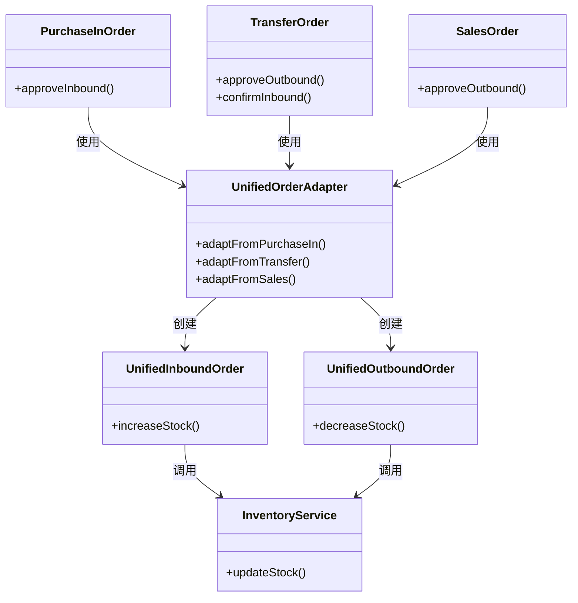
```mermaid
classDiagram
    class PurchaseInOrder {
        +approveInbound()
    }
    class TransferOrder {
        +approveOutbound()
        +confirmInbound()
    }
    class SalesOrder {
        +approveOutbound()
    }
    
    class UnifiedInboundOrder {
        +increaseStock()
    }
    class UnifiedOutboundOrder {
        +decreaseStock()
    }
    
    class UnifiedOrderAdapter {
        +adaptFromPurchaseIn()
        +adaptFromTransfer()
        +adaptFromSales()
    }
    
    class InventoryService {
        +updateStock()
    }
    
    PurchaseInOrder --> UnifiedOrderAdapter : 使用
    TransferOrder --> UnifiedOrderAdapter : 使用
    SalesOrder --> UnifiedOrderAdapter : 使用
    UnifiedOrderAdapter --> UnifiedInboundOrder : 创建
    UnifiedOrderAdapter --> UnifiedOutboundOrder : 创建
    UnifiedInboundOrder --> InventoryService : 调用
    UnifiedOutboundOrder --> InventoryService : 调用
```

**代码实现**：

```java
/**
 * 统一订单适配器
 * 将各种业务单据适配为统一入库单/出库单
 */
public class UnifiedOrderAdapter {
    
    /**
     * 将采购入库单适配为统一入库单
     */
    public UnifiedInboundOrder adaptFromPurchaseIn(PurchaseInOrder order) {
        UnifiedInboundOrder unifiedOrder = new UnifiedInboundOrder();
        unifiedOrder.setSourceDocumentType("PURCHASE_IN");
        unifiedOrder.setSourceDocumentId(order.getOrderNumber());
        unifiedOrder.setWarehouseId(order.getTargetWarehouseId());
        // ... 其他属性映射
        return unifiedOrder;
    }
    
    /**
     * 将调拨单适配为统一出库单（源仓库）
     */
    public UnifiedOutboundOrder adaptFromTransferOutbound(TransferOrder order) {
        UnifiedOutboundOrder unifiedOrder = new UnifiedOutboundOrder();
        unifiedOrder.setSourceDocumentType("TRANSFER_OUT");
        unifiedOrder.setSourceDocumentId(order.getOrderNumber());
        unifiedOrder.setWarehouseId(order.getSourceWarehouseId());
        // ... 其他属性映射
        return unifiedOrder;
    }
    
    /**
     * 将调拨单适配为统一入库单（目标仓库）
     */
    public UnifiedInboundOrder adaptFromTransferInbound(TransferOrder order) {
        UnifiedInboundOrder unifiedOrder = new UnifiedInboundOrder();
        unifiedOrder.setSourceDocumentType("TRANSFER_IN");
        unifiedOrder.setSourceDocumentId(order.getOrderNumber());
        unifiedOrder.setWarehouseId(order.getDestinationWarehouseId());
        // ... 其他属性映射
        return unifiedOrder;
    }
    
    /**
     * 将销售出库单适配为统一出库单
     */
    public UnifiedOutboundOrder adaptFromSales(SalesOrder order) {
        UnifiedOutboundOrder unifiedOrder = new UnifiedOutboundOrder();
        unifiedOrder.setSourceDocumentType("SALES_OUT");
        unifiedOrder.setSourceDocumentId(order.getOrderNumber());
        unifiedOrder.setWarehouseId(order.getWarehouseId());
        // ... 其他属性映射
        return unifiedOrder;
    }
}
```

**优势**：
- ✅ **解耦**：业务单据不直接依赖库存服务
- ✅ **扩展性**：新增业务单据只需实现适配逻辑
- ✅ **统一性**：所有库存操作都通过统一接口

#### 8.1.3 门面模式 (Facade Pattern)

**定义**：为子系统中的一组接口提供一个统一的入口，定义了一个高层接口，使得子系统更容易使用。

**在库存系统中的应用**：
- **门面**：`InventoryUnifiedService`
- **子系统**：库存更新、库存查询、库存流水记录等复杂操作
- **客户端**：业务单据服务

**类图设计**：

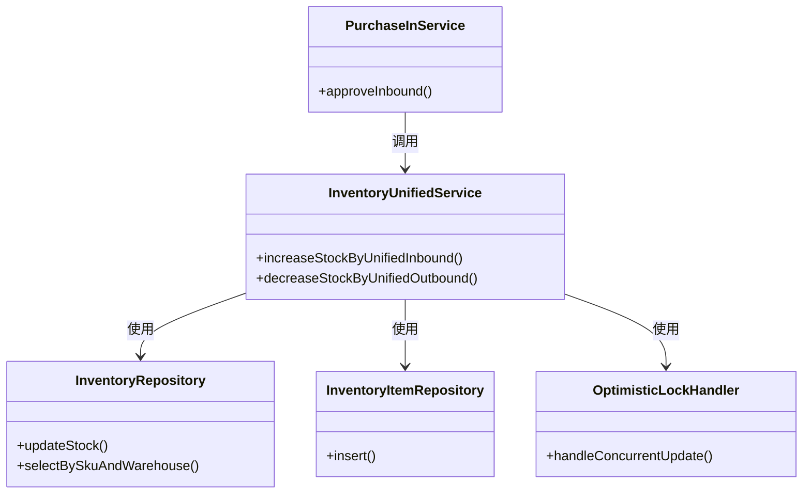
```mermaid
classDiagram
    class InventoryUnifiedService {
        +increaseStockByUnifiedInbound()
        +decreaseStockByUnifiedOutbound()
    }
    
    class InventoryRepository {
        +updateStock()
        +selectBySkuAndWarehouse()
    }
    
    class InventoryItemRepository {
        +insert()
    }
    
    class OptimisticLockHandler {
        +handleConcurrentUpdate()
    }
    
    class PurchaseInService {
        +approveInbound()
    }
    
    InventoryUnifiedService --> InventoryRepository : 使用
    InventoryUnifiedService --> InventoryItemRepository : 使用
    InventoryUnifiedService --> OptimisticLockHandler : 使用
    PurchaseInService --> InventoryUnifiedService : 调用
```

**代码实现**：

```java
/**
 * 统一库存服务（门面）
 * 为业务层提供简化的库存操作接口，隐藏库存更新的复杂性
 */
@Service
public class InventoryUnifiedService {
    
    private final InventoryRepository inventoryRepository;
    private final InventoryItemRepository inventoryItemRepository;
    private final OptimisticLockHandler lockHandler;
    
    /**
     * 通过统一入库单增加库存
     * 门面方法：封装了库存更新、流水记录、并发控制等复杂逻辑
     */
    @Transactional(rollbackFor = Exception.class)
    public void increaseStockByUnifiedInbound(Long unifiedInboundOrderId) {
        // 1. 查询统一入库单
        UnifiedInboundOrderEntity order = getUnifiedInboundOrder(unifiedInboundOrderId);
        List<UnifiedInboundOrderItemEntity> items = getUnifiedInboundOrderItems(unifiedInboundOrderId);
        
        // 2. 对每个明细项更新库存（隐藏了乐观锁、流水记录等复杂性）
        for (UnifiedInboundOrderItemEntity item : items) {
            // 内部处理：查询库存、乐观锁更新、记录流水等
            updateInventoryWithItemLog(item, order, true);
        }
    }
    
    /**
     * 通过统一出库单减少库存
     * 门面方法：封装了库存验证、扣减、流水记录等复杂逻辑
     */
    @Transactional(rollbackFor = Exception.class)
    public void decreaseStockByUnifiedOutbound(Long unifiedOutboundOrderId) {
        // 1. 查询统一出库单
        UnifiedOutboundOrderEntity order = getUnifiedOutboundOrder(unifiedOutboundOrderId);
        List<UnifiedOutboundOrderItemEntity> items = getUnifiedOutboundOrderItems(unifiedOutboundOrderId);
        
        // 2. 对每个明细项更新库存（隐藏了库存验证、乐观锁、流水记录等复杂性）
        for (UnifiedOutboundOrderItemEntity item : items) {
            // 内部处理：验证库存、乐观锁更新、记录流水等
            updateInventoryWithItemLog(item, order, false);
        }
    }
    
    /**
     * 内部方法：更新库存并记录流水（隐藏复杂性）
     */
    private void updateInventoryWithItemLog(
            UnifiedOrderItemEntity item, 
            UnifiedOrderEntity order, 
            boolean isIncrease) {
        
        // 1. 查询当前库存
        InventoryEntity inventory = inventoryRepository.selectBySkuAndWarehouse(...);
        
        // 2. 验证库存（出库时需要）
        if (!isIncrease && inventory.getTotalStock() < item.getQuantity()) {
            throw new InsufficientStockException("库存不足");
        }
        
        // 3. 乐观锁更新库存
        lockHandler.updateWithOptimisticLock(inventory, item.getQuantity(), isIncrease);
        
        // 4. 记录库存流水
        inventoryItemRepository.insert(createItemLog(item, order, isIncrease));
    }
}
```

**优势**：
- ✅ **简化接口**：业务层只需调用简单的方法，不需要了解内部复杂性
- ✅ **封装变化**：库存更新逻辑的变化不影响业务层
- ✅ **统一处理**：所有库存操作都经过统一的验证、更新、记录流程

#### 8.1.4 策略模式 (Strategy Pattern)

**定义**：定义一系列算法，把它们封装起来，并且使它们可以相互替换。

**在库存系统中的应用**：
- **策略接口**：`InventoryDeductionStrategy`
- **具体策略**：`FIFODeductionStrategy`（FIFO扣减）、`LIFODeductionStrategy`（LIFO扣减，未来扩展）
- **上下文**：`SalesOutboundService`

**类图设计**：

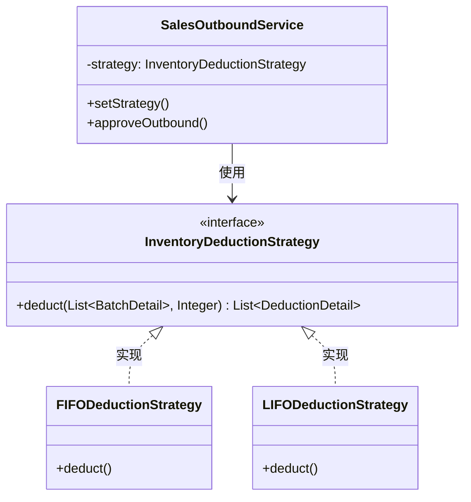
```mermaid
classDiagram
    class InventoryDeductionStrategy {
        <<interface>>
        +deduct(List~BatchDetail~, Integer) List~DeductionDetail~
    }
    
    class FIFODeductionStrategy {
        +deduct()
    }
    
    class LIFODeductionStrategy {
        +deduct()
    }
    
    class SalesOutboundService {
        -strategy: InventoryDeductionStrategy
        +setStrategy()
        +approveOutbound()
    }
    
    InventoryDeductionStrategy <|.. FIFODeductionStrategy : 实现
    InventoryDeductionStrategy <|.. LIFODeductionStrategy : 实现
    SalesOutboundService --> InventoryDeductionStrategy : 使用
```

**代码实现**：

```java
/**
 * 库存扣减策略接口
 */
public interface InventoryDeductionStrategy {
    
    /**
     * 扣减批次库存
     * @param batchDetails 批次入库明细列表（已排序）
     * @param quantity 需要扣减的数量
     * @return 扣减明细列表
     */
    List<BatchDeductionDetail> deduct(
        List<BatchInboundDetailEntity> batchDetails, 
        Integer quantity
    );
}

/**
 * FIFO扣减策略（当前使用）
 */
@Component
public class FIFODeductionStrategy implements InventoryDeductionStrategy {
    
    @Override
    public List<BatchDeductionDetail> deduct(
            List<BatchInboundDetailEntity> batchDetails, 
            Integer quantity) {
        
        // 按入库日期排序（FIFO：最早入库的在前）
        batchDetails.sort(Comparator.comparing(BatchInboundDetailEntity::getInboundDate));
        
        List<BatchDeductionDetail> deductionDetails = new ArrayList<>();
        int remainingQuantity = quantity;
        
        // 按顺序扣减
        for (BatchInboundDetailEntity detail : batchDetails) {
            if (remainingQuantity <= 0) {
                break;
            }
            
            int deductQuantity = Math.min(remainingQuantity, detail.getCurrentAvailableQuantity());
            // 执行扣减操作...
            deductionDetails.add(createDeductionDetail(detail, deductQuantity));
            remainingQuantity -= deductQuantity;
        }
        
        return deductionDetails;
    }
}

/**
 * LIFO扣减策略（未来扩展）
 */
@Component
public class LIFODeductionStrategy implements InventoryDeductionStrategy {
    
    @Override
    public List<BatchDeductionDetail> deduct(
            List<BatchInboundDetailEntity> batchDetails, 
            Integer quantity) {
        
        // 按入库日期倒序排序（LIFO：最晚入库的在前）
        batchDetails.sort(Comparator.comparing(BatchInboundDetailEntity::getInboundDate).reversed());
        
        // ... 扣减逻辑
        return deductionDetails;
    }
}

/**
 * 销售出库服务（使用策略模式）
 */
@Service
@RequiredArgsConstructor
public class SalesOutboundServiceImpl implements SalesOutboundService {
    
    private final InventoryDeductionStrategy deductionStrategy; // 注入策略（默认FIFO）
    
    /**
     * 审核出库：使用策略模式扣减库存
     */
    @Transactional(rollbackFor = Exception.class)
    @Override
    public void approveOutbound(Long salesOrderId) {
        SalesOrderEntity salesOrder = salesOutboundRepository.selectById(salesOrderId);
        List<SalesOrderItemEntity> items = salesOutboundRepository.selectItemsByOrderId(salesOrderId);
        
        for (SalesOrderItemEntity item : items) {
            // 查询批次明细
            List<BatchInboundDetailEntity> batchDetails = 
                batchRepository.selectAvailableInboundDetailsBySkuAndWarehouse(
                    item.getSkuCode(), 
                    salesOrder.getWarehouseId()
                );
            
            // 使用策略扣减库存（可替换策略）
            List<BatchDeductionDetail> deductions = 
                deductionStrategy.deduct(batchDetails, item.getQuantity());
            
            // 记录批次流水
            recordBatchDeductionItemLog(salesOrder.getOrderNumber(), deductions);
        }
        
        // ... 其他逻辑
    }
}
```

**优势**：
- ✅ **可扩展性**：可以轻松添加新的扣减策略（LIFO、平均成本等）
- ✅ **可替换性**：可以在运行时切换策略
- ✅ **单一职责**：每个策略只负责一种扣减算法

#### 8.1.5 模板方法模式 (Template Method Pattern)

**定义**：定义一个操作中算法的骨架，而将一些步骤延迟到子类中。模板方法使得子类可以不改变一个算法的结构即可重定义该算法的某些特定步骤。

**在库存系统中的应用**：
- **抽象模板**：`AbstractInventoryUpdateTemplate`
- **具体实现**：`PurchaseInboundUpdateTemplate`、`SalesOutboundUpdateTemplate`等

**代码实现**：

```java
/**
 * 库存更新模板（抽象类）
 * 定义库存更新的算法骨架
 */
public abstract class AbstractInventoryUpdateTemplate {
    
    /**
     * 模板方法：定义库存更新的流程
     */
    public final void updateInventory(UnifiedOrderEntity order) {
        // 1. 验证（由子类实现）
        validate(order);
        
        // 2. 查询库存（通用逻辑）
        InventoryEntity inventory = queryInventory(order);
        
        // 3. 更新库存（由子类实现具体逻辑）
        updateStock(inventory, order);
        
        // 4. 记录流水（通用逻辑）
        recordItemLog(inventory, order);
        
        // 5. 后置处理（由子类实现）
        postProcess(order);
    }
    
    /**
     * 验证（由子类实现）
     */
    protected abstract void validate(UnifiedOrderEntity order);
    
    /**
     * 更新库存（由子类实现）
     */
    protected abstract void updateStock(InventoryEntity inventory, UnifiedOrderEntity order);
    
    /**
     * 后置处理（由子类实现）
     */
    protected void postProcess(UnifiedOrderEntity order) {
        // 默认空实现，子类可重写
    }
    
    /**
     * 查询库存（通用逻辑）
     */
    private InventoryEntity queryInventory(UnifiedOrderEntity order) {
        // 通用查询逻辑
        return inventoryRepository.selectBySkuAndWarehouse(...);
    }
    
    /**
     * 记录流水（通用逻辑）
     */
    private void recordItemLog(InventoryEntity inventory, UnifiedOrderEntity order) {
        // 通用流水记录逻辑
        inventoryItemRepository.insert(...);
    }
}

/**
 * 采购入库更新模板（具体实现）
 */
@Component
public class PurchaseInboundUpdateTemplate extends AbstractInventoryUpdateTemplate {
    
    @Override
    protected void validate(UnifiedOrderEntity order) {
        // 采购入库的验证逻辑
    }
    
    @Override
    protected void updateStock(InventoryEntity inventory, UnifiedOrderEntity order) {
        // 采购入库的更新逻辑（增加库存）
        inventoryRepository.increaseStock(inventory, order.getQuantity());
    }
}

/**
 * 销售出库更新模板（具体实现）
 */
@Component
public class SalesOutboundUpdateTemplate extends AbstractInventoryUpdateTemplate {
    
    @Override
    protected void validate(UnifiedOrderEntity order) {
        // 销售出库的验证逻辑（检查库存是否充足）
        if (inventory.getTotalStock() < order.getQuantity()) {
            throw new InsufficientStockException("库存不足");
        }
    }
    
    @Override
    protected void updateStock(InventoryEntity inventory, UnifiedOrderEntity order) {
        // 销售出库的更新逻辑（减少库存）
        inventoryRepository.decreaseStock(inventory, order.getQuantity());
    }
    
    @Override
    protected void postProcess(UnifiedOrderEntity order) {
        // 销售出库的后置处理（如通知发货等）
    }
}
```

**优势**：
- ✅ **代码复用**：通用逻辑在模板中实现，避免重复
- ✅ **扩展性**：新增业务类型只需实现抽象方法
- ✅ **一致性**：所有库存更新都遵循相同的流程

#### 8.1.6 观察者模式 (Observer Pattern)

**定义**：定义对象间的一种一对多的依赖关系，当一个对象的状态发生改变时，所有依赖于它的对象都得到通知并被自动更新。

**在库存系统中的应用**：
- **主题**：`InventoryChangeEvent`
- **观察者**：`InventoryAlertListener`（库存预警）、`InventoryCostListener`（成本核算）等

**代码实现**：

```java
/**
 * 库存变更事件
 */
@Data
public class InventoryChangeEvent {
    private String skuCode;
    private Long warehouseId;
    private Integer changeQuantity;
    private Integer totalStockAfterChange;
    private String businessType;
    private String relatedDocumentId;
    private LocalDateTime changeTime;
}

/**
 * 库存变更监听器接口
 */
public interface InventoryChangeListener {
    void onInventoryChanged(InventoryChangeEvent event);
}

/**
 * 库存预警监听器
 */
@Component
public class InventoryAlertListener implements InventoryChangeListener {
    
    @Override
    public void onInventoryChanged(InventoryChangeEvent event) {
        // 检查是否低于安全库存
        if (event.getTotalStockAfterChange() < getSafetyStock(event.getSkuCode())) {
            sendAlert(event);
        }
    }
    
    private void sendAlert(InventoryChangeEvent event) {
        // 发送预警通知
    }
}

/**
 * 成本核算监听器
 */
@Component
public class InventoryCostListener implements InventoryChangeListener {
    
    @Override
    public void onInventoryChanged(InventoryChangeEvent event) {
        // 更新成本核算数据
        updateCostAccounting(event);
    }
}

/**
 * 库存变更事件发布器
 */
@Service
public class InventoryChangeEventPublisher {
    
    private final List<InventoryChangeListener> listeners;
    
    public InventoryChangeEventPublisher(List<InventoryChangeListener> listeners) {
        this.listeners = listeners;
    }
    
    /**
     * 发布库存变更事件
     */
    public void publish(InventoryChangeEvent event) {
        for (InventoryChangeListener listener : listeners) {
            listener.onInventoryChanged(event);
        }
    }
}

/**
 * 统一库存服务（发布事件）
 */
@Service
public class InventoryUnifiedService {
    
    private final InventoryChangeEventPublisher eventPublisher;
    
    public void increaseStockByUnifiedInbound(Long unifiedInboundOrderId) {
        // ... 更新库存逻辑
        
        // 发布库存变更事件
        InventoryChangeEvent event = new InventoryChangeEvent();
        event.setSkuCode(item.getSkuCode());
        event.setChangeQuantity(item.getQuantity());
        event.setTotalStockAfterChange(updatedInventory.getTotalStock());
        event.setBusinessType("PURCHASE_IN");
        eventPublisher.publish(event);
    }
}
```

**优势**：
- ✅ **解耦**：库存更新逻辑与后续处理逻辑解耦
- ✅ **扩展性**：可以轻松添加新的监听器
- ✅ **灵活性**：监听器可以动态添加和移除

#### 8.1.7 设计模式组合应用

销售出库单通过多种设计模式的组合，实现了与库存层的完全解耦：

```mermaid
flowchart LR
    subgraph Business["业务"]
        A[销售出库单]
    end
    
    subgraph Adapter["适配器"]
        B[统一出库单转换]
    end
    
    subgraph Facade["门面"]
        C[统一库存服务]
    end
    
    subgraph Strategy["策略"]
        D[FIFO扣减]
    end
    
    subgraph Template["模板"]
        E[更新模板]
    end
    
    subgraph Observer["观察者"]
        F[事件发布]
    end
    
    subgraph Inventory["库存"]
        G[库存表/流水]
    end
    
    A --> B --> C --> D --> E --> F --> G
    
    style Business fill:#fff9c4
    style Adapter fill:#e1f5ff
    style Facade fill:#e8f5e9
    style Strategy fill:#fff3e0
    style Template fill:#f3e5f5
    style Observer fill:#e0f2f1
    style Inventory fill:#c8e6c9
```

**设计层次**：
1. **适配器层**：将销售出库单适配为统一出库单
2. **门面层**：提供简化的库存操作接口
3. **策略层**：可替换的扣减算法
4. **模板层**：统一的更新流程
5. **观察者层**：解耦的后续处理

**优势总结**：
- ✅ **完全解耦**：销售出库单不直接依赖库存层
- ✅ **易于扩展**：新增业务类型或扣减策略都很容易
- ✅ **易于测试**：每一层都可以独立测试
- ✅ **易于维护**：修改库存逻辑不影响业务层

#### 8.1.8 新增业务单据类型的扩展方式

在保持「数据库无统一单据表、代码层统一入库/出库上下文」的前提下，**新增业务单据类型**（如退货入库单、报损出库单等）应通过设计模式做扩展，避免修改统一库存更新服务与流水写入逻辑：

1. **策略/处理器 + 注册表**
   - 为每种业务单据类型提供**上下文构建器**（如 `InboundContextBuilder` / `OutboundContextBuilder`），负责从该业务单据构建 `InventoryUnifiedInboundContext` 或 `InventoryUnifiedOutboundContext`。
   - 按「单据类型」将构建器注册到 Map 或 Registry（如 Spring 中按 `billType` 注入或注册）。
   - 业务层：根据当前单据类型从注册表取到对应构建器 → 构建上下文 → 调用 `InventoryUnifiedService.increaseStockByInboundContext(context)` 或 `decreaseStockByOutboundContext(context)`。
   - **新增一种业务单据**：只需新增一个 Builder 实现并注册，无需改库存服务与流水逻辑。

2. **适配器**
   - 各业务单据模块通过适配器将自身领域对象转为统一上下文，再交给统一库存服务，保持库存层只依赖上下文 DTO。

3. **模板方法（可选）**
   - 定义「审核通过 → 校验 → 构建上下文 → 调用统一库存服务 → 更新单据状态」的模板；子类或不同单据服务只实现「如何构建上下文」和「如何更新单据状态」。

**小结**：新增业务单据时，通过「上下文构建器 + 注册表」扩展，复用同一套库存更新与流水逻辑，符合开闭原则。详见技术方案 5.2.5。

#### 8.1.9 设计模式选择原则

**何时使用适配器模式**：
- ✅ 需要将不兼容的接口转换为统一接口
- ✅ 需要集成第三方系统
- ✅ 需要统一多个不同的数据源

**何时使用门面模式**：
- ✅ 需要简化复杂子系统的接口
- ✅ 需要隐藏系统内部的复杂性
- ✅ 需要为子系统提供统一的入口

**何时使用策略模式**：
- ✅ 有多种算法可以相互替换
- ✅ 需要在运行时选择算法
- ✅ 需要避免使用大量的if-else语句

**何时使用模板方法模式**：
- ✅ 有多个类有相似的算法流程
- ✅ 需要控制子类的扩展点
- ✅ 需要避免代码重复

**何时使用观察者模式**：
- ✅ 需要实现事件驱动的架构
- ✅ 需要解耦发布者和订阅者
- ✅ 需要支持一对多的依赖关系

#### 8.1.10 设计模式最佳实践

**避免过度设计**：
- ❌ 不要为了使用设计模式而使用
- ✅ 只在真正需要解耦和扩展的地方使用
- ✅ 优先使用简单直接的方式

**保持设计的一致性**：
- ✅ 同一类型的场景使用相同的设计模式
- ✅ 团队内部统一设计模式的使用方式
- ✅ 在文档中明确说明设计模式的使用

**考虑性能影响**：
- ✅ 设计模式可能带来性能开销（如观察者模式）
- ✅ 在关键路径上需要评估性能影响
- ✅ 必要时可以使用异步处理

#### 8.1.10 总结

通过合理应用设计模式，库存管理系统实现了：

1. **业务层与库存层解耦**：业务单据不直接依赖库存服务
2. **高度可扩展**：新增业务类型或算法都很容易
3. **易于维护**：修改库存逻辑不影响业务层
4. **易于测试**：每一层都可以独立测试

**核心设计模式**：
- **适配器模式**：统一业务单据接口
- **门面模式**：简化库存操作接口
- **策略模式**：可替换的扣减算法
- **模板方法模式**：统一的更新流程
- **观察者模式**：解耦的后续处理

这些设计模式的组合应用，使得系统具有良好的架构质量和可维护性。

### 8.2 Spring生命周期处理器应用

#### 8.2.1 概述

Spring提供了多种生命周期回调机制，可以在Bean的创建、初始化、销毁等阶段执行自定义逻辑。在库存管理系统中，合理利用Spring生命周期处理器可以实现：

- **资源初始化**：在Bean创建后初始化缓存、连接池等资源
- **数据预热**：在应用启动时预加载热点数据
- **资源清理**：在Bean销毁时释放资源
- **状态监控**：监控Bean的生命周期状态

#### 8.2.2 BeanPostProcessor（后置处理器）

**定义**：`BeanPostProcessor`是Spring提供的后置处理器接口，可以在Bean初始化前后执行自定义逻辑。

**在库存系统中的应用**：

```java
/**
 * 库存服务后置处理器
 * 用于在库存服务Bean初始化前后执行自定义逻辑
 */
@Component
public class InventoryServicePostProcessor implements BeanPostProcessor {
    
    private static final Logger log = LoggerFactory.getLogger(InventoryServicePostProcessor.class);
    
    /**
     * Bean初始化前处理
     * 可以在这里进行参数校验、依赖注入检查等
     */
    @Override
    public Object postProcessBeforeInitialization(Object bean, String beanName) throws BeansException {
        if (bean instanceof InventoryUnifiedService) {
            log.info("初始化库存服务前处理：{}", beanName);
            // 可以在这里进行参数校验、依赖注入检查等
            validateInventoryService((InventoryUnifiedService) bean);
        }
        return bean;
    }
    
    /**
     * Bean初始化后处理
     * 可以在这里进行缓存预热、资源初始化等
     */
    @Override
    public Object postProcessAfterInitialization(Object bean, String beanName) throws BeansException {
        if (bean instanceof InventoryUnifiedService) {
            log.info("初始化库存服务后处理：{}", beanName);
            // 预热热点商品库存缓存
            preloadHotInventoryCache((InventoryUnifiedService) bean);
        }
        return bean;
    }
    
    /**
     * 验证库存服务配置
     */
    private void validateInventoryService(InventoryUnifiedService service) {
        // 验证必要的依赖是否注入
        // 验证配置参数是否合理
    }
    
    /**
     * 预热热点商品库存缓存
     */
    private void preloadHotInventoryCache(InventoryUnifiedService service) {
        // 查询热点商品列表
        // 预加载库存数据到缓存
    }
}
```

**应用场景**：
- ✅ **缓存预热**：在库存服务初始化后，预加载热点商品的库存数据到缓存
- ✅ **依赖检查**：在初始化前检查必要的依赖是否注入
- ✅ **性能监控**：在初始化后注册性能监控点

#### 8.2.3 InitializingBean（初始化回调）

**定义**：`InitializingBean`接口提供了`afterPropertiesSet()`方法，在Bean的所有属性设置完成后调用。

**在库存系统中的应用**：

```java
/**
 * 统一库存服务
 * 实现InitializingBean接口，在属性注入完成后进行初始化
 */
@Service
@RequiredArgsConstructor
public class InventoryUnifiedService implements InitializingBean {
    
    private final InventoryRepository inventoryRepository;
    private final InventoryItemRepository inventoryItemRepository;
    private final OptimisticLockHandler lockHandler;
    private final InventoryCacheService cacheService;
    
    /**
     * 属性注入完成后调用
     * 用于初始化缓存、连接池等资源
     */
    @Override
    public void afterPropertiesSet() throws Exception {
        log.info("统一库存服务初始化开始");
        
        // 1. 初始化缓存配置
        initCacheConfig();
        
        // 2. 预热热点数据
        preloadHotData();
        
        // 3. 注册监控指标
        registerMetrics();
        
        log.info("统一库存服务初始化完成");
    }
    
    /**
     * 初始化缓存配置
     */
    private void initCacheConfig() {
        // 设置缓存过期时间、最大容量等
        cacheService.setCacheConfig("inventory", Duration.ofMinutes(30), 10000);
    }
    
    /**
     * 预热热点数据
     */
    private void preloadHotData() {
        // 查询热点商品列表（如：最近30天有销售的商品）
        List<String> hotSkuCodes = getHotSkuCodes();
        
        // 批量预加载库存数据
        for (String skuCode : hotSkuCodes) {
            cacheService.preloadInventory(skuCode);
        }
    }
    
    /**
     * 注册监控指标
     */
    private void registerMetrics() {
        // 注册库存更新次数、库存查询次数等监控指标
    }
}
```

**应用场景**：
- ✅ **资源初始化**：初始化缓存、连接池等资源
- ✅ **数据预热**：预加载热点商品库存数据
- ✅ **监控注册**：注册性能监控指标

#### 8.2.4 @PostConstruct（初始化注解）

**定义**：`@PostConstruct`注解标记的方法在Bean依赖注入完成后、`afterPropertiesSet()`之后调用。

**在库存系统中的应用**：

```java
/**
 * 批次管理服务
 * 使用@PostConstruct进行初始化
 */
@Service
@RequiredArgsConstructor
public class BatchServiceImpl implements BatchService {
    
    private final BatchRepository batchRepository;
    private final BatchCacheService cacheService;
    
    /**
     * 依赖注入完成后调用
     * 用于初始化批次相关的缓存和配置
     */
    @PostConstruct
    public void init() {
        log.info("批次管理服务初始化开始");
        
        // 1. 初始化批次缓存
        cacheService.initBatchCache();
        
        // 2. 加载批次状态配置
        loadBatchStatusConfig();
        
        // 3. 初始化批次编号生成器
        initBatchNumberGenerator();
        
        log.info("批次管理服务初始化完成");
    }
    
    private void initBatchCache() {
        // 初始化批次缓存配置
    }
    
    private void loadBatchStatusConfig() {
        // 加载批次状态配置（如：状态流转规则）
    }
    
    private void initBatchNumberGenerator() {
        // 初始化批次编号生成器
    }
}
```

**应用场景**：
- ✅ **配置加载**：加载业务配置（如状态流转规则）
- ✅ **缓存初始化**：初始化业务缓存
- ✅ **工具类初始化**：初始化编号生成器等工具类

#### 8.2.5 DisposableBean（销毁回调）

**定义**：`DisposableBean`接口提供了`destroy()`方法，在Bean销毁时调用。

**在库存系统中的应用**：

```java
/**
 * 库存缓存服务
 * 实现DisposableBean接口，在Bean销毁时清理资源
 */
@Service
public class InventoryCacheService implements DisposableBean {
    
    private final RedisTemplate<String, Object> redisTemplate;
    private final ScheduledExecutorService executorService;
    
    /**
     * Bean销毁时调用
     * 用于清理资源、关闭连接等
     */
    @Override
    public void destroy() throws Exception {
        log.info("库存缓存服务销毁开始");
        
        // 1. 关闭定时任务线程池
        executorService.shutdown();
        try {
            if (!executorService.awaitTermination(60, TimeUnit.SECONDS)) {
                executorService.shutdownNow();
            }
        } catch (InterruptedException e) {
            executorService.shutdownNow();
            Thread.currentThread().interrupt();
        }
        
        // 2. 清理本地缓存
        clearLocalCache();
        
        // 3. 关闭Redis连接（如果需要）
        // redisTemplate.getConnectionFactory().getConnection().close();
        
        log.info("库存缓存服务销毁完成");
    }
    
    private void clearLocalCache() {
        // 清理本地缓存数据
    }
}
```

**应用场景**：
- ✅ **资源清理**：关闭线程池、连接池等资源
- ✅ **缓存清理**：清理本地缓存数据
- ✅ **状态保存**：保存应用状态到持久化存储

#### 8.2.6 @PreDestroy（销毁注解）

**定义**：`@PreDestroy`注解标记的方法在Bean销毁前调用，在`destroy()`之前调用。

**在库存系统中的应用**：

```java
/**
 * 单据编号生成服务
 * 使用@PreDestroy进行资源清理
 */
@Service
public class DocumentNumberService {
    
    private final RedisTemplate<String, Object> redisTemplate;
    private final Map<String, AtomicInteger> localSequenceCache = new ConcurrentHashMap<>();
    
    /**
     * Bean销毁前调用
     * 用于保存序列号状态、清理资源等
     */
    @PreDestroy
    public void cleanup() {
        log.info("单据编号生成服务清理开始");
        
        // 1. 保存本地序列号缓存到Redis
        saveLocalSequenceToRedis();
        
        // 2. 清理本地缓存
        localSequenceCache.clear();
        
        log.info("单据编号生成服务清理完成");
    }
    
    private void saveLocalSequenceToRedis() {
        // 将本地序列号缓存同步到Redis，避免序列号丢失
        for (Map.Entry<String, AtomicInteger> entry : localSequenceCache.entrySet()) {
            String key = "document:sequence:" + entry.getKey();
            redisTemplate.opsForValue().set(key, entry.getValue().get());
        }
    }
}
```

**应用场景**：
- ✅ **状态保存**：保存应用状态到持久化存储
- ✅ **资源清理**：清理临时资源
- ✅ **日志记录**：记录应用关闭日志

#### 8.2.7 生命周期处理器应用总结

**调用顺序**：
```
1. Bean实例化
2. 属性注入
3. BeanPostProcessor.postProcessBeforeInitialization()
4. @PostConstruct 方法
5. InitializingBean.afterPropertiesSet()
6. BeanPostProcessor.postProcessAfterInitialization()
7. Bean使用中...
8. @PreDestroy 方法
9. DisposableBean.destroy()
10. Bean销毁
```

**最佳实践**：
- ✅ **@PostConstruct vs InitializingBean**：优先使用`@PostConstruct`，更简洁，不依赖Spring接口
- ✅ **@PreDestroy vs DisposableBean**：优先使用`@PreDestroy`，更简洁，不依赖Spring接口
- ✅ **BeanPostProcessor**：用于对所有Bean进行统一处理，如缓存预热、性能监控等
- ✅ **资源清理**：必须在`@PreDestroy`或`destroy()`中清理资源，避免资源泄漏

**在库存系统中的典型应用**：
- ✅ **缓存预热**：在库存服务初始化后预加载热点商品库存
- ✅ **资源初始化**：初始化编号生成器、缓存配置等
- ✅ **监控注册**：注册性能监控指标
- ✅ **资源清理**：关闭线程池、清理缓存等

### 8.3 DDD聚合根设计说明（折中方案）

#### 8.3.1 设计理念

**核心思想**：在保持现有分层架构的基础上，引入DDD聚合根概念，将业务逻辑内聚到领域模型中，同时通过Service层来协调和持久化。

**设计原则**：
- ✅ **保留分层架构**：Controller → BizService → Service → Repository → Model
- ✅ **聚合根作为领域模型**：包含业务行为，但不直接依赖Repository
- ✅ **Service层协调**：Service层负责加载聚合根、调用业务方法、持久化
- ✅ **业务逻辑内聚**：核心业务规则封装在聚合根中

#### 8.3.2 架构对比

**传统分层架构（当前使用）**：
```
Controller → BizService → Service → Repository
                              ↓
                          业务逻辑分散在Service层
```

**纯DDD架构（颠覆分层）**：
```
Controller → ApplicationService → AggregateRoot → Repository
                                          ↓
                                    业务逻辑在聚合根中
```

**折中方案（推荐）**：
```
Controller → BizService → Service → Repository
                              ↓
                        聚合根（领域模型）
                              ↓
                        业务逻辑内聚，但通过Service协调
```

#### 8.3.3 折中方案实现

**1. 聚合根作为领域模型（不依赖Repository）**

```java
/**
 * 库存聚合根（领域模型）
 * 
 * 职责：
 * 1. 封装库存业务规则
 * 2. 提供业务行为方法
 * 3. 维护库存一致性
 * 
 * 注意：不直接依赖Repository，由Service层负责持久化
 */
public class Inventory {
    
    private Long id;
    private String skuCode;
    private Long warehouseId;
    private String productStatus;
    private Integer totalStock;
    private Integer allocatableStock;
    private Integer allocatedStock;
    private Integer version;
    
    /**
     * 增加库存（业务行为）
     * 只包含业务逻辑，不涉及持久化
     */
    public void increaseStock(Integer quantity, InventoryChangeContext context) {
        // 1. 业务规则验证
        if (quantity <= 0) {
            throw new IllegalArgumentException("增加数量必须大于0");
        }
        
        // 2. 更新库存数量
        this.totalStock += quantity;
        this.allocatableStock += quantity;
        
        // 3. 记录变更历史（内存中）
        InventoryItemLog itemLog = InventoryItemLog.create(
            this,
            quantity,
            context.getBusinessType(),
            context.getRelatedDocumentId()
        );
        this.pendingItemLogs.add(itemLog);
    }
    
    /**
     * 扣减库存（业务行为）
     */
    public void decreaseStock(Integer quantity, InventoryChangeContext context) {
        // 1. 业务规则验证
        if (quantity <= 0) {
            throw new IllegalArgumentException("扣减数量必须大于0");
        }
        
        if (this.totalStock < quantity) {
            throw new InsufficientStockException("库存不足");
        }
        
        // 2. 更新库存数量
        this.totalStock -= quantity;
        this.allocatableStock -= quantity;
        
        // 3. 记录变更历史（内存中）
        InventoryItemLog itemLog = InventoryItemLog.create(
            this,
            -quantity,
            context.getBusinessType(),
            context.getRelatedDocumentId()
        );
        this.pendingItemLogs.add(itemLog);
    }
    
    /**
     * 获取待持久化的流水日志（由Service层调用）
     */
    public List<InventoryItemLog> getPendingItemLogs() {
        return this.pendingItemLogs;
    }
    
    /**
     * 清除待持久化的流水日志（持久化后调用）
     */
    public void clearPendingItemLogs() {
        this.pendingItemLogs.clear();
    }
}
```

**2. Service层协调聚合根和Repository**

```java
/**
 * 库存服务（领域服务层）
 * 
 * 职责：
 * 1. 从Repository加载聚合根
 * 2. 调用聚合根的业务方法
 * 3. 通过Repository持久化聚合根
 * 4. 处理聚合根产生的领域事件
 */
@Service
@RequiredArgsConstructor
public class InventoryServiceImpl implements InventoryService {
    
    private final InventoryRepository inventoryRepository;
    private final InventoryItemLogRepository itemLogRepository;
    
    /**
     * 增加库存
     * Service层协调聚合根和Repository
     */
    @Transactional(rollbackFor = Exception.class)
    @Override
    public void increaseStock(Long inventoryId, Integer quantity, InventoryChangeContext context) {
        // 1. 从Repository加载聚合根（领域模型）
        InventoryEntity entity = inventoryRepository.selectById(inventoryId);
        if (entity == null) {
            throw new BusinessException("库存不存在");
        }
        
        // 2. 转换为领域模型（聚合根）
        Inventory inventory = InventoryConvert.toDomain(entity);
        
        // 3. 调用聚合根的业务方法（业务逻辑在聚合根中）
        inventory.increaseStock(quantity, context);
        
        // 4. 将领域模型转换回实体
        InventoryEntity updateEntity = InventoryConvert.toEntity(inventory);
        
        // 5. 通过Repository持久化（乐观锁更新）
        int updateCount = inventoryRepository.updateWithVersion(updateEntity);
        if (updateCount == 0) {
            throw new ConcurrentModificationException("库存更新失败，请重试");
        }
        
        // 6. 持久化聚合根产生的流水日志
        List<InventoryItemLog> itemLogs = inventory.getPendingItemLogs();
        for (InventoryItemLog itemLog : itemLogs) {
            InventoryItemEntity itemLogEntity = InventoryItemLogConvert.toEntity(itemLog);
            itemLogRepository.insert(itemLogEntity);
        }
        inventory.clearPendingItemLogs();
        
        // 7. 发布领域事件（可选）
        publishInventoryChangeEvent(inventory, quantity, context);
    }
    
    /**
     * 扣减库存
     */
    @Transactional(rollbackFor = Exception.class)
    @Override
    public void decreaseStock(Long inventoryId, Integer quantity, InventoryChangeContext context) {
        // 1. 加载聚合根
        InventoryEntity entity = inventoryRepository.selectById(inventoryId);
        Inventory inventory = InventoryConvert.toDomain(entity);
        
        // 2. 调用业务方法
        inventory.decreaseStock(quantity, context);
        
        // 3. 持久化
        InventoryEntity updateEntity = InventoryConvert.toEntity(inventory);
        int updateCount = inventoryRepository.updateWithVersion(updateEntity);
        if (updateCount == 0) {
            throw new ConcurrentModificationException("库存更新失败，请重试");
        }
        
        // 4. 持久化流水日志
        List<InventoryItemLog> itemLogs = inventory.getPendingItemLogs();
        for (InventoryItemLog itemLog : itemLogs) {
            InventoryItemEntity itemLogEntity = InventoryItemLogConvert.toEntity(itemLog);
            itemLogRepository.insert(itemLogEntity);
        }
        inventory.clearPendingItemLogs();
    }
}
```

**3. 批次聚合根示例**

```java
/**
 * 批次聚合根（领域模型）
 */
public class Batch {
    
    private Long id;
    private String batchNumber;
    private Long productId;
    private Long warehouseId;
    private String skuCode;
    private BatchStatus status;
    private Integer totalQuantity;
    private Integer version;
    
    /**
     * 按FIFO原则扣减批次库存（业务行为）
     */
    public List<BatchDeductionDetail> deductStockByFIFO(Integer quantity, DeductionContext context) {
        // 1. 业务规则验证
        if (this.status != BatchStatus.ON_SHELF) {
            throw new BusinessException("只有上架状态的批次才能扣减库存");
        }
        
        if (this.totalQuantity < quantity) {
            throw new InsufficientStockException("批次库存不足");
        }
        
        // 2. 按FIFO原则扣减（业务逻辑）
        List<BatchDeductionDetail> deductionDetails = new ArrayList<>();
        // ... FIFO扣减逻辑 ...
        
        // 3. 更新批次总库存
        this.totalQuantity -= quantity;
        
        // 4. 记录批次流水（内存中）
        BatchItemLog itemLog = BatchItemLog.create(...);
        this.pendingItemLogs.add(itemLog);
        
        return deductionDetails;
    }
    
    /**
     * 纳入新入库单资源（业务行为）
     */
    public void includeNewInboundResource(InboundResource resource, String reason) {
        // 1. 业务规则验证
        if (this.status != BatchStatus.ON_SHELF) {
            throw new BusinessException("只有上架状态的批次才能纳入新资源");
        }
        
        // 2. 创建批次入库明细
        BatchInboundDetail detail = BatchInboundDetail.create(...);
        this.inboundDetails.add(detail);
        
        // 3. 更新批次总库存
        this.totalQuantity += resource.getAllocatedQuantity();
        
        // 4. 记录批次流水
        BatchItemLog itemLog = BatchItemLog.create(...);
        this.pendingItemLogs.add(itemLog);
    }
}
```

**4. 批次Service层协调**

```java
/**
 * 批次服务（领域服务层）
 */
@Service
@RequiredArgsConstructor
public class BatchServiceImpl implements BatchService {
    
    private final BatchRepository batchRepository;
    private final BatchInboundDetailRepository detailRepository;
    private final BatchItemLogRepository itemLogRepository;
    
    /**
     * 按FIFO原则扣减批次库存
     */
    @Transactional(rollbackFor = Exception.class)
    @Override
    public List<BatchDeductionDetail> deductStockByFIFO(
            Long batchId, Integer quantity, DeductionContext context) {
        
        // 1. 加载聚合根（包含入库明细）
        BatchEntity entity = batchRepository.selectById(batchId);
        List<BatchInboundDetailEntity> detailEntities = 
            detailRepository.selectByBatchId(batchId);
        
        Batch batch = BatchConvert.toDomain(entity, detailEntities);
        
        // 2. 调用聚合根的业务方法
        List<BatchDeductionDetail> deductionDetails = 
            batch.deductStockByFIFO(quantity, context);
        
        // 3. 持久化批次主表（乐观锁）
        BatchEntity updateEntity = BatchConvert.toEntity(batch);
        int updateCount = batchRepository.updateWithVersion(updateEntity);
        if (updateCount == 0) {
            throw new ConcurrentModificationException("批次更新失败，请重试");
        }
        
        // 4. 持久化批次明细变更
        for (BatchDeductionDetail detail : deductionDetails) {
            BatchInboundDetailEntity detailEntity = 
                detailRepository.selectById(detail.getDetailId());
            detailEntity.setCurrentAvailableQuantity(detail.getRemainingQuantity());
            detailRepository.updateWithVersion(detailEntity);
        }
        
        // 5. 持久化批次流水
        List<BatchItemLog> itemLogs = batch.getPendingItemLogs();
        for (BatchItemLog itemLog : itemLogs) {
            BatchItemLogEntity itemLogEntity = BatchItemLogConvert.toEntity(itemLog);
            itemLogRepository.insert(itemLogEntity);
        }
        batch.clearPendingItemLogs();
        
        return deductionDetails;
    }
}
```

#### 8.3.4 折中方案的优势

**1. 保持分层架构**
- ✅ 不改变现有的Controller → BizService → Service → Repository结构
- ✅ 团队成员无需学习新的架构模式
- ✅ 与现有代码风格保持一致

**2. 业务逻辑内聚**
- ✅ 核心业务规则封装在聚合根中
- ✅ 业务逻辑集中，易于理解和维护
- ✅ 符合DDD的领域模型思想

**3. 职责清晰**
- ✅ **聚合根**：只关注业务逻辑，不关心持久化
- ✅ **Service层**：协调聚合根和Repository，处理事务
- ✅ **Repository层**：只负责数据访问

**4. 易于测试**
- ✅ 聚合根可以独立测试（不依赖Repository）
- ✅ Service层可以Mock Repository进行测试
- ✅ 业务逻辑和持久化逻辑分离

#### 8.3.5 与纯DDD方案的对比

| 方面 | 纯DDD方案 | 折中方案 |
|------|----------|---------|
| **架构** | 颠覆分层架构 | 保持分层架构 |
| **业务逻辑** | 在聚合根中 | 在聚合根中 |
| **持久化** | 聚合根依赖Repository | Service层协调 |
| **学习成本** | 高（需要理解DDD） | 低（兼容现有架构） |
| **代码迁移** | 需要大量重构 | 渐进式改造 |

#### 8.3.6 实施建议

**阶段1：引入聚合根概念**
- 将核心业务逻辑提取到聚合根中
- 保持Service层和Repository层不变
- 通过Convert类在Entity和聚合根之间转换

**阶段2：逐步重构**
- 优先重构核心业务（库存、批次）
- 其他业务保持原有方式
- 逐步推广到其他模块

**阶段3：优化和规范**
- 统一聚合根的设计模式
- 建立Convert类的规范
- 完善单元测试

#### 8.3.7 关键设计要点

1. **聚合根不依赖Repository**
   - 聚合根只包含业务逻辑
   - 不直接操作数据库
   - 通过Service层来持久化

2. **Service层负责协调**
   - 加载聚合根（从Repository）
   - 调用业务方法（聚合根）
   - 持久化变更（通过Repository）

3. **Convert类负责转换**
   - Entity → 聚合根（加载时）
   - 聚合根 → Entity（持久化时）
   - 保持转换逻辑的单一职责

4. **领域事件（可选）**
   - 聚合根可以发布领域事件
   - Service层负责处理事件
   - 实现最终一致性

**详细说明**：纯DDD方案详见 [库存管理系统DDD聚合根设计](./库存管理系统DDD聚合根设计.md)，本文档采用折中方案以兼容现有分层架构。

### 8.4 lime-bill-service 项目结构规范与分层约束

> **重要**：lime-bill-service 的包结构、分层职责与约束以 [lime-bill-service项目结构方案](../../standards/lime-bill-service项目结构方案.md) 为准。以下为关键要求摘要，**实施与代码生成时必须同时遵循**，避免重复犯同样问题。

#### 8.4.1 五层架构与职责

| 层 | 职责 | 禁止 |
|----|------|------|
| **Controller** | 只调用 *BizService / *BizQueryService；参数 @Validated；统一返回 CommonResponse | 业务逻辑；直接调 Service/Repository |
| **BizService** | 编排多个 Service；写操作 @Transactional；跨业务调用在此编排；通过 BasicDataFacade 调用 lime-basic-service | 直接调 Repository |
| **Service** | 先 Validation.valid\* → 再 Convert（若需）→ 再 Repository；本模块逻辑 | @Transactional；跨模块调用 |
| **Repository** | 方法前缀 insert/update/remove/get/list/list*Page、exist*；分页用 PageHelper | 业务逻辑 |
| **Validation** | final 类；静态方法以 **valid** 开头；对入参做完整性校验 | 直接操作 DB |
| **Convert** | final 类；静态方法 toEntity/toDto/toRequest/toResponse | 业务逻辑 |

#### 8.4.2 分层约束（必读）

1. **Biz 禁止直接调用 Repository**：BizService 只能调用 Service 或其他 BizService，不得注入 Repository。
2. **跨业务调用必须在 Biz 层编排**：例如采购入库审核时更新库存，由 PurchaseInBizService 编排 PurchaseInService 与 InventoryBizService，Service 层不得跨模块调用。
3. **Service 层流程固定**：`Validation.valid*` → `Convert.*` → `Repository.*`，禁止跳过校验或直接操作 DB。**所有「请求/上下文/明细 → Entity」的转换必须在 Convert 中完成，禁止在 Service 方法内手写 `new Entity()` 加一堆 `set`。**
4. **无魔法值**：状态、类型等使用枚举（BillTypeEnum、BusinessTypeEnum、InventoryTypeEnum、ItemStatusEnum 等）。

#### 8.4.3 Entity / Mapper 命名

- 根包为 `com.stargoto.lime.bill`，Entity/Mapper 类名不得重复加「Bill」前缀（如 ~~BillBillCodeEntity~~）。
- 规则：**表名转 PascalCase 即类名**。例：`bill_code` → `BillCodeEntity`；`bill_inventory_order` → `InventoryBillEntity`；`bill_inventory_item` → `InventoryItemEntity`（或 `InventoryItemLogEntity` 以区分流水）；`bill_inventory_order_item` → `InventoryBillItemEntity`。

#### 8.4.4 包结构与 SKILL 引用

- 包结构详见 [lime-bill-service项目结构方案](../../standards/lime-bill-service项目结构方案.md) 第 2.3 节。
- 代码生成时请同时引用：`@lime-bill-service项目结构方案.md`、`@.cursor/skills/layered-architecture/SKILL.md`、`@.cursor/skills/alibaba-java-manual/SKILL.md`、`@.cursor/skills/java-comment-javadoc/SKILL.md`。

#### 8.4.5 读写分离规范（必执行）

- **查询与写操作分离**：查询方法（分页 queryPaged、详情 getDetail、条件查询等）放在 **\*QueryService / \*QueryServiceImpl** 与 **\*BizQueryService / \*BizQueryServiceImpl**；写方法（创建、更新、删除、状态变更等）放在 **\*Service / \*ServiceImpl** 与 **\*BizService / \*BizServiceImpl**。
- **Controller**：写接口调用 \*BizService，查询接口调用 \*BizQueryService，不得混用。
- 详见 [lime-bill-service项目结构方案](../../standards/lime-bill-service项目结构方案.md) 第 1.3.3 节。

#### 8.4.6 注释与 Javadoc 规范（必执行）

> 生成或修改 Java 代码时，**默认**为所有类、公开/重要方法、常量及关键步骤编写注释，**不得产出无注释的裸代码**。详见 [Java 注释与 Javadoc 规范 SKILL](../.cursor/skills/java-comment-javadoc/SKILL.md)。

| 类型 | 要求 |
|------|------|
| **类级 Javadoc** | 每个类（含接口、实现类）必须有：职责说明、`@author`、`@date` |
| **方法级 Javadoc** | 所有 **public 方法** 必须有：首行摘要、详细步骤说明（若复杂）、`@param` 每个参数、`@return`、`@author`、`@date`；**重要 private 方法** 至少简要说明 + `@param`/`@return`（若有） |
| **常量注释** | 类内 `static final` 常量在声明上方或同行用注释说明含义与用途 |
| **行内注释** | 分支、循环、异常处理等非一目了然的逻辑，用简短行内注释说明意图 |

**自检清单**（输出 Java 文件前）：

- [ ] 每个类是否有**类级 Javadoc**（职责 + @author + @date）？
- [ ] 每个 public 方法是否有**方法级 Javadoc**（摘要 + 步骤说明 + @param + @return + @author + @date）？
- [ ] 重要 private 方法是否有**简短说明**？
- [ ] 常量是否有**含义注释**？
- [ ] 关键分支/步骤是否有**行内注释**？

---

#### 8.1.2 提交入库任务

**接口地址**：`PUT /api/v1.0/inbound-orders/{id}/submit`

**路径参数**：
- `id`: 入库单ID

**响应结果**：
```json
{
  "code": 200,
  "message": "提交成功",
  "data": {
    "id": 1,
    "status": "PENDING"
  }
}
```

#### 8.1.3 查询入库单列表

**接口地址**：`POST /api/v1.0/inbound-orders/listPaged`

**请求参数**：
```json
{
  "pageIndex": 1,
  "pageSize": 10,
  "orderNumber": "IN-2023102401",
  "supplierName": "日本X-one",
  "warehouseName": "青柠菜鸟中心仓",
  "status": "INBOUNDED"
}
```

**响应结果**：
```json
{
  "code": 200,
  "message": "成功",
  "data": {
    "records": [
      {
        "id": 1,
        "orderNumber": "IN-2023102401",
        "supplierName": "日本X-one株式会社",
        "warehouseName": "青柠菜鸟中心仓-正品",
        "businessDate": "2023-10-24",
        "totalQuantity": 2400,
        "status": "INBOUNDED"
      }
    ],
    "total": 100,
    "pageIndex": 1,
    "pageSize": 10
  }
}
```

#### 8.1.4 查询入库单详情

**接口地址**：`GET /api/v1.0/inbound-orders/{id}`

**路径参数**：
- `id`: 入库单ID

**响应结果**：
```json
{
  "code": 200,
  "message": "成功",
  "data": {
    "id": 1,
    "orderNumber": "IN-2023102401",
    "supplierId": 1,
    "supplierName": "日本X-one株式会社",
    "targetWarehouseId": 1,
    "targetWarehouseName": "青柠菜鸟中心仓-正品",
    "businessDate": "2023-10-24",
    "totalAmount": 54000.00,
    "status": "INBOUNDED",
    "remarks": "季度常规采购",
    "items": [
      {
        "id": 1,
        "productId": 1,
        "productName": "Inup EX保湿卸妆霜110g",
        "skuCode": "SKU-IN001",
        "quantity": 1200,
        "unit": "罐",
        "unitCost": 45.00,
        "expiryDate": "2026-10-24",
        "subtotal": 54000.00
      }
    ],
    "createTime": "2023-10-24 09:00:00"
  }
}
```

### 8.2 调拨单API

#### 8.2.1 创建调拨单

**接口地址**：`POST /api/v1.0/transfer-orders`

**请求参数**：
```json
{
  "businessDate": "2026-02-05",
  "sourceWarehouseId": 1,
  "destinationWarehouseId": 2,
  "remarks": "调拨备注",
  "items": [
    {
      "inboundOrderItemId": 1,
      "productId": 1,
      "skuCode": "SKU-IN001",
      "transferQuantity": 100,
      "unit": "罐"
    }
  ]
}
```

**业务规则**：
- 同一商品在一次调拨中只能选择一个入库批次
- 前端必须展示所选入库单的可用库存数量
- 前端需明确标识入库单原始类型（采购/调拨）

**响应结果**：
```json
{
  "code": 200,
  "message": "成功",
  "data": {
    "id": 1,
    "orderNumber": "TR-20260205001",
    "sourceWarehouseId": 1,
    "sourceWarehouseName": "青柠菜鸟中心仓-正品",
    "destinationWarehouseId": 2,
    "destinationWarehouseName": "重庆西永仓",
    "businessDate": "2026-02-05",
    "totalQuantity": 100,
    "status": "DRAFT"
  }
}
```

#### 8.2.2 提交调拨单

**接口地址**：`PUT /api/v1.0/transfer-orders/{id}/submit`

**路径参数**：
- `id`: 调拨单ID

**业务规则**：
- 提交后状态保持为"草稿"（DRAFT），不立即更新库存
- 后台强制校验：可用库存 ≥ 调拨数量
- 校验维度：单据级、批次级、仓库级
- 禁止超量调拨，系统主动拦截

**响应结果**：
```json
{
  "code": 200,
  "message": "提交成功",
  "data": {
    "id": 1,
    "status": "DRAFT"
  }
}
```

**错误响应（可用库存不足）**：
```json
{
  "code": 400,
  "message": "可用库存不足",
  "data": {
    "skuCode": "SKU-IN001",
    "availableQuantity": 500,
    "transferQuantity": 600
  }
}
```

#### 8.2.3 查询源仓库可用库存（按入库单号）

**接口地址**：`GET /api/v1.0/inventory/items-by-inbound`

**请求参数**：
- `warehouseId`: 仓库ID（必填）
- `productName`: 商品名称（可选）
- `sku`: SKU编码（可选）
- `inboundOrderNumber`: 入库单号（可选）
- `pageIndex`: 页码
- `pageSize`: 每页大小

**响应结果**：
```json
{
  "code": 200,
  "message": "成功",
  "data": {
    "records": [
      {
        "inboundOrderNumber": "IN-2023102401",
        "inboundDate": "2023-10-24",
        "productId": 1,
        "productName": "Inup EX保湿卸妆霜110g",
        "skuCode": "SKU-IN001",
        "currentQuantity": 500,
        "unit": "罐",
        "unitCost": 45.00,
        "expiryDate": "2026-10-24"
      }
    ],
    "total": 50,
    "pageIndex": 1,
    "pageSize": 10
  }
}
```

#### 8.2.3 审核出库

**接口地址**：`PUT /api/v1.0/transfer-orders/{id}/approve-outbound`

**路径参数**：
- `id`: 调拨单ID

**业务规则**：
- 只有草稿状态（DRAFT）的调拨单才能审核出库
- 审核出库时再次验证可用库存（双重校验）
- 审核通过后：
  - 构建统一出库上下文（源仓库）并调用库存服务
  - 扣减源仓库库存（total_stock - Q, allocatable_stock - Q）
  - 记录库存流水（业务类型：调拨出库）
  - 调拨单状态变为"运输中"（IN_TRANSIT）

**请求参数**：
```json
{
  "version": 1
}
```

**响应结果**：
```json
{
  "code": 200,
  "message": "审核出库成功",
  "data": {
    "id": 1,
    "status": "IN_TRANSIT"
  }
}
```

#### 8.2.4 审核入库

**接口地址**：`PUT /api/v1.0/transfer-orders/{id}/approve-inbound`

**路径参数**：
- `id`: 调拨单ID

**业务规则**：
- 只有运输中状态（IN_TRANSIT）的调拨单才能审核入库
- 审核入库时：
  - 构建统一入库上下文（目标仓库）并调用库存服务
  - 增加目标仓库库存（total_stock + Q, allocatable_stock + Q）
  - 记录库存流水（业务类型：调拨入库）
  - 调拨单状态变为"已完成"（COMPLETED）
- 成本追溯：成本源自采购入库单，随调拨过程持续传递

**请求参数**：
```json
{
  "version": 1
}
```

**响应结果**：
```json
{
  "code": 200,
  "message": "审核入库成功",
  "data": {
    "id": 1,
    "status": "COMPLETED"
  }
}
```

#### 8.2.5 查询调拨单列表

**接口地址**：`POST /api/v1.0/transfer-orders/listPaged`

**请求参数**：
```json
{
  "pageIndex": 1,
  "pageSize": 10,
  "orderNumber": "TR-20231026001",
  "warehouseId": 1,
  "status": "DRAFT"
}
```

**响应结果**：
```json
{
  "code": 200,
  "message": "成功",
  "data": {
    "records": [
      {
        "id": 1,
        "orderNumber": "TR-20231026001",
        "sourceWarehouseName": "青柠菜鸟中心仓-正品",
        "destinationWarehouseName": "重庆西永仓",
        "totalQuantity": 100,
        "creatorName": "Admin",
        "createDate": "2023-10-26",
        "status": "DRAFT"
      }
    ],
    "total": 50,
    "pageIndex": 1,
    "pageSize": 10
  }
}
```

#### 8.2.6 查询调拨单详情

**接口地址**：`GET /api/v1.0/transfer-orders/{id}`

**响应结果**：
```json
{
  "code": 200,
  "message": "成功",
  "data": {
    "id": 1,
    "orderNumber": "TR-20231026001",
    "sourceWarehouseId": 1,
    "sourceWarehouseName": "青柠菜鸟中心仓-正品",
    "destinationWarehouseId": 2,
    "destinationWarehouseName": "重庆西永仓",
    "businessDate": "2023-10-26",
    "totalQuantity": 100,
    "status": "DRAFT",
    "remarks": "调拨备注",
    "items": [
      {
        "id": 1,
        "inboundOrderItemId": 1,
        "inboundOrderNumber": "IN-2023102401",
        "inboundOrderType": "PURCHASE_IN",
        "inboundOrderTypeName": "采购入库单",
        "productName": "Inup EX保湿卸妆霜110g",
        "skuCode": "SKU-IN001",
        "transferQuantity": 100,
        "availableQuantity": 500,
        "unit": "罐",
        "unitCost": 45.00,
        "expiryDate": "2026-10-24"
      }
    ]
  }
}
```

**字段说明**：
- `inboundOrderType`: 入库单原始类型（PURCHASE_IN-采购入库单，TRANSFER_IN-调拨入库单）
- `inboundOrderTypeName`: 入库单原始类型名称
- `availableQuantity`: 可用库存数量（前端展示，用于防止超调）

### 8.3 库存管理API

#### 8.3.1 查询库存列表

**接口地址**：`POST /api/v1/basic/bill/inventory/products/listPaged`

**列表语义**：列表按**商品维度**展示，同一商品只返回一条记录；数量字段（totalStock、allocatableStock 等）为各仓库汇总值；分页与 total 均为**商品数**。未按仓库筛选时 `warehouseId`/`warehouseName` 可为 null（前端可展示「多仓库」）；按 warehouseId 筛选时保留单仓库展示。

**请求参数**（与 `InventoryQueryRequest` 一致）：
```json
{
  "pageNum": 1,
  "pageSize": 10,
  "productId": 1,
  "warehouseId": 1
}
```

| 参数 | 类型 | 必填 | 说明 |
|:-----|:-----|:----|:----|
| productId | Integer | 否 | 商品ID；为空时不过滤商品 |
| warehouseId | Integer | 否 | 仓库ID；为空时不过滤仓库；二者均空时查全部 |
| pageNum | Integer | 是 | 页码，从 1 开始 |
| pageSize | Integer | 是 | 每页大小 |

**响应结果**：
```json
{
  "code": "200",
  "message": "成功",
  "data": {
    "records": [
      {
        "productSimple": {
          "productId": 1,
          "skuId": 1001,
          "productName": "Inup EX保湿卸妆霜110g",
          "productCode": "SKU-IN001",
          "skuName": "SKU-IN001",
          "unitName": "罐",
          "imageUrl": "https://..."
        },
        "warehouseId": 1,
        "warehouseName": "青柠菜鸟中心仓-正品",
        "totalStock": 1350,
        "allocatableStock": 800,
        "allocatedStock": 550,
        "status": 1,
        "listingStatus": "销售中"
      }
    ],
    "total": 100,
    "pageNum": 1,
    "pageSize": 10
  }
}
```

**字段说明**：`status` 为上下架状态码（1-销售中，2-已下架）；`listingStatus` 为对应展示文案，由 `ListingStatusEnum` 转换。

#### 8.3.2 查询库存流水日志

**接口地址**：`GET /api/v1.0/inventory/skus/{skuCode}/item-log`

**路径参数**：
- `skuCode`: SKU编码

**请求参数**：
- `pageIndex`: 页码
- `pageSize`: 每页大小
- `searchKeyword`: 搜索关键词（单号/业务类型）
- `businessType`: 业务类型
- `startDate`: 开始日期
- `endDate`: 结束日期

**响应结果**：
```json
{
  "code": 200,
  "message": "成功",
  "data": {
    "records": [
      {
        "id": 1,
        "changeTime": "2023-10-26 14:20:05",
        "businessType": "SALES_OUT",
        "relatedDocumentType": "ORD",
        "relatedDocumentId": "ORD-20231026-8891",
        "warehouseName": "青柠菜鸟中心仓-正品",
        "changeQuantity": -2,
        "totalBalanceAfterChange": 1350,
        "operatorName": "系统"
      }
    ],
    "total": 500,
    "pageIndex": 1,
    "pageSize": 10
  }
}
```

#### 8.3.3 查询批次分布

**接口地址**：`GET /api/v1.0/inventory/skus/{skuCode}/batch-distribution`

**路径参数**：
- `skuCode`: SKU编码

**响应结果**：
```json
{
  "code": 200,
  "message": "成功",
  "data": {
    "summary": {
      "totalStock": 1350,
      "allocatableStock": 800,
      "allocatedStock": 550,
      "soldStock": 400,
      "lockedStock": 65,
      "allocatedButNotSoldStock": 85
    },
    "batches": [
      {
        "batchNumber": "BATCH-231024-001",
        "warehouseName": "青柠菜鸟中心仓-正品",
        "totalStock": 1200,
        "allocatedStock": 400,
        "allocatableStock": 800,
        "storageLocation": "A-01-01",
        "unitCost": 45.00,
        "soldStock": 300,
        "notSoldStock": 50
      }
    ]
  }
}
```

#### 8.3.4 导出库存流水

**接口地址**：`GET /api/v1.0/inventory/skus/{skuCode}/item-log/export`

**路径参数**：
- `skuCode`: SKU编码

**请求参数**：
- `searchKeyword`: 搜索关键词
- `businessType`: 业务类型
- `startDate`: 开始日期
- `endDate`: 结束日期

**响应**：Excel文件下载

### 8.4 批次管理API

#### 8.4.1 创建可售批次

**接口地址**：`POST /api/v1.0/batches`

**请求参数**：
```json
{
  "productId": 1,
  "warehouseId": 1,
  "storageLocation": "A-01-10",
  "expiryDate": "2026-02-19",
  "tradeMode": "保税贸易",
  "customsZone": "重庆西永海关",
  "inboundAllocations": [
    {
      "inboundOrderItemId": 1,
      "allocatedQuantity": 1200
    },
    {
      "inboundOrderItemId": 2,
      "allocatedQuantity": 800
    }
  ]
}
```

**响应结果**：
```json
{
  "code": 200,
  "message": "批次创建成功",
  "data": {
    "id": 1,
    "batchNumber": "BATCH-20260205-504",
    "totalQuantity": 2000,
    "status": "ON_SHELF"
  }
}
```

#### 8.4.2 查询批次详情

**接口地址**：`GET /api/v1.0/batches/{batchId}`

**响应结果**：
```json
{
  "code": 200,
  "message": "成功",
  "data": {
    "id": 1,
    "batchNumber": "BATCH-20260205-473",
    "productId": 1,
    "productName": "Inup EX保湿卸妆霜110g",
    "skuCode": "SKU-IN001",
    "warehouseName": "青柠菜鸟中心仓-正品",
    "storageLocation": "A-01-10",
    "expiryDate": "2026-02-05",
    "tradeMode": "保税贸易",
    "customsZone": "重庆西永海关",
    "status": "ON_SHELF",
    "totalQuantity": 2000,
    "inboundDetails": [
      {
        "inboundOrderNumber": "IN-2023102401",
        "inboundDate": "2023-10-24",
        "initialAllocatedQuantity": 1200,
        "currentAvailableQuantity": 1207
      }
    ]
  }
}
```

#### 8.4.3 查询批次列表

**接口地址**：`POST /api/v1.0/batches/listPaged`

**请求参数**：
```json
{
  "pageIndex": 1,
  "pageSize": 10,
  "batchNumber": "BATCH-20260205-473",
  "productName": "Inup EX",
  "warehouseId": 1,
  "status": "ON_SHELF"
}
```

**响应结果**：
```json
{
  "code": 200,
  "message": "成功",
  "data": {
    "records": [
      {
        "id": 1,
        "batchNumber": "BATCH-20260205-473",
        "productName": "Inup EX保湿卸妆霜110g",
        "skuCode": "SKU-IN001",
        "warehouseName": "青柠菜鸟中心仓-正品",
        "currentStock": 2014,
        "initialAllocation": 2000,
        "status": "ON_SHELF",
        "documentCount": 2
      }
    ],
    "total": 50,
    "pageIndex": 1,
    "pageSize": 10
  }
}
```

#### 8.4.4 编辑批次

**接口地址**：`PUT /api/v1.0/batches/{batchId}`

**路径参数**：
- `batchId`: 批次ID

**请求参数**：
```json
{
  "version": 1,
  "storageLocation": "A-01-10",
  "expiryDate": "2026-02-19",
  "tradeMode": "保税贸易",
  "customsZone": "重庆西永海关",
  "inboundAllocations": [
    {
      "inboundOrderItemId": 1,
      "allocatedQuantity": 1207
    },
    {
      "inboundOrderItemId": 2,
      "allocatedQuantity": 807
    }
  ]
}
```

**响应结果**：
```json
{
  "code": 200,
  "message": "批次更新成功",
  "data": {
    "id": 1,
    "batchNumber": "BATCH-20260205-473",
    "totalQuantity": 2014,
    "status": "ON_SHELF"
  }
}
```

#### 8.4.5 批次库存调整

**接口地址**：`PUT /api/v1.0/batches/{batchId}/adjust-inventory`

**路径参数**：
- `batchId`: 批次ID

**请求参数**：
```json
{
  "version": 1,
  "adjustmentType": "INCREASE",
  "adjustments": [
    {
      "inboundOrderItemId": 1,
      "changeQuantity": 7
    }
  ],
  "newInboundAllocations": [],
  "reason": "库存调整：补充库存"
}
```

**响应结果**：
```json
{
  "code": 200,
  "message": "库存调整成功",
  "data": {
    "id": 1,
    "batchNumber": "BATCH-20260205-473",
    "totalQuantity": 2014,
    "unifiedInboundOrderId": "UIO-20260205-001"
  }
}
```

**调整类型说明**：
- `INCREASE`: 增加库存，系统构建统一入库上下文并调用库存服务
- `DECREASE`: 减少库存，系统构建统一出库上下文并调用库存服务

#### 8.4.6 查询批次库存扣减流水

**接口地址**：`GET /api/v1.0/batches/{batchId}/item-log`

**路径参数**：
- `batchId`: 批次ID

**请求参数**：
- `pageIndex`: 页码
- `pageSize`: 每页大小

**响应结果**：
```json
{
  "code": 200,
  "message": "成功",
  "data": {
    "records": [
      {
        "id": 1,
        "changeTime": "2026-02-05 16:58:16",
        "businessAction": "批次创建",
        "relatedDocumentId": "-",
        "changeAmount": 2000,
        "remainingQuantity": 2000,
        "operatorName": "Admin"
      },
      {
        "id": 2,
        "changeTime": "2023-10-25 10:00:00",
        "businessAction": "订单扣减",
        "relatedDocumentId": "ORD-20230001",
        "changeAmount": -2,
        "remainingQuantity": 1998,
        "operatorName": "系统"
      }
    ],
    "total": 10,
    "pageIndex": 1,
    "pageSize": 10
  }
}
```

#### 8.4.7 查询批次可用入库单资源池

**接口地址**：`GET /api/v1.0/batches/available-inbound-resources`

**请求参数**：
- `productId`: 商品ID（必填）
- `warehouseId`: 仓库ID（必填）
- `pageIndex`: 页码
- `pageSize`: 每页大小

**响应结果**：
```json
{
  "code": 200,
  "message": "成功",
  "data": {
    "records": [
      {
        "inboundOrderItemId": 1,
        "inboundOrderNumber": "IN-2023102401",
        "inboundDate": "2023-10-24",
        "availableQuantity": 1200,
        "unit": "罐",
        "unitCost": 45.00,
        "expiryDate": "2026-10-24"
      }
    ],
    "total": 10,
    "pageIndex": 1,
    "pageSize": 10
  }
}
```

#### 8.4.8 下架批次

**接口地址**：`PUT /api/v1.0/batches/{batchId}/off-shelf`

**路径参数**：
- `batchId`: 批次ID

**请求参数**：
```json
{
  "version": 1
}
```

**响应结果**：
```json
{
  "code": 200,
  "message": "下架成功",
  "data": {
    "id": 1,
    "status": "OFF_SHELF"
  }
}
```

### 8.5 基础数据API

#### 8.5.1 查询供应商列表

**接口地址**：`GET /api/v1.0/suppliers`

**响应结果**：
```json
{
  "code": 200,
  "message": "成功",
  "data": [
    {
      "id": 1,
      "supplierCode": "SUP001",
      "supplierName": "日本X-one株式会社"
    }
  ]
}
```

#### 8.5.2 查询仓库列表

**接口地址**：`GET /api/v1.0/warehouses`

**响应结果**：
```json
{
  "code": 200,
  "message": "成功",
  "data": [
    {
      "id": 1,
      "warehouseCode": "WH001",
      "warehouseName": "青柠菜鸟中心仓-正品"
    }
  ]
}
```

#### 8.5.3 查询商品列表（用于选择）

**接口地址**：`GET /api/v1.0/products`

**请求参数**：
- `keyword`: 搜索关键词（商品名称）
- `pageIndex`: 页码
- `pageSize`: 每页大小

**响应结果**：
```json
{
  "code": 200,
  "message": "成功",
  "data": {
    "records": [
      {
        "id": 1,
        "productName": "Inup EX保湿卸妆霜110g",
        "skuCode": "SKU-IN001",
        "imageUrl": "https://..."
      }
    ],
    "total": 100,
    "pageIndex": 1,
    "pageSize": 10
  }
}
```

---

## 12. 单元测试

### 12.1 测试策略

核心逻辑必须编写单元测试，确保：
1. **业务逻辑正确性**：验证库存更新逻辑的正确性
2. **并发安全性**：验证乐观锁机制的有效性
3. **异常处理**：验证各种异常场景的处理
4. **数据一致性**：验证库存流水记录的完整性

**详细测试用例**：详见 [库存管理系统测试用例](./测试用例.md)

### 12.2 统一库存更新服务单元测试

```java
@SpringBootTest
@Transactional
class UnifiedOrderServiceImplTest {
    
    @Autowired
    private UnifiedOrderService unifiedOrderService;
    
    @Autowired
    private UnifiedInboundOrderRepository unifiedInboundOrderRepository;
    
    @Autowired
    private InventoryRepository inventoryRepository;
    
    @Autowired
    private InventoryItemRepository inventoryItemRepository;
    
    /**
     * 测试：通过统一入库单增加库存
     * 验证：1. 库存数量正确增加 2. 库存流水记录原始业务类型
     */
    @Test
    void testIncreaseStockByUnifiedInbound() {
        // 1. 准备测试数据
        UnifiedInboundOrderEntity unifiedOrder = createTestUnifiedInboundOrder();
        unifiedOrder.setSourceDocumentType("PURCHASE_IN");
        unifiedOrder.setSourceDocumentId("IN-2023102401");
        Long unifiedOrderId = unifiedInboundOrderRepository.insert(unifiedOrder);
        
        UnifiedInboundOrderItemEntity item = createTestUnifiedInboundOrderItem(unifiedOrderId);
        item.setBusinessType("PURCHASE_IN"); // 原始业务类型
        item.setRelatedDocumentType("IN");
        item.setRelatedDocumentId("IN-2023102401");
        unifiedInboundOrderRepository.insertItem(item);
        
        // 2. 创建初始库存
        InventoryEntity initialInventory = createTestInventory();
        initialInventory.setTotalStock(100);
        initialInventory.setAllocatableStock(100);
        inventoryRepository.insert(initialInventory);
        
        // 3. 执行测试
        unifiedOrderService.increaseStockByUnifiedInbound(unifiedOrderId);
        
        // 4. 验证库存更新
        InventoryQueryRequest queryRequest = new InventoryQueryRequest();
        queryRequest.setSkuCode("SKU-IN001");
        queryRequest.setWarehouseId(1L);
        queryRequest.setProductStatus("正品");
        InventoryEntity updatedInventory = inventoryRepository.selectBySkuAndWarehouse(queryRequest);
        
        assertEquals(150, updatedInventory.getTotalStock()); // 100 + 50
        assertEquals(150, updatedInventory.getAllocatableStock());
        assertEquals(1, updatedInventory.getVersion()); // 版本号应该+1
        
        // 5. 验证库存流水记录（关键：验证记录的是原始业务类型）
        InventoryItemQueryRequest itemQuery = new InventoryItemQueryRequest();
        itemQuery.setSkuCode("SKU-IN001");
        itemQuery.setRelatedDocumentId("IN-2023102401");
        List<InventoryItemEntity> itemLogs = inventoryItemRepository.selectList(itemQuery);
        
        assertEquals(1, itemLogs.size());
        InventoryItemEntity itemLog = itemLogs.get(0);
        assertEquals("PURCHASE_IN", itemLog.getBusinessType()); // 验证是原始业务类型，不是"统一入库"
        assertEquals("IN", itemLog.getRelatedDocumentType());
        assertEquals("IN-2023102401", itemLog.getRelatedDocumentId());
        assertEquals(50, itemLog.getChangeQuantity()); // 正数表示增加
        assertEquals(150, itemLog.getTotalBalanceAfterChange());
    }
    
    /**
     * 测试：通过统一出库单减少库存
     * 验证：1. 库存数量正确减少 2. 库存流水记录原始业务类型
     */
    @Test
    void testDecreaseStockByUnifiedOutbound() {
        // 1. 准备测试数据
        UnifiedOutboundOrderEntity unifiedOrder = createTestUnifiedOutboundOrder();
        unifiedOrder.setSourceDocumentType("SALES_OUT");
        unifiedOrder.setSourceDocumentId("ORD-20231026-8891");
        Long unifiedOrderId = unifiedOutboundOrderRepository.insert(unifiedOrder);
        
        UnifiedOutboundOrderItemEntity item = createTestUnifiedOutboundOrderItem(unifiedOrderId);
        item.setBusinessType("SALES_OUT"); // 原始业务类型
        item.setRelatedDocumentType("ORD");
        item.setRelatedDocumentId("ORD-20231026-8891");
        unifiedOutboundOrderRepository.insertItem(item);
        
        // 2. 创建初始库存
        InventoryEntity initialInventory = createTestInventory();
        initialInventory.setTotalStock(100);
        initialInventory.setAllocatableStock(100);
        inventoryRepository.insert(initialInventory);
        
        // 3. 执行测试
        unifiedOrderService.decreaseStockByUnifiedOutbound(unifiedOrderId);
        
        // 4. 验证库存更新
        InventoryQueryRequest queryRequest = new InventoryQueryRequest();
        queryRequest.setSkuCode("SKU-IN001");
        queryRequest.setWarehouseId(1L);
        queryRequest.setProductStatus("正品");
        InventoryEntity updatedInventory = inventoryRepository.selectBySkuAndWarehouse(queryRequest);
        
        assertEquals(50, updatedInventory.getTotalStock()); // 100 - 50
        assertEquals(50, updatedInventory.getAllocatableStock());
        assertEquals(1, updatedInventory.getVersion());
        
        // 5. 验证库存流水记录（关键：验证记录的是原始业务类型）
        InventoryItemQueryRequest itemQuery = new InventoryItemQueryRequest();
        itemQuery.setSkuCode("SKU-IN001");
        itemQuery.setRelatedDocumentId("ORD-20231026-8891");
        List<InventoryItemEntity> itemLogs = inventoryItemRepository.selectList(itemQuery);
        
        assertEquals(1, itemLogs.size());
        InventoryItemEntity itemLog = itemLogs.get(0);
        assertEquals("SALES_OUT", itemLog.getBusinessType()); // 验证是原始业务类型，不是"统一出库"
        assertEquals("ORD", itemLog.getRelatedDocumentType());
        assertEquals("ORD-20231026-8891", itemLog.getRelatedDocumentId());
        assertEquals(-50, itemLog.getChangeQuantity()); // 负数表示减少
        assertEquals(50, itemLog.getTotalBalanceAfterChange());
    }
    
    /**
     * 测试：并发更新库存（乐观锁）
     * 验证：并发冲突时抛出异常或重试成功
     */
    @Test
    void testConcurrentUpdateStock() throws InterruptedException {
        // 1. 创建初始库存
        InventoryEntity initialInventory = createTestInventory();
        initialInventory.setTotalStock(100);
        initialInventory.setVersion(0);
        inventoryRepository.insert(initialInventory);
        
        // 2. 模拟并发更新
        CountDownLatch latch = new CountDownLatch(2);
        AtomicInteger successCount = new AtomicInteger(0);
        AtomicInteger failCount = new AtomicInteger(0);
        
        ExecutorService executor = Executors.newFixedThreadPool(2);
        
        // 线程1：更新库存
        executor.submit(() -> {
            try {
                InventoryEntity entity = new InventoryEntity();
                entity.setSkuCode("SKU-IN001");
                entity.setWarehouseId(1L);
                entity.setProductStatus("正品");
                entity.setVersion(0); // 都使用版本0
                entity.setChangeQuantity(10);
                
                int count = inventoryRepository.updateStockWithVersion(entity);
                if (count > 0) {
                    successCount.incrementAndGet();
                } else {
                    failCount.incrementAndGet();
                }
            } finally {
                latch.countDown();
            }
        });
        
        // 线程2：同时更新库存
        executor.submit(() -> {
            try {
                InventoryEntity entity = new InventoryEntity();
                entity.setSkuCode("SKU-IN001");
                entity.setWarehouseId(1L);
                entity.setProductStatus("正品");
                entity.setVersion(0); // 都使用版本0
                entity.setChangeQuantity(20);
                
                int count = inventoryRepository.updateStockWithVersion(entity);
                if (count > 0) {
                    successCount.incrementAndGet();
                } else {
                    failCount.incrementAndGet();
                }
            } finally {
                latch.countDown();
            }
        });
        
        // 3. 等待所有线程完成
        latch.await(5, TimeUnit.SECONDS);
        executor.shutdown();
        
        // 4. 验证：只有一个线程成功，另一个失败
        assertEquals(1, successCount.get());
        assertEquals(1, failCount.get());
        
        // 5. 验证最终库存（应该是100+10或100+20，只有一个生效）
        InventoryQueryRequest queryRequest = new InventoryQueryRequest();
        queryRequest.setSkuCode("SKU-IN001");
        queryRequest.setWarehouseId(1L);
        queryRequest.setProductStatus("正品");
        InventoryEntity finalInventory = inventoryRepository.selectBySkuAndWarehouse(queryRequest);
        
        assertTrue(finalInventory.getTotalStock() == 110 || finalInventory.getTotalStock() == 120);
        assertEquals(1, finalInventory.getVersion()); // 版本号应该+1
    }
    
    /**
     * 测试：库存不足时抛出异常
     */
    @Test
    void testInsufficientStock() {
        // 1. 创建初始库存（数量不足）
        InventoryEntity initialInventory = createTestInventory();
        initialInventory.setTotalStock(10);
        initialInventory.setAllocatableStock(10);
        inventoryRepository.insert(initialInventory);
        
        // 2. 创建统一出库单（出库数量大于库存）
        UnifiedOutboundOrderEntity unifiedOrder = createTestUnifiedOutboundOrder();
        Long unifiedOrderId = unifiedOutboundOrderRepository.insert(unifiedOrder);
        
        UnifiedOutboundOrderItemEntity item = createTestUnifiedOutboundOrderItem(unifiedOrderId);
        item.setQuantity(50); // 出库50，但库存只有10
        unifiedOutboundOrderRepository.insertItem(item);
        
        // 3. 执行测试，应该抛出异常
        assertThrows(InsufficientStockException.class, () -> {
            unifiedOrderService.decreaseStockByUnifiedOutbound(unifiedOrderId);
        });
        
        // 4. 验证库存未变化
        InventoryQueryRequest queryRequest = new InventoryQueryRequest();
        queryRequest.setSkuCode("SKU-IN001");
        queryRequest.setWarehouseId(1L);
        queryRequest.setProductStatus("正品");
        InventoryEntity inventory = inventoryRepository.selectBySkuAndWarehouse(queryRequest);
        
        assertEquals(10, inventory.getTotalStock()); // 库存未变化
    }
}
```

### 11.3 采购入库单转换逻辑单元测试

```java
@SpringBootTest
@Transactional
class PurchaseInServiceImplTest {
    
    @Autowired
    private PurchaseInService purchaseInService;
    
    @Autowired
    private PurchaseInRepository purchaseInRepository;
    
    @Autowired
    private UnifiedInboundOrderRepository unifiedInboundOrderRepository;
    
    @Autowired
    private InventoryItemRepository inventoryItemRepository;
    
    /**
     * 测试：审核通过采购入库单，转换为统一入库单并更新库存
     * 验证：1. 构建统一入库上下文并调用库存服务 2. 流水（bill_inventory_item）记录原始业务类型与单据号
     */
    @Test
    void testApproveInboundOrder() {
        // 1. 创建采购入库单
        PurchaseInOrderEntity inboundOrder = createTestPurchaseInOrder();
        inboundOrder.setOrderNumber("IN-2023102401");
        inboundOrder.setStatus("PENDING");
        Long inboundOrderId = purchaseInRepository.insert(inboundOrder);
        
        PurchaseInOrderItemEntity item = createTestPurchaseInOrderItem(inboundOrderId);
        item.setQuantity(100);
        purchaseInRepository.insertItem(item);
        
        // 2. 执行审核
        purchaseInService.approveInboundOrder(inboundOrderId);
        
        // 3. 验证采购入库单状态更新
        PurchaseInOrderEntity updatedOrder = purchaseInRepository.selectById(inboundOrderId);
        assertEquals("INBOUNDED", updatedOrder.getStatus());
        
        // 4. 验证创建了统一入库单
        UnifiedInboundOrderQueryRequest queryRequest = new UnifiedInboundOrderQueryRequest();
        queryRequest.setSourceDocumentId("IN-2023102401");
        List<UnifiedInboundOrderEntity> unifiedOrders = unifiedInboundOrderRepository.selectList(queryRequest);
        
        assertEquals(1, unifiedOrders.size());
        UnifiedInboundOrderEntity unifiedOrder = unifiedOrders.get(0);
        assertEquals("PURCHASE_IN", unifiedOrder.getSourceDocumentType());
        assertEquals("IN-2023102401", unifiedOrder.getSourceDocumentId());
        
        // 5. 验证统一入库单明细保存了原始业务信息
        List<UnifiedInboundOrderItemEntity> unifiedItems = unifiedInboundOrderRepository.selectItemsByOrderId(unifiedOrder.getId());
        assertEquals(1, unifiedItems.size());
        UnifiedInboundOrderItemEntity unifiedItem = unifiedItems.get(0);
        assertEquals("PURCHASE_IN", unifiedItem.getBusinessType()); // 原始业务类型
        assertEquals("IN", unifiedItem.getRelatedDocumentType());
        assertEquals("IN-2023102401", unifiedItem.getRelatedDocumentId());
        
        // 6. 验证库存流水记录原始业务类型
        InventoryItemQueryRequest itemQuery = new InventoryItemQueryRequest();
        itemQuery.setRelatedDocumentId("IN-2023102401");
        List<InventoryItemEntity> itemLogs = inventoryItemRepository.selectList(itemQuery);
        
        assertEquals(1, itemLogs.size());
        InventoryItemEntity itemLog = itemLogs.get(0);
        assertEquals("PURCHASE_IN", itemLog.getBusinessType()); // 验证是"采购入库"，不是"统一入库"
        assertEquals("IN", itemLog.getRelatedDocumentType());
        assertEquals("IN-2023102401", itemLog.getRelatedDocumentId());
    }
}
```

### 12.4 调拨单转换逻辑单元测试

```java
@SpringBootTest
@Transactional
class TransferOrderServiceImplTest {
    
    @Autowired
    private TransferOrderService transferOrderService;
    
    @Autowired
    private TransferOrderRepository transferOrderRepository;
    
    @Autowired
    private UnifiedOutboundOrderRepository unifiedOutboundOrderRepository;
    
    @Autowired
    private UnifiedInboundOrderRepository unifiedInboundOrderRepository;
    
    /**
     * 测试：调拨单审核出库和确认入库
     * 验证：1. 审核出库构建统一出库上下文并调用库存服务（源仓库） 2. 确认入库构建统一入库上下文并调用库存服务（目标仓库）
     *       3. 库存流水分别记录调拨出库和调拨入库
     */
    @Test
    void testTransferOrderFlow() {
        // 1. 创建调拨单
        TransferOrderEntity transferOrder = createTestTransferOrder();
        transferOrder.setOrderNumber("TR-20231026001");
        transferOrder.setStatus(OrderStatusEnum.DRAFT.getCode());
        Long transferOrderId = transferOrderRepository.insert(transferOrder);
        
        TransferOrderItemEntity item = createTestTransferOrderItem(transferOrderId);
        item.setTransferQuantity(50);
        transferOrderRepository.insertItem(item);
        
        // 2. 创建源仓库和目标仓库的初始库存
        createTestInventory(1L, "SKU-IN001", 100); // 源仓库
        createTestInventory(2L, "SKU-IN001", 50);  // 目标仓库
        
        // 3. 执行审核出库
        transferOrderService.approveOutbound(transferOrderId);
        
        // 4. 验证创建了统一出库单（源仓库）
        UnifiedOutboundOrderQueryRequest outboundQuery = new UnifiedOutboundOrderQueryRequest();
        outboundQuery.setSourceDocumentId("TR-20231026001");
        List<UnifiedOutboundOrderEntity> outboundOrders = unifiedOutboundOrderRepository.selectList(outboundQuery);
        
        assertEquals(1, outboundOrders.size());
        UnifiedOutboundOrderEntity outboundOrder = outboundOrders.get(0);
        assertEquals("TRANSFER_OUT", outboundOrder.getSourceDocumentType());
        assertEquals(1L, outboundOrder.getWarehouseId()); // 源仓库
        
        // 验证统一出库单明细的业务类型
        List<UnifiedOutboundOrderItemEntity> outboundItems = unifiedOutboundOrderRepository.selectItemsByOrderId(outboundOrder.getId());
        assertEquals("TRANSFER_OUT", outboundItems.get(0).getBusinessType());
        
        // 5. 执行确认入库
        transferOrderService.confirmInbound(transferOrderId);
        
        // 6. 验证创建了统一入库单（目标仓库）
        UnifiedInboundOrderQueryRequest inboundQuery = new UnifiedInboundOrderQueryRequest();
        inboundQuery.setSourceDocumentId("TR-20231026001");
        List<UnifiedInboundOrderEntity> inboundOrders = unifiedInboundOrderRepository.selectList(inboundQuery);
        
        assertEquals(1, inboundOrders.size());
        UnifiedInboundOrderEntity inboundOrder = inboundOrders.get(0);
        assertEquals("TRANSFER_IN", inboundOrder.getSourceDocumentType());
        assertEquals(2L, inboundOrder.getWarehouseId()); // 目标仓库
        
        // 验证统一入库单明细的业务类型
        List<UnifiedInboundOrderItemEntity> inboundItems = unifiedInboundOrderRepository.selectItemsByOrderId(inboundOrder.getId());
        assertEquals("TRANSFER_IN", inboundItems.get(0).getBusinessType());
        
        // 7. 验证库存流水记录
        InventoryItemQueryRequest itemQuery = new InventoryItemQueryRequest();
        itemQuery.setRelatedDocumentId("TR-20231026001");
        List<InventoryItemEntity> itemLogs = inventoryItemRepository.selectList(itemQuery);
        
        assertEquals(2, itemLogs.size()); // 应该有两条流水：一条出库，一条入库
        
        // 验证出库流水
        InventoryItemEntity outboundItem = itemLogs.stream()
            .filter(f -> "TRANSFER_OUT".equals(f.getBusinessType()))
            .findFirst()
            .orElseThrow();
        assertEquals(-50, outboundItem.getChangeQuantity());
        
        // 验证入库流水
        InventoryItemEntity inboundItem = itemLogs.stream()
            .filter(f -> "TRANSFER_IN".equals(f.getBusinessType()))
            .findFirst()
            .orElseThrow();
        assertEquals(50, inboundItem.getChangeQuantity());
    }
}
```

### 12.5 测试覆盖率要求

核心逻辑的单元测试覆盖率应达到：
- **统一库存更新服务**：覆盖率 ≥ 90%
- **业务单据转换逻辑**：覆盖率 ≥ 85%
- **库存流水记录逻辑**：覆盖率 ≥ 90%
- **并发控制逻辑**：覆盖率 ≥ 95%

---

### 8.4 包结构规范

```
lime-bill-service/
├── controller/
│   ├── PurchaseInController.java
│   ├── TransferOrderController.java
│   ├── InventoryController.java
│   └── BatchController.java
├── biz/
│   ├── ErpPurchaseBizService.java
│   ├── ErpPurchaseBizServiceImpl.java
│   ├── ErpTransferBizService.java
│   ├── ErpTransferBizServiceImpl.java
│   ├── ErpInventoryBizService.java
│   ├── ErpInventoryBizServiceImpl.java
│   ├── ErpBatchBizService.java
│   └── ErpBatchBizServiceImpl.java
├── service/
│   ├── purchasein/
│   │   ├── PurchaseInService.java
│   │   ├── impl/
│   │   │   └── PurchaseInServiceImpl.java
│   │   ├── convert/
│   │   │   └── PurchaseInConvert.java
│   │   └── validation/
│   │       └── PurchaseInValidation.java
│   ├── transferorder/
│   │   ├── TransferOrderService.java
│   │   ├── impl/
│   │   │   └── TransferOrderServiceImpl.java
│   │   ├── convert/
│   │   │   └── TransferOrderConvert.java
│   │   └── validation/
│   │       └── TransferOrderValidation.java
│   ├── inventory/
│   │   ├── InventoryService.java
│   │   ├── impl/
│   │   │   └── InventoryServiceImpl.java
│   │   ├── InventoryItemService.java
│   │   ├── impl/
│   │   │   └── InventoryItemServiceImpl.java
│   │   ├── UnifiedOrderService.java
│   │   ├── impl/
│   │   │   └── UnifiedOrderServiceImpl.java
│   │   ├── convert/
│   │   │   └── InventoryConvert.java
│   │   └── validation/
│   │       └── InventoryValidation.java
│   └── batch/
│       ├── BatchService.java
│       ├── impl/
│       │   └── BatchServiceImpl.java
│       ├── BatchInventoryService.java
│       ├── impl/
│       │   └── BatchInventoryServiceImpl.java
│       ├── convert/
│       │   └── BatchConvert.java
│       └── validation/
│           └── BatchValidation.java
├── repository/
│   ├── entity/
│   │   ├── PurchaseInOrderEntity.java
│   │   ├── PurchaseInOrderItemEntity.java
│   │   ├── TransferOrderEntity.java
│   │   ├── TransferOrderItemEntity.java
│   │   ├── InventoryEntity.java
│   │   ├── InventoryItemEntity.java
│   │   ├── BatchEntity.java
│   │   ├── BatchInboundDetailEntity.java
│   │   └── BatchItemLogEntity.java
│   ├── mapper/
│   │   ├── PurchaseInOrderMapper.java
│   │   ├── PurchaseInOrderItemMapper.java
│   │   ├── TransferOrderMapper.java
│   │   ├── TransferOrderItemMapper.java
│   │   ├── InventoryMapper.java
│   │   ├── InventoryItemLogMapper.java
│   │   ├── BatchMapper.java
│   │   ├── BatchInboundDetailMapper.java
│   │   └── BatchItemLogMapper.java
│   └── impl/
│       ├── PurchaseInOrderRepositoryImpl.java
│       ├── TransferOrderRepositoryImpl.java
│       ├── InventoryRepositoryImpl.java
│       └── BatchRepositoryImpl.java
└── model/
    ├── request/
    │   ├── purchasein/
    │   │   ├── AddPurchaseInRequest.java
    │   │   └── PurchaseInQueryRequest.java
    │   ├── transferorder/
    │   │   ├── AddTransferOrderRequest.java
    │   │   └── TransferOrderQueryRequest.java
    │   ├── inventory/
    │   │   ├── AllocateStockRequest.java
    │   │   └── InventoryQueryRequest.java
    │   └── batch/
    │       ├── AddBatchRequest.java
    │       ├── UpdateBatchRequest.java
    │       ├── AdjustBatchInventoryRequest.java
    │       └── BatchQueryRequest.java
    └── dto/
        ├── PurchaseInOrderDTO.java
        ├── TransferOrderDTO.java
        ├── InventoryDTO.java
        ├── BatchDTO.java
        └── UnifiedOrderDTO.java
```

### 9.2 关键实现要点

1. **事务管理**：所有写操作必须在 `BizService` 层使用 `@Transactional` 注解
2. **乐观锁**：所有库存更新操作必须使用 `version` 字段进行版本校验
3. **异常处理**：并发冲突时抛出 `ConcurrentModificationException`，由上层处理重试
4. **数据校验**：使用 `Validation` 类进行业务规则校验
5. **对象转换**：使用 `Convert` 类进行 Request、Entity、DTO 之间的转换
6. **统一库存变更**：所有库存变更必须通过统一的入库单/出库单处理，不能直接修改库存表

### 9.3 注意事项

1. **库存更新必须原子性**：扣减源仓库和增加目标仓库必须在同一事务中完成
2. **流水记录必须记录**：所有库存变动都必须记录到 `bill_inventory_item` 表
3. **版本号必须递增**：每次更新成功后，`version` 字段必须 +1
4. **重试机制**：对于并发冲突，建议实现重试机制（最多3次）
5. **性能优化**：对于高频查询，考虑使用 Redis 缓存
6. **统一抽象层（代码层，数据库无统一单据表）**：
   - 所有业务单据（采购入库单、调拨单、销售出库单、批次调整等）在代码层必须转换为统一入库/出库上下文（InventoryUnifiedInboundContext / InventoryUnifiedOutboundContext）
   - 统一库存更新服务仅接受上下文，是库存变更的唯一入口；流水写入 bill_inventory_item
   - 新增业务单据类型时，通过「上下文构建器 + 注册表」扩展，无需修改统一库存更新逻辑（详见 5.2.5）
7. **批次约束**：
   - 同批次仅限同一商品及同一仓库
   - 批次创建时，从入库单明细的池内可用数量中分配
   - 批次库存调整必须通过统一入库单/出库单处理

---

## 附录

### A. 状态枚举定义

#### A.1 入库单状态

| 状态码 | 状态名称 | 说明 |
|:------|:--------|:----|
| `DRAFT` | 📝 草稿 | 入库单创建后的初始状态 |
| `PENDING` | ⏳ 待审核 | 入库单已提交，等待审核 |
| `APPROVED` | ✅ 已审核 | 入库单审核通过 |
| `INBOUNDED` | 📥 已入库 | 入库操作完成，库存已更新 |
| `CANCELLED` | ❌ 已取消 | 入库单已取消 |

#### A.2 调拨单状态

| 状态码 | 状态名称 | 说明 |
|:------|:--------|:----|
| `DRAFT` | 📝 草稿 | 创建和提交后均为草稿状态，不更新库存 |
| `IN_TRANSIT` | 🚚 运输中 | 审核出库后，源仓库库存已扣减 |
| `COMPLETED` | ✅ 已完成 | 审核入库后，目标仓库库存已增加 |
| `CANCELLED` | ❌ 已取消 | 调拨单已取消 |

#### A.3 批次状态

| 状态码 | 状态名称 | 说明 |
|:------|:--------|:----|
| `ON_SHELF` | ✅ 已上架 | 批次发布即生效，无草稿状态 |
| `OFF_SHELF` | ❌ 已下架 | 批次作废，库存已返还到可用库存池 |

#### A.4 业务类型

| 业务类型码 | 业务类型名称 | 说明 |
|:----------|:-----------|:----|
| `PURCHASE_IN` | 📥 采购入库 | 采购商品入库操作 |
| `TRANSFER_IN` | 📥 调拨入库 | 调拨商品入库操作 |
| `TRANSFER_OUT` | 📤 调拨出库 | 调拨商品出库操作 |
| `SALES_OUT` | 📤 销售出库 | 销售商品出库操作 |
| `INVENTORY_ADJUSTMENT` | 🔧 库存盘点 | 库存盘点调整操作 |
| `BATCH_CREATE` | 🏷️ 批次创建 | 批次创建操作 |
| `BATCH_ADJUSTMENT` | 🔧 批次库存调整 | 批次库存调整操作 |
| `ALLOCATE` | 🔒 分配 | 库存分配操作 |
| `DEALLOCATE` | 🔓 取消分配 | 取消库存分配操作 |

#### A.5 批次业务动作
- `批次创建`: 批次创建时的初始库存
- `订单扣减`: 订单出库时扣减批次库存
- `批次调整`: 批次库存调整
- `纳入新单据`: 纳入新的入库单资源

---

## 附录

```java
@Service
@RequiredArgsConstructor
public class UnifiedOrderServiceImpl implements UnifiedOrderService {
    
    private final UnifiedInboundOrderRepository unifiedInboundOrderRepository;
    private final UnifiedOutboundOrderRepository unifiedOutboundOrderRepository;
    private final InventoryRepository inventoryRepository;
    private final InventoryItemRepository inventoryItemRepository;
    
    /**
     * 通过统一入库单增加库存
     * 核心逻辑：更新库存表 + 记录库存流水（包含原始业务类型）
     */
    @Transactional(rollbackFor = Exception.class)
    @Override
    public void increaseStockByUnifiedInbound(Long unifiedInboundOrderId) {
        // 1. 查询统一入库单
        UnifiedInboundOrderEntity unifiedOrder = unifiedInboundOrderRepository.selectById(unifiedInboundOrderId);
        if (unifiedOrder == null) {
            throw new BusinessException("统一入库单不存在");
        }
        
        // 2. 查询统一入库单明细（包含业务类型和原始单据信息）
        List<UnifiedInboundOrderItemEntity> items = unifiedInboundOrderRepository.selectItemsByOrderId(unifiedInboundOrderId);
        
        // 3. 对每个明细项更新库存并记录流水
        for (UnifiedInboundOrderItemEntity item : items) {
            // 3.1 查询当前库存
            InventoryQueryRequest queryRequest = new InventoryQueryRequest();
            queryRequest.setSkuCode(item.getSkuCode());
            queryRequest.setWarehouseId(unifiedOrder.getWarehouseId());
            queryRequest.setProductStatus(ProductStatusEnum.NORMAL.getCode());
            InventoryEntity inventory = inventoryRepository.selectBySkuAndWarehouse(queryRequest);
            
            if (inventory == null) {
                // 创建新库存记录
                inventory = createNewInventory(item, unifiedOrder.getWarehouseId());
            }
            
            // 3.2 更新库存（带乐观锁）
            InventoryEntity updateEntity = new InventoryEntity();
            updateEntity.setSkuCode(item.getSkuCode());
            updateEntity.setWarehouseId(unifiedOrder.getWarehouseId());
            updateEntity.setProductStatus(ProductStatusEnum.NORMAL.getCode());
            updateEntity.setVersion(inventory.getVersion());
            updateEntity.setChangeQuantity(item.getQuantity());
            
            int updateCount = inventoryRepository.updateStockWithVersion(updateEntity);
            if (updateCount == 0) {
                throw new ConcurrentModificationException("库存更新失败，请重试");
            }
            
            // 3.3 重新查询更新后的库存（获取最新版本和数量）
            InventoryEntity updatedInventory = inventoryRepository.selectBySkuAndWarehouse(queryRequest);
            
            // 3.4 记录库存流水（关键：保存原始业务类型和单据信息）
            InventoryItemEntity itemLog = new InventoryItemEntity();
            itemLog.setProductId(item.getProductId());
            itemLog.setSkuCode(item.getSkuCode());
            itemLog.setWarehouseId(unifiedOrder.getWarehouseId());
            itemLog.setWarehouseName(getWarehouseName(unifiedOrder.getWarehouseId()));
            itemLog.setProductStatus(ProductStatusEnum.NORMAL.getCode());
            itemLog.setChangeTime(LocalDateTime.now());
            // 关键：使用统一入库单明细中的业务类型，而不是"统一入库"
            itemLog.setBusinessType(item.getBusinessType()); // PURCHASE_IN, TRANSFER_IN等
            itemLog.setRelatedDocumentType(item.getRelatedDocumentType()); // IN, TR等
            itemLog.setRelatedDocumentId(item.getRelatedDocumentId()); // IN-2023102401, TR-20231026001等
            itemLog.setChangeQuantity(item.getQuantity()); // 正数
            itemLog.setTotalBalanceAfterChange(updatedInventory.getTotalStock());
            itemLog.setOperatorId(getCurrentUserId());
            itemLog.setOperatorName(getCurrentUserName());
            
            inventoryItemRepository.insert(itemLog);
        }
    }
    
    /**
     * 通过统一出库单减少库存
     * 核心逻辑：更新库存表 + 记录库存流水（包含原始业务类型）
     */
    @Transactional(rollbackFor = Exception.class)
    @Override
    public void decreaseStockByUnifiedOutbound(Long unifiedOutboundOrderId) {
        // 1. 查询统一出库单
        UnifiedOutboundOrderEntity unifiedOrder = unifiedOutboundOrderRepository.selectById(unifiedOutboundOrderId);
        if (unifiedOrder == null) {
            throw new BusinessException("统一出库单不存在");
        }
        
        // 2. 查询统一出库单明细（包含业务类型和原始单据信息）
        List<UnifiedOutboundOrderItemEntity> items = unifiedOutboundOrderRepository.selectItemsByOrderId(unifiedOutboundOrderId);
        
        // 3. 对每个明细项更新库存并记录流水
        for (UnifiedOutboundOrderItemEntity item : items) {
            // 3.1 查询当前库存
            InventoryQueryRequest queryRequest = new InventoryQueryRequest();
            queryRequest.setSkuCode(item.getSkuCode());
            queryRequest.setWarehouseId(unifiedOrder.getWarehouseId());
            queryRequest.setProductStatus(ProductStatusEnum.NORMAL.getCode());
            InventoryEntity inventory = inventoryRepository.selectBySkuAndWarehouse(queryRequest);
            
            if (inventory == null || inventory.getTotalStock() < item.getQuantity()) {
                throw new InsufficientStockException("库存不足");
            }
            
            // 3.2 更新库存（带乐观锁）
            InventoryEntity updateEntity = new InventoryEntity();
            updateEntity.setSkuCode(item.getSkuCode());
            updateEntity.setWarehouseId(unifiedOrder.getWarehouseId());
            updateEntity.setProductStatus(ProductStatusEnum.NORMAL.getCode());
            updateEntity.setVersion(inventory.getVersion());
            updateEntity.setChangeQuantity(-item.getQuantity()); // 负数表示减少
            
            int updateCount = inventoryRepository.updateStockWithVersion(updateEntity);
            if (updateCount == 0) {
                throw new ConcurrentModificationException("库存更新失败，请重试");
            }
            
            // 3.3 重新查询更新后的库存
            InventoryEntity updatedInventory = inventoryRepository.selectBySkuAndWarehouse(queryRequest);
            
            // 3.4 记录库存流水（关键：保存原始业务类型和单据信息）
            InventoryItemEntity itemLog = new InventoryItemEntity();
            itemLog.setProductId(item.getProductId());
            itemLog.setSkuCode(item.getSkuCode());
            itemLog.setWarehouseId(unifiedOrder.getWarehouseId());
            itemLog.setWarehouseName(getWarehouseName(unifiedOrder.getWarehouseId()));
            itemLog.setProductStatus(ProductStatusEnum.NORMAL.getCode());
            itemLog.setChangeTime(LocalDateTime.now());
            // 关键：使用统一出库单明细中的业务类型，而不是"统一出库"
            itemLog.setBusinessType(item.getBusinessType()); // SALES_OUT, TRANSFER_OUT等
            itemLog.setRelatedDocumentType(item.getRelatedDocumentType()); // ORD, TR等
            itemLog.setRelatedDocumentId(item.getRelatedDocumentId()); // ORD-20231026-8891, TR-20231026001等
            itemLog.setChangeQuantity(-item.getQuantity()); // 负数表示减少
            itemLog.setTotalBalanceAfterChange(updatedInventory.getTotalStock());
            itemLog.setOperatorId(getCurrentUserId());
            itemLog.setOperatorName(getCurrentUserName());
            
            inventoryItemRepository.insert(itemLog);
        }
    }
}
```

### 11.4 库存流水查询和展示逻辑

```java
@Service
@RequiredArgsConstructor
public class InventoryItemServiceImpl implements InventoryItemService {
    
    private final InventoryItemRepository inventoryItemRepository;
    
    /**
     * 查询库存流水日志
     * 对外展示时，显示原始业务类型（采购入库、销售出库、调拨入库、调拨出库等）
     */
    @Override
    public IPage<InventoryItemDTO> queryItemLog(InventoryItemQueryRequest request) {
        // 1. 构建查询条件
        InventoryItemQueryRequest queryRequest = new InventoryItemQueryRequest();
        queryRequest.setSkuCode(request.getSkuCode());
        queryRequest.setWarehouseId(request.getWarehouseId());
        queryRequest.setBusinessType(request.getBusinessType()); // 可以按业务类型筛选
        queryRequest.setRelatedDocumentId(request.getRelatedDocumentId()); // 可以按单据号搜索
        queryRequest.setStartDate(request.getStartDate());
        queryRequest.setEndDate(request.getEndDate());
        
        // 2. 分页查询
        Page<InventoryItemEntity> page = new Page<>(request.getPageIndex(), request.getPageSize());
        IPage<InventoryItemEntity> entityPage = inventoryItemRepository.selectPage(page, queryRequest);
        
        // 3. 转换为DTO（业务类型转换为中文显示）
        IPage<InventoryItemDTO> dtoPage = entityPage.convert(entity -> {
            InventoryItemDTO dto = new InventoryItemDTO();
            dto.setId(entity.getId());
            dto.setChangeTime(entity.getChangeTime());
            // 关键：使用原始业务类型，转换为中文显示
            dto.setBusinessType(getBusinessTypeDisplayName(entity.getBusinessType()));
            dto.setRelatedDocumentType(entity.getRelatedDocumentType());
            dto.setRelatedDocumentId(entity.getRelatedDocumentId()); // 显示原始单据号
            dto.setWarehouseName(entity.getWarehouseName());
            dto.setChangeQuantity(entity.getChangeQuantity());
            dto.setTotalBalanceAfterChange(entity.getTotalBalanceAfterChange());
            dto.setOperatorName(entity.getOperatorName());
            return dto;
        });
        
        return dtoPage;
    }
    
    /**
     * 业务类型转换为中文显示名称
     */
    private String getBusinessTypeDisplayName(String businessType) {
        switch (businessType) {
            case "PURCHASE_IN":
                return "采购入库";
            case "TRANSFER_IN":
                return "调拨入库";
            case "TRANSFER_OUT":
                return "调拨出库";
            case "SALES_OUT":
                return "销售出库";
            case "BATCH_ADJUSTMENT":
                return "批次调整";
            case "INVENTORY_ADJUSTMENT":
                return "库存盘点";
            default:
                return businessType;
        }
    }
}
```

### 11.5 核心流程总结

```mermaid
flowchart LR
    subgraph Business["业务单据"]
        A[采购入库单]
        B[调拨单]
        C[销售出库单]
        D[批次调整]
    end
    
    subgraph Convert["转换"]
        E[统一入库/出库上下文<br/>代码层，不落统一表]
    end
    
    subgraph Context["上下文"]
        F[包含业务类型<br/>单据号、仓库、明细]
    end
    
    subgraph Inventory["库存"]
        G[更新 inventory<br/>写流水 bill_inventory_item]
    end
    
    subgraph Display["展示"]
        H[显示原始业务类型]
    end
    
    A & B & C & D --> E --> F --> G --> H
    
    style Business fill:#fff9c4
    style Convert fill:#e1f5ff
    style Context fill:#e8f5e9
    style Inventory fill:#c8e6c9
    style Display fill:#f3e5f5
```

### 11.6 关键设计要点

1. **统一入库/出库上下文（代码层）必须包含业务追溯字段**
   - `business_type`、`bill_type`、`bill_id`、`bill_code` 等，写流水时写入 `bill_inventory_item`

2. **库存流水写入 bill_inventory_item，从上下文中取业务信息**
   - 不记录"统一入库"或"统一出库"，而是记录原始业务类型（采购入库、销售出库、调拨入库、调拨出库等）
   - 数据库层无统一单据表，流水表承载追溯信息

3. **对外展示时使用库存流水中的业务类型**
   - 前端查询库存流水时，显示原始业务类型
   - 用户看到的是"采购入库单增加了库存"，而不是"统一入库单增加了库存"

4. **追溯完整**
   - 通过 `bill_code`、`bill_id` 可追溯到原始业务单据
   - 通过 `business_type` 可区分不同业务场景

5. **扩展性**：新增业务单据时，通过「上下文构建器 + 注册表」扩展，不修改统一库存服务（详见 5.2.5、8.1.8）。

---

<div align="right">

[⬆️ 返回顶部](#库存管理系统技术方案)

</div>

**文档结束**
