# 库存管理系统数据库设计文档

> 本文档详细描述了库存管理系统的数据库设计，包括ER图、表结构设计和创建SQL。

## 📖 文档信息

### 版本信息
- **版本**: v2.0
- **创建日期**: 2026-02-05
- **更新日期**: 2026-02-05
- **作者**: 技术团队
- **技术方案**: 详见 [库存管理系统技术方案](./技术方案.md)

### 图表查看说明

本文档中的架构图使用 **Mermaid** 语法编写，在以下环境中可以正常显示图表：

- ✅ **GitHub/GitLab**：直接查看 Markdown 文件时会自动渲染图表
- ✅ **VS Code**：安装 `Markdown Preview Mermaid Support` 插件后预览
- ✅ **Typora**：直接支持 Mermaid 图表渲染
- ✅ **在线工具**：https://mermaid.live/ 可以粘贴代码查看

### 设计说明

1. **数据库名**：本设计所属数据库为 **`lime_bill`**（单据/库存服务独立库），与《库存管理系统技术方案》一致。
2. **表命名规范**：本库所有表均以 **`bill_`** 开头（与 lime_basic 库表以 `basic_` 开头一致），如 `bill_inventory_order`、`bill_inventory`、`bill_code` 等。
3. **库存单据表设计**：采购入库单、调拨单统一使用 `bill_inventory_order` 表，通过 `bill_type` 区分单据类型，通过 `inventory_type` 区分增加或减少库存。
4. **统一命名规范**：所有单据相关字段统一使用 `bill` 前缀（bill_code、bill_type、bill_date、bill_id）。
5. **基础数据表**：商品表、供应商表、仓库表已存在于基础数据服务中，本设计不包含。
6. **统一字段规范**：所有表都包含 `create_user_id`、`create_user_name`、`create_time`、`status`、`remark` 字段。

---

## 目录

1. [ER图设计](#1-er图设计)
2. [数据库表结构](#2-数据库表结构)
3. [创建SQL](#3-创建sql)
4. [索引设计说明](#4-索引设计说明)
5. [数据字典](#5-数据字典)

<div align="right">

[⬆️ 返回顶部](#库存管理系统数据库设计文档) | [📋 查看目录](#目录)

</div>

---

## 1. ER图设计

### 1.1 核心实体关系图

```mermaid
erDiagram
    BILL_INVENTORY_ORDER ||--o{ BILL_INVENTORY_ORDER_ITEM : "包含明细"
    BILL_INVENTORY_ORDER_ITEM ||--o{ BILL_BATCH_DETAIL : "分配"
    BILL_INVENTORY_ORDER_ITEM ||--o{ BILL_INVENTORY_ORDER_ITEM : "关联（调拨）"
    BILL_INVENTORY ||--o{ BILL_INVENTORY_ITEM : "明细记录"
    BILL_INVENTORY_BATCH ||--o{ BILL_BATCH_DETAIL : "关联单据"
    BILL_INVENTORY_BATCH ||--o{ BILL_INVENTORY_BATCH_ITEM : "明细记录"
    BILL_INVENTORY_ORDER {
        int id PK
        string bill_code UK
        string bill_type
        string inventory_type
        int supplier_id FK
        int source_warehouse_id FK
        int target_warehouse_id FK
        date bill_date
        decimal total_amount
        decimal total_quantity
        int status
        string remark
        int create_user_id
        string create_user_name
        datetime create_time
        int update_user_id
        int version
        datetime update_time
    }
    
    BILL_INVENTORY_ORDER_ITEM {
        int id PK
        int bill_id FK
        string bill_code
        int source_bill_item_id FK
        int product_id FK
        long sku_id
        decimal quantity
        int unit_id
        decimal unit_cost
        date expiry_date
        decimal subtotal
        decimal available_quantity
        int status
        string remark
        int create_user_id
        string create_user_name
        datetime create_time
        int update_user_id
        int version
        datetime update_time
    }
    
    BILL_INVENTORY {
        int id PK
        int product_id FK
        long sku_id
        int warehouse_id FK
        string product_status
        decimal total_stock
        decimal allocatable_stock
        decimal allocated_stock
        decimal sold_stock
        decimal locked_stock
        decimal pending_shipment_stock
        int status
        string remark
        int create_user_id
        string create_user_name
        datetime create_time
        int update_user_id
        int version
        datetime update_time
    }
    
    BILL_INVENTORY_ITEM {
        int id PK
        int product_id FK
        long sku_id
        int warehouse_id FK
        string warehouse_name
        string product_status
        datetime change_time
        string business_type
        string bill_type
        int bill_id
        string bill_code
        int bill_status
        decimal before_quantity
        decimal change_quantity
        decimal after_quantity
        int status
        string remark
        int create_user_id
        string create_user_name
        datetime create_time
        int update_user_id
    }
    
    BILL_INVENTORY_BATCH {
        int id PK
        string batch_code UK
        int product_id FK
        long sku_id
        int warehouse_id FK
        string storage_location
        date expiry_date
        string trade_mode
        string customs_zone
        int status
        decimal total_quantity
        decimal allocatable_quantity
        decimal allocated_quantity
        decimal sold_quantity
        decimal frozen_quantity
        decimal allocated_unsold_quantity
        decimal inbound_cost
        string remark
        int create_user_id
        string create_user_name
        datetime create_time
        int update_user_id
        int version
        datetime update_time
    }
    
    BILL_BATCH_DETAIL {
        int id PK
        int batch_id FK
        int bill_item_id FK
        string bill_code
        date bill_date
        int bill_status
        decimal initial_allocated_quantity
        decimal current_available_quantity
        int status
        string remark
        int create_user_id
        string create_user_name
        datetime create_time
        int update_user_id
        int version
        datetime update_time
    }
    
    BILL_INVENTORY_BATCH_ITEM {
        int id PK
        int batch_id FK
        string batch_code
        datetime change_time
        string business_action
        string bill_type
        int bill_id
        string bill_code
        int bill_item_id
        date bill_date
        decimal change_amount
        decimal remaining_quantity
        decimal allocatable_quantity
        decimal allocated_quantity
        decimal sold_quantity
        decimal frozen_quantity
        decimal allocated_unsold_quantity
        decimal inbound_cost
        int status
        string remark
        int create_user_id
        string create_user_name
        datetime create_time
        int update_user_id
        datetime update_time
    }
    
```



### 1.2 实体说明

#### 1.2.1 核心实体

1. **bill_inventory_order (库存单据表)**
   - 统一存储采购入库单、调拨单等所有库存相关单据
   - 通过 `bill_type` 字段区分单据类型（PURCHASE_IN-采购入库单，TRANSFER-调拨单）
   - 关联供应商、源仓库、目标仓库

2. **bill_inventory_order_item (库存单据明细表)**
   - 库存单据的商品明细；同时承载**采购入库单明细**与**调拨单明细**
   - 记录数量、成本、效期等信息；**available_quantity** 为可分配数量明细（池内可用），用于调拨出库、新建/调整批次的分配与扣减
   - 调拨单明细通过 `source_bill_item_id` 关联源入库单明细；采购入库/调拨入库审核通过后将该行 available_quantity 置为 quantity，被调拨出库或批次分配时扣减

3. **bill_inventory (库存表)**
   - 库存汇总表
   - 按SKU、仓库、产品状态维度统计

4. **bill_inventory_item (库存明细表/库存流水表)**
   - 库存变动明细记录
   - 用于追溯和审计
   - 通过 `bill_type`、`bill_id`、`bill_code` 关联原始单据

5. **bill_inventory_batch (批次表)**
   - 可售批次信息
   - 关联多个单据明细

6. **bill_batch_detail (批次单据明细表)**
   - 批次与**入库单明细**的关联关系；**bill_item_id** 指向 **bill_inventory_order_item.id**（不区分采购入库单或调拨入库单，统一为入库单明细）
   - 记录分配数量和当前可售余量

7. **bill_inventory_batch_item (批次明细表)**
   - 批次库存变动明细记录
   - 记录批次创建、订单扣减、批次调整等操作

#### 1.2.2 关系说明

- **一对多关系**：一个库存单据包含多个单据明细
- **多对一关系**：多个单据明细关联到一个商品，多个库存记录关联到一个仓库
- **多对多关系**：批次与单据明细通过批次单据明细表建立多对多关系

---

## 2. 数据库表结构

### 2.1 表结构设计原则

1. **统一字段规范**
   - 所有表包含：`id`(主键)、`create_time`、`update_time`
   - 所有表包含：`create_user_id`、`create_user_name`、`update_user_id`、`status`、`remark`
   - 需要并发控制的表包含：`version`(乐观锁版本号)
   - 软删除字段：`is_deleted`(0-未删除，1-已删除)

2. **索引设计**
   - 主键索引：`PRIMARY KEY (id)`
   - 唯一索引：业务唯一字段（如单据号、SKU编码）
   - 普通索引：外键字段、查询频繁字段

3. **字段类型规范**
   - 金额：`DECIMAL(18,2)`
   - 数量：`DECIMAL(18,2)` - 所有数量字段（quantity、total_quantity、available_quantity等）统一使用DECIMAL类型，支持小数
   - 状态：`INT` - 所有status字段统一使用INT类型，不使用字符串
   - 单位：`unit_id INT` - 单位字段统一使用unit_id（INT类型），关联单位字典表，不使用字符串
   - 日期：`DATE`
   - 时间：`DATETIME`
   - 版本号：`INT DEFAULT 0`
   - ID字段：所有以id开头或结尾的字段统一使用`INT`类型

4. **单据命名规范**
   - 单据号：`bill_code`
   - 单据类型：`bill_type`
   - 业务日期：`bill_date`
   - 单据ID：`bill_id`

### 2.2 核心表结构

#### 2.2.1 库存单据表 (bill_inventory_order)

| 字段名 | 类型 | 说明 | 约束 |
|--------|------|------|------|
| id | INT | 主键ID | PK, AUTO_INCREMENT |
| bill_code | VARCHAR(50) | 单据号 | UK, NOT NULL |
| bill_type | VARCHAR(50) | 单据类型 | NOT NULL |
| inventory_type | VARCHAR(20) | 库存类型（INCREASE-增加库存，DECREASE-减少库存） | NOT NULL |
| supplier_id | INT | 供应商ID（采购入库单时必填） | FK |
| source_warehouse_id | INT | 源仓库ID（调拨单时必填） | FK |
| target_warehouse_id | INT | 目标仓库ID | FK, NOT NULL |
| bill_date | DATE | 业务日期 | NOT NULL |
| total_amount | DECIMAL(18,2) | 总金额 | DEFAULT 0 |
| total_quantity | DECIMAL(18,2) | 商品总数量 | DEFAULT 0 |
| status | INT | 状态 | NOT NULL |
| remark | VARCHAR(500) | 备注 | |
| create_user_id | INT | 创建人ID | |
| create_user_name | VARCHAR(100) | 创建人名称 | |
| create_time | DATETIME | 创建时间 | DEFAULT CURRENT_TIMESTAMP |
| update_user_id | INT | 更新人ID | |
| version | INT | 乐观锁版本号 | DEFAULT 0 |
| update_time | DATETIME | 更新时间 | DEFAULT CURRENT_TIMESTAMP ON UPDATE |

**单据类型枚举值**：

| 单据类型码 | 单据类型名称 | 说明 |
|:----------|:-----------|:----|
| `PURCHASE_IN` | 📥 采购入库单 | 采购商品入库 |
| `TRANSFER` | 🚚 调拨单 | 仓库间调拨 |

**库存类型枚举值**：

| 库存类型码 | 库存类型名称 | 说明 |
|:----------|:-----------|:----|
| `INCREASE` | 📈 增加库存 | 单据导致库存增加（如采购入库、调拨入库） |
| `DECREASE` | 📉 减少库存 | 单据导致库存减少（如调拨出库、销售出库） |

**状态枚举值**：

| 状态码 | 状态名称 | 说明 |
|:------|:--------|:----|
| `DRAFT` | 📝 草稿 | 单据创建后的初始状态 |
| `PENDING` | ⏳ 待审核 | 单据已提交，等待审核 |
| `APPROVED` | ✅ 已审核 | 单据审核通过 |
| `INBOUNDED` | 📥 已入库 | 入库操作完成，库存已更新（采购入库单） |
| `IN_TRANSIT` | 🚚 运输中 | 审核出库后，源仓库库存已扣减（调拨单） |
| `COMPLETED` | ✅ 已完成 | 审核入库后，目标仓库库存已增加（调拨单） |
| `CANCELLED` | ❌ 已取消 | 单据已取消 |

#### 2.2.2 库存单据明细表 (bill_inventory_order_item)

| 字段名 | 类型 | 说明 | 约束 |
|--------|------|------|------|
| id | INT | 主键ID | PK, AUTO_INCREMENT |
| bill_id | INT | 单据ID | FK, NOT NULL |
| bill_code | VARCHAR(50) | 单据号（冗余） | NOT NULL |
| source_bill_item_id | INT | 源单据明细ID（调拨单明细关联源入库单明细） | FK |
| product_id | INT | 商品ID | FK, NOT NULL |
| sku_id | BIGINT | SKU ID | NOT NULL |
| quantity | DECIMAL(18,2) | 数量 | NOT NULL |
| unit_id | INT | 单位ID | FK |
| unit_cost | DECIMAL(18,2) | 成本单价 | NOT NULL |
| expiry_date | DATE | 商品效期 | |
| subtotal | DECIMAL(18,2) | 小计 | NOT NULL |
| available_quantity | DECIMAL(18,2) | **可分配数量明细**（池内可用）：该行可被调拨出库、新建/调整批次占用的数量；采购入库审核入库后 = quantity，调拨入库审核入库后 = quantity；被调拨出库或批次分配时扣减；约束 0 ≤ available_quantity ≤ quantity | DEFAULT 0 |
| status | INT | 状态 | NOT NULL |
| remark | VARCHAR(500) | 备注 | |
| create_user_id | INT | 创建人ID | |
| create_user_name | VARCHAR(100) | 创建人名称 | |
| create_time | DATETIME | 创建时间 | DEFAULT CURRENT_TIMESTAMP |
| update_user_id | INT | 更新人ID | |
| update_time | DATETIME | 更新时间 | DEFAULT CURRENT_TIMESTAMP ON UPDATE |
| version | INT | 乐观锁版本号 | DEFAULT 0 |

**可分配数量明细（available_quantity）来源与消费**：  
- **来源**：采购入库单审核入库后，将该单每条明细的 available_quantity 置为 quantity；调拨单审核入库后，将该单每条明细的 available_quantity 置为 quantity（目标仓可分配池）。  
- **消费**：调拨出库时扣减源仓采购入库单明细的 available_quantity；新建可售批次或批次纳入新入库单时，从该仓 available_quantity > 0 的入库单明细（采购或调拨）中分配并扣减。详见《库存管理系统技术方案》3.5.0 节。

#### 2.2.3 库存表 (bill_inventory)

| 字段名 | 类型 | 说明 | 约束 |
|--------|------|------|------|
| id | INT | 主键ID | PK, AUTO_INCREMENT |
| product_id | INT | 商品ID | FK, NOT NULL |
| sku_id | BIGINT | SKU ID | NOT NULL |
| warehouse_id | INT | 仓库ID | FK, NOT NULL |
| product_status | VARCHAR(50) | 产品状态（正品/次品） | NOT NULL, DEFAULT '正品' |
| total_stock | DECIMAL(18,2) | 入库库存合计（总结余） | DEFAULT 0 |
| allocatable_stock | DECIMAL(18,2) | 当前可分配（可售数量）= total_stock - allocated_stock | DEFAULT 0 |
| allocated_stock | DECIMAL(18,2) | 已分配库存合计 = sold_stock + locked_stock + pending_shipment_stock | DEFAULT 0 |
| sold_stock | DECIMAL(18,2) | 已售（已销售并出库） | DEFAULT 0 |
| locked_stock | DECIMAL(18,2) | 冻结占用（如质检、调拨在途等） | DEFAULT 0 |
| pending_shipment_stock | DECIMAL(18,2) | 已分配未销售（已分配订单但尚未发货） | DEFAULT 0 |
| status | INT | 状态 | NOT NULL |
| remark | VARCHAR(500) | 备注 | |
| create_user_id | INT | 创建人ID | |
| create_user_name | VARCHAR(100) | 创建人名称 | |
| create_time | DATETIME | 创建时间 | DEFAULT CURRENT_TIMESTAMP |
| update_user_id | INT | 更新人ID | |
| update_time | DATETIME | 更新时间 | DEFAULT CURRENT_TIMESTAMP ON UPDATE |
| version | INT | 乐观锁版本号 | DEFAULT 0 |

**唯一约束**：`UNIQUE KEY uk_sku_warehouse_status (sku_id, warehouse_id, product_status)`  
**业务约定**：库存的**业务唯一键**为 **仓库 id + 商品 id**，当前**未使用 sku 维度**。查/建库存时按 product_id + warehouse_id（及 product_status）处理；新建行时 sku_id 以 product_id 填充以满足表唯一约束。

**前端「实时库存汇总看板」字段映射**（库存明细管理页）：

| 前端展示项 | 库存表字段 | 说明 |
|------------|------------|------|
| 入库库存合计 | total_stock | 总结余 |
| 当前可分配 | allocatable_stock | 可售数量 |
| 已分配库存 | allocated_stock | 已分配合计 |
| 已售 | sold_stock | 已销售并出库 |
| 冻结占用 | locked_stock | 锁定/占用 |
| 已分配未销售 | pending_shipment_stock | 待发 |

#### 2.2.4 库存明细表/库存流水表 (bill_inventory_item)

| 字段名 | 类型 | 说明 | 约束 |
|--------|------|------|------|
| id | INT | 主键ID | PK, AUTO_INCREMENT |
| product_id | INT | 商品ID | FK, NOT NULL |
| sku_id | BIGINT | SKU ID | NOT NULL |
| warehouse_id | INT | 仓库ID | FK, NOT NULL |
| warehouse_name | VARCHAR(255) | 仓库名称（冗余） | |
| product_status | VARCHAR(50) | 产品状态 | NOT NULL |
| change_time | DATETIME | 变动时间 | NOT NULL |
| business_type | VARCHAR(50) | 业务类型 | NOT NULL |
| bill_type | VARCHAR(50) | 关联单据类型 | NOT NULL |
| bill_id | INT | 关联单据ID | NOT NULL |
| bill_code | VARCHAR(100) | 关联单据号 | NOT NULL |
| bill_status | INT | 单据状态 | NOT NULL |
| before_quantity | DECIMAL(18,2) | 变动前数量 | NOT NULL |
| change_quantity | DECIMAL(18,2) | 变动数量（正数表示增加，负数表示减少） | NOT NULL |
| after_quantity | DECIMAL(18,2) | 变动后总结余 | NOT NULL |
| status | INT | 状态 | NOT NULL |
| remark | VARCHAR(500) | 备注 | |
| create_user_id | INT | 操作人ID | |
| create_user_name | VARCHAR(100) | 操作人名称 | |
| create_time | DATETIME | 创建时间 | DEFAULT CURRENT_TIMESTAMP |
| update_user_id | INT | 更新人ID | |
| update_time | DATETIME | 更新时间 | DEFAULT CURRENT_TIMESTAMP ON UPDATE |

**单据状态枚举值**：

| 状态码 | 状态名称 | 说明 |
|:------|:--------|:----|
| `NORMAL` | ✅ 正常 | 单据正常状态 |
| `CANCELLED` | ❌ 已作废 | 单据已作废 |

**业务类型枚举值**：

| 业务类型码 | 业务类型名称 | 说明 |
|:----------|:-----------|:----|
| `PURCHASE_IN` | 📥 采购入库 | 采购商品入库操作 |
| `TRANSFER_IN` | 📥 调拨入库 | 调拨商品入库操作 |
| `TRANSFER_OUT` | 📤 调拨出库 | 调拨商品出库操作 |
| `SALES_OUT` | 📤 销售出库 | 销售商品出库操作 |
| `INVENTORY_ADJUSTMENT` | 🔧 库存盘点 | 库存盘点调整操作 |
| `ALLOCATE` | 🔒 分配 | 库存分配操作 |
| `DEALLOCATE` | 🔓 取消分配 | 取消库存分配操作 |
| `PURCHASE_IN_VOID` | 📤 采购入库作废冲回 | 采购入库单作废时，从目标仓库出库冲回 |
| `TRANSFER_VOID_REVERSE_OUT` | 📤 调拨作废-冲回目标出库 | 调拨单作废时，目标仓库出库冲回 |
| `TRANSFER_VOID_REVERSE_IN` | 📥 调拨作废-冲回源入库 | 调拨单作废时，源仓库入库冲回 |

#### 2.2.5 批次表 (bill_inventory_batch)

| 字段名 | 类型 | 说明 | 约束 |
|--------|------|------|------|
| id | INT | 主键ID | PK, AUTO_INCREMENT |
| batch_code | VARCHAR(50) | 批次号 | UK, NOT NULL |
| product_id | INT | 商品ID | FK, NOT NULL |
| sku_id | BIGINT | SKU ID | NOT NULL |
| warehouse_id | INT | 仓库ID | FK, NOT NULL |
| storage_location | VARCHAR(50) | 库位 | |
| expiry_date | DATE | 到期日期 | |
| trade_mode | VARCHAR(50) | 贸易模式 | |
| customs_zone | VARCHAR(100) | 申报关区 | |
| status | INT | 状态 | NOT NULL |
| total_quantity | DECIMAL(18,2) | 批次库存合计（入库库存） | DEFAULT 0 |
| allocatable_quantity | DECIMAL(18,2) | 当前可分配库存 | DEFAULT 0 |
| allocated_quantity | DECIMAL(18,2) | 已分配库存合计 | DEFAULT 0 |
| sold_quantity | DECIMAL(18,2) | 已售 | DEFAULT 0 |
| frozen_quantity | DECIMAL(18,2) | 冻结占用 | DEFAULT 0 |
| allocated_unsold_quantity | DECIMAL(18,2) | 已分配未销售 | DEFAULT 0 |
| inbound_cost | DECIMAL(18,2) | 入库成本 | DEFAULT 0 |
| remark | VARCHAR(500) | 备注 | |
| create_user_id | INT | 创建人ID | |
| create_user_name | VARCHAR(100) | 创建人名称 | |
| create_time | DATETIME | 创建时间 | DEFAULT CURRENT_TIMESTAMP |
| update_user_id | INT | 更新人ID | |
| update_time | DATETIME | 更新时间 | DEFAULT CURRENT_TIMESTAMP ON UPDATE |
| version | INT | 乐观锁版本号 | DEFAULT 0 |

**状态枚举值**：

| 状态码 | 状态名称 | 说明 |
|:------|:--------|:----|
| `ON_SHELF` | ✅ 已上架 | 批次发布即生效，无草稿状态 |
| `OFF_SHELF` | ❌ 已下架 | 批次作废，库存已返还到可用库存池 |

#### 2.2.6 批次单据明细表 (bill_batch_detail)

| 字段名 | 类型 | 说明 | 约束 |
|--------|------|------|------|
| id | INT | 主键ID | PK, AUTO_INCREMENT |
| batch_id | INT | 批次ID | FK, NOT NULL |
| bill_item_id | INT | 单据明细ID | FK, NOT NULL |
| bill_code | VARCHAR(50) | 单据号 | NOT NULL |
| bill_date | DATE | 单据日期 | |
| bill_status | INT | 单据状态 | NOT NULL |
| initial_allocated_quantity | DECIMAL(18,2) | 初始分配量 | NOT NULL |
| current_available_quantity | DECIMAL(18,2) | 当前可售余量 | NOT NULL |
| status | INT | 状态 | NOT NULL |
| remark | VARCHAR(500) | 备注 | |
| create_user_id | INT | 创建人ID | |
| create_user_name | VARCHAR(100) | 创建人名称 | |
| create_time | DATETIME | 创建时间 | DEFAULT CURRENT_TIMESTAMP |
| update_user_id | INT | 更新人ID | |
| update_time | DATETIME | 更新时间 | DEFAULT CURRENT_TIMESTAMP ON UPDATE |
| version | INT | 乐观锁版本号 | DEFAULT 0 |

**单据状态枚举值**：

| 状态码 | 状态名称 | 说明 |
|:------|:--------|:----|
| `NORMAL` | ✅ 正常 | 单据正常状态 |
| `CANCELLED` | ❌ 已作废 | 单据已作废 |

#### 2.2.7 批次明细表 (bill_inventory_batch_item)

| 字段名 | 类型 | 说明 | 约束 |
|--------|------|------|------|
| id | INT | 主键ID | PK, AUTO_INCREMENT |
| batch_id | INT | 批次ID | FK, NOT NULL |
| batch_code | VARCHAR(50) | 批次号（冗余） | NOT NULL |
| change_time | DATETIME | 变动时间 | NOT NULL |
| business_action | VARCHAR(50) | 业务动作 | NOT NULL |
| bill_type | VARCHAR(50) | 关联单据类型 | |
| bill_id | INT | 关联单据ID | |
| bill_code | VARCHAR(100) | 关联单据号 | |
| bill_item_id | INT | 关联单据明细ID | |
| bill_date | DATE | 单据日期（批次扣减时记录，用于FIFO追溯） | |
| change_amount | DECIMAL(18,2) | 变动量（正数表示增加，负数表示减少） | NOT NULL |
| remaining_quantity | DECIMAL(18,2) | 余量（变动后的批次总库存） | NOT NULL |
| allocatable_quantity | DECIMAL(18,2) | 当前可分配库存（变动后） | DEFAULT 0 |
| allocated_quantity | DECIMAL(18,2) | 已分配库存合计（变动后） | DEFAULT 0 |
| sold_quantity | DECIMAL(18,2) | 已售（变动后） | DEFAULT 0 |
| frozen_quantity | DECIMAL(18,2) | 冻结占用（变动后） | DEFAULT 0 |
| allocated_unsold_quantity | DECIMAL(18,2) | 已分配未销售（变动后） | DEFAULT 0 |
| inbound_cost | DECIMAL(18,2) | 入库成本 | DEFAULT 0 |
| status | INT | 状态 | NOT NULL |
| remark | VARCHAR(500) | 备注说明 | |
| create_user_id | INT | 操作人ID | |
| create_user_name | VARCHAR(100) | 操作人名称 | |
| create_time | DATETIME | 创建时间 | DEFAULT CURRENT_TIMESTAMP |
| update_user_id | INT | 更新人ID | |
| update_time | DATETIME | 更新时间 | DEFAULT CURRENT_TIMESTAMP ON UPDATE |

**关键字段说明**：
- `bill_id`、`bill_code`、`bill_item_id`、`bill_date`：记录批次扣减时具体从哪个单据明细扣减的，用于FIFO追溯
- `remark`：记录操作原因，如纳入新单据的具体原因

#### 2.2.8 单据编号表 (bill_code)

| 字段名 | 类型 | 说明 | 约束 |
|--------|------|------|------|
| id | INT | 主键ID | PK, AUTO_INCREMENT |
| bill_code | VARCHAR(50) | 单据编号 | UK, NOT NULL |
| bill_type | VARCHAR(50) | 单据类型 | NOT NULL |
| date_str | VARCHAR(8) | 日期字符串（YYYYMMDD） | NOT NULL |
| current_sequence | INT | 当前序号 | DEFAULT 0 |
| max_sequence | INT | 最大序号（3位=999，4位=9999） | NOT NULL |
| status | INT | 状态 | NOT NULL |
| remark | VARCHAR(500) | 备注 | |
| create_user_id | INT | 创建人ID | |
| create_user_name | VARCHAR(100) | 创建人名称 | |
| create_time | DATETIME | 创建时间 | DEFAULT CURRENT_TIMESTAMP |
| update_user_id | INT | 更新人ID | |
| update_time | DATETIME | 更新时间 | DEFAULT CURRENT_TIMESTAMP ON UPDATE |
| version | INT | 版本号（乐观锁） | DEFAULT 0 |

**关键字段说明**：
- `bill_code`: 生成的单据编号，唯一标识
- `bill_type`: 单据类型，用于区分不同的业务单据
- `date_str`: 日期字符串（YYYYMMDD），每日重置序号
- `current_sequence`: 当前序号，每次生成编号时递增
- `max_sequence`: 最大序号，防止超出编号范围
- `version`: 乐观锁版本号，用于并发控制

**唯一约束**：`UNIQUE KEY uk_bill_code (bill_code)`，`UNIQUE KEY uk_type_date (bill_type, date_str)`

---

## 3. 创建SQL

### 3.1 库存单据表

```sql
CREATE TABLE `bill_inventory_order` (
    `id` INT(11) NOT NULL AUTO_INCREMENT COMMENT '主键ID',
    `bill_code` VARCHAR(50) NOT NULL COMMENT '单据号',
    `bill_type` VARCHAR(50) NOT NULL COMMENT '单据类型：PURCHASE_IN-采购入库单，TRANSFER-调拨单',
    `inventory_type` VARCHAR(20) NOT NULL COMMENT '库存类型：INCREASE-增加库存，DECREASE-减少库存',
    `supplier_id` INT(11) DEFAULT NULL COMMENT '供应商ID（采购入库单时必填）',
    `source_warehouse_id` INT(11) DEFAULT NULL COMMENT '源仓库ID（调拨单时必填）',
    `target_warehouse_id` INT(11) NOT NULL COMMENT '目标仓库ID',
    `bill_date` DATE NOT NULL COMMENT '业务日期',
    `total_amount` DECIMAL(18,2) NOT NULL DEFAULT '0.00' COMMENT '总金额',
    `total_quantity` DECIMAL(18,2) NOT NULL DEFAULT '0.00' COMMENT '商品总数量',
    `status` INT(11) NOT NULL COMMENT '状态：DRAFT-草稿，PENDING-待审核，APPROVED-已审核，INBOUNDED-已入库，IN_TRANSIT-运输中，COMPLETED-已完成，CANCELLED-已取消',
    `remark` VARCHAR(500) DEFAULT NULL COMMENT '备注',
    `create_user_id` INT(11) DEFAULT NULL COMMENT '创建人ID',
    `create_user_name` VARCHAR(100) DEFAULT NULL COMMENT '创建人名称',
    `create_time` DATETIME NOT NULL DEFAULT CURRENT_TIMESTAMP COMMENT '创建时间',
    `update_user_id` INT(11) DEFAULT NULL COMMENT '更新人ID',
    `version` INT(11) NOT NULL DEFAULT '0' COMMENT '乐观锁版本号',
    `update_time` DATETIME NOT NULL DEFAULT CURRENT_TIMESTAMP ON UPDATE CURRENT_TIMESTAMP COMMENT '更新时间',
    PRIMARY KEY (`id`),
    UNIQUE KEY `uk_bill_code` (`bill_code`),
    KEY `idx_bill_type` (`bill_type`),
    KEY `idx_supplier_id` (`supplier_id`),
    KEY `idx_source_warehouse_id` (`source_warehouse_id`),
    KEY `idx_target_warehouse_id` (`target_warehouse_id`),
    KEY `idx_bill_date` (`bill_date`),
    KEY `idx_status` (`status`)
) ENGINE=InnoDB DEFAULT CHARSET=utf8mb4 COMMENT='库存单据表（bill_ 前缀，统一存储采购入库单、调拨单等）';
```

### 3.2 库存单据明细表

```sql
CREATE TABLE `bill_inventory_order_item` (
    `id` INT(11) NOT NULL AUTO_INCREMENT COMMENT '主键ID',
    `bill_id` INT(11) NOT NULL COMMENT '单据ID',
    `bill_code` VARCHAR(50) NOT NULL COMMENT '单据号（冗余）',
    `source_bill_item_id` INT(11) DEFAULT NULL COMMENT '源单据明细ID（调拨单明细关联源入库单明细）',
    `product_id` INT(11) NOT NULL COMMENT '商品ID',
    `sku_id` BIGINT NOT NULL COMMENT 'SKU ID',
    `quantity` DECIMAL(18,2) NOT NULL COMMENT '数量',
    `unit_id` INT(11) DEFAULT NULL COMMENT '单位ID',
    `unit_cost` DECIMAL(18,2) NOT NULL COMMENT '成本单价',
    `expiry_date` DATE DEFAULT NULL COMMENT '商品效期',
    `subtotal` DECIMAL(18,2) NOT NULL COMMENT '小计',
    `available_quantity` DECIMAL(18,2) NOT NULL DEFAULT '0.00' COMMENT '可用数量（池内可用）',
    `status` INT(11) NOT NULL COMMENT '状态',
    `remark` VARCHAR(500) DEFAULT NULL COMMENT '备注',
    `create_user_id` INT(11) DEFAULT NULL COMMENT '创建人ID',
    `create_user_name` VARCHAR(100) DEFAULT NULL COMMENT '创建人名称',
    `create_time` DATETIME NOT NULL DEFAULT CURRENT_TIMESTAMP COMMENT '创建时间',
    `update_user_id` INT(11) DEFAULT NULL COMMENT '更新人ID',
    `version` INT(11) NOT NULL DEFAULT '0' COMMENT '乐观锁版本号',
    `update_time` DATETIME NOT NULL DEFAULT CURRENT_TIMESTAMP ON UPDATE CURRENT_TIMESTAMP COMMENT '更新时间',
    PRIMARY KEY (`id`),
    KEY `idx_bill_id` (`bill_id`),
    KEY `idx_bill_code` (`bill_code`),
    KEY `idx_source_bill_item_id` (`source_bill_item_id`),
    KEY `idx_product_id` (`product_id`),
    KEY `idx_sku_id` (`sku_id`)
) ENGINE=InnoDB DEFAULT CHARSET=utf8mb4 COMMENT='库存单据明细表（bill_ 前缀）';
```

### 3.3 库存表

```sql
CREATE TABLE `bill_inventory` (
    `id` INT(11) NOT NULL AUTO_INCREMENT COMMENT '主键ID',
    `product_id` INT(11) NOT NULL COMMENT '商品ID',
    `sku_id` BIGINT NOT NULL COMMENT 'SKU ID',
    `warehouse_id` INT(11) NOT NULL COMMENT '仓库ID',
    `product_status` VARCHAR(50) NOT NULL DEFAULT '正品' COMMENT '产品状态（正品/次品）',
    `total_stock` DECIMAL(18,2) NOT NULL DEFAULT '0.00' COMMENT '入库库存合计（总结余）',
    `allocatable_stock` DECIMAL(18,2) NOT NULL DEFAULT '0.00' COMMENT '当前可分配（可售数量）= total_stock - allocated_stock',
    `allocated_stock` DECIMAL(18,2) NOT NULL DEFAULT '0.00' COMMENT '已分配库存合计 = sold_stock + locked_stock + pending_shipment_stock',
    `sold_stock` DECIMAL(18,2) NOT NULL DEFAULT '0.00' COMMENT '已售（已销售并出库）',
    `locked_stock` DECIMAL(18,2) NOT NULL DEFAULT '0.00' COMMENT '冻结占用（如质检、调拨在途等）',
    `pending_shipment_stock` DECIMAL(18,2) NOT NULL DEFAULT '0.00' COMMENT '已分配未销售（已分配订单但尚未发货）',
    `status` INT(11) NOT NULL COMMENT '状态',
    `remark` VARCHAR(500) DEFAULT NULL COMMENT '备注',
    `create_user_id` INT(11) DEFAULT NULL COMMENT '创建人ID',
    `create_user_name` VARCHAR(100) DEFAULT NULL COMMENT '创建人名称',
    `create_time` DATETIME NOT NULL DEFAULT CURRENT_TIMESTAMP COMMENT '创建时间',
    `update_user_id` INT(11) DEFAULT NULL COMMENT '更新人ID',
    `version` INT(11) NOT NULL DEFAULT '0' COMMENT '乐观锁版本号',
    `update_time` DATETIME NOT NULL DEFAULT CURRENT_TIMESTAMP ON UPDATE CURRENT_TIMESTAMP COMMENT '更新时间',
    PRIMARY KEY (`id`),
    UNIQUE KEY `uk_sku_warehouse_status` (`sku_id`, `warehouse_id`, `product_status`),
    KEY `idx_product_id` (`product_id`),
    KEY `idx_sku_id` (`sku_id`),
    KEY `idx_warehouse_id` (`warehouse_id`)
) ENGINE=InnoDB DEFAULT CHARSET=utf8mb4 COMMENT='库存表（bill_ 前缀）';
```

### 3.4 库存明细表/库存流水表

```sql
CREATE TABLE `bill_inventory_item` (
    `id` INT(11) NOT NULL AUTO_INCREMENT COMMENT '主键ID',
    `product_id` INT(11) NOT NULL COMMENT '商品ID',
    `sku_id` BIGINT NOT NULL COMMENT 'SKU ID',
    `warehouse_id` INT(11) NOT NULL COMMENT '仓库ID',
    `warehouse_name` VARCHAR(255) DEFAULT NULL COMMENT '仓库名称（冗余）',
    `product_status` VARCHAR(50) NOT NULL COMMENT '产品状态',
    `change_time` DATETIME NOT NULL COMMENT '变动时间',
    `business_type` VARCHAR(50) NOT NULL COMMENT '业务类型：PURCHASE_IN-采购入库，TRANSFER_IN-调拨入库，TRANSFER_OUT-调拨出库，SALES_OUT-销售出库，INVENTORY_ADJUSTMENT-库存盘点，BATCH_ADJUSTMENT-批次调整，ALLOCATE-分配，DEALLOCATE-取消分配',
    `bill_type` VARCHAR(50) NOT NULL COMMENT '关联单据类型：PURCHASE_IN-采购入库单，TRANSFER-调拨单，SALES-销售单，BATCH-批次',
    `bill_id` INT(11) NOT NULL COMMENT '关联单据ID',
    `bill_code` VARCHAR(100) NOT NULL COMMENT '关联单据号（原始业务单据号）',
    `bill_status` INT(11) NOT NULL COMMENT '单据状态：NORMAL-正常，CANCELLED-已作废',
    `before_quantity` DECIMAL(18,2) NOT NULL COMMENT '变动前数量',
    `change_quantity` DECIMAL(18,2) NOT NULL COMMENT '变动数量（正数表示增加，负数表示减少）',
    `after_quantity` DECIMAL(18,2) NOT NULL COMMENT '变动后总结余',
    `status` INT(11) NOT NULL COMMENT '状态',
    `remark` VARCHAR(500) DEFAULT NULL COMMENT '备注',
    `create_user_id` INT(11) DEFAULT NULL COMMENT '操作人ID',
    `create_user_name` VARCHAR(100) DEFAULT NULL COMMENT '操作人名称',
    `create_time` DATETIME NOT NULL DEFAULT CURRENT_TIMESTAMP COMMENT '创建时间',
    `update_user_id` INT(11) DEFAULT NULL COMMENT '更新人ID',
    `update_time` DATETIME NOT NULL DEFAULT CURRENT_TIMESTAMP ON UPDATE CURRENT_TIMESTAMP COMMENT '更新时间',
    PRIMARY KEY (`id`),
    KEY `idx_product_id` (`product_id`),
    KEY `idx_sku_id` (`sku_id`),
    KEY `idx_warehouse_id` (`warehouse_id`),
    KEY `idx_change_time` (`change_time`),
    KEY `idx_bill` (`bill_type`, `bill_id`, `bill_code`),
    KEY `idx_business_type` (`business_type`)
) ENGINE=InnoDB DEFAULT CHARSET=utf8mb4 COMMENT='库存明细表/库存流水表（bill_ 前缀）';
```

### 3.5 批次表

```sql
CREATE TABLE `bill_inventory_batch` (
    `id` INT(11) NOT NULL AUTO_INCREMENT COMMENT '主键ID',
    `batch_code` VARCHAR(50) NOT NULL COMMENT '批次号',
    `product_id` INT(11) NOT NULL COMMENT '商品ID',
    `sku_id` BIGINT NOT NULL COMMENT 'SKU ID',
    `warehouse_id` INT(11) NOT NULL COMMENT '仓库ID',
    `storage_location` VARCHAR(50) DEFAULT NULL COMMENT '库位',
    `expiry_date` DATE DEFAULT NULL COMMENT '到期日期',
    `trade_mode` VARCHAR(50) DEFAULT NULL COMMENT '贸易模式',
    `customs_zone` VARCHAR(100) DEFAULT NULL COMMENT '申报关区',
    `status` INT(11) NOT NULL COMMENT '状态：ON_SHELF-已上架，OFF_SHELF-已下架',
    `total_quantity` DECIMAL(18,2) NOT NULL DEFAULT '0.00' COMMENT '批次库存合计（入库库存）',
    `allocatable_quantity` DECIMAL(18,2) NOT NULL DEFAULT '0.00' COMMENT '当前可分配库存',
    `allocated_quantity` DECIMAL(18,2) NOT NULL DEFAULT '0.00' COMMENT '已分配库存合计',
    `sold_quantity` DECIMAL(18,2) NOT NULL DEFAULT '0.00' COMMENT '已售',
    `frozen_quantity` DECIMAL(18,2) NOT NULL DEFAULT '0.00' COMMENT '冻结占用',
    `allocated_unsold_quantity` DECIMAL(18,2) NOT NULL DEFAULT '0.00' COMMENT '已分配未销售',
    `inbound_cost` DECIMAL(18,2) NOT NULL DEFAULT '0.00' COMMENT '入库成本',
    `remark` VARCHAR(500) DEFAULT NULL COMMENT '备注',
    `create_user_id` INT(11) DEFAULT NULL COMMENT '创建人ID',
    `create_user_name` VARCHAR(100) DEFAULT NULL COMMENT '创建人名称',
    `create_time` DATETIME NOT NULL DEFAULT CURRENT_TIMESTAMP COMMENT '创建时间',
    `update_user_id` INT(11) DEFAULT NULL COMMENT '更新人ID',
    `version` INT(11) NOT NULL DEFAULT '0' COMMENT '乐观锁版本号',
    `update_time` DATETIME NOT NULL DEFAULT CURRENT_TIMESTAMP ON UPDATE CURRENT_TIMESTAMP COMMENT '更新时间',
    PRIMARY KEY (`id`),
    UNIQUE KEY `uk_batch_code` (`batch_code`),
    KEY `idx_product_id` (`product_id`),
    KEY `idx_sku_id` (`sku_id`),
    KEY `idx_warehouse_id` (`warehouse_id`),
    KEY `idx_status` (`status`)
) ENGINE=InnoDB DEFAULT CHARSET=utf8mb4 COMMENT='批次表（bill_ 前缀）';
```

### 3.6 批次单据明细表

```sql
CREATE TABLE `bill_batch_detail` (
    `id` INT(11) NOT NULL AUTO_INCREMENT COMMENT '主键ID',
    `batch_id` INT(11) NOT NULL COMMENT '批次ID',
    `bill_item_id` INT(11) NOT NULL COMMENT '单据明细ID',
    `bill_code` VARCHAR(50) NOT NULL COMMENT '单据号',
    `bill_date` DATE DEFAULT NULL COMMENT '单据日期',
    `bill_status` INT(11) NOT NULL COMMENT '单据状态：NORMAL-正常，CANCELLED-已作废',
    `initial_allocated_quantity` DECIMAL(18,2) NOT NULL COMMENT '初始分配量',
    `current_available_quantity` DECIMAL(18,2) NOT NULL COMMENT '当前可售余量',
    `status` INT(11) NOT NULL COMMENT '状态',
    `remark` VARCHAR(500) DEFAULT NULL COMMENT '备注',
    `create_user_id` INT(11) DEFAULT NULL COMMENT '创建人ID',
    `create_user_name` VARCHAR(100) DEFAULT NULL COMMENT '创建人名称',
    `create_time` DATETIME NOT NULL DEFAULT CURRENT_TIMESTAMP COMMENT '创建时间',
    `update_user_id` INT(11) DEFAULT NULL COMMENT '更新人ID',
    `version` INT(11) NOT NULL DEFAULT '0' COMMENT '乐观锁版本号',
    `update_time` DATETIME NOT NULL DEFAULT CURRENT_TIMESTAMP ON UPDATE CURRENT_TIMESTAMP COMMENT '更新时间',
    PRIMARY KEY (`id`),
    KEY `idx_batch_id` (`batch_id`),
    KEY `idx_bill_item_id` (`bill_item_id`),
    KEY `idx_bill_code` (`bill_code`)
) ENGINE=InnoDB DEFAULT CHARSET=utf8mb4 COMMENT='批次单据明细表（bill_ 前缀）';
```

### 3.7 批次明细表

```sql
CREATE TABLE `bill_inventory_batch_item` (
    `id` INT(11) NOT NULL AUTO_INCREMENT COMMENT '主键ID',
    `batch_id` INT(11) NOT NULL COMMENT '批次ID',
    `batch_code` VARCHAR(50) NOT NULL COMMENT '批次号（冗余）',
    `change_time` DATETIME NOT NULL COMMENT '变动时间',
    `business_action` VARCHAR(50) NOT NULL COMMENT '业务动作：批次创建、订单扣减、批次调整、纳入新单据',
    `bill_type` VARCHAR(50) DEFAULT NULL COMMENT '关联单据类型',
    `bill_id` INT(11) DEFAULT NULL COMMENT '关联单据ID',
    `bill_code` VARCHAR(100) DEFAULT NULL COMMENT '关联单据号',
    `bill_item_id` INT(11) DEFAULT NULL COMMENT '关联单据明细ID',
    `bill_date` DATE DEFAULT NULL COMMENT '单据日期（批次扣减时记录，用于FIFO追溯）',
    `change_amount` DECIMAL(18,2) NOT NULL COMMENT '变动量（正数表示增加，负数表示减少）',
    `remaining_quantity` DECIMAL(18,2) NOT NULL COMMENT '余量（变动后的批次总库存）',
    `allocatable_quantity` DECIMAL(18,2) NOT NULL DEFAULT '0.00' COMMENT '当前可分配库存（变动后）',
    `allocated_quantity` DECIMAL(18,2) NOT NULL DEFAULT '0.00' COMMENT '已分配库存合计（变动后）',
    `sold_quantity` DECIMAL(18,2) NOT NULL DEFAULT '0.00' COMMENT '已售（变动后）',
    `frozen_quantity` DECIMAL(18,2) NOT NULL DEFAULT '0.00' COMMENT '冻结占用（变动后）',
    `allocated_unsold_quantity` DECIMAL(18,2) NOT NULL DEFAULT '0.00' COMMENT '已分配未销售（变动后）',
    `inbound_cost` DECIMAL(18,2) NOT NULL DEFAULT '0.00' COMMENT '入库成本',
    `status` INT(11) NOT NULL COMMENT '状态',
    `remark` VARCHAR(500) DEFAULT NULL COMMENT '备注说明',
    `create_user_id` INT(11) DEFAULT NULL COMMENT '操作人ID',
    `create_user_name` VARCHAR(100) DEFAULT NULL COMMENT '操作人名称',
    `create_time` DATETIME NOT NULL DEFAULT CURRENT_TIMESTAMP COMMENT '创建时间',
    `update_user_id` INT(11) DEFAULT NULL COMMENT '更新人ID',
    PRIMARY KEY (`id`),
    KEY `idx_batch_id` (`batch_id`),
    KEY `idx_batch_code` (`batch_code`),
    KEY `idx_change_time` (`change_time`),
    KEY `idx_bill` (`bill_type`, `bill_id`, `bill_code`)
) ENGINE=InnoDB DEFAULT CHARSET=utf8mb4 COMMENT='批次明细表（bill_ 前缀，包含单据明细信息，用于FIFO追溯）';
```

### 3.8 单据编号表

```sql
CREATE TABLE `bill_code` (
    `id` INT(11) NOT NULL AUTO_INCREMENT COMMENT '主键ID',
    `bill_code` VARCHAR(50) NOT NULL COMMENT '单据编号',
    `bill_type` VARCHAR(50) NOT NULL COMMENT '单据类型：PURCHASE_IN-采购入库单，TRANSFER-调拨单，SALES_OUT-销售出库单，BATCH-批次',
    `date_str` VARCHAR(8) NOT NULL COMMENT '日期字符串：YYYYMMDD',
    `current_sequence` INT(11) NOT NULL DEFAULT 0 COMMENT '当前序号',
    `max_sequence` INT(11) NOT NULL COMMENT '最大序号（3位=999，4位=9999）',
    `status` INT(11) NOT NULL COMMENT '状态',
    `remark` VARCHAR(500) DEFAULT NULL COMMENT '备注',
    `create_user_id` INT(11) DEFAULT NULL COMMENT '创建人ID',
    `create_user_name` VARCHAR(100) DEFAULT NULL COMMENT '创建人名称',
    `create_time` DATETIME NOT NULL DEFAULT CURRENT_TIMESTAMP COMMENT '创建时间',
    `update_user_id` INT(11) DEFAULT NULL COMMENT '更新人ID',
    `version` INT(11) NOT NULL DEFAULT 0 COMMENT '版本号（乐观锁）',
    `update_time` DATETIME NOT NULL DEFAULT CURRENT_TIMESTAMP ON UPDATE CURRENT_TIMESTAMP COMMENT '更新时间',
    PRIMARY KEY (`id`),
    UNIQUE KEY `uk_bill_code` (`bill_code`),
    UNIQUE KEY `uk_type_date` (`bill_type`, `date_str`),
    KEY `idx_bill_type` (`bill_type`),
    KEY `idx_date` (`date_str`)
) ENGINE=InnoDB DEFAULT CHARSET=utf8mb4 COMMENT='单据编号表（bill_ 前缀）';
```

---

## 4. 索引设计说明

### 4.1 索引设计原则

1. **主键索引**：所有表都有主键索引 `PRIMARY KEY (id)`
2. **唯一索引**：业务唯一字段建立唯一索引，如单据号、SKU编码、批次号等
3. **普通索引**：
   - 外键字段建立索引，提高关联查询性能
   - 查询频繁的字段建立索引，如状态、日期、业务类型等
   - 组合索引用于多字段查询场景

### 4.2 关键索引说明

#### 4.2.1 库存表索引

- **唯一索引**：`uk_sku_warehouse_status (sku_id, warehouse_id, product_status)`
  - 表层面唯一约束；业务上库存按「仓库+商品」唯一，当前未使用 sku 维度，入库时按 product_id+warehouse_id 查/建，新建行 sku_id 以 product_id 填充
  - 用于库存查询和更新操作

#### 4.2.2 库存明细表索引

- **组合索引**：`idx_bill (bill_type, bill_id, bill_code)`
  - 用于根据原始业务单据查询库存流水
  - 支持成本追溯和业务单据关联查询

- **时间索引**：`idx_change_time (change_time)`
  - 用于按时间范围查询库存流水
  - 支持库存变动历史查询

#### 4.2.3 批次明细表索引

- **组合索引**：`idx_bill (bill_type, bill_id, bill_code)`
  - 用于FIFO扣减时的单据追溯
  - 支持按单据查询批次扣减明细

---

## 5. 数据字典

### 5.1 状态枚举

#### 5.1.1 库存单据状态

| 状态码 | 状态名称 | 说明 |
|:------|:--------|:----|
| `DRAFT` | 📝 草稿 | 单据创建后的初始状态 |
| `PENDING` | ⏳ 待审核 | 单据已提交，等待审核 |
| `APPROVED` | ✅ 已审核 | 单据审核通过 |
| `INBOUNDED` | 📥 已入库 | 入库操作完成，库存已更新（采购入库单） |
| `IN_TRANSIT` | 🚚 运输中 | 审核出库后，源仓库库存已扣减（调拨单） |
| `COMPLETED` | ✅ 已完成 | 审核入库后，目标仓库库存已增加（调拨单） |
| `CANCELLED` | ❌ 已取消 | 单据已取消 |

#### 5.1.2 批次状态

| 状态码 | 状态名称 | 说明 |
|:------|:--------|:----|
| `ON_SHELF` | ✅ 已上架 | 批次发布即生效，无草稿状态 |
| `OFF_SHELF` | ❌ 已下架 | 批次作废，库存已返还到可用库存池 |

### 5.2 业务类型枚举

| 业务类型码 | 业务类型名称 | 说明 |
|:----------|:-----------|:----|
| `PURCHASE_IN` | 📥 采购入库 | 采购商品入库操作 |
| `TRANSFER_IN` | 📥 调拨入库 | 调拨商品入库操作 |
| `TRANSFER_OUT` | 📤 调拨出库 | 调拨商品出库操作 |
| `SALES_OUT` | 📤 销售出库 | 销售商品出库操作 |
| `INVENTORY_ADJUSTMENT` | 🔧 库存盘点 | 库存盘点调整操作 |
| `BATCH_ADJUSTMENT` | 🔧 批次调整 | 批次库存调整操作 |
| `ALLOCATE` | 🔒 分配 | 库存分配操作 |
| `DEALLOCATE` | 🔓 取消分配 | 取消库存分配操作 |
| `PURCHASE_IN_VOID` | 📤 采购入库作废冲回 | 采购入库单作废时，从目标仓库出库冲回 |
| `TRANSFER_VOID_REVERSE_OUT` | 📤 调拨作废-冲回目标出库 | 调拨单作废时，目标仓库出库冲回 |
| `TRANSFER_VOID_REVERSE_IN` | 📥 调拨作废-冲回源入库 | 调拨单作废时，源仓库入库冲回 |

### 5.3 单据类型枚举

| 单据类型码 | 单据类型名称 | 说明 |
|:----------|:-----------|:----|
| `PURCHASE_IN` | 📥 采购入库单 | 采购入库单 |
| `TRANSFER` | 🚚 调拨单 | 调拨单 |
| `SALES_OUT` | 📤 销售出库单 | 销售出库单 |
| `BATCH` | 🏷️ 批次 | 批次 |

---

<div align="right">

[⬆️ 返回顶部](#库存管理系统数据库设计文档)

</div>

**文档结束**
