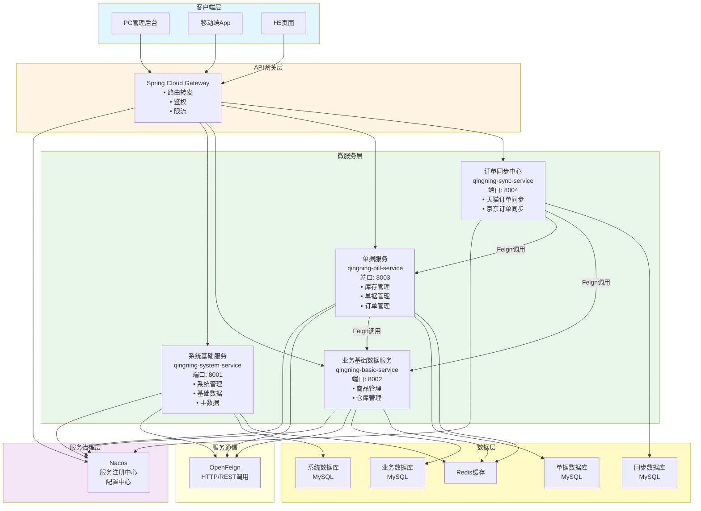
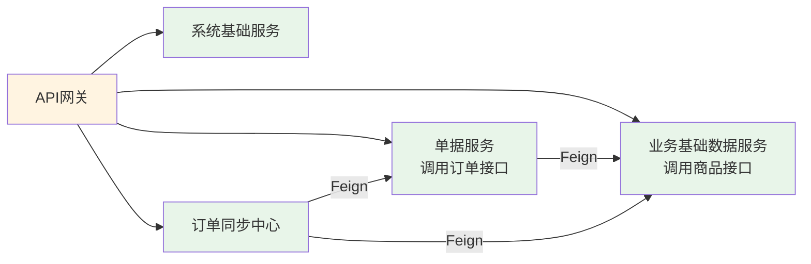
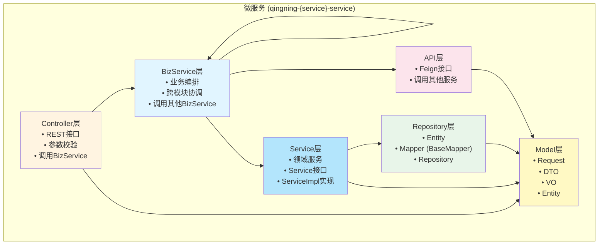
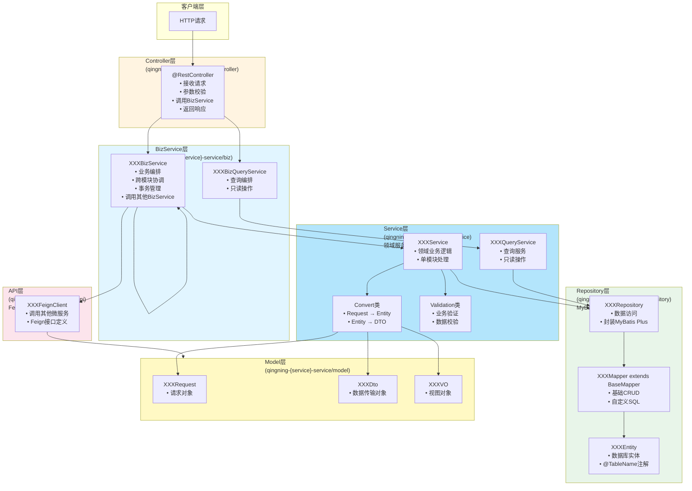
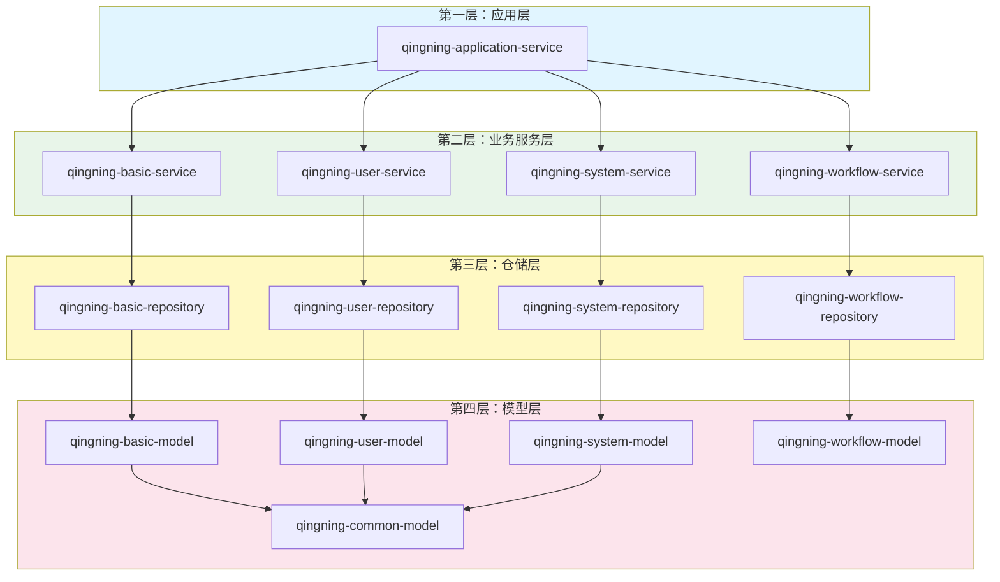
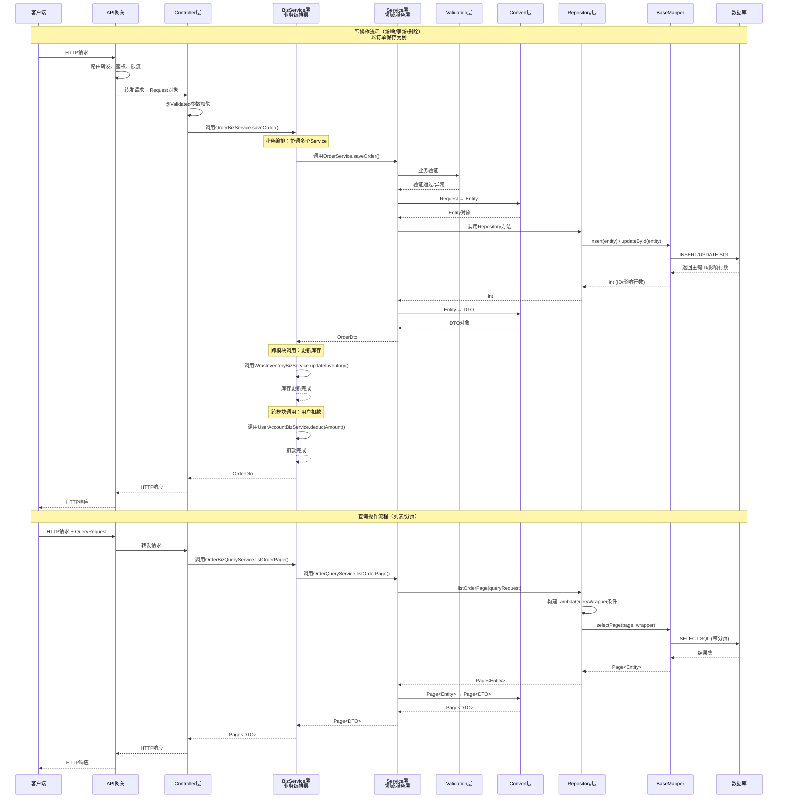

# 青柠中台系统项目架构详细文档

> 本文档详细描述了青柠中台系统的整体架构、模块划分、代码分层和依赖关系，采用 Spring Boot 3.0 + MyBatis Plus 技术栈。

## 📖 文档说明

### 图表查看说明

本文档中的架构图使用 **Mermaid** 语法编写，在以下环境中可以正常显示图表：

- ✅ **GitHub/GitLab**：直接查看 Markdown 文件时会自动渲染图表
- ✅ **VS Code**：安装 `Markdown Preview Mermaid Support` 插件后预览
- ✅ **Typora**：直接支持 Mermaid 图表渲染
- ✅ **在线工具**：https://mermaid.live/ 可以粘贴代码查看
- ❌ **普通文本编辑器**：只显示代码，不显示图表

如果您的查看环境不支持 Mermaid，图表部分会显示为代码块，这是正常现象。您可以：
1. 复制代码块内容到 https://mermaid.live/ 查看渲染后的图表
2. 使用支持 Mermaid 的 Markdown 查看器
3. 参考图表下方的文字说明理解架构

---

## 目录

1. [项目整体架构](#1-项目整体架构)
2. [模块划分架构](#2-模块划分架构)
3. [代码分层架构](#3-代码分层架构)
4. [依赖关系架构](#4-依赖关系架构)
5. [数据流向架构](#5-数据流向架构)
6. [技术栈说明](#6-技术栈说明)
7. [MyBatis Plus 使用指南](#7-mybatis-plus-使用指南)
8. [Spring Boot 3.0 升级说明](#8-spring-boot-30-升级说明)
9. [新项目搭建指南](#9-新项目搭建指南)

---

## 1. 项目整体架构

### 1.1 架构概述

青柠中台系统采用**微服务架构**，整个系统划分为4个独立的微服务：

1. **系统基础服务 (qingning-system-service)**：系统管理、基础数据、主数据
2. **业务基础数据服务 (qingning-basic-service)**：商品、仓库等业务基础数据
3. **单据服务 (qingning-bill-service)**：库存、单据、订单等业务单据
4. **订单同步中心 (qingning-sync-service)**：天猫订单、京东订单等第三方订单同步

**架构特点**：
- **服务独立**：每个微服务独立开发、部署、扩展
- **服务通信**：服务间通过 OpenFeign 进行 HTTP 调用
- **统一网关**：Spring Cloud Gateway 作为统一入口
- **服务治理**：Nacos 作为服务注册中心和配置中心
- **内部分层**：每个微服务内部采用标准分层架构（Controller → Service → Repository）

### 1.2 微服务架构图

> 💡 **提示**：下方是架构图的 Mermaid 代码，支持 Mermaid 的环境会自动渲染为可视化图表。如果不显示图表，请参考文档开头的"图表查看说明"。



### 1.3 微服务详细说明

#### 1.3.1 系统基础服务 (qingning-system-service)

**服务职责**：
- 系统管理：用户、角色、权限、菜单管理
- 基础数据：字典、参数配置、系统配置
- 主数据：租户、组织架构、基础分类

**技术特点**：
- 端口：8001
- 数据库：独立的系统数据库
- 服务接口：提供用户认证、权限验证、基础数据查询等接口

**核心功能模块**：
- 用户管理：用户信息、账号管理
- 权限管理：角色、权限、菜单
- 系统配置：系统参数、字典管理
- 组织管理：租户、部门、员工

#### 1.3.2 业务基础数据服务 (qingning-basic-service)

**服务职责**：
- 商品管理：商品信息、商品分类、商品规格
- 仓库管理：仓库信息、仓库配置

**技术特点**：
- 端口：8002
- 数据库：独立的业务基础数据库
- 服务接口：提供商品查询、仓库查询等接口

**核心功能模块**：
- 商品管理：商品基础信息、商品分类、商品规格
- 仓库管理：仓库信息、仓库配置、仓库权限

#### 1.3.3 单据服务 (qingning-bill-service)

**服务职责**：
- 库存管理：库存查询、库存调整、库存盘点
- 单据管理：采购单、销售单、调拨单等各类业务单据
- 订单管理：订单创建、订单查询、订单处理

**技术特点**：
- 端口：8003
- 数据库：独立的单据数据库
- 服务接口：提供单据查询、单据创建、库存查询等接口
- 依赖调用：通过 Feign 调用业务基础数据服务

**核心功能模块**：
- 库存管理：实时库存、库存明细、库存变动记录
- 单据管理：采购入库单、销售出库单、调拨单、盘点单等
- 订单管理：订单创建、订单查询、订单状态管理

#### 1.3.4 订单同步中心 (qingning-sync-service)

**服务职责**：
- 天猫订单同步：从天猫平台同步订单数据
- 京东订单同步：从京东平台同步订单数据
- 订单数据转换：将第三方订单转换为系统内部订单格式

**技术特点**：
- 端口：8004
- 数据库：独立的同步数据库
- 服务接口：提供订单同步接口、同步状态查询接口
- 依赖调用：通过 Feign 调用单据服务和业务基础数据服务

**核心功能模块**：
- 天猫订单同步：订单拉取、订单解析、订单同步
- 京东订单同步：订单拉取、订单解析、订单同步
- 订单转换：第三方订单格式转换为系统订单格式
- 同步监控：同步状态、同步日志、异常处理

### 1.4 服务间调用关系



**调用说明**：
- **单据服务 → 业务基础数据服务**：查询商品信息、仓库信息
- **订单同步中心 → 单据服务**：创建订单、查询订单
- **订单同步中心 → 业务基础数据服务**：查询商品信息、匹配商品

### 1.5 架构特点说明

1. **微服务架构**：采用微服务设计，服务独立部署、独立扩展，提高系统灵活性和可维护性
2. **服务拆分**：按业务领域划分为4个微服务，服务职责清晰，边界明确
3. **服务治理**：使用 Nacos 作为服务注册中心和配置中心，统一管理服务配置
4. **统一网关**：Spring Cloud Gateway 作为统一入口，提供路由、鉴权、限流等功能
5. **服务通信**：服务间通过 OpenFeign 进行 HTTP 调用，实现服务解耦
6. **内部分层**：每个微服务内部采用标准分层架构（Controller → Service → Repository），职责清晰
7. **技术栈升级**：基于 Spring Boot 3.0 + MyBatis Plus + Spring Cloud，提升开发效率和系统性能
8. **数据隔离**：每个微服务使用独立数据库，实现数据隔离，提高系统安全性

---

## 2. 微服务划分架构

### 2.1 微服务划分原则

青柠中台系统的微服务划分遵循以下原则：

1. **业务内聚**：同一业务领域的功能放在同一个微服务中
2. **服务独立**：每个微服务独立部署、独立扩展、独立数据库
3. **职责单一**：每个微服务职责明确，避免服务过大或过小
4. **低耦合高内聚**：服务间通过接口调用，减少直接依赖
5. **数据隔离**：每个微服务使用独立数据库，避免数据耦合

### 2.2 微服务命名规范

```
qingning-{service-name}-service

service-name: 服务名称（system, basic, bill, sync）
```

**服务命名示例**：
- `qingning-system-service`：系统基础服务
- `qingning-basic-service`：业务基础数据服务
- `qingning-bill-service`：单据服务
- `qingning-sync-service`：订单同步中心

### 2.3 微服务内部模块命名规范

每个微服务内部采用模块化设计，模块命名规范：

```
{service-name}-{domain}-{layer}

domain: 业务域（根据服务内的业务划分）
layer: 分层（model, repository, service, interface, api）
```

**示例**（系统基础服务内部）：
- `system-user-model`：用户模型层
- `system-user-repository`：用户仓储层
- `system-user-service`：用户服务层
- `system-user-api`：用户API接口层（Feign接口）

### 2.4 微服务内部结构说明

每个微服务内部采用标准的分层结构，各层职责如下：

| 分层 | 包路径 | 主要职责 | 包含内容 |
|------|---------|---------|---------|
| Controller层 | controller/ | 接收请求 | REST Controller、参数校验、调用BizService |
| BizService层 | biz/ | 业务编排 | BizService接口、BizServiceImpl实现、跨模块协调 |
| Service层 | service/ | 领域服务 | Service接口、ServiceImpl实现、QueryService、Convert、Validation |
| Repository层 | repository/ | 数据访问 | Entity、Mapper（BaseMapper）、Repository |
| Model层 | model/ | 数据模型 | Request、DTO、VO、Entity、Enum |
| API层 | api/ | 对外接口 | Feign接口定义、接口模型 |

**依赖关系**：
- Controller 层可以依赖 BizService 层和 Model 层
- BizService 层可以依赖 Service 层、其他 BizService 层、Model 层和 API 层（调用其他微服务）
- Service 层可以依赖 Repository 层和 Model 层
- Repository 层只能依赖 Model 层
- API 层只能依赖 Model 层
- Model 层不依赖任何层（纯数据对象）

### 2.5 微服务内部结构图

> 💡 **提示**：下方是模块结构的 Mermaid 代码，支持 Mermaid 的环境会自动渲染为可视化图表。



### 2.6 完整微服务列表

| 微服务名称 | 端口 | 业务说明 | 数据库 |
|-----------|------|---------|--------|
| qingning-system-service | 8001 | 系统基础服务：系统管理、基础数据、主数据 | system_db |
| qingning-basic-service | 8002 | 业务基础数据服务：商品、仓库 | basic_db |
| qingning-bill-service | 8003 | 单据服务：库存、单据、订单 | bill_db |
| qingning-sync-service | 8004 | 订单同步中心：天猫订单、京东订单 | sync_db |

### 2.7 微服务详细模块划分

#### 系统基础服务 (qingning-system-service)

| 内部模块 | 说明 |
|---------|------|
| system-user | 用户管理模块 |
| system-role | 角色管理模块 |
| system-permission | 权限管理模块 |
| system-dict | 字典管理模块 |
| system-config | 系统配置模块 |
| system-tenant | 租户管理模块 |

#### 业务基础数据服务 (qingning-basic-service)

| 内部模块 | 说明 |
|---------|------|
| basic-product | 商品管理模块 |
| basic-warehouse | 仓库管理模块 |
| basic-category | 商品分类模块 |

#### 单据服务 (qingning-bill-service)

| 内部模块 | 说明 |
|---------|------|
| bill-inventory | 库存管理模块 |
| bill-purchase | 采购单据模块 |
| bill-sale | 销售单据模块 |
| bill-order | 订单管理模块 |
| bill-transfer | 调拨单据模块 |

#### 订单同步中心 (qingning-sync-service)

| 内部模块 | 说明 |
|---------|------|
| sync-tmall | 天猫订单同步模块 |
| sync-jd | 京东订单同步模块 |
| sync-convert | 订单转换模块 |
| sync-monitor | 同步监控模块 |

---

## 3. 代码分层架构

### 3.1 分层架构概述

每个微服务内部采用**五层架构**设计，从外到内依次为：

1. **Controller 层**：接收 HTTP 请求，参数校验，调用 BizService，返回响应
2. **BizService 层**：业务编排层，负责跨模块的业务编排，调用 Service 和其他 BizService
3. **Service 层**：领域服务层，实现单个模块的核心业务逻辑、对象转换、业务验证
4. **Repository 层**：数据访问层，封装数据库操作（基于 MyBatis Plus）
5. **Model 层**：数据模型层，定义各种数据对象（Request、DTO、VO、Entity）

**额外层次**：
- **API 层**：Feign 接口层，定义服务间调用的接口（用于调用其他微服务）

**数据流向**（单个微服务内部）：
- 请求：HTTP → Controller → BizService → Service → Repository → Database
- 响应：Database → Repository → Service → BizService → Controller → HTTP

**服务间调用**：
- 微服务A → Feign接口 → 微服务B（通过服务注册中心发现服务）

**分层说明**：
- **BizService**：业务编排层，负责协调多个 Service 完成复杂业务场景，可以调用其他 BizService
- **Service**：领域服务层，负责单个模块的内部业务逻辑，只处理本模块的数据操作
- **示例**：订单保存时，`OrderBizService` 调用 `OrderService` 保存订单，同时调用 `WmsInventoryBizService` 更新库存，调用 `UserAccountBizService` 处理用户扣款

### 3.2 微服务内部分层架构图（MyBatis Plus版本）

> 💡 **提示**：下方是微服务内部分层架构的 Mermaid 代码，支持 Mermaid 的环境会自动渲染为可视化图表。



### 3.3 分层职责说明

#### 3.3.1 Controller层

**位置**: `qingning-{service}-service/src/main/java/com/qingning/{service}/controller/`

**示例路径**：
- 系统基础服务：`qingning-system-service/src/main/java/com/qingning/system/controller/`
- 业务基础数据服务：`qingning-basic-service/src/main/java/com/qingning/basic/controller/`
- 单据服务：`qingning-bill-service/src/main/java/com/qingning/bill/controller/`

**职责**:
- 接收 HTTP 请求
- 参数校验（使用 `@Validated`）
- 调用 BizService 或 BizQueryService
- 返回统一响应（`GenericResponse` 或 `PagingResponse`）
- API 文档注解（`@Tag`, `@Operation` - OpenAPI 3.0）
- 日志记录（`@ApiLog`）

**约束**:
- ❌ 禁止包含业务逻辑
- ❌ 禁止直接调用 Service 或 Repository
- ❌ 禁止对象转换
- ✅ 只能调用 BizService 或 BizQueryService

**示例代码结构**:
```java
@RestController
@RequestMapping(value = "/api/v1.0/bill/order")
@Tag(name = "订单管理", description = "订单相关接口")
public class OrderController {
    @Autowired
    private OrderBizService orderBizService;
    
    @Autowired
    private OrderBizQueryService orderBizQueryService;
    
    @PostMapping(value = "/save")
    @Operation(summary = "保存订单", description = "创建或更新订单")
    public GenericResponse<OrderDto> save(@RequestBody @Validated OrderRequest request) {
        OrderDto result = orderBizService.saveOrder(request);
        return GenericResponse.success(result);
    }
    
    @PostMapping(value = "/listPaged")
    @Operation(summary = "分页查询订单", description = "分页查询订单列表")
    public GenericResponse<Page<OrderDto>> listPaged(@RequestBody @Validated OrderQueryRequest request) {
        Page<OrderDto> pageInfo = orderBizQueryService.listOrderPage(request);
        return GenericResponse.success(pageInfo);
    }
}
```

#### 3.3.2 BizService层（业务编排层）

**位置**: `qingning-{service}-service/src/main/java/com/qingning/{service}/biz/`

**职责**:
- **业务编排**：协调多个 Service 完成复杂业务场景
- **跨模块协调**：调用其他 BizService 完成跨模块业务
- **事务管理**：在 BizService 层管理事务边界
- **调用 Service**：调用本模块的 Service 处理内部逻辑
- **调用其他微服务**：通过 Feign 接口调用其他微服务

**包结构**:
```
biz/
├── OrderBizService.java              # BizService接口
├── OrderBizQueryService.java         # BizQueryService接口
└── impl/
    ├── OrderBizServiceImpl.java      # BizService实现
    └── OrderBizQueryServiceImpl.java # BizQueryService实现
```

**约束**:
- ✅ 可以调用 Service 层
- ✅ 可以调用其他 BizService（跨模块调用）
- ✅ 可以调用 API 层（Feign 接口）调用其他微服务
- ✅ 应该在 BizService 层管理事务
- ❌ 禁止直接调用 Repository
- ❌ 禁止包含详细的业务逻辑（应该在 Service 层）

**示例代码结构**（订单保存业务）:
```java
@Slf4j
@Service
@RequiredArgsConstructor
public class OrderBizServiceImpl implements OrderBizService {
    private final OrderService orderService;              // 订单Service
    private final WmsInventoryBizService inventoryBizService;  // 库存BizService
    private final UserAccountBizService accountBizService;     // 用户账户BizService
    
    @Transactional(rollbackFor = Exception.class)
    @Override
    public OrderDto saveOrder(OrderRequest request) {
        // 1. 调用订单Service保存订单
        OrderDto orderDto = orderService.saveOrder(request);
        
        // 2. 调用库存BizService更新库存
        inventoryBizService.updateInventory(request.getInventoryRequest());
        
        // 3. 调用用户账户BizService处理扣款
        accountBizService.deductAmount(request.getAccountRequest());
        
        return orderDto;
    }
}
```

#### 3.3.3 Service层（领域服务层）

**位置**: `qingning-{service}-service/src/main/java/com/qingning/{service}/service/`

**职责**:
- **领域业务逻辑**：实现单个模块的核心业务逻辑
- **数据操作**：调用 Repository 进行数据操作
- **对象转换**：使用 Convert 类进行对象转换
- **业务验证**：使用 Validation 类进行业务验证
- **只处理本模块**：只处理本模块的内部逻辑，不跨模块

**包结构**:
```
service/
├── order/
│   ├── OrderService.java              # Service接口
│   ├── OrderQueryService.java         # QueryService接口
│   ├── impl/
│   │   ├── OrderServiceImpl.java      # Service实现
│   │   └── OrderQueryServiceImpl.java # QueryService实现
│   ├── convert/
│   │   └── OrderConvert.java          # 对象转换类
│   └── validation/
│       └── OrderValidation.java       # 业务验证类
```

**约束**:
- ✅ 可以调用 Repository 层
- ✅ 可以使用 Convert 类进行对象转换
- ✅ 可以使用 Validation 类进行业务验证
- ❌ 禁止调用其他 BizService 或 Service（跨模块调用应该在 BizService 层）
- ❌ 禁止直接操作数据库
- ❌ 禁止在 Service 层管理事务（事务应该在 BizService 层）

**示例代码结构**:
```java
@Slf4j
@Service
@RequiredArgsConstructor
public class OrderServiceImpl implements OrderService {
    private final OrderRepository repository;
    
    @Override
    public OrderDto saveOrder(OrderRequest request) {
        // 1. 业务验证
        OrderValidation.validSaveOrder(request);
        
        // 2. 对象转换
        OrderEntity entity = OrderConvert.toEntity(request);
        
        // 3. 业务逻辑（只处理订单相关的逻辑）
        int id = repository.insert(entity);
        entity.setId(id);
        
        // 4. 返回转换
        return OrderConvert.toDto(entity);
    }
}
```

#### 3.3.3 Repository层（MyBatis Plus版本）

**位置**: `qingning-{service}-service/src/main/java/com/qingning/{service}/repository/`

**职责**:
- 数据持久化操作
- 使用 MyBatis Plus 的 BaseMapper 和 Service 接口
- 封装复杂查询和自定义SQL
- 分页查询处理（使用 MyBatis Plus 的分页插件）

**包结构**:
```
repository/
├── entity/                    # 数据库实体
│   └── XXXEntity.java        # 使用 @TableName 注解
├── mapper/                    # MyBatis Plus Mapper
│   └── XXXMapper.java        # extends BaseMapper<XXXEntity>
└── XXXRepository.java         # Repository接口（可选）
    └── impl/
        └── XXXRepositoryImpl.java  # Repository实现（可选，可直接使用Mapper）
```

**约束**:
- ✅ 使用 MyBatis Plus 的 BaseMapper 提供基础CRUD
- ✅ 复杂查询使用 Wrapper 条件构造器或自定义SQL
- ✅ 分页查询使用 MyBatis Plus 的分页插件
- ✅ Entity 类使用 `@TableName` 注解指定表名

**示例代码结构**:
```java
// Entity
@Data
@TableName("xxx_table")
public class XXXEntity extends BaseEntity {
    @TableId(type = IdType.AUTO)
    private Long id;
    private String name;
    // ... 更多字段
}

// Mapper
@Mapper
public interface XXXMapper extends BaseMapper<XXXEntity> {
    // 基础CRUD由BaseMapper提供
    // 自定义SQL方法
    List<XXXEntity> selectCustomQuery(@Param("param") String param);
}

// Repository实现（可选，直接使用Mapper也可以）
@Component
public class XXXRepositoryImpl implements XXXRepository {
    @Autowired
    private XXXMapper mapper;
    
    @Override
    public Page<XXXEntity> listXXXPage(XXXQueryRequest request) {
        // 使用MyBatis Plus的Page对象
        Page<XXXEntity> page = new Page<>(request.getPageIndex(), request.getPageSize());
        
        // 使用Wrapper条件构造器
        LambdaQueryWrapper<XXXEntity> wrapper = new LambdaQueryWrapper<>();
        if (request.getId() != null) {
            wrapper.eq(XXXEntity::getId, request.getId());
        }
        if (StringUtils.isNotBlank(request.getName())) {
            wrapper.like(XXXEntity::getName, request.getName());
        }
        wrapper.orderByDesc(XXXEntity::getCreateTime);
        
        return mapper.selectPage(page, wrapper);
    }
}
```

#### 3.3.4 Model层

**位置**: `qingning-{service}-service/src/main/java/com/qingning/{service}/model/`

**职责**: 定义数据传输对象、请求和响应对象、领域模型。

**包结构**:
```
model/
├── request/           # 请求对象
│   ├── AddXXXRequest.java
│   ├── ModifyXXXRequest.java
│   └── XXXQueryRequest.java
├── dto/               # 数据传输对象
│   └── XXXDto.java
├── vo/                # 视图对象
│   └── XXXVO.java
└── enums/             # 枚举类
    └── XXXEnum.java
```

**对象类型说明**:

| 类型 | 用途 | 示例 |
|------|------|------|
| Request | Controller 接收请求 | `AddXXXRequest`, `XXXQueryRequest` |
| DTO | 跨层数据传输、服务间传输 | `XXXDto` |
| VO | 视图展示对象 | `XXXVO` |
| Entity | 数据库实体 | `XXXEntity`（在 Repository 层） |

#### 3.3.5 API层（Feign接口层）

**位置**: `qingning-{service}-service/src/main/java/com/qingning/{service}/api/`

**职责**:
- 定义 Feign 客户端接口，用于调用其他微服务
- 定义服务间调用的请求和响应模型

**包结构**:
```
api/
├── feign/
│   ├── OtherServiceFeignClient.java    # Feign客户端接口
│   └── OtherServiceFeignFallback.java  # 降级处理（可选）
└── model/                               # API接口模型
    ├── XXXApiRequest.java
    └── XXXApiResponse.java
```

**约束**:
- ✅ 只能定义接口，不包含实现
- ✅ 只能使用 Model 层的对象作为参数和返回值
- ✅ 需要配置 Feign 客户端名称和服务路径
- ❌ 禁止包含业务逻辑

**示例代码结构**:
```java
@FeignClient(name = "qingning-basic-service", path = "/api/v1.0/basic")
public interface BasicServiceFeignClient {
    
    @PostMapping("/product/get")
    GenericResponse<ProductDto> getProduct(@RequestBody ProductQueryRequest request);
    
    @PostMapping("/warehouse/list")
    GenericResponse<List<WarehouseDto>> listWarehouse(@RequestBody WarehouseQueryRequest request);
}
```

---

## 4. 依赖关系架构

### 4.1 模块依赖关系



---

## 5. 数据流向架构

### 5.1 微服务内部请求流程（MyBatis Plus版本）



---

## 6. 技术栈说明

### 6.1 核心技术栈（升级版）

| 技术 | 版本 | 用途 | 说明 |
|------|------|------|------|
| Java | 17+ | 编程语言 | Spring Boot 3.0 要求 Java 17+ |
| Spring Boot | 3.0+ | 应用框架 | 升级到最新稳定版本 |
| Spring Framework | 6.0+ | Spring核心框架 | Spring Boot 3.0 配套版本 |
| MyBatis Plus | 3.5+ | ORM框架 | 替代 MyBatis，提供增强功能 |
| Maven | 3.8+ | 构建工具 | 支持新版本特性 |
| MySQL | 8.0+ | 数据库 | 支持新特性 |
| Jackson | 2.14+ | JSON处理 | Spring Boot 3.0 默认版本 |
| Lombok | 1.18+ | 代码简化 | 持续使用 |
| OpenAPI 3.0 | - | API文档 | 替代 Swagger 2.x |
| SpringDoc | 2.0+ | OpenAPI集成 | Spring Boot 3.0 推荐 |

### 6.2 主要依赖配置

```xml
<properties>
    <java.version>17</java.version>
    <spring-boot.version>3.0.5</spring-boot.version>
    <spring-cloud.version>2022.0.4</spring-cloud.version>
    <mybatis-plus.version>3.5.3.1</mybatis-plus.version>
    <springdoc.version>2.0.4</springdoc.version>
    <lombok.version>1.18.28</lombok.version>
    <mysql.version>8.0.33</mysql.version>
    <nacos.version>2022.0.4.0</nacos.version>
</properties>

<dependencyManagement>
    <dependencies>
        <!-- Spring Cloud 依赖管理 -->
        <dependency>
            <groupId>org.springframework.cloud</groupId>
            <artifactId>spring-cloud-dependencies</artifactId>
            <version>${spring-cloud.version}</version>
            <type>pom</type>
            <scope>import</scope>
        </dependency>
        
        <!-- Spring Cloud Alibaba 依赖管理 -->
        <dependency>
            <groupId>com.alibaba.cloud</groupId>
            <artifactId>spring-cloud-alibaba-dependencies</artifactId>
            <version>${nacos.version}</version>
            <type>pom</type>
            <scope>import</scope>
        </dependency>
    </dependencies>
</dependencyManagement>

<dependencies>
    <!-- Spring Boot Web -->
    <dependency>
        <groupId>org.springframework.boot</groupId>
        <artifactId>spring-boot-starter-web</artifactId>
    </dependency>
    
    <!-- Nacos 服务注册与发现 -->
    <dependency>
        <groupId>com.alibaba.cloud</groupId>
        <artifactId>spring-cloud-starter-alibaba-nacos-discovery</artifactId>
    </dependency>
    
    <!-- Nacos 配置中心 -->
    <dependency>
        <groupId>com.alibaba.cloud</groupId>
        <artifactId>spring-cloud-starter-alibaba-nacos-config</artifactId>
    </dependency>
    
    <!-- OpenFeign 服务调用 -->
    <dependency>
        <groupId>org.springframework.cloud</groupId>
        <artifactId>spring-cloud-starter-openfeign</artifactId>
    </dependency>
    
    <!-- LoadBalancer 负载均衡 -->
    <dependency>
        <groupId>org.springframework.cloud</groupId>
        <artifactId>spring-cloud-starter-loadbalancer</artifactId>
    </dependency>
    
    <!-- MyBatis Plus -->
    <dependency>
        <groupId>com.baomidou</groupId>
        <artifactId>mybatis-plus-boot-starter</artifactId>
        <version>${mybatis-plus.version}</version>
    </dependency>
    
    <!-- MySQL Driver -->
    <dependency>
        <groupId>com.mysql</groupId>
        <artifactId>mysql-connector-j</artifactId>
        <version>${mysql.version}</version>
    </dependency>
    
    <!-- Redis -->
    <dependency>
        <groupId>org.springframework.boot</groupId>
        <artifactId>spring-boot-starter-data-redis</artifactId>
    </dependency>
    
    <!-- OpenAPI 3.0 (SpringDoc) -->
    <dependency>
        <groupId>org.springdoc</groupId>
        <artifactId>springdoc-openapi-starter-webmvc-ui</artifactId>
        <version>${springdoc.version}</version>
    </dependency>
    
    <!-- Lombok -->
    <dependency>
        <groupId>org.projectlombok</groupId>
        <artifactId>lombok</artifactId>
        <version>${lombok.version}</version>
    </dependency>
</dependencies>
```

#### 6.2.1 API网关依赖配置（Gateway服务）

```xml
<dependencies>
    <!-- Spring Cloud Gateway -->
    <dependency>
        <groupId>org.springframework.cloud</groupId>
        <artifactId>spring-cloud-starter-gateway</artifactId>
    </dependency>
    
    <!-- Nacos 服务注册与发现 -->
    <dependency>
        <groupId>com.alibaba.cloud</groupId>
        <artifactId>spring-cloud-starter-alibaba-nacos-discovery</artifactId>
    </dependency>
    
    <!-- LoadBalancer 负载均衡 -->
    <dependency>
        <groupId>org.springframework.cloud</groupId>
        <artifactId>spring-cloud-starter-loadbalancer</artifactId>
    </dependency>
</dependencies>
```

---

## 7. MyBatis Plus 使用指南

### 7.1 基础配置

#### application.yml 配置

```yaml
spring:
  datasource:
    driver-class-name: com.mysql.cj.jdbc.Driver
    url: jdbc:mysql://localhost:3306/qingning_db?useUnicode=true&characterEncoding=utf8&useSSL=false&serverTimezone=Asia/Shanghai
    username: root
    password: password

# MyBatis Plus 配置
mybatis-plus:
  # 实体类包路径
  type-aliases-package: com.qingning.**.entity
  # Mapper XML 文件路径
  mapper-locations: classpath*:mapper/**/*.xml
  # 全局配置
  global-config:
    db-config:
      # 主键类型：AUTO-自增, NONE-无, INPUT-手动输入, ASSIGN_ID-分配ID（雪花算法）
      id-type: AUTO
      # 表名前缀
      table-prefix: 
      # 逻辑删除字段名
      logic-delete-field: deleted
      # 逻辑删除值（已删除）
      logic-delete-value: 1
      # 逻辑删除值（未删除）
      logic-not-delete-value: 0
  # 配置
  configuration:
    # 是否开启自动驼峰命名规则映射
    map-underscore-to-camel-case: true
    # 日志实现
    log-impl: org.apache.ibatis.logging.stdout.StdOutImpl

# 分页插件配置（可选，使用代码配置）
```

#### MyBatis Plus 配置类

```java
@Configuration
@MapperScan("com.qingning.**.mapper")
public class MyBatisPlusConfig {
    
    /**
     * 分页插件
     */
    @Bean
    public MybatisPlusInterceptor mybatisPlusInterceptor() {
        MybatisPlusInterceptor interceptor = new MybatisPlusInterceptor();
        interceptor.addInnerInterceptor(new PaginationInnerInterceptor(DbType.MYSQL));
        return interceptor;
    }
    
    /**
     * 自动填充处理器
     */
    @Bean
    public MetaObjectHandler metaObjectHandler() {
        return new MyMetaObjectHandler();
    }
}
```

### 7.2 Entity 实体类

```java
@Data
@TableName("sys_user")
public class SysUserEntity extends BaseEntity {
    
    /**
     * 主键ID
     */
    @TableId(type = IdType.AUTO)
    private Long id;
    
    /**
     * 用户名
     */
    private String username;
    
    /**
     * 密码
     */
    private String password;
    
    /**
     * 邮箱
     */
    private String email;
    
    /**
     * 逻辑删除（0-未删除，1-已删除）
     */
    @TableLogic
    private Integer deleted;
}
```

### 7.3 Mapper 接口

```java
@Mapper
public interface SysUserMapper extends BaseMapper<SysUserEntity> {
    
    /**
     * BaseMapper 提供的常用方法：
     * - insert(T entity) - 插入一条记录
     * - deleteById(Serializable id) - 根据ID删除
     * - updateById(T entity) - 根据ID更新
     * - selectById(Serializable id) - 根据ID查询
     * - selectBatchIds(Collection<? extends Serializable> idList) - 根据ID批量查询
     * - selectList(Wrapper<T> queryWrapper) - 根据条件查询列表
     * - selectPage(IPage<T> page, Wrapper<T> queryWrapper) - 分页查询
     */
    
    /**
     * 自定义查询方法
     */
    List<SysUserEntity> selectByUsername(@Param("username") String username);
}
```

### 8.2 通用条件构建工具（QueryWrapperBuilder）

为了**避免在每个 Repository 中重复编写条件构建代码**，我们提供了通用的 `QueryWrapperBuilder` 工具类。

#### 7.4.1 工具类设计思路

参考现有项目中的 `getCriteria()` 方法模式，设计一个通用的条件构建工具，支持：

1. **自动字段映射**：Request 字段自动映射到 Entity 字段
2. **多种查询类型**：
   - 等于查询（普通字段）
   - 模糊查询（fuzzy 开头或 queryKey）
   - IN 查询（List 类型字段）
   - 范围查询（Begin/End 结尾）
3. **简化使用**：只需传入 Request 对象和字段映射关系

#### 7.4.2 工具类实现

在 `qingning-common-core` 模块中创建：

```java
package com.qingning.common.core.util;

import com.baomidou.mybatisplus.core.conditions.query.LambdaQueryWrapper;
import com.baomidou.mybatisplus.core.toolkit.StringUtils;
import org.springframework.util.CollectionUtils;

import java.lang.reflect.Field;
import java.util.Collection;
import java.util.HashMap;
import java.util.Map;
import java.util.function.Function;

/**
 * MyBatis Plus QueryWrapper 通用构建工具
 * 
 * 自动将 Request 对象的字段转换为 LambdaQueryWrapper 查询条件
 * 避免在每个 Repository 中重复编写条件构建代码
 * 
 * @author: 系统生成
 * @date: 2024/01/01
 */
public class QueryWrapperBuilder {
    
    /**
     * 根据 Request 对象和字段映射规则构建 LambdaQueryWrapper
     * 
     * @param request Request 查询对象
     * @param fieldMapper 字段映射函数（Request字段名 -> Entity字段的Function）
     * @param <T> Entity 类型
     * @return LambdaQueryWrapper
     */
    public static <T> LambdaQueryWrapper<T> build(Object request, 
                                                   Function<String, Function<T, ?>> fieldMapper) {
        LambdaQueryWrapper<T> wrapper = new LambdaQueryWrapper<>();
        
        if (request == null || fieldMapper == null) {
            return wrapper;
        }
        
        Class<?> requestClass = request.getClass();
        Field[] fields = requestClass.getDeclaredFields();
        
        for (Field field : fields) {
            try {
                field.setAccessible(true);
                Object value = field.get(request);
                
                if (value == null) {
                    continue;
                }
                
                String fieldName = field.getName();
                Class<?> fieldType = field.getType();
                
                // 跳过分页字段
                if (isPageField(fieldName)) {
                    continue;
                }
                
                // 获取 Entity 字段的 Function
                Function<T, ?> entityFieldFunc = fieldMapper.apply(fieldName);
                if (entityFieldFunc == null) {
                    continue;
                }
                
                // 处理 List 类型（IN 查询）
                if (Collection.class.isAssignableFrom(fieldType)) {
                    Collection<?> collection = (Collection<?>) value;
                    if (!CollectionUtils.isEmpty(collection)) {
                        // 处理 xxxList 字段，映射到对应的单个字段
                        String actualFieldName = fieldName.replace("List", "");
                        Function<T, ?> actualFieldFunc = fieldMapper.apply(actualFieldName);
                        if (actualFieldFunc != null) {
                            wrapper.in(actualFieldFunc, collection);
                        }
                    }
                    continue;
                }
                
                // 处理模糊查询字段（fuzzy 开头或 queryKey）
                if (isFuzzyField(fieldName)) {
                    if (value instanceof String && StringUtils.isNotBlank((String) value)) {
                        // fuzzyXxx 字段，映射到对应的 xxx 字段
                        if (fieldName.startsWith("fuzzy")) {
                            String actualFieldName = fieldName.replaceFirst("^fuzzy", "");
                            actualFieldName = Character.toLowerCase(actualFieldName.charAt(0)) + actualFieldName.substring(1);
                            Function<T, ?> actualFieldFunc = fieldMapper.apply(actualFieldName);
                            if (actualFieldFunc != null) {
                                wrapper.like(actualFieldFunc, value);
                            }
                        } else if ("queryKey".equals(fieldName)) {
                            // queryKey 需要特殊处理，可能需要匹配多个字段
                            // 这里简化处理，实际使用时可以根据业务需求扩展
                            // 例如：wrapper.and(w -> w.like(...).or().like(...));
                        }
                    }
                    continue;
                }
                
                // 处理范围查询字段（Begin/End 结尾）
                if (isRangeField(fieldName)) {
                    if (fieldName.endsWith("Begin")) {
                        String actualFieldName = fieldName.replace("Begin", "");
                        Function<T, ?> actualFieldFunc = fieldMapper.apply(actualFieldName);
                        if (actualFieldFunc != null) {
                            wrapper.ge(actualFieldFunc, value);
                        }
                    } else if (fieldName.endsWith("End")) {
                        String actualFieldName = fieldName.replace("End", "");
                        Function<T, ?> actualFieldFunc = fieldMapper.apply(actualFieldName);
                        if (actualFieldFunc != null) {
                            wrapper.le(actualFieldFunc, value);
                        }
                    }
                    continue;
                }
                
                // 处理普通字段（等于查询）
                wrapper.eq(entityFieldFunc, value);
                
            } catch (Exception e) {
                // 忽略无法访问的字段
                continue;
            }
        }
        
        // 应用排序
        applyOrderBy(wrapper, request, fieldMapper);
        
        return wrapper;
    }
    
    /**
     * 设置排序（默认按创建时间倒序，如果Request中有排序字段则使用Request的排序）
     * 
     * @param wrapper QueryWrapper
     * @param request Request对象
     * @param fieldMapper 字段映射函数
     * @param <T> Entity类型
     */
    private static <T> void applyOrderBy(LambdaQueryWrapper<T> wrapper, 
                                         Object request, 
                                         Function<String, Function<T, ?>> fieldMapper) {
        if (fieldMapper == null) {
            return;
        }
        
        if (request == null) {
            // 默认按创建时间倒序
            Function<T, ?> createTimeFunc = fieldMapper.apply("createTime");
            if (createTimeFunc != null) {
                wrapper.orderByDesc(createTimeFunc);
            }
            return;
        }
        
        try {
            // 尝试获取排序字段和排序方式
            Class<?> requestClass = request.getClass();
            
            // 获取 orderBy 字段（排序字段名）
            Field orderByField = getField(requestClass, "orderBy");
            String orderBy = null;
            if (orderByField != null) {
                orderByField.setAccessible(true);
                orderBy = (String) orderByField.get(request);
            }
            
            // 获取 orderType 字段（排序方式：ASC/DESC）
            Field orderTypeField = getField(requestClass, "orderType");
            String orderType = null;
            if (orderTypeField != null) {
                orderTypeField.setAccessible(true);
                orderType = (String) orderTypeField.get(request);
            }
            
            // 如果指定了排序字段，使用指定的排序
            if (orderBy != null && !orderBy.trim().isEmpty()) {
                Function<T, ?> orderFieldFunc = fieldMapper.apply(orderBy);
                if (orderFieldFunc != null) {
                    if ("ASC".equalsIgnoreCase(orderType) || "asc".equals(orderType)) {
                        wrapper.orderByAsc(orderFieldFunc);
                    } else {
                        wrapper.orderByDesc(orderFieldFunc);
                    }
                    return;
                }
            }
            
            // 默认按创建时间倒序
            Function<T, ?> createTimeFunc = fieldMapper.apply("createTime");
            if (createTimeFunc != null) {
                wrapper.orderByDesc(createTimeFunc);
            }
        } catch (Exception e) {
            // 如果获取排序字段失败，使用默认排序
            Function<T, ?> createTimeFunc = fieldMapper.apply("createTime");
            if (createTimeFunc != null) {
                wrapper.orderByDesc(createTimeFunc);
            }
        }
    }
    
    /**
     * 安全获取字段（避免异常）
     */
    private static Field getField(Class<?> clazz, String fieldName) {
        try {
            return clazz.getDeclaredField(fieldName);
        } catch (NoSuchFieldException e) {
            return null;
        }
    }
    
    /**
     * 判断是否为分页字段
     */
    private static boolean isPageField(String fieldName) {
        return "pageIndex".equals(fieldName) || 
               "pageSize".equals(fieldName) ||
               "pageNum".equals(fieldName);
    }
    
    /**
     * 判断是否为模糊查询字段
     */
    private static boolean isFuzzyField(String fieldName) {
        return fieldName.startsWith("fuzzy") || 
               "queryKey".equals(fieldName);
    }
    
    /**
     * 判断是否为范围查询字段
     */
    private static boolean isRangeField(String fieldName) {
        return fieldName.endsWith("Begin") || 
               fieldName.endsWith("End");
    }
}
```

#### 7.4.3 Repository 实现（使用通用工具）

```java
@Component
public class SysUserRepositoryImpl implements SysUserRepository {
    
    @Autowired
    private SysUserMapper mapper;
    
    // 字段映射 Map（静态初始化，可以缓存）
    private static final Map<String, Function<SysUserEntity, ?>> FIELD_MAP = new HashMap<>();
    
    static {
        // 基础字段映射
        FIELD_MAP.put("id", SysUserEntity::getId);
        FIELD_MAP.put("username", SysUserEntity::getUsername);
        FIELD_MAP.put("email", SysUserEntity::getEmail);
        FIELD_MAP.put("status", SysUserEntity::getStatus);
        FIELD_MAP.put("tenantId", SysUserEntity::getTenantId);
        FIELD_MAP.put("createTime", SysUserEntity::getCreateTime);
        
        // 模糊查询字段映射（fuzzyXxx -> xxx）
        FIELD_MAP.put("fuzzyUsername", SysUserEntity::getUsername);
        FIELD_MAP.put("fuzzyEmail", SysUserEntity::getEmail);
        
        // List 字段映射（xxxList -> xxx）
        FIELD_MAP.put("idList", SysUserEntity::getId);
        FIELD_MAP.put("usernameList", SysUserEntity::getUsername);
    }
    
    @Override
    public Page<SysUserEntity> selectPage(SysUserQueryRequest request) {
        Page<SysUserEntity> page = new Page<>(request.getPageIndex(), request.getPageSize());
        
        // 使用通用工具构建查询条件（自动处理排序）
        LambdaQueryWrapper<SysUserEntity> wrapper = QueryWrapperBuilder.build(
            request, 
            FIELD_MAP::get
        );
        
        // 方式1：如果Request中有orderBy和orderType字段，会自动使用
        // 方式2：如果需要手动设置排序，可以在build之后添加：
        // wrapper.orderByDesc(SysUserEntity::getCreateTime);
        // wrapper.orderByAsc(SysUserEntity::getUsername);
        
        return mapper.selectPage(page, wrapper);
    }
    
    @Override
    public List<SysUserEntity> selectList(SysUserQueryRequest request) {
        // 使用通用工具构建查询条件
        LambdaQueryWrapper<SysUserEntity> wrapper = QueryWrapperBuilder.build(
            request, 
            FIELD_MAP::get
        );
        
        return mapper.selectList(wrapper);
    }
    
    @Override
    public boolean existByUsername(String username, Long excludeId) {
        LambdaQueryWrapper<SysUserEntity> wrapper = new LambdaQueryWrapper<>();
        wrapper.eq(SysUserEntity::getUsername, username);
        if (excludeId != null) {
            wrapper.ne(SysUserEntity::getId, excludeId);
        }
        return mapper.selectCount(wrapper) > 0;
    }
}
```

#### 7.4.4 使用优势

1. **代码复用**：避免在每个 Repository 中重复编写条件构建代码
2. **统一规范**：所有 Repository 使用相同的条件构建逻辑
3. **易于维护**：条件构建逻辑集中管理，修改更方便
4. **类型安全**：使用 Lambda 表达式，编译时类型检查
5. **灵活扩展**：支持自定义字段映射规则

#### 7.4.5 支持的查询类型

| Request 字段命名 | 查询类型 | 示例 |
|----------------|---------|------|
| `id` | 等于查询 | `wrapper.eq(SysUserEntity::getId, request.getId())` |
| `fuzzyName` | 模糊查询 | `wrapper.like(SysUserEntity::getName, request.getFuzzyName())` |
| `nameList` | IN 查询 | `wrapper.in(SysUserEntity::getName, request.getNameList())` |
| `createTimeBegin` | 大于等于 | `wrapper.ge(SysUserEntity::getCreateTime, request.getCreateTimeBegin())` |
| `createTimeEnd` | 小于等于 | `wrapper.le(SysUserEntity::getCreateTime, request.getCreateTimeEnd())` |
| `queryKey` | 特殊处理 | 需要根据业务需求自定义（可匹配多个字段） |

#### 7.4.6 排序功能说明

**方式1：在Request对象中定义排序字段（推荐）**

在 `XXXQueryRequest` 中添加排序字段：

```java
@Data
public class SysUserQueryRequest extends SysUserBaseQueryRequest {
    /**
     * 排序字段（可选，默认按createTime排序）
     * 支持字段：id, username, email, createTime等
     */
    @ApiModelProperty("排序字段")
    private String orderBy;
    
    /**
     * 排序方式：ASC-升序，DESC-降序（可选，默认DESC）
     */
    @ApiModelProperty("排序方式：ASC-升序，DESC-降序")
    private String orderType;
}
```

使用示例：
```java
// 前端传入排序参数
SysUserQueryRequest request = new SysUserQueryRequest();
request.setOrderBy("username");  // 按用户名排序
request.setOrderType("ASC");     // 升序

// QueryWrapperBuilder会自动应用排序
LambdaQueryWrapper<SysUserEntity> wrapper = QueryWrapperBuilder.build(request, FIELD_MAP::get);
// 结果：ORDER BY username ASC
```

**方式2：手动设置排序（灵活性更高）**

如果不需要在Request中传递排序参数，可以在build之后手动设置：

```java
@Override
public Page<SysUserEntity> selectPage(SysUserQueryRequest request) {
    Page<SysUserEntity> page = new Page<>(request.getPageIndex(), request.getPageSize());
    
    // 使用通用工具构建查询条件
    LambdaQueryWrapper<SysUserEntity> wrapper = QueryWrapperBuilder.build(
        request, 
        FIELD_MAP::get
    );
    
    // 手动设置排序（会覆盖默认排序）
    wrapper.orderByDesc(SysUserEntity::getCreateTime);  // 按创建时间倒序
    wrapper.orderByAsc(SysUserEntity::getUsername);     // 再按用户名升序
    
    // 或者只按单个字段排序
    // wrapper.orderByDesc(SysUserEntity::getId);
    
    return mapper.selectPage(page, wrapper);
}
```

**方式3：多字段排序**

```java
// 先按创建时间倒序，再按用户名升序
wrapper.orderByDesc(SysUserEntity::getCreateTime)
       .orderByAsc(SysUserEntity::getUsername);

// 只按ID倒序
wrapper.orderByDesc(SysUserEntity::getId);
```

**默认排序规则**：

- 如果Request中没有指定 `orderBy` 字段，默认按 `createTime` 倒序排序
- 如果Request中指定了 `orderBy` 但对应的字段在 FIELD_MAP 中不存在，仍使用默认排序
- 如果Request中指定了 `orderType` 为 "ASC" 或 "asc"，则升序；否则降序

#### 7.4.7 注意事项

1. **字段映射必须完整**：所有需要查询的 Request 字段都必须在 FIELD_MAP 中定义映射关系
2. **命名规范**：
   - 模糊查询字段以 `fuzzy` 开头
   - 范围查询字段以 `Begin` 或 `End` 结尾
   - List 字段以 `List` 结尾
3. **性能考虑**：FIELD_MAP 使用静态初始化，避免重复创建
4. **特殊字段处理**：`queryKey` 等特殊字段需要根据业务需求自定义处理逻辑
5. **排序字段**：如果使用方式1（Request中定义排序字段），需要在 FIELD_MAP 中映射排序字段

### 7.5 排序功能详细说明

#### 7.5.1 排序方式对比

| 方式 | 优点 | 缺点 | 适用场景 |
|------|------|------|---------|
| Request中定义排序字段 | 灵活，前端可控制 | 需要在Request中添加字段 | 需要前端动态排序 |
| 手动设置排序 | 简单直接，代码清晰 | 不灵活，需要改代码 | 固定排序规则 |
| 默认排序 | 无需配置 | 无法自定义 | 简单场景 |

#### 7.5.2 完整排序示例

**示例1：使用Request中的排序字段**

```java
// Request类
@Data
public class SysUserQueryRequest extends SysUserBaseQueryRequest {
    private String orderBy;    // 排序字段
    private String orderType;  // 排序方式：ASC/DESC
}

// Repository实现
@Override
public Page<SysUserEntity> selectPage(SysUserQueryRequest request) {
    Page<SysUserEntity> page = new Page<>(request.getPageIndex(), request.getPageSize());
    LambdaQueryWrapper<SysUserEntity> wrapper = QueryWrapperBuilder.build(request, FIELD_MAP::get);
    return mapper.selectPage(page, wrapper);
}

// 使用
request.setOrderBy("username");
request.setOrderType("ASC");
// 结果：ORDER BY username ASC
```

**示例2：手动设置排序**

```java
@Override
public Page<SysUserEntity> selectPage(SysUserQueryRequest request) {
    Page<SysUserEntity> page = new Page<>(request.getPageIndex(), request.getPageSize());
    LambdaQueryWrapper<SysUserEntity> wrapper = QueryWrapperBuilder.build(request, FIELD_MAP::get);
    
    // 覆盖默认排序，按用户名升序
    wrapper.orderByAsc(SysUserEntity::getUsername);
    
    return mapper.selectPage(page, wrapper);
}
```

**示例3：多字段组合排序**

```java
@Override
public Page<SysUserEntity> selectPage(SysUserQueryRequest request) {
    Page<SysUserEntity> page = new Page<>(request.getPageIndex(), request.getPageSize());
    LambdaQueryWrapper<SysUserEntity> wrapper = QueryWrapperBuilder.build(request, FIELD_MAP::get);
    
    // 先按状态升序，再按创建时间倒序
    wrapper.orderByAsc(SysUserEntity::getStatus)
           .orderByDesc(SysUserEntity::getCreateTime);
    
    return mapper.selectPage(page, wrapper);
}
```

### 8.5 Wrapper 条件构造器常用方法

```java
// LambdaQueryWrapper - 推荐使用，类型安全
LambdaQueryWrapper<Entity> wrapper = new LambdaQueryWrapper<>();

// 等于
wrapper.eq(Entity::getField, value);
wrapper.ne(Entity::getField, value);  // 不等于

// 大于、小于
wrapper.gt(Entity::getField, value);  // 大于
wrapper.ge(Entity::getField, value);  // 大于等于
wrapper.lt(Entity::getField, value);  // 小于
wrapper.le(Entity::getField, value);  // 小于等于

// 模糊查询
wrapper.like(Entity::getField, value);      // LIKE '%value%'
wrapper.likeLeft(Entity::getField, value);  // LIKE '%value'
wrapper.likeRight(Entity::getField, value); // LIKE 'value%'

// IN、NOT IN
wrapper.in(Entity::getField, list);
wrapper.notIn(Entity::getField, list);

// BETWEEN
wrapper.between(Entity::getField, value1, value2);
wrapper.notBetween(Entity::getField, value1, value2);

// IS NULL、IS NOT NULL
wrapper.isNull(Entity::getField);
wrapper.isNotNull(Entity::getField);

// 排序
wrapper.orderByAsc(Entity::getField);
wrapper.orderByDesc(Entity::getField);
wrapper.orderBy(true, true, Entity::getField1, Entity::getField2);

// 分组
wrapper.groupBy(Entity::getField);

// 多条件
wrapper.and(w -> w.eq(Entity::getField1, value1).or().eq(Entity::getField2, value2));
wrapper.or(w -> w.eq(Entity::getField1, value1).eq(Entity::getField2, value2));

// 最后调用
mapper.selectList(wrapper);
mapper.selectPage(page, wrapper);
mapper.selectCount(wrapper);
```

---

## 9. Spring Boot 3.0 升级说明

### 8.1 主要变化

#### 8.1.1 Java 版本要求
- **最低要求**: Java 17（推荐 Java 17 或 Java 21）
- **移除支持**: Java 8、Java 11

#### 8.1.2 包名变更
- `javax.*` → `jakarta.*`
  - `javax.servlet.*` → `jakarta.servlet.*`
  - `javax.validation.*` → `jakarta.validation.*`
  - `javax.persistence.*` → `jakarta.persistence.*`

#### 8.1.3 API 文档
- Swagger 2.x → OpenAPI 3.0 (SpringDoc)
- `@Api` → `@Tag`
- `@ApiOperation` → `@Operation`
- `@ApiModel` → `@Schema`
- `@ApiModelProperty` → `@Schema`

#### 8.1.4 配置文件
- 移除了一些废弃的配置项
- 新增了一些配置项

### 8.2 迁移步骤

#### 步骤1：升级 Java 版本
```bash
# 检查Java版本
java -version  # 需要 >= 17

# 如果使用Java 17，确保JDK版本正确
```

#### 步骤2：修改 pom.xml
```xml
<properties>
    <java.version>17</java.version>
    <spring-boot.version>3.0.5</spring-boot.version>
</properties>
```

#### 步骤3：替换包名
使用 IDE 的全局替换功能：
- `javax.servlet` → `jakarta.servlet`
- `javax.validation` → `jakarta.validation`
- `javax.persistence` → `jakarta.persistence`

#### 步骤4：更新 API 文档注解
```java
// 旧代码 (Swagger 2.x)
@Api(tags = "用户管理")
@ApiOperation(value = "新增用户", notes = "新增用户信息")
@ApiModel(value = "用户请求")
@ApiModelProperty(value = "用户名", required = true)

// 新代码 (OpenAPI 3.0)
@Tag(name = "用户管理", description = "用户管理相关接口")
@Operation(summary = "新增用户", description = "新增用户信息")
@Schema(description = "用户请求")
@Schema(description = "用户名", required = true)
```

#### 步骤5：更新配置文件
```yaml
# application.yml
springdoc:
  api-docs:
    path: /v3/api-docs
  swagger-ui:
    path: /swagger-ui.html
```

### 8.3 常见问题

#### 问题1：javax包找不到
**解决方案**: 将所有 `javax.*` 包替换为 `jakarta.*`

#### 问题2：Swagger注解失效
**解决方案**: 使用 SpringDoc OpenAPI 3.0 替代 Swagger

#### 问题3：MySQL驱动类名变更
**解决方案**: 
- 旧: `com.mysql.jdbc.Driver`
- 新: `com.mysql.cj.jdbc.Driver`

---

## 10. 新项目搭建指南（微服务架构）

### 10.1 项目初始化步骤

#### 步骤1：创建父POM项目

```xml
<?xml version="1.0" encoding="UTF-8"?>
<project xmlns="http://maven.apache.org/POM/4.0.0"
         xmlns:xsi="http://www.w3.org/2001/XMLSchema-instance"
         xsi:schemaLocation="http://maven.apache.org/POM/4.0.0 
         http://maven.apache.org/xsd/maven-4.0.0.xsd">
    <modelVersion>4.0.0</modelVersion>
    
    <groupId>com.qingning</groupId>
    <artifactId>qingning-platform</artifactId>
    <version>1.0.0-SNAPSHOT</version>
    <packaging>pom</packaging>
    
    <modules>
        <module>qingning-application</module>
        <module>qingning-basic</module>
        <module>qingning-user</module>
        <module>qingning-system</module>
        <module>qingning-common</module>
    </modules>
    
    <properties>
        <java.version>17</java.version>
        <maven.compiler.source>17</maven.compiler.source>
        <maven.compiler.target>17</maven.compiler.target>
        <spring-boot.version>3.0.5</spring-boot.version>
        <mybatis-plus.version>3.5.3.1</mybatis-plus.version>
        <springdoc.version>2.0.4</springdoc.version>
        <lombok.version>1.18.28</lombok.version>
        <mysql.version>8.0.33</mysql.version>
        <fastjson2.version>2.0.43</fastjson2.version>
    </properties>
    
    <dependencyManagement>
        <dependencies>
            <dependency>
                <groupId>org.springframework.boot</groupId>
                <artifactId>spring-boot-dependencies</artifactId>
                <version>${spring-boot.version}</version>
                <type>pom</type>
                <scope>import</scope>
            </dependency>
        </dependencies>
    </dependencyManagement>
</project>
```

#### 步骤2：创建微服务项目结构

每个微服务项目结构如下（以系统基础服务为例）：

```
qingning-system-service/
├── pom.xml
└── src/
    └── main/
        ├── java/
        │   └── com/qingning/system/
        │       ├── SystemServiceApplication.java    # 启动类
        │       ├── controller/                      # Controller层
        │       │   └── user/
        │       │       └── UserController.java
        │       ├── biz/                             # BizService层
        │       │   ├── UserBizService.java
        │       │   ├── UserBizQueryService.java
        │       │   └── impl/
        │       │       ├── UserBizServiceImpl.java
        │       │       └── UserBizQueryServiceImpl.java
        │       ├── service/                         # Service层
        │       │   ├── user/
        │       │   │   ├── UserService.java
        │       │   │   ├── UserQueryService.java
        │       │   │   ├── impl/
        │       │   │   │   ├── UserServiceImpl.java
        │       │   │   │   └── UserQueryServiceImpl.java
        │       │   │   ├── convert/
        │       │   │   │   └── UserConvert.java
        │       │   │   └── validation/
        │       │   │       └── UserValidation.java
        │       ├── repository/                      # Repository层
        │       │   ├── entity/
        │       │   │   └── UserEntity.java
        │       │   ├── mapper/
        │       │   │   └── UserMapper.java
        │       │   └── UserRepository.java
        │       ├── model/                           # Model层
        │       │   ├── request/
        │       │   │   ├── AddUserRequest.java
        │       │   │   └── UserQueryRequest.java
        │       │   ├── dto/
        │       │   │   └── UserDto.java
        │       │   └── vo/
        │       │       └── UserVO.java
        │       └── api/                             # API层（Feign接口）
        │           └── feign/
        │               └── OtherServiceFeignClient.java
        └── resources/
            ├── application.yml                      # 应用配置
            └── mapper/                              # MyBatis XML（可选）
```

### 9.2 标准代码模板（MyBatis Plus版本）

#### Entity模板

```java
@Data
@TableName("xxx_table")
public class XXXEntity extends BaseEntity {
    
    @TableId(type = IdType.AUTO)
    private Long id;
    
    private String name;
    
    @TableLogic
    private Integer deleted;
}
```

#### Mapper模板

```java
@Mapper
public interface XXXMapper extends BaseMapper<XXXEntity> {
    // BaseMapper 已提供基础CRUD方法
    // 可添加自定义SQL方法
}
```

#### Repository模板（使用通用条件构建工具）

**第一步：创建通用条件构建工具类**

在 `qingning-common-core` 模块中创建 `QueryWrapperBuilder` 工具类：

```java
package com.qingning.common.core.util;

import com.baomidou.mybatisplus.core.conditions.query.LambdaQueryWrapper;
import com.baomidou.mybatisplus.core.toolkit.StringUtils;
import org.springframework.util.CollectionUtils;

import java.lang.reflect.Field;
import java.lang.reflect.Method;
import java.util.Collection;
import java.util.Date;
import java.util.List;

/**
 * MyBatis Plus QueryWrapper 通用构建工具
 * 
 * 自动将 Request 对象的字段转换为 LambdaQueryWrapper 查询条件
 * 
 * @author: 系统生成
 * @date: 2024/01/01
 */
public class QueryWrapperBuilder {
    
    /**
     * 根据 Request 对象自动构建 LambdaQueryWrapper
     * 
     * @param request Request 查询对象
     * @param entityClass Entity 类
     * @param <T> Entity 类型
     * @return LambdaQueryWrapper
     */
    public static <T> LambdaQueryWrapper<T> build(Object request, Class<T> entityClass) {
        LambdaQueryWrapper<T> wrapper = new LambdaQueryWrapper<>();
        
        if (request == null) {
            return wrapper;
        }
        
        Class<?> requestClass = request.getClass();
        Field[] fields = requestClass.getDeclaredFields();
        
        for (Field field : fields) {
            try {
                field.setAccessible(true);
                Object value = field.get(request);
                
                if (value == null) {
                    continue;
                }
                
                String fieldName = field.getName();
                Class<?> fieldType = field.getType();
                
                // 跳过分页字段
                if (isPageField(fieldName)) {
                    continue;
                }
                
                // 处理 List 类型（IN 查询）
                if (List.class.isAssignableFrom(fieldType) || Collection.class.isAssignableFrom(fieldType)) {
                    handleListField(wrapper, fieldName, (Collection<?>) value, entityClass);
                    continue;
                }
                
                // 处理模糊查询字段（fuzzy 开头或 queryKey）
                if (isFuzzyField(fieldName)) {
                    handleFuzzyField(wrapper, fieldName, value.toString(), entityClass);
                    continue;
                }
                
                // 处理范围查询字段（Begin/End 结尾）
                if (isRangeField(fieldName)) {
                    handleRangeField(wrapper, fieldName, value, request, entityClass);
                    continue;
                }
                
                // 处理普通字段（等于查询）
                handleEqualField(wrapper, fieldName, value, entityClass);
                
            } catch (Exception e) {
                // 忽略无法访问的字段
                continue;
            }
        }
        
        // 默认按创建时间倒序
        try {
            wrapper.orderByDesc(getFieldFunction(entityClass, "createTime"));
        } catch (Exception e) {
            // 如果实体类没有 createTime 字段，忽略
        }
        
        return wrapper;
    }
    
    /**
     * 判断是否为分页字段
     */
    private static boolean isPageField(String fieldName) {
        return "pageIndex".equals(fieldName) || 
               "pageSize".equals(fieldName) ||
               "pageNum".equals(fieldName);
    }
    
    /**
     * 判断是否为模糊查询字段
     */
    private static boolean isFuzzyField(String fieldName) {
        return fieldName.startsWith("fuzzy") || 
               "queryKey".equals(fieldName);
    }
    
    /**
     * 判断是否为范围查询字段
     */
    private static boolean isRangeField(String fieldName) {
        return fieldName.endsWith("Begin") || 
               fieldName.endsWith("End");
    }
    
    /**
     * 处理 List 类型字段（IN 查询）
     */
    private static <T> void handleListField(LambdaQueryWrapper<T> wrapper, 
                                            String fieldName, 
                                            Collection<?> value, 
                                            Class<T> entityClass) {
        if (CollectionUtils.isEmpty(value)) {
            return;
        }
        
        // 移除 List 后缀，获取实际字段名
        String actualFieldName = fieldName.replace("List", "");
        try {
            wrapper.in(getFieldFunction(entityClass, actualFieldName), value);
        } catch (Exception e) {
            // 字段不存在，忽略
        }
    }
    
    /**
     * 处理模糊查询字段
     */
    private static <T> void handleFuzzyField(LambdaQueryWrapper<T> wrapper, 
                                             String fieldName, 
                                             String value, 
                                             Class<T> entityClass) {
        if (StringUtils.isBlank(value)) {
            return;
        }
        
        // queryKey 需要特殊处理，可能匹配多个字段
        if ("queryKey".equals(fieldName)) {
            // 可以根据实际需求，在多个字段中搜索
            // 这里简化处理，需要根据具体业务调整
            return;
        }
        
        // fuzzy 开头的字段，移除 fuzzy 前缀
        String actualFieldName = fieldName.replaceFirst("^fuzzy", "");
        // 首字母转小写
        actualFieldName = Character.toLowerCase(actualFieldName.charAt(0)) + actualFieldName.substring(1);
        
        try {
            wrapper.like(getFieldFunction(entityClass, actualFieldName), value);
        } catch (Exception e) {
            // 字段不存在，忽略
        }
    }
    
    /**
     * 处理范围查询字段
     */
    private static <T> void handleRangeField(LambdaQueryWrapper<T> wrapper, 
                                             String fieldName, 
                                             Object value, 
                                             Object request, 
                                             Class<T> entityClass) {
        String actualFieldName = fieldName.replace("Begin", "").replace("End", "");
        
        try {
            if (fieldName.endsWith("Begin")) {
                wrapper.ge(getFieldFunction(entityClass, actualFieldName), value);
            } else if (fieldName.endsWith("End")) {
                wrapper.le(getFieldFunction(entityClass, actualFieldName), value);
            }
        } catch (Exception e) {
            // 字段不存在，忽略
        }
    }
    
    /**
     * 处理普通字段（等于查询）
     */
    private static <T> void handleEqualField(LambdaQueryWrapper<T> wrapper, 
                                             String fieldName, 
                                             Object value, 
                                             Class<T> entityClass) {
        try {
            wrapper.eq(getFieldFunction(entityClass, fieldName), value);
        } catch (Exception e) {
            // 字段不存在，忽略
        }
    }
    
    /**
     * 获取字段的 Function（用于 LambdaQueryWrapper）
     * 这里使用反射获取，实际使用时可以通过方法引用优化
     */
    @SuppressWarnings("unchecked")
    private static <T> com.baomidou.mybatisplus.core.toolkit.support.SFunction<T, ?> getFieldFunction(
            Class<T> entityClass, String fieldName) {
        // 注意：这里简化处理，实际使用时需要根据字段类型返回对应的 Function
        // 可以通过缓存 Field 信息来优化性能
        try {
            Field field = entityClass.getDeclaredField(fieldName);
            // 这里返回一个占位符，实际使用时需要通过其他方式获取
            // 建议使用 Map 缓存字段信息，或者使用其他方式
            return null; // 需要根据实际情况实现
        } catch (NoSuchFieldException e) {
            throw new RuntimeException("Field not found: " + fieldName, e);
        }
    }
}
```

**注意**：上面的 `getFieldFunction` 方法需要特殊处理。更实用的方案是使用**注解驱动**的方式：

**改进方案：使用注解驱动**

```java
package com.qingning.common.core.util;

import com.baomidou.mybatisplus.core.conditions.query.LambdaQueryWrapper;
import com.baomidou.mybatisplus.core.toolkit.StringUtils;
import org.springframework.util.CollectionUtils;

import java.lang.reflect.Field;
import java.util.Collection;
import java.util.function.Function;

/**
 * MyBatis Plus QueryWrapper 通用构建工具（注解驱动版本）
 */
public class QueryWrapperBuilder {
    
    /**
     * 根据 Request 对象和字段映射规则构建 LambdaQueryWrapper
     * 
     * @param request Request 查询对象
     * @param fieldMapper 字段映射函数（Request字段名 -> Entity字段的Function）
     * @param <T> Entity 类型
     * @return LambdaQueryWrapper
     */
    public static <T> LambdaQueryWrapper<T> build(Object request, 
                                                   Function<String, Function<T, ?>> fieldMapper) {
        LambdaQueryWrapper<T> wrapper = new LambdaQueryWrapper<>();
        
        if (request == null) {
            return wrapper;
        }
        
        Class<?> requestClass = request.getClass();
        Field[] fields = requestClass.getDeclaredFields();
        
        for (Field field : fields) {
            try {
                field.setAccessible(true);
                Object value = field.get(request);
                
                if (value == null) {
                    continue;
                }
                
                String fieldName = field.getName();
                Class<?> fieldType = field.getType();
                
                // 跳过分页字段
                if (isPageField(fieldName)) {
                    continue;
                }
                
                // 获取 Entity 字段的 Function
                Function<T, ?> entityFieldFunc = fieldMapper.apply(fieldName);
                if (entityFieldFunc == null) {
                    continue;
                }
                
                // 处理 List 类型（IN 查询）
                if (Collection.class.isAssignableFrom(fieldType)) {
                    Collection<?> collection = (Collection<?>) value;
                    if (!CollectionUtils.isEmpty(collection)) {
                        wrapper.in(entityFieldFunc, collection);
                    }
                    continue;
                }
                
                // 处理模糊查询字段
                if (isFuzzyField(fieldName)) {
                    if (value instanceof String && StringUtils.isNotBlank((String) value)) {
                        wrapper.like(entityFieldFunc, value);
                    }
                    continue;
                }
                
                // 处理范围查询字段
                if (isRangeField(fieldName)) {
                    if (fieldName.endsWith("Begin")) {
                        wrapper.ge(entityFieldFunc, value);
                    } else if (fieldName.endsWith("End")) {
                        wrapper.le(entityFieldFunc, value);
                    }
                    continue;
                }
                
                // 处理普通字段（等于查询）
                wrapper.eq(entityFieldFunc, value);
                
            } catch (Exception e) {
                // 忽略无法访问的字段
                continue;
            }
        }
        
        // 默认按创建时间倒序（需要提供 createTime 的 Function）
        Function<T, ?> createTimeFunc = fieldMapper.apply("createTime");
        if (createTimeFunc != null) {
            wrapper.orderByDesc(createTimeFunc);
        }
        
        return wrapper;
    }
    
    private static boolean isPageField(String fieldName) {
        return "pageIndex".equals(fieldName) || 
               "pageSize".equals(fieldName) ||
               "pageNum".equals(fieldName);
    }
    
    private static boolean isFuzzyField(String fieldName) {
        return fieldName.startsWith("fuzzy") || 
               "queryKey".equals(fieldName);
    }
    
    private static boolean isRangeField(String fieldName) {
        return fieldName.endsWith("Begin") || 
               fieldName.endsWith("End");
    }
}
```

**第二步：在 Repository 中使用**

```java
@Component
public class XXXRepositoryImpl implements XXXRepository {
    
    @Autowired
    private XXXMapper mapper;
    
    @Override
    public Page<XXXEntity> listXXXPage(XXXQueryRequest request) {
        Page<XXXEntity> page = new Page<>(request.getPageIndex(), request.getPageSize());
        
        // 使用通用工具构建查询条件
        LambdaQueryWrapper<XXXEntity> wrapper = QueryWrapperBuilder.build(
            request, 
            this::getEntityFieldFunction  // 字段映射函数
        );
        
        return mapper.selectPage(page, wrapper);
    }
    
    /**
     * 字段映射函数：将 Request 字段名映射到 Entity 字段的 Function
     */
    private Function<XXXEntity, ?> getEntityFieldFunction(String requestFieldName) {
        // 使用 Map 缓存字段映射关系
        Map<String, Function<XXXEntity, ?>> fieldMap = getFieldMap();
        return fieldMap.get(requestFieldName);
    }
    
    /**
     * 获取字段映射 Map（可以缓存）
     */
    private Map<String, Function<XXXEntity, ?>> getFieldMap() {
        Map<String, Function<XXXEntity, ?>> map = new HashMap<>();
        map.put("id", XXXEntity::getId);
        map.put("name", XXXEntity::getName);
        map.put("code", XXXEntity::getCode);
        map.put("fuzzyName", XXXEntity::getName);  // 模糊查询字段映射
        map.put("nameList", XXXEntity::getName);   // List 字段映射
        map.put("createTime", XXXEntity::getCreateTime);
        // ... 更多字段映射
        return map;
    }
}
```

**更简化的方案：直接在 Repository 中定义字段映射**

```java
@Component
public class XXXRepositoryImpl implements XXXRepository {
    
    @Autowired
    private XXXMapper mapper;
    
    // 字段映射 Map（可以提取为常量或配置）
    private static final Map<String, Function<XXXEntity, ?>> FIELD_MAP = new HashMap<>();
    
    static {
        FIELD_MAP.put("id", XXXEntity::getId);
        FIELD_MAP.put("name", XXXEntity::getName);
        FIELD_MAP.put("code", XXXEntity::getCode);
        FIELD_MAP.put("fuzzyName", XXXEntity::getName);
        FIELD_MAP.put("nameList", XXXEntity::getName);
        FIELD_MAP.put("createTime", XXXEntity::getCreateTime);
        FIELD_MAP.put("status", XXXEntity::getStatus);
        // ... 更多字段
    }
    
    @Override
    public Page<XXXEntity> listXXXPage(XXXQueryRequest request) {
        Page<XXXEntity> page = new Page<>(request.getPageIndex(), request.getPageSize());
        
        LambdaQueryWrapper<XXXEntity> wrapper = QueryWrapperBuilder.build(request, FIELD_MAP::get);
        
        return mapper.selectPage(page, wrapper);
    }
    
    @Override
    public List<XXXEntity> listXXX(XXXQueryRequest request) {
        LambdaQueryWrapper<XXXEntity> wrapper = QueryWrapperBuilder.build(request, FIELD_MAP::get);
        return mapper.selectList(wrapper);
    }
}
```

#### Controller模板（微服务版本）

```java
@Slf4j
@RestController
@Tag(name = "订单管理", description = "订单相关接口")
@RequestMapping(value = "/api/v1.0/bill/order")
public class OrderController {
    
    @Autowired
    private OrderBizService orderBizService;
    
    @Autowired
    private OrderBizQueryService orderBizQueryService;
    
    @PostMapping(value = "/save")
    @Operation(summary = "保存订单", description = "创建或更新订单")
    public GenericResponse<OrderDto> save(@RequestBody @Validated OrderRequest request) {
        OrderDto result = orderBizService.saveOrder(request);
        return GenericResponse.success(result);
    }
    
    @PostMapping(value = "/listPaged")
    @Operation(summary = "分页查询订单", description = "分页查询订单列表")
    public GenericResponse<Page<OrderDto>> listPaged(@RequestBody @Validated OrderQueryRequest request) {
        Page<OrderDto> pageInfo = orderBizQueryService.listOrderPage(request);
        return GenericResponse.success(pageInfo);
    }
}
```

#### BizService模板（业务编排层）

```java
@Slf4j
@Service
@RequiredArgsConstructor
public class OrderBizServiceImpl implements OrderBizService {
    private final OrderService orderService;              // 订单Service
    private final WmsInventoryBizService inventoryBizService;  // 库存BizService
    private final UserAccountBizService accountBizService;     // 用户账户BizService
    
    @Transactional(rollbackFor = Exception.class)
    @Override
    public OrderDto saveOrder(OrderRequest request) {
        // 1. 调用订单Service保存订单
        OrderDto orderDto = orderService.saveOrder(request);
        
        // 2. 调用库存BizService更新库存
        inventoryBizService.updateInventory(request.getInventoryRequest());
        
        // 3. 调用用户账户BizService处理扣款
        accountBizService.deductAmount(request.getAccountRequest());
        
        return orderDto;
    }
}
```

#### Service模板（领域服务层）

```java
@Slf4j
@Service
@RequiredArgsConstructor
public class OrderServiceImpl implements OrderService {
    private final OrderRepository repository;
    
    @Override
    public OrderDto saveOrder(OrderRequest request) {
        // 1. 业务验证
        OrderValidation.validSaveOrder(request);
        
        // 2. 对象转换
        OrderEntity entity = OrderConvert.toEntity(request);
        
        // 3. 业务逻辑（只处理订单相关的逻辑）
        int id = repository.insert(entity);
        entity.setId(id);
        
        // 4. 返回转换
        return OrderConvert.toDto(entity);
    }
}
```

### 9.3 配置文件模板

#### application.yml

```yaml
spring:
  application:
    name: qingning-application-service
  datasource:
    driver-class-name: com.mysql.cj.jdbc.Driver
    url: jdbc:mysql://localhost:3306/qingning_db?useUnicode=true&characterEncoding=utf8&useSSL=false&serverTimezone=Asia/Shanghai
    username: root
    password: password
  servlet:
    multipart:
      max-file-size: 10MB
      max-request-size: 10MB

# MyBatis Plus 配置
mybatis-plus:
  type-aliases-package: com.qingning.**.entity
  mapper-locations: classpath*:mapper/**/*.xml
  global-config:
    db-config:
      id-type: AUTO
      logic-delete-field: deleted
      logic-delete-value: 1
      logic-not-delete-value: 0
  configuration:
    map-underscore-to-camel-case: true

# SpringDoc OpenAPI 配置
springdoc:
  api-docs:
    path: /v3/api-docs
  swagger-ui:
    path: /swagger-ui.html
    enabled: true
```

### 10.6 检查清单

#### 微服务基础设施检查
- [ ] Nacos 服务注册中心已部署并运行
- [ ] API网关已配置并启动
- [ ] 所有微服务已注册到Nacos
- [ ] 网关路由配置正确

#### 技术栈检查
- [ ] Java 版本 >= 17
- [ ] Spring Boot 版本 = 3.0+
- [ ] Spring Cloud 版本 = 2022.0+
- [ ] MyBatis Plus 版本 = 3.5+
- [ ] 所有 javax.* 包替换为 jakarta.*
- [ ] Swagger 注解替换为 OpenAPI 3.0 注解

#### 项目结构检查
- [ ] 每个微服务是独立项目（或独立模块）
- [ ] 每个微服务包含 controller, biz, service, repository, model, api 层
- [ ] BizService层和Service层职责清晰（BizService负责编排，Service负责领域逻辑）
- [ ] 服务名称配置正确（spring.application.name）
- [ ] 服务端口配置正确且不冲突

#### 代码规范检查
- [ ] Entity 使用 @TableName 注解
- [ ] Mapper 继承 BaseMapper<Entity>
- [ ] Repository 使用通用条件构建工具
- [ ] Controller 调用 BizService，不直接调用 Service
- [ ] BizService 使用 @Transactional 注解（事务在BizService层管理）
- [ ] Service 不管理事务（事务在BizService层）
- [ ] Controller 使用 OpenAPI 3.0 注解
- [ ] Feign 客户端接口定义正确

#### 服务间调用检查
- [ ] Feign 客户端接口已定义
- [ ] Feign 客户端已正确注入
- [ ] 服务间调用路径正确
- [ ] 异常处理和降级策略已配置

---

## 11. 总结

本架构文档详细描述了青柠中台系统的：

1. **整体架构**：微服务架构，4个独立微服务
2. **服务划分**：系统基础服务、业务基础数据服务、单据服务、订单同步中心
3. **代码分层**：Controller → BizService → Service → Repository（微服务内部分层）
4. **技术栈**：Spring Boot 3.0 + Spring Cloud + MyBatis Plus + Nacos
5. **服务治理**：Nacos 服务注册与发现、配置中心
6. **服务通信**：OpenFeign 实现服务间HTTP调用
7. **统一网关**：Spring Cloud Gateway 作为统一入口
8. **数据流向**：清晰的请求处理流程和服务间调用流程
9. **MyBatis Plus 使用**：完整的配置和使用指南，包括通用条件构建工具
10. **升级说明**：详细的迁移步骤和注意事项

该架构具有以下特点：
- ✅ **微服务架构**：服务独立部署、独立扩展，提高系统灵活性
- ✅ **现代化技术栈**：Spring Boot 3.0 + Spring Cloud + MyBatis Plus
- ✅ **清晰的分层设计**：BizService负责业务编排，Service负责领域逻辑，职责明确
- ✅ **服务治理完善**：Nacos 提供服务注册、配置管理
- ✅ **统一网关**：Gateway 提供路由、鉴权、限流
- ✅ **服务间解耦**：通过 Feign 实现服务间HTTP调用
- ✅ **数据隔离**：每个微服务独立数据库
- ✅ **高效的开发体验**：MyBatis Plus 简化CRUD，通用工具类提高效率
- ✅ **可复用的代码模板**：标准化开发流程

适用于中大型企业级微服务系统的开发。

