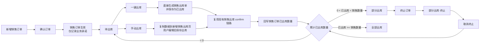
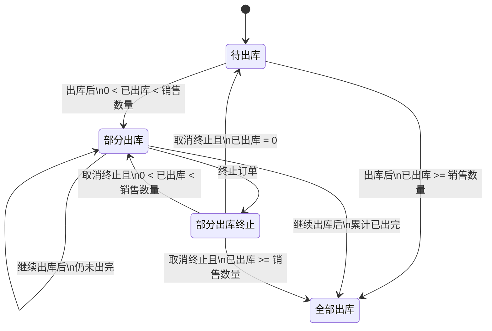
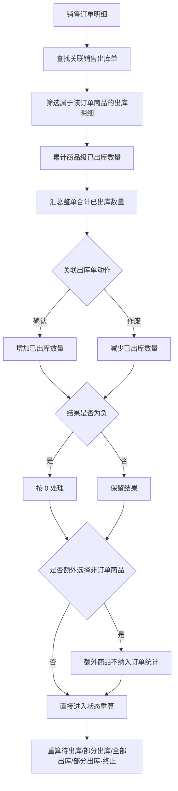
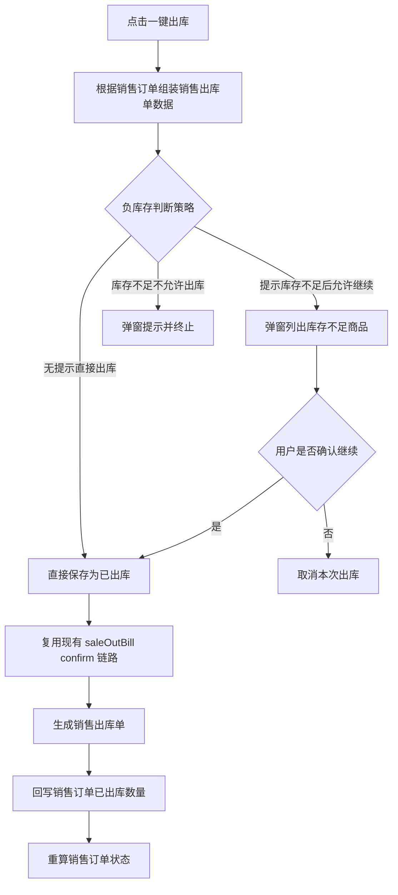
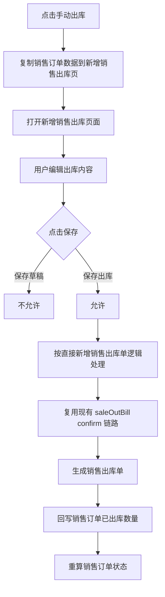
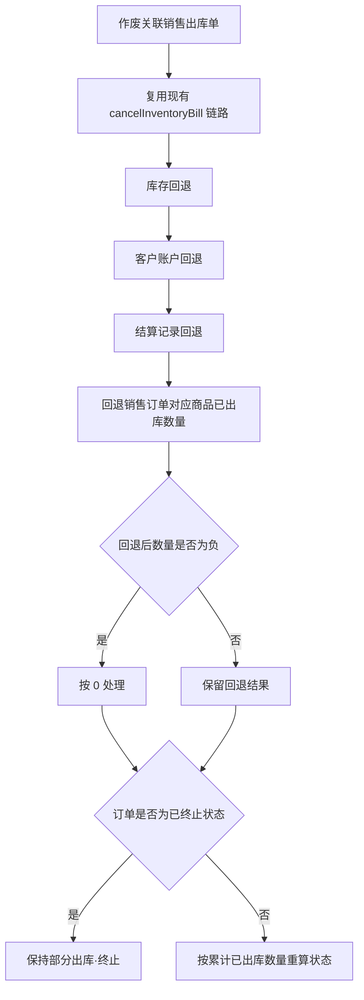

# 销售订单详细 PRD

> 文档定位：面向产品、研发、测试的一体化详细 PRD  
> 需求真源：`docs/wiki/b2b/销售订单/202604-销售订单需求/*.html`  
> 单据链路参考：`docs/wiki/inventory-bill/四大库存单据确认作废-全链路逻辑与自动化验证方案.md`  
> 版本：v2.0  
> 日期：2026-04-04

---

## 1. 文档目标

本 PRD 用于明确 ERP 后台“销售订单”模块的页面、字段、状态、操作规则，以及与现有销售出库单确认/作废链路的衔接方式。

本次需求主线不是 B2B 小程序审核流，而是 ERP 内部单据管理与出库进度管理。销售订单本身是业务承诺单据，不是库存生效单据。

---

## 2. 产品定位

### 2.1 销售订单的角色

销售订单用于记录对客户的销售承诺，包括商品、数量、价格、交货日期、备注等信息，并作为后续销售出库的来源单据。

销售订单的主要作用：

- 作为销售业务录单载体。
- 作为后续“一键出库”或“手动出库”的源单。
- 作为出库进度的管理入口。
- 作为销售订单与销售出库单之间的追溯对象。

### 2.2 与销售出库单的关系

- 销售订单不是库存单据。
- 销售出库单仍然是库存单据。
- 销售订单确认后不直接影响库存、成本、往来和报表。
- 销售出库单确认后，才按现有库存单据逻辑影响库存、客户账户、银行卡和结算。

### 2.3 与现有销售出库单新增页的关系

根据原型，销售订单新增页面和销售出库单新增页面基本保持一致，但有以下差异：

- 销售订单编号规则为：`XXDD + 日期 + 5 位流水号`
- 销售订单多一个字段：`交货日期`
- 销售订单表尾没有收款信息，也没有累计应收款
- 销售订单表尾仅展示“当前此前应付款”

---

## 3. 核心业务原则

### 3.1 销售订单确认后的影响边界

销售订单确认后：

- 不影响库存数量
- 不影响库存成本
- 不影响购买单位的应收款/应付款
- 不影响销售报表

该原则是本需求最核心的边界，必须在页面、接口、服务设计中保持一致。

### 3.2 销售订单状态是出库进度状态

销售订单状态不是审核状态，也不是库存单据状态，而是基于“整单累计已出库数量”计算出的履约状态。

### 3.3 销售订单必须可追溯到销售出库单

- 每次由销售订单发起的一键出库或手动出库，均应与对应销售出库单建立关联。
- 销售订单的已出库数量、未出库数量、状态，均基于关联销售出库单计算。

### 3.4 手动出库允许额外加商品，但额外商品不回写订单

原型明确指出：

- 手动出库时，如果额外选择了不属于销售订单的商品，这部分商品仍可正常进入销售出库单
- 但该部分商品不纳入销售订单已出库数量统计

---

## 4. 页面结构

## 4.1 模块入口

销售订单管理模块由 5 个列表页签组成：

- 全部订单
- 待出库
- 部分出库
- 部分出库·终止
- 全部出库

其中“全部订单”为总览页，其余 4 个页签按销售订单状态分类展示。

## 4.2 页面清单

| 页面 | 说明 |
|------|------|
| 销售订单管理 | 模块总入口，含 5 个状态页签 |
| 新增销售订单 | 销售订单新增/修改页 |
| 全部订单 | 查看全部销售订单 |
| 待出库 | 查看未发生出库的订单 |
| 部分出库 | 查看部分履约中的订单 |
| 部分出库·终止 | 查看人工终止继续出库的订单 |
| 全部出库 | 查看全部履约完成的订单 |
| 一键出库说明页 | 描述一键出库行为、负库存规则与字段来源 |
| 手动出库说明页 | 描述手动出库行为与限制 |
| 右侧抽屉式出库详情 | 点击已出库数量后的抽屉详情 |
| 销售订单流程图 | 状态机、已出库数量计算口径、操作流转 |

---

## 4.3 销售订单总体流程图

---

## 5. 新增销售订单

## 5.1 页面定位

新增销售订单页面用于新增或修改销售订单，页面结构基本复用新增销售出库单页面，降低学习成本与研发成本。

## 5.2 页面差异

相比新增销售出库单，销售订单页面有以下固定差异：

### 编号

- 销售订单编号前缀使用 `XXDD`
- 编号规则：`XXDD + 日期 + 5位流水号`

### 头部字段

- 新增字段：`交货日期`

### 表尾展示

- 不展示收款信息
- 不展示累计应收款
- 仅展示当前此前应付款

## 5.3 页面字段

结合原型与现有销售出库页面，可在 PRD 中明确以下字段组：

### 表头字段

- 单据编号
- 购买单位
- 销售人员
- 销售部门
- 出库仓库
- 销售日期
- 交货日期
- 单据备注

### 明细字段

- 商品
- 规格
- 单位
- 销售数量
- 单价
- 金额
- 赠品
- 明细备注

### 表尾字段

- 当前此前应付款
- 数量合计
- 金额合计

## 5.4 操作

- 确认订单
- 修改订单
- 删除订单

其中“确认订单”表示销售订单业务确认/保存完成，不代表库存确认。

---

## 6. 销售订单状态设计

## 6.1 状态列表

销售订单共 4 种业务状态：

| 状态 | 含义 |
|------|------|
| 待出库 | 订单尚未出库 |
| 部分出库 | 订单已部分出库，尚未全部出完 |
| 部分出库·终止 | 订单原本部分出库，且人工终止继续出库 |
| 全部出库 | 订单全部出库完成 |

## 6.2 状态判定规则

状态判定唯一依据为：整单合计已出库数量。

### 待出库

满足条件：

- 整单合计已出库数量 = 0

### 部分出库

满足条件：

- 0 < 整单合计已出库数量 < 整单合计销售数量

### 全部出库

满足条件：

- 整单合计销售数量 <= 整单合计已出库数量

说明：

- 允许出现超额出库场景
- 只要累计已出库数量大于等于整单销售数量，即判定为全部出库

### 部分出库·终止

满足条件：

- 0 < 整单合计已出库数量 < 整单合计销售数量
- 并且用户手动执行了“终止订单”

## 6.2.1 销售订单状态流转图

## 6.3 状态流转

### 待出库

可执行操作：

- 修改
- 删除
- 一键出库
- 手动出库

状态变化：

- 出库后且已出库数量仍小于销售数量：变为“部分出库”
- 出库后且已出库数量大于等于销售数量：变为“全部出库”

### 部分出库

可执行操作：

- 一键出库
- 手动出库
- 终止订单

状态变化：

- 继续出库且累计数量仍不足：保持“部分出库”
- 继续出库且累计数量达到或超过销售数量：变为“全部出库”
- 手工终止：变为“部分出库·终止”

### 部分出库·终止

可执行操作：

- 取消终止

状态变化：

- 取消终止后：
  - 若已出库数量 = 0，变为“待出库”
  - 若 0 < 已出库数量 < 销售数量，变为“部分出库”
  - 若已出库数量 >= 销售数量，变为“全部出库”

### 全部出库

默认不允许继续出库，作为履约完成状态展示。

---

## 7. 已出库数量计算规则

## 7.1 基本定义

整单合计已出库数量 = 关联销售出库单中，属于该销售订单商品的出库数量之和。

## 7.2 增加规则

当关联销售出库单保存并确认后：

- 增加销售订单对应商品的已出库数量

## 7.3 减少规则

当关联销售出库单作废后：

- 减少销售订单对应商品的已出库数量

## 7.4 非订单商品不纳入统计

手动出库时，如果用户额外选择了不属于销售订单的商品：

- 这些商品可以写入销售出库单
- 但不计入销售订单已出库数量

## 7.5 特殊规则

### 负数保护

若某商品因超额出库后再作废，导致计算出来的已出库数量为负数：

- 该商品已出库数量按 0 处理

### 终止状态保持

如果销售订单已经被标记为“部分出库·终止”，此时再作废关联销售出库单，导致订单已出库数量变为 0：

- 订单状态仍保持“部分出库·终止”
- 不自动恢复为“待出库”

### 取消终止后的重算

如果“部分出库·终止”订单已出库数量 = 0，用户执行“取消终止”后：

- 订单恢复为“待出库”

## 7.6 已出库数量计算图

---

## 8. 列表页设计

## 8.1 统一列表字段

各列表页统一展示以下字段：

- 序号
- 操作
- 单据状态
- 单据编号
- 购买单位
- 销售人员
- 销售部门
- 出库仓库
- 销售日期
- 交货日期
- 销售数量
- 已出库数量
- 未出库数量
- 销售金额
- 单据备注
- 出库单据
- 制单人
- 制单时间

### 字段说明

#### 已出库数量

- 用于展示当前销售订单累计已履约数量
- 点击该字段，打开右侧抽屉式出库详情

#### 未出库数量

- `未出库数量 = 销售数量 - 已出库数量`
- 若发生超额出库，原型中列表仍按 0 展示未出库数量

#### 出库单据

- 展示关联的销售出库单编号
- 多张出库单时可拼接展示

## 8.2 全部订单

### 页面目标

展示所有销售订单，并统一查看其当前出库进度状态。

### 页面说明

原型明确说明：

- 单据状态由单据上所有商品合计的已出库数量决定
- 共 4 种状态：待出库、部分出库、部分出库·已终止、全部出库

### 页面操作

全部订单页按订单当前状态展示对应操作：

- 待出库：一键出库、手动出库、修改、删除
- 部分出库：一键出库、手动出库、终止订单
- 部分出库·终止：取消终止
- 全部出库：以查看为主

## 8.3 待出库

### 状态口径

- 已出库数量 = 0

### 单行操作

- 一键出库
- 手动出库
- 修改
- 删除

### 批量操作

- 批量删除

### 交互要求

- 修改：打开新增销售订单页面，允许重新编辑数据
- 删除：需弹窗二次确认

## 8.4 部分出库

### 状态口径

- 0 < 已出库数量 < 销售数量

### 单行操作

- 一键出库
- 手动出库
- 终止订单

### 批量操作

- 批量终止

### 交互要求

- 终止订单：需弹窗确认

## 8.5 部分出库·终止

### 状态口径

- 订单部分履约
- 且已被人工终止继续出库

### 单行操作

- 取消终止

### 批量操作

- 批量取消终止

### 交互要求

- 取消终止：需弹窗确认

## 8.6 全部出库

### 状态口径

- 已出库数量 >= 销售数量

### 页面目标

- 展示履约完成的销售订单
- 作为订单已完成出库的结果页

### 页面操作

- 以查看为主，不再强调继续出库类动作

---

## 9. 一键出库

## 9.1 功能定义

点击“一键出库”后，系统直接根据当前销售订单生成销售出库单，并直接保存为已出库状态。

## 9.2 交互规则

原型要求如下：

- 点击一键出库后，不打开销售出库编辑页面
- 直接生成销售出库单
- 直接保存成已出库销售出库单

## 9.3 负库存判断策略

生成销售出库单时，负库存判断支持 3 种策略：

### 策略一：无提示，直接出库

- 不进行弹窗确认
- 直接生成销售出库单并完成出库

### 策略二：提示库存不足，再确认出库

- 若库存不足，弹窗列出不足商品
- 用户可选择继续出库

### 策略三：提示库存不足，不允许出库

- 若库存不足，弹窗列出不足商品
- 不提供继续出库入口

## 9.4 库存不足提示内容

原型中的提示弹窗应包含：

- 序号
- 商品编号
- 商品名称
- 规格
- 计量单位
- 出库数量
- 库存数量
- 差异数量
- 仓库

## 9.5 字段来源

### 主表字段

一键出库生成的销售出库单主表字段来源于销售订单头信息，包括：

- 购买单位
- 销售人员
- 销售部门
- 出库仓库
- 销售日期
- 单据备注

### 明细字段

明细数量默认来源于销售订单的未出库数量。

### 最终生效逻辑

一键出库生成后，最终确认逻辑复用现有销售出库确认链路。

## 9.6 一键出库流程图

---

## 10. 手动出库

## 10.1 功能定义

点击“手动出库”后，系统将当前销售订单信息复制到新增销售出库单页面，由用户编辑后完成出库。

## 10.2 交互规则

- 打开新增销售出库单页面
- 自动带入销售订单信息
- 用户可对出库内容继续编辑

## 10.3 关键限制

原型明确要求：

- 手动出库生成的销售出库单只能保存出库
- 无法保存成草稿

## 10.4 与直接新增销售出库的关系

- 页面结构与直接新增销售出库页面一致
- 保存出库逻辑与直接新增销售出库单一致
- 只是来源数据由销售订单预填充

## 10.5 字段处理原则

### 来源于销售订单的字段

- 客户信息
- 销售人员
- 销售部门
- 仓库
- 销售日期
- 明细商品
- 明细数量
- 备注

### 用户可修改字段

用户可基于新增销售出库页面的既有能力调整：

- 出库数量
- 商品行
- 备注
- 其他允许编辑字段

## 10.6 手动出库流程图

---

## 11. 右侧抽屉式出库详情

## 11.1 触发方式

点击销售订单列表中的“已出库数量”字段，展示右侧抽屉式出库详情。

## 11.2 顶部摘要信息

抽屉顶部展示：

- 购买单位
- 销售日期
- 单据编号

## 11.3 明细字段

抽屉展示订单商品维度的履约情况：

- 序号
- 商品编号
- 商品名称
- 规格
- 计量单位
- 条形码
- 销售数量
- 已出库数量
- 未出库数量
- 赠品
- 明细备注

## 11.4 用途

该抽屉用于快速查看：

- 某订单每个商品的已履约情况
- 当前剩余未出库数量
- 是否需要继续出库

---

## 12. 与现有库存单据链路的衔接

## 12.1 销售订单本身不走库存确认链路

销售订单本身：

- 不调用库存确认链路
- 不调用客户账户变更链路
- 不调用银行卡链路
- 不调用结算链路
- 不调用报表写入链路

也就是说，销售订单只负责“录单”和“作为出库来源单据”，不负责“库存财务生效”。

## 12.2 销售出库单继续复用现有链路

由销售订单触发的一键出库和手动出库，在最终确认出库时，应继续复用现有销售出库单能力：

- `ErpSaleOutBillServiceImpl#confirmInventoryBill(...)`
- `ErpSaleOutBillServiceImpl#cancelInventoryBill(...)`

## 12.3 销售出库确认后的影响

销售出库单确认后，仍按现有库存单据链路执行：

- 出库扣减库存
- 更新客户应收
- 更新银行卡金额
- 生成结算记录
- 记录基础资料引用

以上影响属于销售出库单，不属于销售订单本身。

## 12.4 销售出库作废后的影响

关联销售出库单作废后：

- 回退销售订单对应商品的已出库数量
- 再次按订单累计已出库数量重算状态
- 若已终止状态已人工设定，则按原型特殊规则保持终止状态

## 12.5 销售出库作废回退图

---

## 13. 研发实现边界

## 13.1 领域对象边界

销售订单模块需要新增或明确以下领域对象：

- 销售订单主表
- 销售订单明细表
- 销售订单与销售出库关联表

## 13.2 与 InventoryBill 的边界

- 销售订单不是 `InventoryBill`
- 销售出库单仍然是 `InventoryBill`
- 销售订单与销售出库之间通过“关联关系”而不是“同表不同类型”实现

## 13.3 最低公共能力

PRD 中需明确以下能力存在：

- 销售订单新增
- 销售订单修改
- 销售订单删除
- 销售订单分页查询
- 一键出库
- 手动出库
- 终止订单
- 取消终止
- 已出库数量详情查询

## 13.4 文档深度边界

本 PRD 只写到“行为和规则”层，不扩展为完整技术方案：

- 不在本文件中硬性定义完整 DTO 结构
- 不发明脱离现有代码口径的新字段协议
- 不展开数据库 DDL 细节
- 不展开接口 JSON 示例

如需研发落地，再基于本 PRD 继续补技术方案。

---

## 14. 建议接口能力

以下为 PRD 级别建议接口，不限定最终路径命名：

### 销售订单

- 新增销售订单
- 修改销售订单
- 删除销售订单
- 分页查询销售订单
- 查询销售订单详情

### 出库联动

- 一键出库
- 手动出库数据复制
- 查询订单已出库详情

### 状态控制

- 终止订单
- 取消终止

---

## 15. 验收场景

## 15.1 新增销售订单

- 页面字段与销售出库单新增页基本一致
- 存在“交货日期”字段
- 表尾无收款信息和累计应收款
- 仅展示当前此前应付款

## 15.2 销售订单确认

- 确认后不影响库存
- 不影响库存成本
- 不影响客户应收应付
- 不影响销售报表

## 15.3 待出库状态

- 已出库数量 = 0
- 可执行修改、删除、一键出库、手动出库
- 支持批量删除

## 15.4 部分出库状态

- 多次出库后累计已出库数量大于 0 且小于销售数量
- 可继续一键出库
- 可继续手动出库
- 可执行终止订单
- 支持批量终止

## 15.5 全部出库状态

- 累计已出库数量大于等于销售数量
- 状态自动变为全部出库

## 15.6 部分出库·终止状态

- 人工终止后状态正确变更
- 取消终止后，按已出库数量重新判断状态

## 15.7 一键出库

- 可直接生成已出库销售出库单
- 不打开销售出库编辑页
- 三种负库存策略行为与原型一致

## 15.8 手动出库

- 打开新增销售出库页时可带入销售订单数据
- 页面允许用户编辑
- 不允许保存草稿
- 只允许保存出库

## 15.9 出库详情抽屉

- 点击已出库数量可打开右侧抽屉
- 抽屉显示商品级销售数量、已出库数量、未出库数量
- 抽屉顶部显示购买单位、销售日期、单据编号

## 15.10 出库作废回退

- 已出库数量按关联销售出库单回退
- 回退后不出现负数
- 已终止订单在回退到 0 后仍保持终止
- 只有取消终止后才按数量重算为待出库

---

## 16. 默认假设

- 本文档以 ERP 后台销售订单管理为主，不再以 B2B 小程序审核流为主场景。
- “确认订单”理解为销售订单业务确认/保存完成，不是库存生效确认。
- “一键出库”生成的销售出库单视为已确认出库，因为原型明确写明“直接保存成已出库销售出库单”。
- 与销售出库字段映射、数据库表字段、接口入参细节，仅写到 PRD 必要程度，不扩展成完整技术方案。
