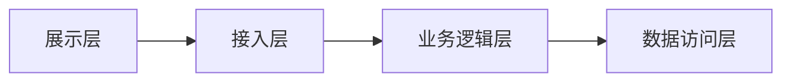

# 销售订单技术方案（E2E 样板，可通过门禁）

## 架构图


## 架构层次说明
- 展示层/接入层：REST API
- 业务逻辑层：订单状态机
- 数据访问层：MyBatis
- 基础设施层：MySQL、Redis

## Controller/API 入口
- `SalesOrderController`
- `POST /api/v1/sales-orders` 创建销售订单
- `POST /api/v1/sales-orders/{order_id}/submit` 提交审核
- `POST /api/v1/sales-orders/{order_id}/approve` 审核通过
- `POST /api/v1/sales-orders/{order_id}/reject` 驳回
- `POST /api/v1/sales-orders/{order_id}/cancel` 作废
- `POST /api/v1/sales-orders/{order_id}/confirm` 接收外部 WMS 子流程 `confirm` 回写

## Application/Service 编排节点
1. `SalesOrderApplicationService` 接收 API 请求并校验角色权限。
2. `SalesOrderDomainService` 校验状态机、幂等键和字段规则。
3. `SalesOrderRepository` 落库主表与明细表。
4. `InventoryConfirmService` 处理外部/现网子流程 `confirm` 回写。
5. `OrderCloseService` 根据累计出库数量计算闭单条件并更新结果。

## 技术选型
- Spring Boot：成熟生态

## 接口设计
| 方法 | 路径 | 说明 |
| --- | --- | --- |
| POST | /api/v1/sales-orders | 创建订单 |
| POST | /api/v1/sales-orders/{order_id}/submit | 提交订单 |
| POST | /api/v1/sales-orders/{order_id}/approve | 审核订单 |
| POST | /api/v1/sales-orders/{order_id}/reject | 驳回订单 |
| POST | /api/v1/sales-orders/{order_id}/cancel | 作废订单 |
| POST | /api/v1/sales-orders/{order_id}/confirm | 外部子流程回写 |

## 请求参数
- `order_id`: string，主键，创建后只读
- `customer_id`: string，提交前必填
- `order_qty`: number，订单数量
- `shipped_qty`: number，外部 `confirm` 回写累计数量
- `status`: string，状态机字段
- `closed_flag`: boolean，闭单标记

## 响应格式
JSON：`{ "code":0, "data":{} }`

## 错误码定义
| 码 | 说明 |
| --- | --- |
| 0 | 成功 |
| 400 | 参数错误 |
| 409 | 当前订单状态不允许提交 |
| 422 | 已确认出库，不允许作废 |

## 数据表与字段职责
- 主表 `sales_order` 负责 `order_id`、`customer_id`、`status`、`order_qty`、`shipped_qty`、`closed_flag`。
- 明细表 `sales_order_line` 负责 `sku`、`qty`、`shipped_qty`。
- `status` 由领域服务统一维护，不允许前端直接覆盖。
- `shipped_qty` 只允许外部 `confirm` 子流程回写。

## DDL / 表结构引用
- 依赖 `sales_order` 与 `sales_order_line` 表结构。
- DDL 中必须包含 `customer_id`、`status`、`order_qty`、`shipped_qty`、`closed_flag` 字段。

## 外部/现网子流程边界
- 外部 WMS 通过 `confirm` 接口回写发货结果，属于外部子流程。
- 本域负责校验回写幂等、更新累计数量和状态。
- 现网库存扣减结果只读引用，不在本服务内重复计算。

## 幂等与补偿/作废顺序
- `submit`、`approve`、`confirm` 都要按 `order_id + event_id` 做幂等。
- `confirm` 重放时不得重复累计 `shipped_qty`。
- 作废顺序要求：仅 `草稿`、`已提交`、`已驳回` 可作废；已确认出库需先补偿再关闭。

## 公式 / 累计 / 闭单条件
- 公式：`remaining_qty = order_qty - shipped_qty`
- 累计规则：每次 `confirm` 回写都累计 `shipped_qty`
- 闭单条件：`shipped_qty >= order_qty` 时设置 `closed_flag = true` 且 `status = 已闭单`
- 折扣、金额等字段本期不参与闭单公式

## 查库 / SQL / 关键字段断言
- 提交前查库：校验 `sales_order.status` 当前是否为 `草稿`
- 审核前查库：校验 `sales_order.status` 当前是否为 `已提交`
- `confirm` 后查库：断言 `sales_order.shipped_qty`、`sales_order.closed_flag`、`sales_order.status`
- SQL 示例：

```sql
SELECT `order_id`, `customer_id`, `status`, `order_qty`, `shipped_qty`, `closed_flag`
FROM `sales_order`
WHERE `order_id` = ?;
```

## 非法状态与错误提示
- 已驳回状态不允许直接审核
- 当前订单状态不允许提交
- 已确认出库，不允许作废
